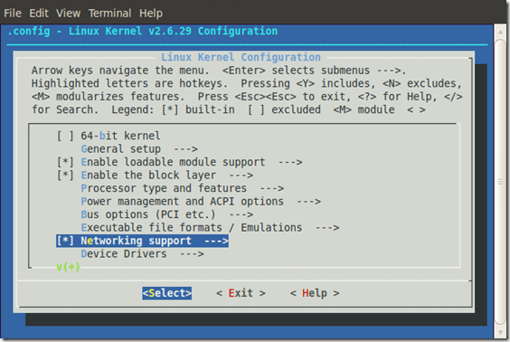

# Android编译VirtualBox版本

## 一、环境设置：
官网上已经写明ubuntu10.04,如果用其它版本编译，可能会出现许多奇怪的问题,我采用的为ubuntu10.04-desktop-64bit,参考文章：http://www.cnblogs.com/jqyp/archive/2012/02/27/2369291.html
### 1、jdk的安装
去jdk官网下载此文件：jdk-6u45-linux-x64.bin,然后是安装和设置java的环境变量，参考此网址：
http://blog.csdn.net/jjjkl81/article/details/5895845
配置java环境变量,假设用户名为:sa
```
# sudo gedit /home/alex/.bashrc 
```
在 .bashrc文件中加入： 
```
export JAVA_HOME=/usr/lib/jvm/java/jdk1.6.0_45
export JRE_HOME=/usr/lib/jvm/java/jdk1.6.0_45/jre
export CLASSPATH=$CLASSPATH:$JAVA_HOME/lib:$JAVA_HOME/jre/lib 
export PATH=$JAVA_HOME/bin:$JAVA_HOME/jre/bin:$PATH
``` 
### 2、安装依赖库
```
$ sudo apt-get install git-core gnupg flex bison gperf build-essential \
  zip curl zlib1g-dev libc6-dev lib32ncurses5-dev ia32-libs \
  x11proto-core-dev libx11-dev lib32readline5-dev lib32z-dev \
  libgl1-mesa-dev g++-multilib mingw32 tofrodos python-markdown \
  libxml2-utils xsltproc
```
### 3、升级git,现在要求git版本最低1.7.2，因此如果发现下载的git低于1.7.2，可作如下动作：
```
$ sudo add-apt-repository ppa:git-core/ppa
$ sudo apt-get update
$ sudo apt-get install git-core curl
```
### 二、源码下载
（一）android4.0.1_r1源码下载
建议先改/etc/hosts文件，增加文件如下：
```
74.125.237.1    　 dl-ssl.google.com
74.125.31.82 　　　www.googlesource.com
74.125.31.82 　　　android.googlesource.com
203.208.46.172 　  cache.pack.google.com
59.24.3.173 　　　 cache.pack.google.com
```
### 1、下载Repo
```
$ mkdir ~/bin 
$ PATH=~/bin:$PATH
$ curl https://dl-ssl.google.com/dl/googlesource/git-repo/repo > ~/bin/repo 
```
正常情况下，你已经在hosts中做了相应的更改并且重启了机器，是不会出错的了，如果很不幸，你连不上去，可参考这篇文章：http://www.w3c.com.cn/repo-%E8%8E%B7%E5%8F%96android%E6%BA%90%E7%A0%81，此文章可以得到可用的repo。之前我主要就是卡在域名映射这一块，怎么都下载不了，然后用上篇的方法下到了repo,也下到了一部份源码，可惜最多也只下到了5G，然后就一直连不上了，足足卡在这儿一个多星期，无比的痛苦。
### 2、修改执行权限：
```
$ chmod a+x ~/bin/repo
```
### 3、创建并进入源码目录：
```
$ mkdir android-4.0.1_r1
$ cd android-4.0.1_r1
```
### 4、下载android-4.0.1_r1的源码
```
$ repo init -u https://android.googlesource.com/platform/manifest
$ git --git-dir .repo/manifests/.git/ branch –a
$ repo init -u https://android.googlesource.com/platform/manifest -b android-4.0.1_r1
$ repo sync
```
这一步正常的话，就是等待源码下载结束了，大约有12G多点。如果中途断掉了，你可以重新执行以下命令，得以继续下载。
$ repo sync
## （二）kernel_sdk_x86源码下载
http://software.intel.com/en-us/blogs/2012/03/06/hands-on-notesbuild-android-x86-ics-4-virtualbox-from-google-virtualbox-target-and-intel-kernel
此网页中有一个Intel插件的介绍：kernel_sdk_x86.tar.gz，这个是必须要用到的，点击其中的链接Intel_x86_sysimg_2.3.7_Source_Files.zip，将其下载下来即可，建议解压缩直接到linux环境下进行，因在windows环境下会有文件覆盖的现象，恐会导致后面的编译出错。
## 三、源码编译：
### （一）kernel_sdk_x86源码编译
1、之前下载的zip解压后有一个压缩包kernel_sdk_x86.tar.gz，这个正是我们需要的内核源码，将其再解压，放置于home目录，与android-4.0.1_r1目录处于同一级
```
$ cd ~/kernel_sdk_x86
$ cp arch/x86/configs/vbox_defconfig  .config
$ make  ARCH=x86 menuconfig
```
弹出以下对话框：





特别注意：不能选中64－bit kernel，否则很可能编到最后会出错，再选中两处：
```
Device Driver->Input Device Support –> Mice
Network Device –>Wireless
```
点击Esc键（可能是两次）退出保存
### 2、编译（j代表线程，一般用处理器数的2倍，我的有4核，所以用8线程编译）
```
$ make ARCH=x86 –j8
After the compiling, if you see the last line that Kernel: arch/x86/boot/bzImage is ready .Then, your make is successful.
```
## （二）android-4.0.1_r1源码编译
### 1、进入源码目录
```
cd ~/android-4.0.1_r1
```
### 2、拷贝内核信息到此目录
```
cp ~/kernel_sdk_x86/arch/x86/boot/bzImage ~/android-4.0.1_r1/prebuilt/android-x86/kernel/kernel-vbox 
cp ~/kernel_sdk_x86/vmlinux ~/android-4.0.1_r1/prebuilt/android-x86/kernel/vmlinux-vbox
```
### 3、编译源码
```
source build/envsetup.sh
```
你应该能看到以下信息：
```
including device/samsung/maguro/vendorsetup.sh
including device/samsung/tuna/vendorsetup.sh
including device/ti/panda/vendorsetup.sh
including sdk/bash_completion/adb.bash
```
### 4、lunch
```
$ lunch
```
出现以下信息：
```
1. full-eng
2. full_x86-eng
3. vbox_x86-eng
4. full_maguro-userdebug
5. full_tuna-userdebug
6. full_panda-eng

Which would you like? [full-eng] 3   (Note: make sure you select 3.vbox_x86-eng)
```
### 5、编译
```
$ make   -j8
```
编译时间比较久，完了后会看到生成了一堆.img文件。
### 6、设置DNS
```
echo "Net.eth0.dns1 = 8.8.8.8"  >> ~/android-4.0.1_r1/out/target/product/vbox_x86/root/default.prop
echo "Net.dns1 = 8.8.8.8"  >> ~/android-4.0.1_r1/out/target/product/vbox_x86/root/default.prop
```
### 7、安装virtualbox
```
apt-get install virtualbox-ose
```
### 8、编译成vdi文件
```
$ make android_disk_vdi –j8
$ make installer_vdi  -j8
```
## 四、总结
至此，android源码基本算是结束了，关于jdk的安装稍显复杂了点，后面有机会我会测试直接通过命令安装是否不需要这么麻烦，virtualbox是必须要安装的，否则无法生成vdi文件，同样，第2步拷贝的内容也是必须的，之前我忘记了这一步骤，结果一直报错No rule to make target，把我折腾好久。