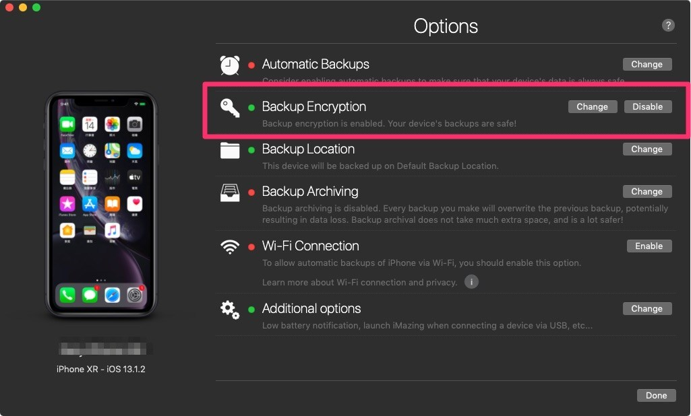
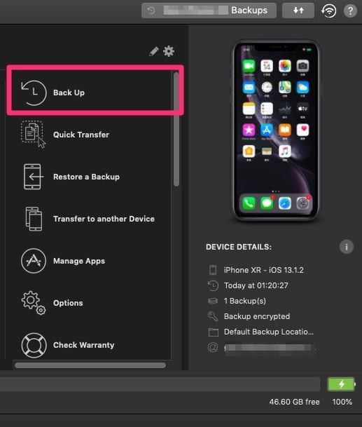
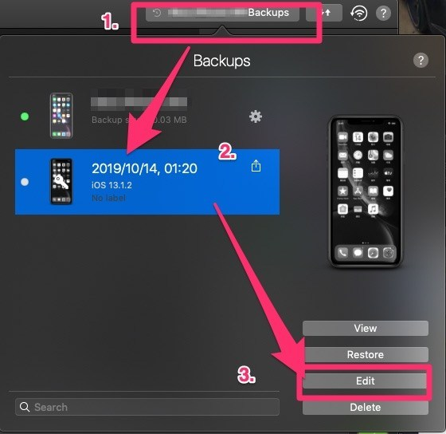
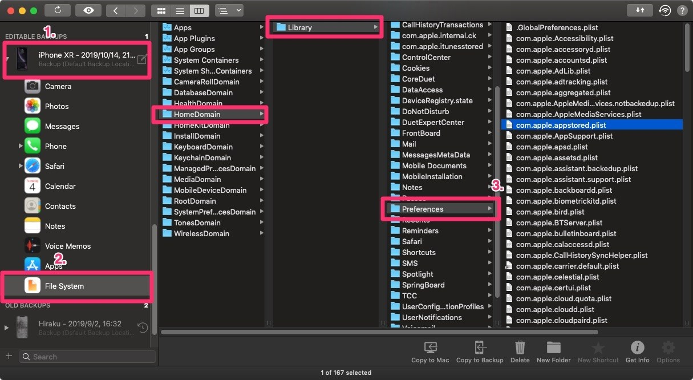
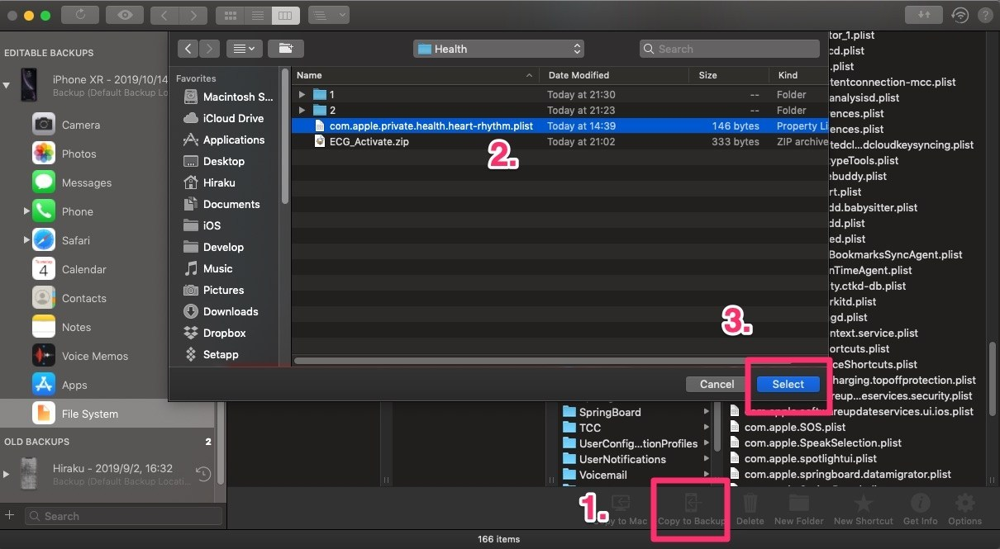
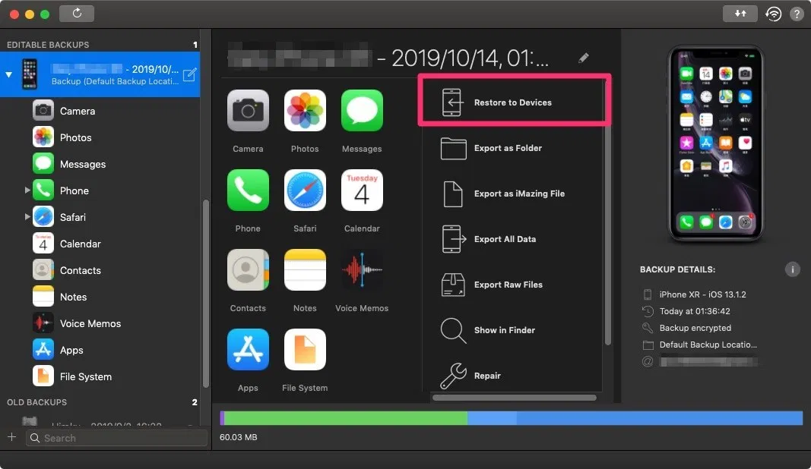
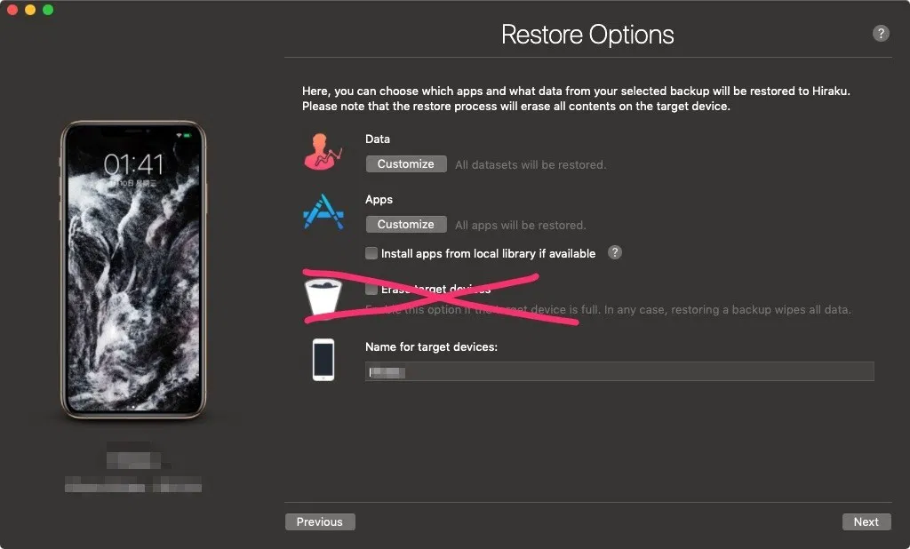
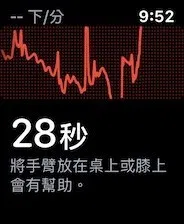

# 不求人，自己開通海外版本 Apple Watch ECG 功能

[2019/10/13](https://hiraku.tw/date/2019/10/)

English version [here](https://hiraku.tw/2019/10/4951/)

無論如何，請先升級到 iOS 13.5 + watchOS 6.2.5，因為這個版本組合可以「無視地區」開啟 ECG 功能！

在開始本教學之前，有幾點非常重要，請大家看清楚。

本文為全球首發教學，轉載請附上原本連結，謝謝。

1.  本教學僅供技術研究使用，在未經許可的國家開啟 ECG 功能，甚至販賣「開通的服務」可能觸犯當地相關法律
2.  Apple 有可能隨時改變遊戲規則
3.  跟 iCloud 污染法不同，這個方法如果換手機配對手錶可能需要重新操作一次，即使兩隻手機是用同一個 iCloud 帳號也是。

必備條件：

1.  任何支援 Apple Watch 4代以上的 iPhone
2.  iOS 升級到 13.5，watchOS 升級到 6.2.5，舊版不行，未來新版沒人測試不知道，目前這個組合可以無視地區開通！
3.  iMazing ([購買優惠網址](https://store.lizhi.io/site/products/id/56?cid=v62bqx4s)，運費選 0 元，它不會真的寄出，賣家會訊息給你正版序號)，PC / Mac 應該都可以，Windows 請確定你的系統是 64bit 的才行
4.  ECG 啟用檔案 ([下載地址](https://download.hiraku.tw/iOS/ECG_Activate.zip)) 下載之後請解壓縮，會得到一個 .plist 檔案
5.  手機的「健康」App 必須要有任何紀錄（正常應該都會有啦…）

測試環境：

1.  台版 iPhone XR iOS 13.1.2（完全乾淨重刷，手機地區完全不影響）
2.  Apple Watch 4 代港版 watchOS 6.0.1
3.  日本 iCloud 帳號（日本為非開通地區，帳號地區完全不影響）

在之前跟 [x43x61x69](https://www.reddit.com/r/AppleWatch/comments/dfihbp/apple_watch_ecg_activation_rules_experiments/) 大大的研究中，我注意到了開啟 ECG 功能之後會在「健康」紀錄裡面寫入兩個標記。所以反過來說，我們只要把「健康」資料裡面寫入那兩個標記，不就開通了嗎？

經過詳細的研究之後，我發現確實跟這兩個標記有關，但是並非直接改「健康」資料，而是用更簡單的方法。但無論如何，需要修改手機的備份檔案。這時候就要用第三方軟體 iMazing 了，如果你沒有購買的話，可以[點這邊購買正版](https://partner.lizhi.io/hiraku/imazing)，官網賣 45 美金（約 1400 台幣），透過折價券只要 94 人民幣（400 台幣左右），如果你有兩台電腦，買雙授權更划算！

為了讓手錶能夠正確讀取我們之後導入的 ECG 開通資訊，請先解除手錶的配對。接著，用 iMazing 對手機做一次加密備份，打開 iMazing 應該會跳出如下的畫面叫你設定備份選項。

▼ 接著注意設定如下，備份加密的選項一定要開，否則你之前的「健康」紀錄不會備份到，其他選項可以照自己的意思隨意調整，預設狀態不用動也可以。

[]

▼ 設定完成之後，就按備份以建立一份加密備份

[]

▼ 接著，按上面的按鈕以顯示所有備份，再選擇我們剛剛的備份，最後再選擇編輯

[]

接下來會 iMazing 會跟你說亂改備份很危險，要先叫你做「備份的備份」，就直接按繼續，等他跑完。

▼ 再來，看到 iMazing 左邊往下滑，會出現「可以編輯的備份」，按照下圖選到 `HomeDomain/Library/Preferences` 裡面

[]

接著，找到我們上面說要下載的「ECG 啟用檔案」，解壓縮得到一個 `com.apple.private.health.heart-rhythm.plist`

▼ 把這個檔案複製到備份檔的`HomeDomain/Library/Preferences`資料夾底下，如果出現警告說要覆蓋，就確定讓他覆蓋吧

[]

▼ 選回我們修改過的備份，然後按「還原」，接下來選機器

▼ 如果你有用 eSIM，請不要勾選 iMazing 的「清除內容」，有可能導致 eSIM 消失，如果空間不足，先去刪照片、或者同步的音樂之類的，反正備份會還原照片，甚至 DFU 重刷也可以，DFU 不會導致 eSIM 消失

還原完成之後，重新配對 Apple Watch，請選擇新的 Apple Watch，不要還原手錶備份。

配對完成之後，你就可以使用 ECG 功能了。如果配對完成後發現心電圖 App 一直卡在安裝中，嘗試重開機，重開機若無效，需要重新配對，但應該就會正常。

本文非常感謝 [x43x61x69](https://github.com/x43x61x69)、@HuangIYang，[Garynil](https://garynil.tw) 以及熱心借我手錶的宥勝，沒有他們的話我不可能完成這個研究。

附註：

若出現 com.apple.security.xpc error 訊息，請直接在手機裡面選擇清除所有資料與內容，再嘗試還原備份

