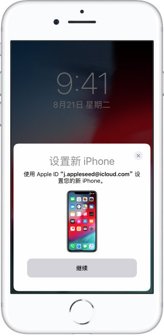
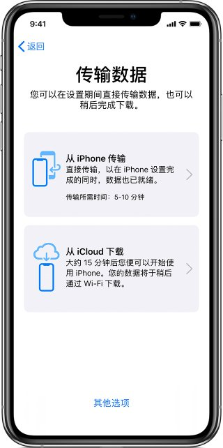

使用运行 iOS 11 或更高版本的 iPhone、iPad 或 iPod touch 来自动设置新的 iOS 设备。
通过“快速开始”，您可以使用当前设备的信息来快速设置新的 iOS 设备。*然后，您可以将其余数据和内容从 iCloud 备份恢复到新设备。

如果您使用当前 iPhone 设置新的 iPhone，并且这两台设备都运行 iOS 12.4 或更高版本，“快速开始”会提供使用  [iPhone 迁移](https://support.apple.com/zh-cn/HT210216#migration)的选项。这样您便可以通过无线方式将所有数据从当前 iPhone 传输到新设备。

使用“快速开始”的过程会同时占用两台设备，因此请务必选择在几分钟内都不需要使用当前设备的时候进行设置。

## 如何使用“快速开始”

1. 将新设备开机，并将它放在运行 iOS 11 或更高版本的当前设备旁边。“快速开始”屏幕会出现在当前设备上，并且屏幕上会提供使用您的 Apple ID 设置新设备的选项。确保这就是您要使用的 Apple ID，然后轻点“继续”。如果您没有看到这一选项而无法在当前设备上继续操作，请确保蓝牙已打开。

2. 等待新设备上出现动画。拿起当前设备并置于新设备上方，然后使动画居中位于取景框内。等待提示“在新 [设备] 上完成”的信息出现。如果您无法使用当前设备的摄像头，请轻点“手动验证”，然后按照显示的步骤操作。

3. 出现提示时，在新设备上输入当前设备的密码。
4. 按照说明在新设备上设置面容 ID 或触控 ID。
5. 出现提示时，在新设备上输入您的 Apple ID 密码。如果您拥有多个设备，则可能还需要输入其他设备的密码。

6. 您的新设备会提供从最新的 iCloud 云备份恢复 App、数据和设置的选项，或更新当前设备的备份后进行恢复的选项。选择一个备份后，您可以选取要不要传输某些与位置、隐私、Apple Pay 和 Siri 相关的设置。如果您要更新设备上的备份，请确保您的设备上已启用 Wi-Fi。

7. 如果您有 Apple Watch 并且正在设置新 iPhone，系统还会询问您要不要传输您的 Apple Watch 数据和设置。

### 将数据直接从一台 iPhone 传输到另一台 iPhone

如果当前 iPhone 和新 iPhone 均运行 iOS 12.4 或更高版本，您可以使用 iPhone 迁移直接将数据从旧设备传输到新设备。您可以通过无线方式完成传输，也可以将设备连接到一起进行传输。如果您使用的无线网络速度太慢或是过于拥堵，则可以选择使用有线方式。

如果您想通过无线方式迁移数据，请[按照以下步骤进行操作](https://support.apple.com/zh-cn/HT210216#migrationhowto)，并在整个过程中将旧 iPhone 放在新 iPhone 的旁边。确保两台设备均已连接到电源。

要通过有线连接迁移数据，您需要[闪电转 USB 3 相机转换器](https://www.apple.com/cn/shop/product/MK0W2FE/A)和[闪电转 USB 连接线](https://www.apple.com/cn/shop/product/MQUE2FE/A)。将闪电转 USB 3 相机转换器连接到当前 iPhone，然后用闪电转 USB 连接线连接新 iPhone 和转换器的另一端。使用 12W 或更高功率的电源适配器通过闪电转 USB 3 相机转换器的闪电端口向它供电，然后[按照以下步骤操作](https://support.apple.com/zh-cn/HT210216#migrationhowto)。

### 如何使用 iPhone 迁移

1. 将新 iPhone 开机，并将它放在运行 iOS 12.4 或更高版本的旧 iPhone 旁边。如果您想通过有线连接进行数据迁移，请将两台设备连接到一起。“快速开始”屏幕会出现在当前 iPhone 上，并且屏幕上会提供使用您的 Apple ID 设置新 iPhone 的选项。确保这就是您要使用的 Apple ID，然后轻点“继续”。如果您没有看到这一选项而无法在当前设备上继续操作，请确保蓝牙已打开。

2. 等待新 iPhone 上出现动画。拿起当前 iPhone 并置于新 iPhone 上方，然后使动画居中位于取景框内。等待提示“在新 iPhone 上完成”的信息出现。如果您无法使用当前 iPhone 的摄像头，请轻点“手动验证”，然后按照显示的步骤操作。

3. 出现提示时，在新 iPhone 上输入当前 iPhone 的密码。
4. 按照说明在新 iPhone 上设置面容 ID 或触控 ID。

5. 轻点“从 iPhone 传输”，以开始将旧 iPhone 的数据传输到新 iPhone。使用有线方式时，传输图标  会指明两台设备已连接。您还可以选择要不要将旧 iPhone 的某些设置（例如 Apple Pay 和 Siri）传输到新 iPhone。

6. 如果您有 Apple Watch 并且正在设置新 iPhone，系统会询问您要不要传输您的 Apple Watch 数据和设置。
7. 将两台设备相邻放置，并插接电源，直到 iPhone 数据迁移过程完成为止。传输时间取决于多个因素，例如，您使用的连接类型、网络状况和传输的数据量。

## 完成

将数据传输到新 iOS 设备之后，[您可能需要再完成几步操作才能完成这个流程](https://support.apple.com/zh-cn/HT209568)。

## 仍然需要协助？

- 了解[出售或赠送 iOS 设备前该怎么做](https://support.apple.com/zh-cn/ht201351)。
- 如果您无法激活 iPhone，请[了解该怎么做](https://support.apple.com/zh-cn/HT201407)。
- 如果您需要更多帮助，请[联系 Apple 支持](https://getsupport.apple.com/?caller=kbase)。

*如果您的新 iPhone 已在“Apple 校园教务管理”或“Apple 商务管理”中注册，则无法使用“快速开始”来迁移当前 iPhone 的数据。