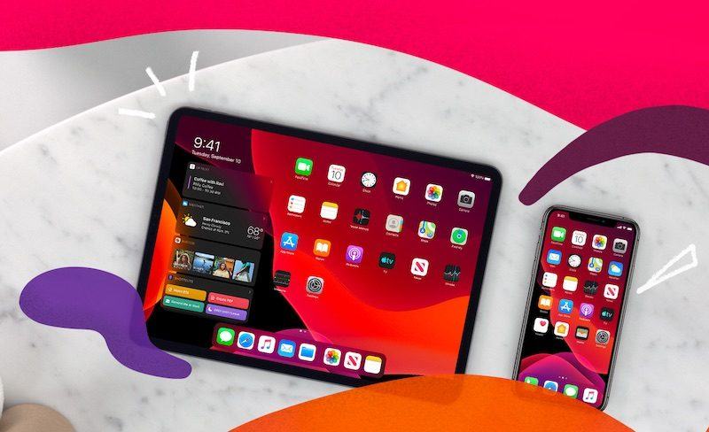

    自从 9 月中旬发布以来，iOS 13 经历了艰难的开端，尽管它带来了深色模式等受人欢迎的新特性，但它也是近年 iOS 更新中内存漏洞最多的版本之一。

越来越多的 iPhone 和 iPad 用户抱怨 iOS 13 和 iPadOS 13 上的 RAM 管理不善，导致他们在简单切换应用后原本开启的应用立马在后台被清除，导致更频繁的应用重新打开，包括 Safari、邮件等原生应用也是如此。

    某些用户反应，在切换到另一个可能占用更多内存的应用（例如相机或 iMessage）后，甚至在短短几秒钟内就可以享受一把「后台杀服务」，后台进程全清。

    “我正在 iPhone 11 Pro 上的 YouTube 上观看视频，随后暂停了视频回复一个短信。在 iMessage 中呆了不到一分钟，当返回 YouTube 时，它就需要重新加载了，而且观看进度也丢失了。在 iPad Pro 上也有很多同样的情况。与 iOS 12 相比，iOS 13 App 和 Safari 选项卡的重新加载频率更高。”

相信上面这位国外论坛用户的陈述大家也深有体会，我们同样也在威锋社区收到了大量关于 iOS 13 杀后台的抱怨。

    从 iOS 13.2 和 iPadOS 13.2 开始，该问题似乎变得更加严重。许多开发者也发现并测试了这个问题，iOS 设计师、开发人员 Nick Heer 表示：“iOS 13.2 在杀死后台任务方面「表现出色」。”

    他测试了在 iMessage（消息撰写中）和 Safari（页面浏览状态）之间进行多次切换，而每次应用前台时，后台都被完全刷新。这种情况一直发生在整个 iOS 13 系统中：Safari 甚至无法在后台打开单个选项卡，每个应用都从头启动。**Nick Heer 感叹：简直就像退回到了以前没有多任务处理功能的时代。**

RAM 管理不善的最大问题在于用户在执行任务时可能会失去应用进度，例如编辑文字或观看视频。有用户报告称丢失了电子邮件的全部草稿，只是因为他们在过程中切换了一下   相机或者音乐 App。

    这样的问题可能与新版本 iOS  在旧款  iPhone 上的运行方式有关，但即使在 iPhone 11 和 iPhone 11 Pro 机型以及 iPad Pro 上，RAM 管理问题仍然存在，目前原因未明，有推测称是由于新相机系统的内存占用量大造成的。

    按照正常情况，在拥有出色的硬件组件和软件优化前提下，iPhone 在内存管理方面应该变得更好才对，结果反而变更糟。这样的 BUG 可能并不像 HomePod 变砖这么严重，但是苹果绝对应该将修复杀后台问题提为最高优先级。

**欢迎关注威锋网官方微信：威锋网（weiphone_2007) 汇聚最新Apple动态，精选最热科技资讯。**