# iPadOS 13.1连接鼠标键盘扩展坞用法说明

*\f017* 2019-09-26 09:37:46  *\f234* 绿联  ** 3832

升级iPadOS之后，iPad Pro 2018开启了一些好玩实用的功能，比如连接鼠标键盘、连接有线网络等。下面我们借助绿联type-c[扩展坞](https://www.lulian.cn/news/246-cn.html)来做个iPadOS 13.1的功能演示。

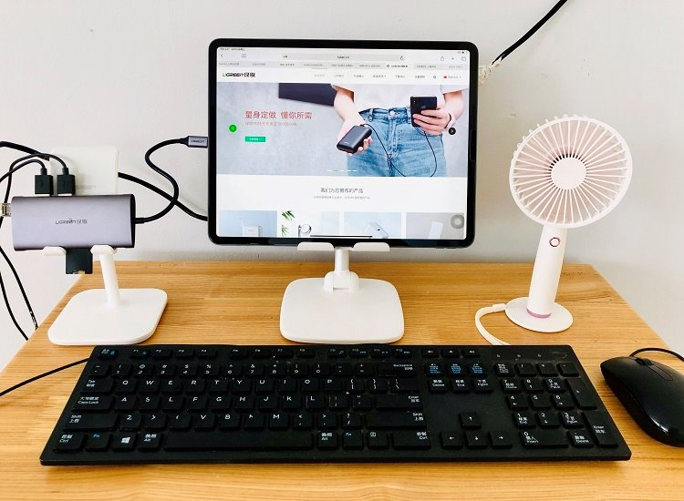

### 一、iPad连键盘鼠标

1.将扩展坞连接iPad Pro 2018，鼠标和键盘分别插入扩展坞的USB接口。
2.打开iPad，选择设置一辅助功能一触控一打开辅助触控；
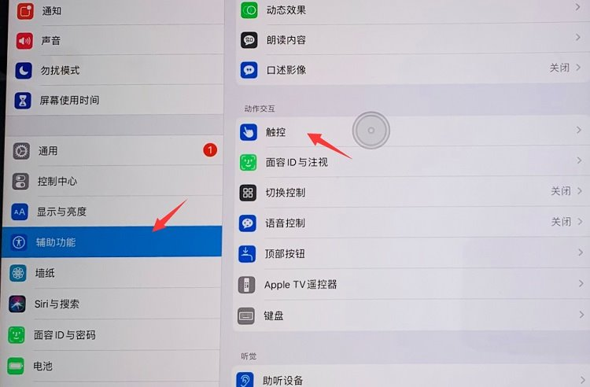
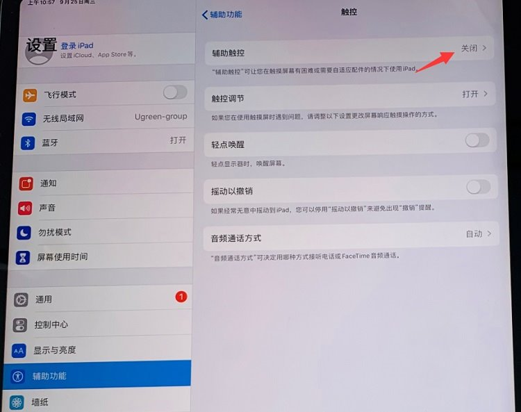
3.打开鼠标键选项，选择开启，iPad屏幕上出现圆形的鼠标指针，连接完成。
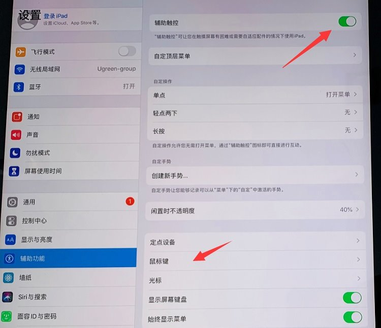
 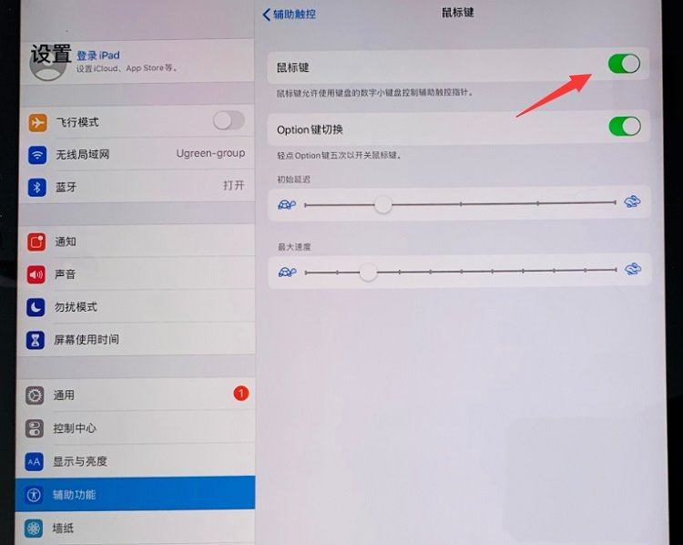
然后光标选项可以更改指针大小，跟踪速度可以调整鼠标的灵敏度。

### 二、iPad连U盘读卡器

将U盘（读卡器、移动硬盘也可）插入扩展坞。打开iPad文件管理，会看到“我的iPad”下面出现了自己的U盘，点击即可查看U盘内容。
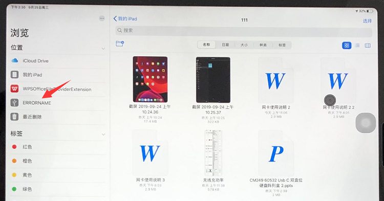
在U盘中点击右上方“选择”，然后选择需要拷贝的文件，复制或移动，完成。
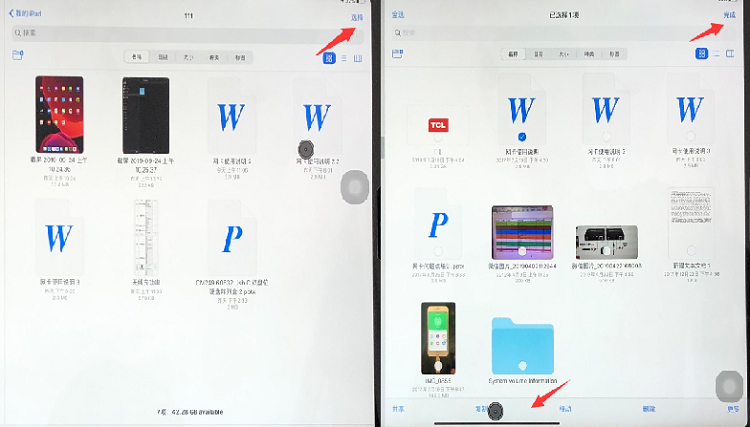
也可直接长按单个文件进行复制。
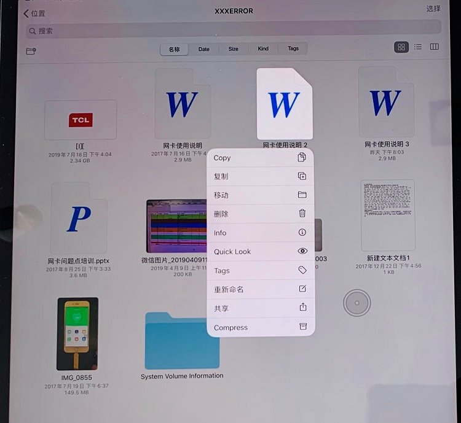
本文我们选择文档“网卡使用说明”，选择拷贝到ipad“111”文件夹，点击完成。然后打开我的iPad“111”文件夹，即可看到网卡文档了。
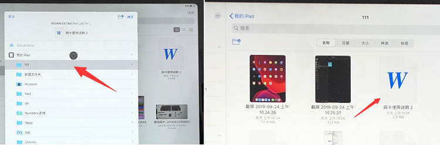
说明下：
1.iPad Pro 2018目前支持1TB(含)以下容量的U盘/内存卡/硬盘，不支持Wifi版的SD卡。
2.iPadOS 13.1系统暂不兼容NTFS格式U盘，无法读取时请转换格式为FAT32/exFAT。

### 三、iPad连接外置网卡

将网线插入绿联[Type-C扩展坞](https://www.lulian.cn/product/list-179-cn.html)的网口处。点击设置，若出现“以太网”选项，表示ipad Pro 2018识别网卡成功。

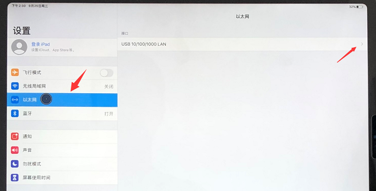
点击以太网—USB10/100/100LAN—配置IP，选择自动，获取到IP地址后，ipad Pro 2018就可以有线上网了。
说明下：目前仅网卡芯片为RLT8152/RTL8153B/RTL8153的绿联扩展坞支持iPad外插网线。
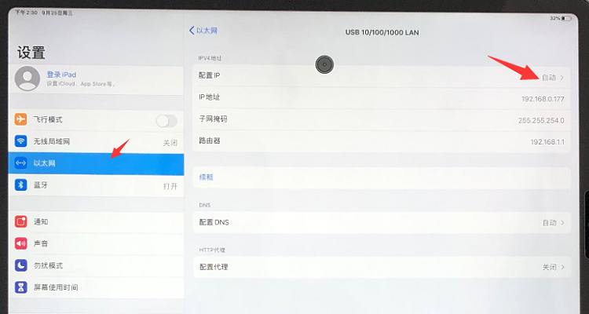

以上就是iPad在OS 13.1系统下外接键鼠和网卡的操作教程，若你的iPad Pro 2018升级后不能实现以上功能，请检查系统版本是否为iPadOS 13.1。

[上一篇](https://www.lulian.cn/news/223-cn.html)  [: iPhone6系列电池更换视频教程](https://www.lulian.cn/news/223-cn.html)  [下一篇](https://www.lulian.cn/news/306-cn.html)  [: 苹果PD快充的配件要求和挑选方法](https://www.lulian.cn/news/306-cn.html)