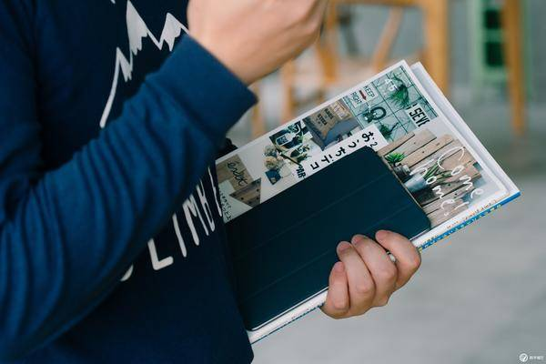
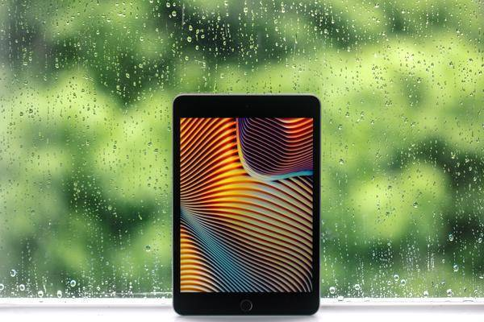
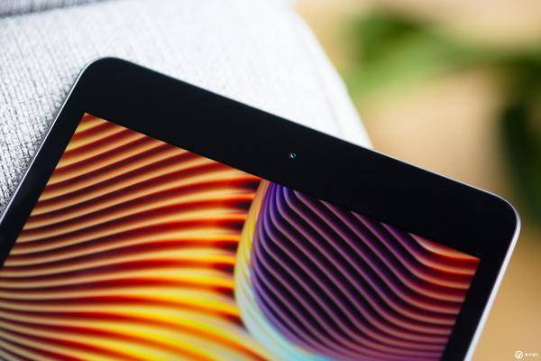
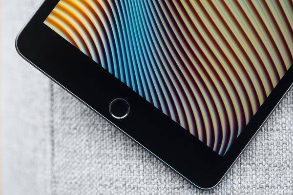
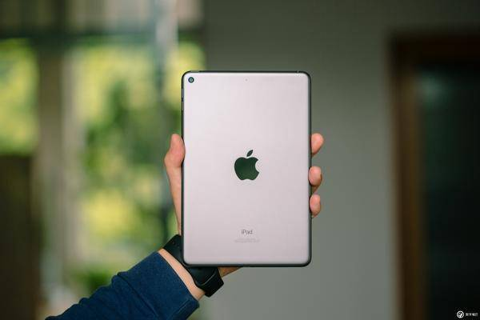
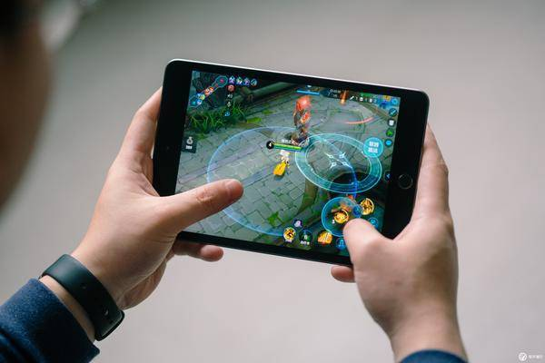
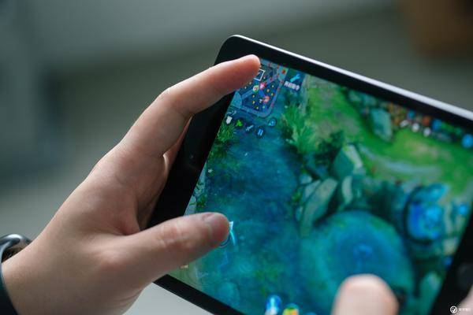
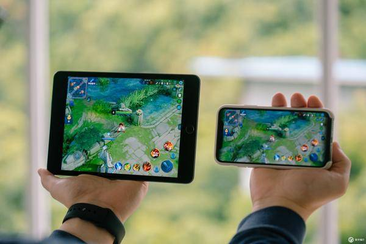
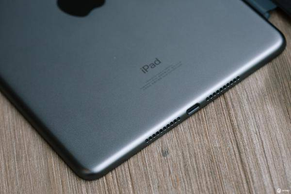
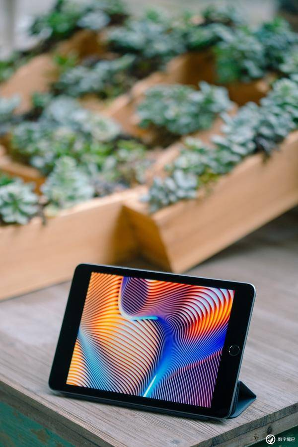

# **iPad mini 5：这是最佳的 iPad 入门设备**** **

2019-04-14 19:45 来源:[数字尾巴](http://www.dgtle.com/article-28084-1.html)

前几天苹果以「线上发布会」的形式悄悄更新了 iPad mini 和新 iPad Air，在外观基本不变的基础上，为他们加入了更强的 A12 处理器，同时还支持第一代 Apple Pencil。

这种形式的更新像极了四年前的 iPad mini 4，当时苹果在秋季活动上留给 iPad mini 4 的时间也不多，一句「它变得更轻了」就算是正式发布了。但相比 iPad mini 2 到 iPad mini 3 微弱的改进，iPad mini 4 的进步显然更大，「全层压显示屏」「抗反射涂层」「A8 处理器」「800 万像素摄像头」「2GB RAM」等特性使它成为当时 mini 平板的首选。

时隔四年，iPad mini 5 依旧选择低调亮相，在内部的众多升级加持之下，它能否满足我们的期盼？

**加量不加价**

iPad mini 5 搭载了一块 7.9 英寸、分辨率为 2048 x 1536 的视网膜显示屏，虽然依旧是 326 ppi，但苹果为其添加了许多新特性，例如 P3 广色域显示、原彩显示，同时这款屏幕还是全层压显示屏，并加入了防油渍防指纹涂层和抗反射涂层，参数上仅缺少 iPad Pro 独占的 ProMotion 自适应刷新率，考虑到两者的定价差异，iPad mini 5 的这块屏幕可以称得上「香气十足」了。

iPad mini 5 整体的外观设计与前代差别不大，依旧是熟悉的额头+下巴构造，其中额头的前置摄像头由 120 万升级为 700 万像素，最高可拍摄 30 帧 1080P 视频，此前由于硬件原因而缺席的实况照片功能也正式在 iPad mini 5 上回归，另外下巴也依旧是熟悉的可按压 Touch ID Home 键。

由于体积小巧，使用 iPad mini 5 的这几天时间里，它带给我的是一种「无限接近大屏手机的平板体验」。我能够轻松地将其拿在手上，而不是像其他 iPad 一样需要握着屏幕；在横屏模式下，我也能够在手捧的姿势下轻松用双手在 iPad mini 5 上使用虚拟键盘完成文字输入，这些操作在别的 iPad 上几乎是不可能完成的任务。

「无限接近大屏手机的平板体验」也使得 iPad mini 5 在打游戏这件事上占足先天优势。拿我经常玩的《王者荣耀》来说，无论是观赏性还是操作性，拥有更大屏幕的 iPad mini 玩起来的感觉都要比 iPhone XS 舒服很多。

操作性方面，适中的体积使得 iPad mini 5 操控起来不会像 iPad Pro 11 那般「笨拙」，能够快速完成一些技能的释放，同时屏幕更大的好处之一是能给双手操作留出更多空间，例如许多高端玩家会在左手拇指操控轮盘的同时，用左手食指点击小地图来快速转换视角，这样的操作在屏幕更大的 iPad mini 5 更加容易实现。

但「大屏」的特性没有为 iPad mini 5 带来额外的视野「bonus」。和手机版《王者荣耀》相比，屏幕比例为 4：3 的 iPad mini 5 的左右视野反而更窄，上下视野则差别不大。

此外，A12 处理器的加入也使得 iPad mini 5 的性能赶上了主流 iPhone 的水平，在《王者荣耀》上开启高帧率模式之后，长时间运行之后游戏的帧数依旧能够保持在稳定的水平。从 iFixt 的拆解来看，iPad mini 5 的内存为 3GB RAM，虽然不及 iPhone XS/Max 的 4GB，但 A12 + 3GB RAM 的配置也和 iPhone XR 看齐了。

还有一个细节需要注意的是，iPad mini 5 搭载的是双扬声器系统。玩游戏时，由于只有底部的扬声器发声，所以在横向握持时手掌难免会遮挡到扬声器，影响声音效果。此外，双扬声器系统在「煲剧」时没有 iPad Pro 的四扬声器系统来的震撼。但考虑到不到 3000 元的售价，这点「减配」也能接受吧。

**最佳的 iPad 入门设备**
如果你想要在 Apple 官网购买一部全新 iPad，目前只有下面四种选择：
iPad 2018（￥2499 起）
iPad mini 5（￥2921 起）
新 iPad Air（￥3896 起）
iPad Pro（￥6331 起）

iPad Pro 作为目前最高端的 iPad 产品，虽然有众多独占特性，但较高的定价也在一定程度上影响了它的受众；iPad 2018 是 Apple 去年推出的一款「廉价大屏 iPad」，由于这是苹果首次将支持 Apple Pencil 的特性下放到价格更低的 iPad 产品线，再加上较为亲民的定价，这款 iPad 也被视为「最佳教育平板」，但屏幕、容量（32GB 起售价为 2499 元）和性能（A10 Fusion）等特性远远不及 iPad mini。

剩下的新 iPad Air 和 iPad mini 5 在外观与前代基本保持一致的前提下，对内部的配置进行了「翻新」。

如果你现在想入手一部 iPad，同时对大尺寸 iPad 不感冒的话，iPad mini 5 应该是最佳的 iPad 入门设备。不到 3000 元的起售价，iPad mini 5 拥有与 iPhone XR 相当的性能，虽然它的模具已经用了七年之久，但在同一价格线内，它所提供的功能和体验是其他平板产品所不能及的。

**丨优点：**
A12 芯片加持，性能比肩 iPhone XR；
优秀的屏幕素质；
价格实惠
**丨缺点：**
双扬声器系统；
老旧的模具；