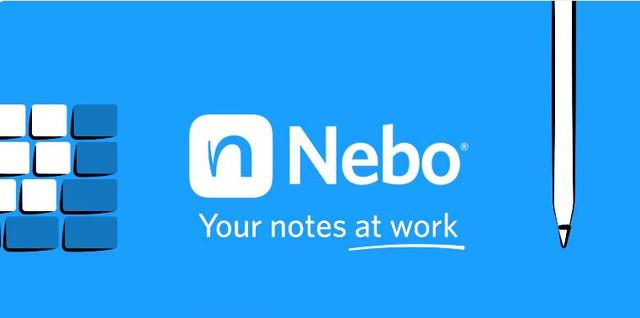
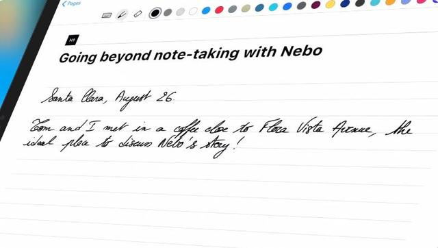
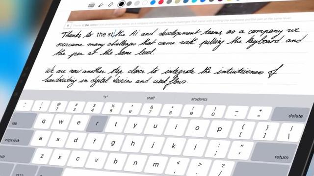
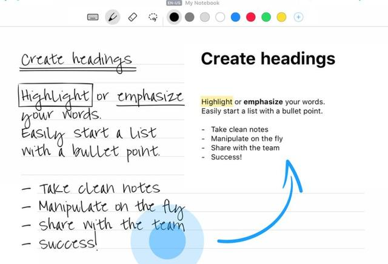
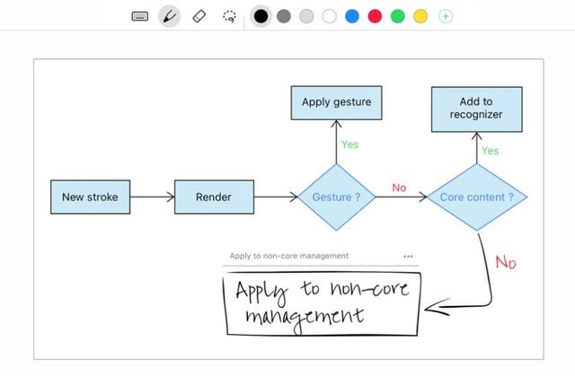
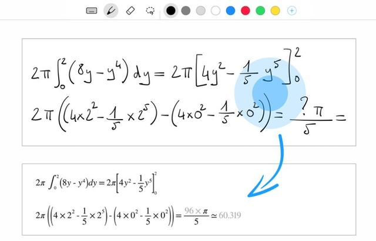

# 原价45元的手写笔记神器Myscript Nebo限免中

威锋网 2020-02-26 10:00:48

如果你钟爱手写，那么 Myscript Nebo 是一款可以拯救你脱离苦海的手写笔记应用，它来自专注手写识别、数字墨水技术三十年的 MyScript。Myscript Nebo 可以在你书写的同时自动对笔迹进行识别，当你写完后，只需对着内容轻轻双击一下，瞬间将手写笔记转换成可编辑文字。

该软件正在 App Store 开放限时免费，原价 45 元，它限免的机会不太多，各位有需要的小伙伴千万别错过。

MyScript Nebo 采用的是目前行业领先的 Interactive Ink 新型墨水技术，依靠由人工智能和神经网络架构的实时预测性手写识别驱动，将人工智能带到了手写领域。Interactive Ink 允许用户在不需要键盘的情况下，通过与数字设备更直观地交互来创建内容，并以数字形式进行内容分享。其支持用户进行字组输入或连笔输入，预测性地解释该输入并将其转换为数字文本。

MyScript Nebo 支持包括简繁中英文在内一共 58 种语言的手写文字识别（需要手动下载中文语言包），识别准确率高，支持中英文混排和图表混排，可以实现手写排版，涂写修改，甚至支持开发商另一款手写计算器 MyScript Calculator 基础上的公式自动识别与计算，还能将公式以 LaTeX 或图片格式导出，可以说实用度非常高。

该笔记软件此前一直是为 Apple Pencil 和 Surface Pen 两款触控笔量身定制，必须在 iPad 上搭配 Apple Pencil 才能使用。后来 iOS 2.3.0 版本更新追加了键盘支持，没有 Apple Pencil 也可以做文本输入了。

目前的 2.5.0 版本加入了用户自定义单词术语、混合草稿、内容成块移动/调整大小/拷贝等功能，并且对识别引擎进行优化，使其更快学习并熟悉用户的手写字体，字迹潦草也不怕了。

