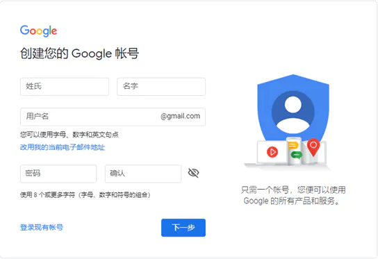
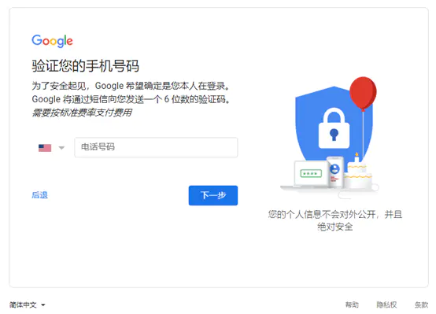
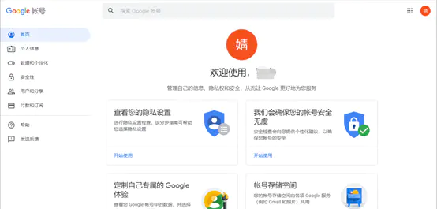
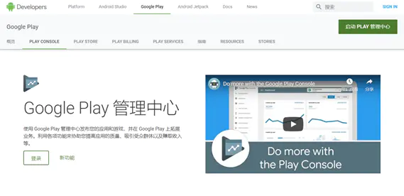
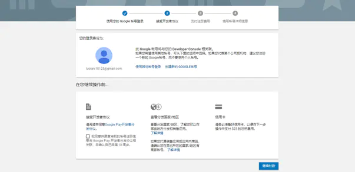
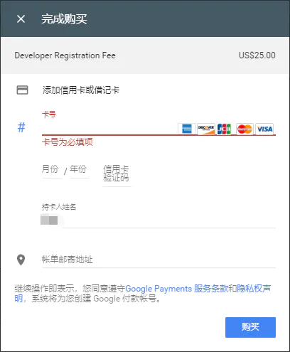
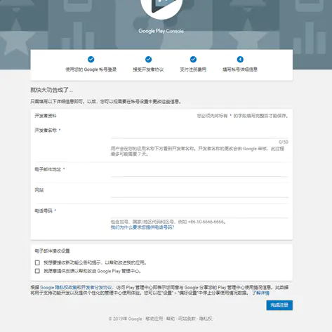
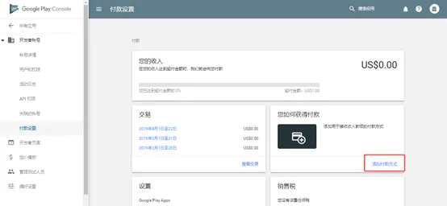
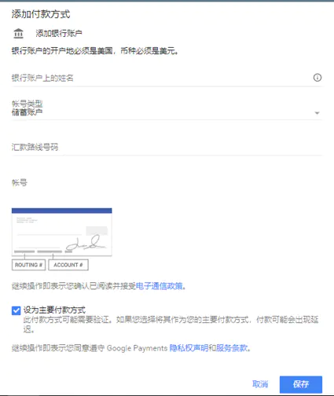

# 如何注册Google Play 开发者账号（含收款设置）

2019年04月23日

对于每一位独立的app开发者来说，App Store和Google Play都是两座绕不过的大山。我今天就为大家整理了**Google Play开发者从账号注册到收款设置**的整个流程，期间有很多细微但是非常重要的步骤，大家可要看好咯！

### 【注册准备】

1、 翻墙工具，以便提高申请的成功率，蓝灯、ss等等都可以。

2、 Chrome浏览器或者火狐浏览器，这2个浏览器能更好地兼容Google的各项服务，申请过程比较顺畅。 

3、 带有Visa或Master等标志的信用卡1张，以便支付Google Play开发者25美元的注册费用，没有的话可以使用虚拟信用卡付款，PingPong现在是免费提供这项服务，需要的自己去官网看吧。

4、 带SIM卡的手机一部；申请Gmail时Google公司出于安全考虑有时会要求进行短信码验证，通过手机以便及时接收短信验证码。

5、 一个美国地址（Amz123上有个虚拟身份功能，可以生成一个虚拟地址），这是供我们注册美国的Google Play账号用的，一定要是美国的，原因我后面会解释。

### 【账户注册篇】

**1、 创建Google Play账号**

注册链接：[accounts.google.com/signup/v2/w…](https://accounts.google.com/signup/v2/webcreateaccount?flowName=GlifWebSignIn&flowEntry=SignUp)

按照真实信息无脑填写即可，完成后点击“下一步”

**2、验证手机号码，填写国内的手机号码就行**

有的童鞋可能会遇到跟我一样的情况——输入号码后提示：“**此电话号码无法用于进行验证**” 。

首先，**分析一下可能的原因**：

（1）该号码已经多次注册过Google账户

（2）号码是新出的号码段，或者是虚拟号码（例如170、147这些）

（3）天朝屏蔽的原因

**解決方法：**

（1）用[谷歌香港](https://www.google.com.hk/?gws_rd=ssl)或者日本进行注册 （建议用Chrome浏览器）

（2）挂SS & VPN注册，提示不行就换个节点（ip）&地区，激活时候国家选择VPN所在地国家，在你的电话号码前加+86然后短信验证

（3）用Gmail APP注册

（4）换个号码试试

（5）填座机号，语音验证

（6）使用QQ邮箱APP（手机或者平板），选择设置“添加账户” → gmail → 多选项 → 创建帐号 → 然后正常注册就可以使用中国电话收短信。

经过多番尝试，号码验证成功~

**3、登录开发者后台**

链接地址：[play.google.com/apps/publis…](https://play.google.com/apps/publish/signup/)

点击“启动PLAY管理中心”

**4、支付费用**

勾选同意协议，并点击“继续付款”，需要支付25美元，和苹果的每年支付不一样，Google开发者账号是终身有效的。

**注意**，支付时只能用带有Visa或Master等标志的卡， 并且一张信用卡只能注册一个谷歌开发者账号，如果绑定了2个以上，则可能开发者账号被关联而造成其它问题，比如封号或是被要求上传资料等。

如果没有国外信用卡的话，可以试试[pingpong免费的vcc](https://joy.pingpongx.com/index)（虚拟信用卡)，有需求的可以直接联系官网客服。

PS：账单地址并不一定要选美国，可以填信用卡实际的地址，也可以填其他地址。

**5、填写开发者的详细资料**

填写完毕后点击“完成注册”就会自动跳转至Google play Developer Console 界面，点击“订单管理”-”注册商业账户”。

**注意**：商业账户需要填写客户信息和公开信息，客户信息中的国家/地区，只能填写一次，后期无法修改，收款账户的所在地和填写的这个国家必须保持一致。

### 【收款篇】

Google Play开发者账号如何绑定银行卡进行收款。

**1、添加付款方式**

登录Google开发者后台，链接地址：[play.google.com/apps/publis…](https://play.google.com/apps/publish) 点击“设置”—“付款设置（payment设置）”—“添加付款方式”

**2、填写收款银行卡信息**

输入银行账户所有人姓名（必须与银行对帐单上的姓名完全一致）、账户类型、银行信息等，点击“保存”

**3、验证银行账户**

选择“通过小额存款进行验证（需要 2-3 天时间）”，点击验证后，会看到一条消息，要求你在 72 小时后联系银行或查看银行对帐单，以核实 Google 汇入的小额存款。

**4、账户验证**

收到PingPong的邮件/短信通知后，登录找到“您如何获得付款”，然后点击管理付款方式，在要验证的付款方式的名称下方，点击修复。

在下一屏幕上，从下拉列表中选择Google，存入您账户的金额，然后点击验证，通过后完成绑定即可。

*到这里，Google Play的开发者账号注册、收款设置就结束了*。

期间，我最想吐槽的是——

> 我们在注册商家账户时，需要填写地址，不知情的小伙伴都会老老实实地填写中国，而按照谷歌的要求，就只能用国内的银行卡收款，悲催的事情就此发生——人家美国的账号，满1美元就能结算，而你却要辛辛苦苦**攒到100美元才出账**，还会**扣除10-30美金左右的电汇费用**，最最最惨的是，你在结汇成人民币时，**经常会被银行卡审核资料**，需要一趟趟往银行跑，把自己折腾地疲惫不堪。

挣钱不易，那我把账号改成美国的可以吗？

> 亲，不行哦，注册时会要求选择所在国家，**选定之后就不能再修改**（微笑脸）。

所以，有美国银行卡的小伙伴可以直接注册美国的账号来收款，像我这种**注册了多个开发者账号，但银行卡不够或者嫌管理起来比较麻烦的**，可以试试[PingPong收款](https://joy.pingpongx.com/index)，不受结汇限制，汇率也比银行更有优势，他们的服务相当专业，态度也不错，需要的可以了解一下。

其他的方法我就没试过了，欢迎大家评论交流啊！

