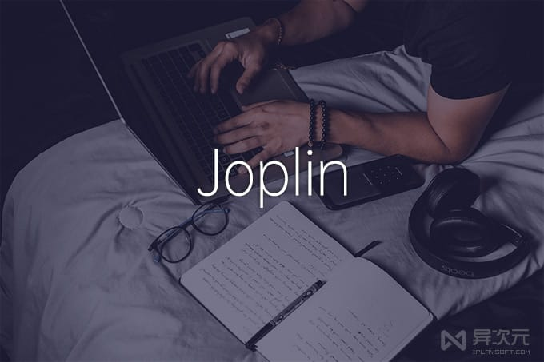
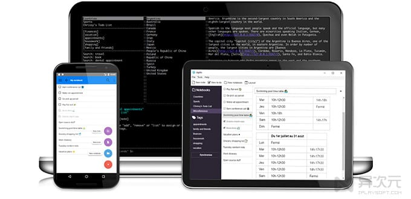
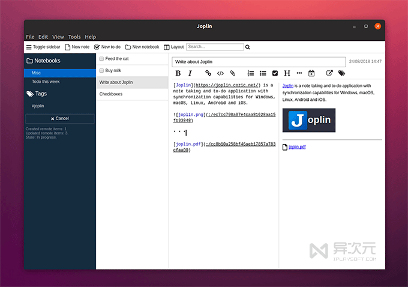
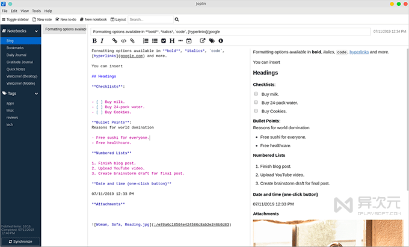
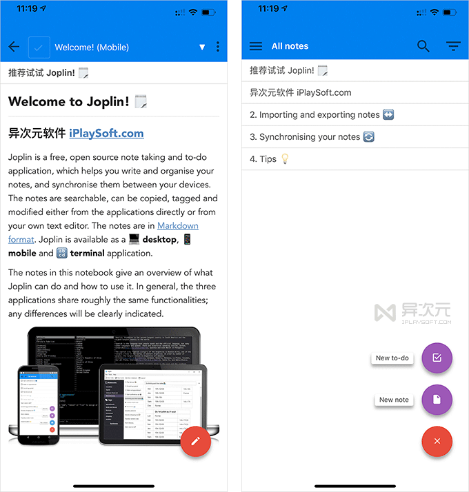
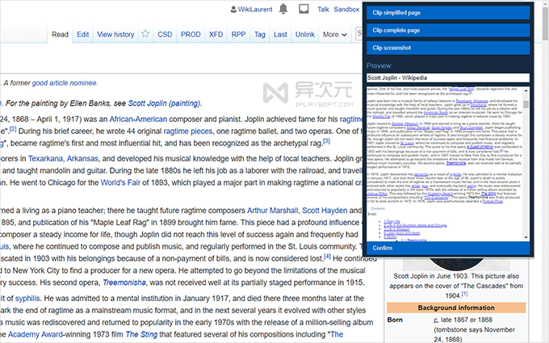

每个人的记忆力是有限的，在如今信息如此丰富的时代，我们都需要使用一些[笔记软件](https://www.iplaysoft.com/tag/%E7%AC%94%E8%AE%B0)来保存备忘和[资料](https://www.iplaysoft.com/tag/%E8%B5%84%E6%96%99)，否则时间长了你会慢慢地忘记很多东西。

所以笔记软件是刚需，但每人的需求和习惯不同，因此催生了大量的笔记 APP 工具，如 [印象笔记](https://www.iplaysoft.com/yinxiangbiji.html)、[OneNote](https://www.iplaysoft.com/onenote.html)、[熊掌记](https://www.iplaysoft.com/bear.html)、[ZoHo](https://www.iplaysoft.com/zoho-notebook.html)、[Leanote 蚂蚁笔记](https://www.iplaysoft.com/leanote.html)、[GitNote](https://www.iplaysoft.com/gitnote.html)、[SimpleNote](https://www.iplaysoft.com/simplenote.html) 等可谓各有特色。而 **Joplin** 是又一款全平台的开源免费笔记应用，功能丰富，也是不错的**印象笔记替代品**……

### Joplin - 免费开源的印象笔记替代品

**Joplin** 是一款全平台的[开源](https://www.iplaysoft.com/tag/%E5%BC%80%E6%BA%90)且完全免费的笔记应用，同时也是一个高效的 [To-Do 待办事项](https://www.iplaysoft.com/tag/todo)工具和生产力工具。你可以用标签或笔记本进行分类整理，笔记支持 Markdown，可实现全文[搜索](https://www.iplaysoft.com/tag/%E6%90%9C%E7%B4%A2)，并且你还可以使用自己喜欢的第三方外置[编辑器](https://www.iplaysoft.com/tag/%E7%BC%96%E8%BE%91%E5%99%A8)如 [Typora](https://www.iplaysoft.com/typora.html)、[VIM](https://www.iplaysoft.com/vim.html) 来编辑笔记，以获得更好的[写作](https://www.iplaysoft.com/tag/%E5%86%99%E4%BD%9C)体验。

在 Joplin 的笔记里你还可以插入代码、图片，支持附件，支持地理位置功能，支持笔记模板，自定义 CSS ，支持子笔记嵌套，支持多层次结构，支持从印象笔记 (Evernote) 的 .enex 文件、.md 文档等格式导入数据。它的功能非常丰富，界面也并不复杂，因此使用起来很容易上手。

你可以用 Joplin 记录课堂[学习](https://www.iplaysoft.com/tag/%E5%AD%A6%E4%B9%A0)笔记，也可以用于记录[生活](https://www.iplaysoft.com/tag/%E7%94%9F%E6%B4%BB)日常、[写日记](https://www.iplaysoft.com/tag/%E6%97%A5%E8%AE%B0)、摘抄代码、剪藏网页、保存[办公](https://www.iplaysoft.com/tag/%E5%8A%9E%E5%85%AC)资料，或者借助待办事项来制定工作计划等等，用途非常广泛。而且它开源+完全免费，可以替代很多付费的笔记软件。

### 支持网盘同步 / 也可离线使用

与云端笔记软件会在[服务器](https://www.iplaysoft.com/tag/%E6%9C%8D%E5%8A%A1%E5%99%A8)上保存你的资料不同，在 Joplin 里你将拥有笔记数据的绝对控制权，默认情况下你的笔记数据只会保存在本地 （可以纯离线使用），但如果你需要同步笔记，也可以借助网盘 [OneDrive](https://www.iplaysoft.com/onedrive.html)、[NextCloud](https://www.iplaysoft.com/nextcloud.html)、[坚果云](https://www.iplaysoft.com/jianguoyun.html)、[Dropbox](https://www.iplaysoft.com/dropbox.html)、[SeaFile](https://www.iplaysoft.com/seafile.html) 或自建的 WebDAV [服务器](https://www.iplaysoft.com/tag/%E6%9C%8D%E5%8A%A1%E5%99%A8)、[NAS](https://www.iplaysoft.com/go/nas) 等进行数据[同步](https://www.iplaysoft.com/tag/%E5%90%8C%E6%AD%A5)。

### 端到端数据加密

加上 Joplin 支持“端到端”的数据[加密](https://www.iplaysoft.com/tag/%E5%8A%A0%E5%AF%86) (需要手动开启)，即便将你的笔记数据丢到网盘、NAS、服务器上同步，文件也无法被他人解密，因此基本不会有资料泄露的可能。你可以在设置里启用端对端加密，并选用信任的[网盘](https://www.iplaysoft.com/tag/%E7%BD%91%E7%9B%98)进行同步。因此，比起把所有数据都放在别人手上的云端服务而言，Joplin 对笔记数据的[安全](https://www.iplaysoft.com/tag/%E5%AE%89%E5%85%A8)性和可控性都更高，适合对隐私有更高要求的人。

### 全平台/跨平台支持

由于 [Joplin](https://www.iplaysoft.com/joplin.html) 的跨平台支持非常全面，Windows、[macOS](https://www.iplaysoft.com/os/mac-platform)、[Linux](https://www.iplaysoft.com/os/linux-platform)、[iOS](https://www.iplaysoft.com/os/ios-platform)、[Android](https://www.iplaysoft.com/os/android-platform) 等主流桌面平台和手机平台都提供有客户端，甚至还提供了命令行版本，因此配合网盘同步，使用起来跟一般付费的云端服务体验没有太大差别。

Joplin iPhone 手机版截图

### 支持笔记历史版本

版本历史可以说是[文档](https://www.iplaysoft.com/tag/%E6%96%87%E6%A1%A3)编辑的“后悔神药”，Joplin 目前已经也可以支持**笔记历史版本**了！每当你修改过笔记，它都会自动帮你保存一个历史版本供你日后恢复或查询。而且这些笔记历史版本都会跟笔记本身一起同步的，在桌面版的 Joplin 上就能查看和恢复。你也可以根据自己的洗好，启用或禁用版本历史功能，并修改保留最长多久的历史记录。

### 网页剪藏插件扩展

作为笔记软件，除了自己写[日记](https://www.iplaysoft.com/tag/%E6%97%A5%E8%AE%B0)、写笔记之外，平常访问[网站](https://www.iplaysoft.com/tag/%E7%BD%91%E7%AB%99)也是最重要的资料收集来源之一。Joplin 提供了一个与印象笔记类似的 **Joplin Web Clipper** 「**网页剪藏插件**」，支持 [Chrome](https://www.iplaysoft.com/google-chrome.html) 和 [FireFox](https://www.iplaysoft.com/firefox.html) 浏览器。

你可以通过这个网页剪藏插件，一键快速将[网页](https://www.iplaysoft.com/tag/%E7%BD%91%E9%A1%B5)内容保存到 Joplin 笔记，快速完成资料收集。

### Joplin 的特色：

*   全(跨)平台支持，提供了桌面版、手机移动版以及命令行版客户端
*   网页剪藏插件 (支持 Chrome 和 FireFox)
*   支持端到端加密 (End To End Encryption / E2EE)
*   可完全离线使用，不上传任何数据
*   也可搭配各种主流网盘同步，比如 OneDrive、NextCloud、Dropbox,、WebDAV 等
*   支持导入印象笔记的 .enex 备份文件，支持导入 Markdown 文档
*   可以导出：JEX （Joplin 导出格式）[备份](https://www.iplaysoft.com/tag/%E5%A4%87%E4%BB%BD)，或 MD、TXT、PDF、JASON 等格式
*   支持记录笔记、待办事项，支持使用标签和笔记本进行整理
*   支持中文全文[搜索](https://www.iplaysoft.com/tag/%E6%90%9C%E7%B4%A2)
*   支持 Markdown 语法，可以显示出图片和排版
*   支持插入附件
*   支持使用外置编辑器打开和修改笔记

### 写在后面：

由于[笔记](https://www.iplaysoft.com/tag/%E7%AC%94%E8%AE%B0)软件的需求较为普遍，而功能的要求又具有较多的差异性，因此每款笔记软件都有其存在的价值以及特别适合的细分人群，Joplin 也不例外。

如果你对免费、开源、数据可自由支配 (导出/网盘同步/离线使用) 比较重视，而又需要跨平台支持、[Markdown](https://www.iplaysoft.com/tag/markdown)、[待办事项](https://www.iplaysoft.com/tag/todo)、网页剪藏等功能，那么 Joplin 比起商业化的 OneNote、印象笔记可能更加适合你。

### 相关文件下载地址

官方网站：[访问](https://joplinapp.org/)  
软件性质：免费开源  
同类软件： [印象笔记](https://www.iplaysoft.com/yinxiangbiji.html)  |  [OneNote](https://www.iplaysoft.com/onenote.html)  |  [熊掌记](https://www.iplaysoft.com/bear.html)  |  [Leanote](https://www.iplaysoft.com/leanote.html)  |  [为知笔记](https://www.iplaysoft.com/wiz.html)

下载 Joplin 桌面版：[Win](https://dl.iplaysoft.com/files/5187.html)  |  [Mac](https://dl.iplaysoft.com/files/5188.html)  |  [Linux](https://dl.iplaysoft.com/files/5189.html)  
下载网页剪藏插件：[Chrome](https://dl.iplaysoft.com/files/5190.html)  |  [FireFox](https://dl.iplaysoft.com/files/5191.html)  
下载 Joplin 手机版：[iOS](https://dl.iplaysoft.com/files/5185.html)  |  [Android](https://dl.iplaysoft.com/files/5186.html)  |  [更多笔记相关](https://www.iplaysoft.com/tag/%E7%AC%94%E8%AE%B0)  |  [记事相关](https://www.iplaysoft.com/tag/%E8%AE%B0%E4%BA%8B)

  
异次元软件世界、iPcFun.com 网站创始人。

本来名字很酷，但很无辜地被叫成小X，瞬间被萌化了。据说爱软件，爱网络，爱游戏，爱数码，爱科技，各种控，各种宅，不纠结会死星人，不折腾会死星人。此人属虚构，如有雷同，纯属被抄袭……

本文作者