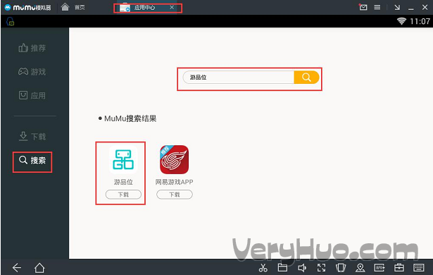
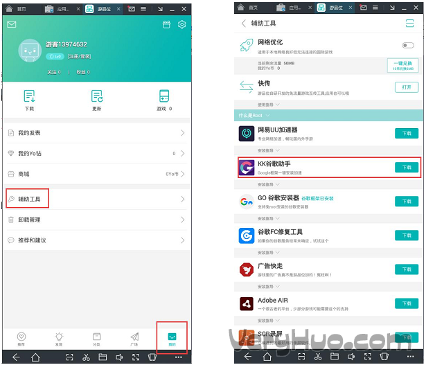
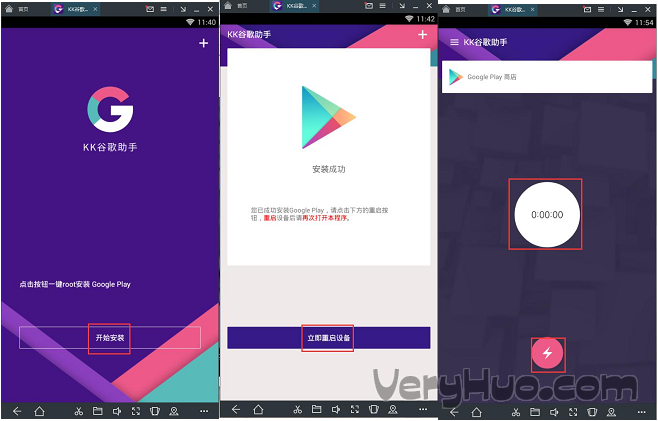
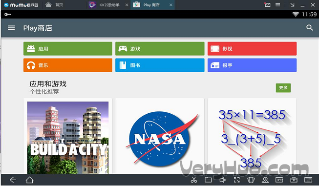

# 网易MuMu模拟器怎么安装Google Play全家桶

文章作者：网友投稿　发布时间：2017-09-21　来源：网络

**如何在MuMu模拟器上安装Google Play四件套并登录Google账号?请看步骤。**

> 第一步：在MuMu应用中心搜索下载安装APP"游品位"
> 第二步：启动"游品位"-->向右切换到【我的】-->找到【辅助工具】-->下载安装"KK谷歌助手"
> 第三步，启动KK谷歌，一键安装google play四件套，按步骤执行(如下图)，并点击图中的【立> 即重启设备】，按要求授予权限，就可以成功安装谷歌四件套了。
> 第四部：启动"KK谷歌助手"，并根据提示一键安装Google Play四件套
> 第五步：重启"KK谷歌助手"-->进入KK的加速页面，点击【闪电】启动加速器，KK会启动启动Google Play store.
> 第六步：登录Google账号，畅玩Google play!
> 

## 更详细图文教程：

第一步，在应用中心搜索下载安装APP“游品位”，见下图

第二步，进入游品位-我的-辅助工具-KK谷歌助手-下载，见下图

第三步，启动KK谷歌，一键安装google play四件套，按步骤执行(如下图)，并点击图中的【立即重启设备】，按要求授予权限，就可以成功安装谷歌四件套了。

第四步，启动KK谷歌助手，点击‘闪电’回事，计时器开始计时后，KK会自动启动Google Play Store，按照要求登陆，并进入Google Play Store，见下图：

## 注意事项：

1，用KK安装Google Play 前有用其他安装器(如：GO安装器)安装过的需要重装模拟器

2，登陆google play 账号之前，必须保证KK处于加速状态，否则登录失败。

[comment]: [MuMu安装谷歌框架.pdf](../_resources/MuMu安装谷歌框架.pdf)
