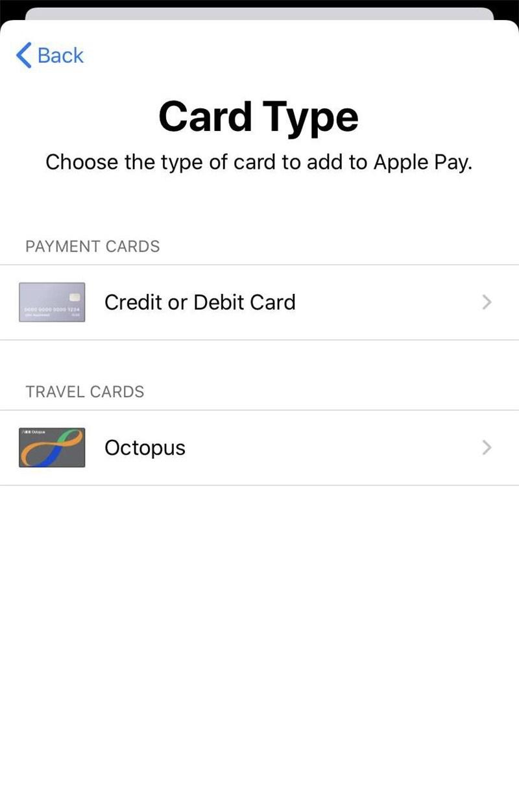

## 苹果 iPhone Apple Pay 正式支持香港八达通

2020-06-02 02:14:10 来源： 作者：骑士

[评论(0)](#J_GlobelComment) 收藏(0)

微博 微信 QQ空间 扫一扫

　　 6月2日消息北京时间今日凌晨1点，苹果正式推送iOS13.5.1/iPadOS13.5.1正式版更新，版本号为17F80，主要是提供了重要的安性更新，建议所有用户安装。网友们可以到【果粉圈】讨论iOS/iPadOS13.5.1正式版的新发现。

　　今天，苹果iPhone Apple Pay正式上线支持香港八达通卡。香港八达通官方介绍，iPhone用户现可透过八达通App拍卡，支持实时增值、查询余额及交易记录、领取交通补贴等。

　　八达通App拍卡功能现已登陆iPhone！无论Android还是iPhone用家，只要成为八达通App的登记用户，便可简易轻松享用八达通的全方位服务*，让你随时随地在手机上管理八达通卡及O!ePay账户：

　　**增值八达通卡**

　　使用O!ePay账户内的结余或透过转数快随时随地增值八达通卡。

　　**查询八达通卡**

　　查阅八达通卡余额及消费纪录，以及过往三个月的消费纪录分类。

　　**领取公共交通费用补贴**

　　领取补贴、查阅公共交通开支记录、补贴金额及指定车船票的登记状况。

　　**购买巴士及渡轮月票、缴付账单**

　　随时随地购买巴士及渡轮月票，以及缴付账单。

　　其他功能

- 　　启动八达通自动增值服务或实时提升自动增值至$500
    
- 　　报失个人八达通或附有自动增值的八达通
    
- 　　登记及启动八达通日日赏会籍，查阅八达通日日赏$余额
    
- 　　享用商户提供的精选优惠
    

　　**备注：**

　　*八达通拍卡功能适用于：

- 　　 Android-具备近场通讯功能(NFC)
    
- 　　 iOS-iPhone7或之后型号，并已安装iOS13或以上，或已连接八达通流动读写器
    

　　 获悉，八达通拍卡功能只适用于号码为9位数字的八达通卡(即8个数字加括号内的1个数字)。如你持有第一代租用版八达通卡(卡上的号码最后数字并无括号)，可到位于指定港铁站及商场内的八达通服务站免费换卡。了解更多八达通换卡计划详情。

