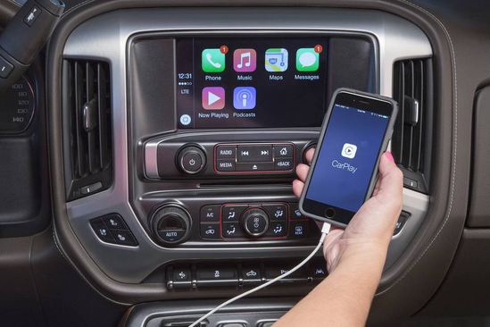

　　网易科技讯 12月12日消息，据华尔街日报报道，从部分经销商的反馈来看，支持苹果车载平台CarPlay有助于汽车的销售，通用汽车大范围采用CarPlay之举或许收到了回报。
　　CarPlay今年秋季登陆通用汽车的27款车型，该数字要远远超过任何其它的汽车公司。CarPlay可在汽车的中控台上显示iPhone的屏幕，支持访问各类应用程序，包括苹果自有的地图应用。
　　包括本田和大众在内的部分汽车厂商已在部分产品中提供该款软件，几乎每一家汽车公司都计划引入CarPlay和谷歌与之竞争的Android Auto平台。
　　汽车经销商Jerry Seiner Dealerships的CEO克里斯·赫梅斯梅尔（Chris Hemmersmeier）表示，“有些顾客是因为听说了CarPlay而前来光顾，一看到实际的情况，他们就很喜欢CarPlay，因为它的外观和体验与他们所使用的设备类似。这有助于交易的达成。”
　　通用汽车的高管称他们看到了CarPlay的影响的例证，认同该产品很受欢迎。通用汽车连接性与信息娱乐部门执行总监菲尔·埃布拉姆（Phil Abram）指出，近年来客户一直在呼吁提供该项功能，公司也计划尽可能快速地将CarPlay推向更多的车型。
　　有的汽车厂商则在CarPlay的引入上较为谨慎。丰田尚未表态要在产品中安装CarPlay和Android Auto，它仍坚持使用自有的移动应用软件。
　　受市场强势和SUV需求强劲提振，通用汽车10月和11月的美国销量均呈现上涨。不过，很难认定这是CarPlay引发的直接影响。
　　经销商Pat McGrath Chevyland总经理加文·麦格拉斯（Gavin McGrat）一直在积极宣传产品对CarPlay的支持，这帮助它吸引力不少顾客。
　　“这确实给我们带来了帮助。”他说道，“CarPlay在零售层面的最大影响是，有了带有导航功能的CarPlay，消费者就不必另外购置900美元至1000美元的导航装置。这帮助促进了我们的销售。”CarPlay免费安装于汽车当中，汽车内的屏幕较大，足以展示各类应用程序。
　　麦克格拉斯和赫梅斯梅尔指出，该软件将会影响内置导航系统的车型的销售。前者称，他已经在考虑改变这类车型的订购计划。（皓慧）
　　更多有态度内容请下载网易新闻