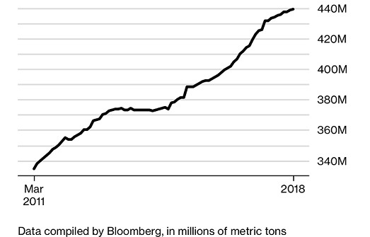

# 文书工作人员危险了！壳牌、BP等石油巨头用区块链记提单，耗时立减86%

|     |     |     |
| --- | --- | --- |
| 本文作者：[周蕾](https://www.leiphone.com/author/zhoulei342) | 编辑：陈伊莉 | 2018-02-26 17:19 |

导语：区块链删繁就简任务get√

雷锋网AI金融评论报道，彭博社消息，英国石油公司BP、壳牌、挪威国家石油公司、摩科瑞能源集团、KS&T、荷兰国际集团等正在联合开发一个基于区块链的实体石油交易平台，并进行了一次实际测试，用时25分钟，耗时立减86%。

每天都有几十艘巨型油轮扬帆起航，载着数百万桶原油和一代代海洋船长们珍藏的货物，前往世界各地的港口——从统计数据来看，随着全球需求的上升，油轮月运载量正在屡创新高。

每艘船上的货物价值超过1.22亿美元，而提单是验证这些昂贵商品的所有权的文件。这个远洋原油市场占全球一半的供应量，日交易额达27亿美元，倘若没有这些文件，买卖双方就无法开展业务。

但一些大型生产商、贸易商和银行希望取消提单制度，以及其他形式的每笔交易所需的耗时记录。为了削减成本，应对更严峻的盈利问题，业界正在关注区块链技术在此方面的落地应用。

“我们做所有权转让和交易后执行的方式，存在十分繁冗的文书工作。”摩科瑞能源集团（Mercuria）的全球业务主管Alistair Cross表示，“在过去的几百年里，文书工作并没有实现真正的发展。”

区块链的魅力在于交易采用加密记录以确保安全，并允许每个交易历史记录被用户网络查看。虽然大多数石油贸易商使用数字技术来存储他们自己的数据，但区块链能迫使买家和卖家在同一记录簿上工作，这无疑提升了交易透明度，还消除了大部分来回文档的需求。

雷锋网AI金融评论了解到，包括石油生产商BP、壳牌、挪威国家石油公司、摩科瑞、大宗商品交易商贡沃集团以及荷兰银行等多家公司在内的一个财团正在开发基于区块链的实体石油交易平台。

摩科瑞证实，在将一船原油送至买家中国化工集团公司手中前，他们进行了三次实际测试，交易验证用时仅需25分钟，远低于平常所需的3小时，减少了一般需要确认常规错误风险的时间。

法国兴业银行的一位常务董事表示，他们的业务体系需要有人在世界各地来管理交易，而通过区块链系统，人们可以直接通过移动设备执行工作任务，而不再依靠其他人的文书工作。据悉，以往后台的工作人员需要花费数小时来追踪每份合同所需的相应文件，其中可能仅仅因为书面发票上的污迹或时间地点输入错误而前功尽弃，区块链则可能将这些工作人员取而代之。

荷兰国际集团的贸易商品融资全球主管Anthony van Vliet指出，显然这些工作将受到影响，如果能有节省下来的成本开销，这就意味着能用更少的人来完成同样的工作。

来自牛津大学赛德商学院的副研究员David Sherier，同时也是金融服务行为分析供应商Distilled Analytics的首席执行官，他表示在这一趋势下，首当其冲的将是财务、物流、运营和会计领域的数百名办公人员。

区块链技术公司BTL Group Ltd.的联合创始人Hugh Halford-Thompson曾与银行家和能源交易方交流过：“这就是能源交易的过程。我们可以略过哪些中间商，可以跳过哪些步骤呢？”

根据他的说法，公司们正热衷于采用这一技术来降低成本：他们已经和摩科瑞以及埃尼集团签下合作，将提供用于欧洲天然气管道交易的服务。当中不需要用到纸质提单，也不用集团把油轮送到中国进行测试交易。

> “这将使交易员、能源公司和银行的工作人员们，能把更多时间花在真正重要的工作上”Van Vliet这样说道。

可以肯定的是，任何新系统面世之初都要面对各种挑战，从成本到技术，以及所有数据上链的问题——尤其是电子提单目前还不具备与纸质文件相同的法律地位。Anthony van Vliet表示，尚无相关法例出台。

然而，使用纸质文件仍然容易出现欺诈问题，交易商希望找到一种更安全的替代方式。Alistair Cross指出，人们购买并支付这些文件中的货物并不是为了发现他们购买的东西不翼而飞的。

值得一提的是，近期各国航运业对区块链技术的探索正持续进行中，雷锋网了解到韩国和新加坡都在抢滩新领域。据中国水运报消息，2018年2月23日，太平船务（PIL）联合新加坡港务集团（PSA）及IBM新加坡完成基于区块链技术的首次试航。

太平船务董事总经理张松声表示，相信区块链技术的广泛应用可以提高运行操作的高效性、安全性及透明性，这正是航运业的未来。

而韩国方面，韩国区块链航运与物流联盟再添新成员增至38家。联盟主要领导成员之—三星SDS指出，多项试验表明区块链技术可以降低企业运营成本，提高企业运营效率，并受到全球各行各业的不断关注。

雷锋网(公众号：雷锋网)编译 via [Bloomberg](https://www.bloomberg.com/news/articles/2018-02-26/big-oil-buyers-ditch-paper-for-blockchain-to-track-tanker-sales)

雷锋网原创文章，未经授权禁止转载。详情见[转载须知](http://dwz.cn/4ErMxZ)。

2人收藏

分享：

