LATEX（英语发音：/ˈleɪtɛk/ LAY-tek或英语发音：/ˈlɑːtɛk/ LAH-tek，音译“拉泰赫”），是一种基于TEX的排版系统，由美国电脑学家莱斯利•兰伯特在20世纪80年代初期开发，利用这种格式，即使用户没有排版和程序设计的知识也可以充分发挥由TEX所提供的强大功能。对于生成复杂表格和数学公式，这一点表现得尤为突出。因此它非常适用于生成高印刷质量的科技和数学类文档。这个系统同样适用于生成从简单的邮件到完整书籍的所有其他种类的文档。
      和Microsoft Office Word 等所见即所得的办公软件不同，用LATEX 排版文档，首先要用文本编辑器编辑好tex 文档，然后通过各种程序编译，得到pdf 文档用于打印或者阅读。基本的排版流程如下图：

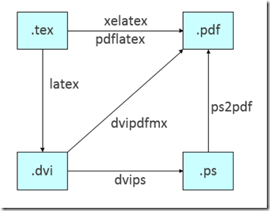

      一般我们经常用pdflatex 或者xelatex 程序直接从tex 文件生成pdf 文件。如果是中文tex 文档，优先使用xelatex 程序编译。
      WinEdt是一款Microsoft Windows平台下的文本编辑器。它主要是用来创建TeX（或者LaTeX）文档，但是同时也能处理HTML或者其他文本文档。它被很多TeX系统如MiKTeX用来当作输入前端，且无缝整合。
本文利用WinEdt来实现对latex的学习与应用。
## **第一部分 软件安装**
### **1.首先安装LATEX**
下载地址：http://www.miktex.org/download。按照步骤安装，新版Latex会自带文档编辑器TeXworks。
TeXworks 是在TUG（TeX Users Group）的支持下开发的一个全新的TeX/LaTeX 编辑器。它的首要特点如下：自带了一个pdf 浏览器，编辑latex文件时可以迅速预览排版后的pdf 文件；还有就是它的设计目标是简单易用，所以只支持直接生成并预览pdf，避免dvi, ps, pdf 各种文件格式对初学者的干扰。
TeXWorks 支持命令补全（command completion）。使用方法是在输入若干字母后按Shift+Tab（或Ctrl+Tab）。比如，输入i 之后按Ctrl+Tab 就会变成\item。如果有几种可能的补全方式，多按次就会在这几种方式之间循环，按Ctrl+Tab 和按Shift+Tab 循环方向相反。
### 2.安装WinEdt
下载地址：http://www.winedt.com/download.html。按照步骤安装，在完成时，增加勾选关联关于Tex的项。
1）熟悉WinEdt软件，几个重要的区域：

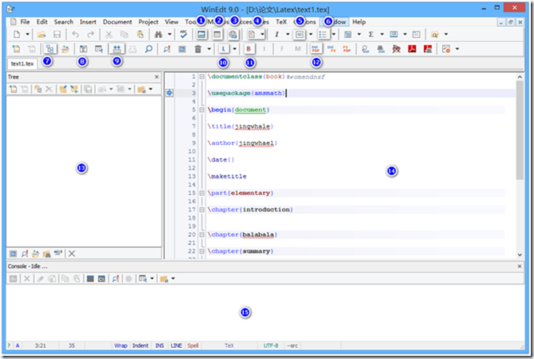

①插入图片
②插入表格
③插入超链接
④插入文章的结构：part、chapter等

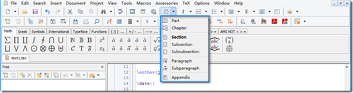

⑤文字的居左、中、右。
⑥列表样式

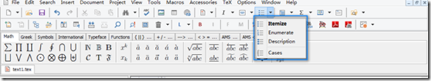

⑦显示左侧的框区，区域13
⑧显示数学符号

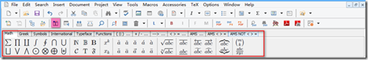

⑨编译，运行；旁边的放大镜

为预览。
⑩将此项改为LaTex或PDFTexify；PDFTexify运行后自动生成PDF文件打开
⑪处理参考文献
⑫将DVI格式转换为PDF；10设置为LaTex时，需要用它转换成PDF文件
⑬点击Set Main File，显示文章的树型结构大纲

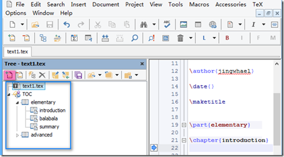

⑭代码编辑区
⑮Console，工作台，代码出错会在这里报错。

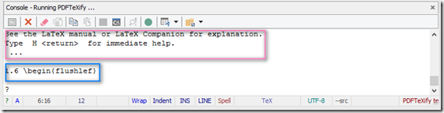

蓝框内表示：第一个错误出现在第6行。
红框内表示：错误的信息。
在Console内，按enter键跳过错误，继续执行后面的代码；所有当修改错误后，要点击Console区域的×号停止编译，然后重新编译。
2）TIPS
a.大小写敏感
b．设置编辑区代码行数：View->Line Numbers(或Ctrl+=);
c. WinEdt中的环境(
\begin{}...\end{}
)自动补足功能。以
...(1)
为例：
▪输入时使用
\begin{equation}} ▪输入时使用\begin{equation}>，如果之后没有\end{...}，则与第一种方法相同；如果之后有个别的\end{...}，如\end{document}，则系统将弹出窗口提示Change Environment，输入equation，则自动将\end{document}改为\end{equation}

▪输入时使用\end{{
d. 编辑区左侧的小箭头将这行代码转到PDF文件对应的区域

相比较，WinEdt功能更强，且无缝整合LaTex，选择WinEdt作为编辑器。当然除了TeXWorks、WinEdt，还有很多其他的软件，此处不再介绍。
## **第二部分 LaTex排版**
### **一.英文文档**
1.最简单的LATEX 英文文档
% hello.tex
\documentclass[a4paper]{article}
\usepackage{hyperref}
\begin{document}
Hello World!
\end{document}

①% 符号后面的内容都表示注释
②在LATEX 文档中，用\ 开始的字母串来表示一个命令。命令后面用花括号{} 包含的内容是该命令的参数，必不可少。
③这里的\documentclass 是LATEX 文档的基本命令，用于指明文档类。\documentclass[选项]{文档类}
文档类
article    排版科技期刊、短报告、程序文档、邀请函等。
report    排版多章节的长报告、短篇的书籍、博士论文等。
book    排版书籍。
slides    排版幻灯片。其中使用了较大的 sans serif 字体。也可以考虑使用 FoilTEX 来得到相同的效果。
文档类的选项
纸张大小（a4paper，a5paper，b4paper，letterpaper，legalpaper，executivepaper）：
默认的letterpaper 纸张常见于美国，和国内常用的A4 纸张的大小稍有差别，建议自己指定。
字体大小（10pt，11pt，12pt）：默认为10pt。
纸张方向（portrait，landscape）：默认为portrait（纵向），在屏幕阅读也许landscape（横向）更方便。
草稿定稿（draft，final）：默认为final（定稿）；如果是draft（草稿），页面内容有溢出时会显示粗黑条。
单面双面（oneside，twoside）：对于article 和report 文档类，默认设置为单面，页码总是在右边；对于book 文档类，默认设置为双面，奇数页页码在右边，偶数页页码在左边，这样双面打印时页码总在外侧。
新章开始（openright，openany）：仅对book 文档类有效，默认值为openright，即每章都从奇数页开始；如果设置为openany，则每章仅从新的一页开始，不管奇偶页。
④\usepackage 命令也是LATEX 的基本命令，用于载入LATEX 宏包。LATEX 系统中包含了各种各样的宏包，对LATEX 的基本功能作了各种扩展。
⑤
\begin{document} 和\end{document}
之间的部分我们称为正文区，一般用于正文内容的撰写。这个例子的正文内容只有简单的Hello World!。对应的，在\documentclass 和\begin{document} 命令之间的部分我们称为导言区，一般用于载入宏包，定义命令和调整格式。
⑥LaTeX 的命令也有不同的类型，形如
\begin{环境名}...\end{环境名}
的命令组合我们称为环境。
LATEX 文档把格式和内容部分分开，是一种良好的设计准则。
### **二.中文文档**
LaTeX 中文文档的排版有各种方式，例如CCT，CJK，xeCJK 等等。目前最优秀的方式是用ctex 文档类来排版中文文档，它在其它各种方式的基础上以一致的方式解决了中文排版的问题。例如：
\documentclass[UTF8]{ctexart}
\begin{document}
中文内容测试！
\end{document}
使用这种方式，只需要将文档类从英文的article 改成ctexart，所有中文环境和章节编号等等都已经按照中文习惯设置好了，简单易行。另外，对于book 和report 文档类，也有对应的ctexbook 和ctexrep 中文文档类，其用法类似。
例子中的UTF8 这个可选参数指明了中文文档的编码。编码主要有这两种：GBK 和UTF8，而不同的LaTeX 编辑器对中文文档的默认编码不同。WinEdt 编辑器的默认中文编码为GBK，而TeXworks 编辑器的默认中文编码为UTF8。
### **三.主要编辑（使用图形加快编辑）**
#### 1.输入特殊字符
输入 \# $ \% \& \{ \} \ _ \^{} \~{} \textless \textgreater \textbar \textbackslash
输出 # $ % & { } _ ^ ~ < > | \
#### 2.段落换行
用一个空行或者\par 命令可以开始新的段落，同时会有默认的首行缩进。用\\ 或者\newline 可以强制换行在下一行继续，且在下一行不会有缩进。
#### 3.列表环境
列表环境有三种：无序列表（itemize）、有序列表（enumerate）和描述列表（description）。使用⑥的图标，自动生成代码。
\documentclass[UTF8]{ctexart}
\begin{document}
\begin{itemize}
  \item javascript
  \item html
  \item css
\end{itemize}
\begin{enumerate}
  \item javascript
  \item html
  \item css
\end{enumerate}
\begin{description}
  \item[javascript] javascript
  \item[html] html
  \item[css] css
\end{description}
\end{document}
显示效果如下：

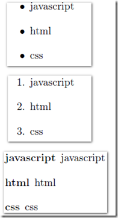

#### **4.标题摘要**
用下面的代码可以加入文章的标题、作者、日期信息和内容摘要：
\documentclass[UTF8]{ctexart}
\begin{document}
\title{Latex与Winedt}
\author{jingwhale}
\date{January 25, 2015}
\maketitle
\begin{abstract}
LATEX（英语发音：/ˈleɪtɛk/ LAY-tek或英语发音：/ˈlɑːtɛk/ LAH-tek，音译“拉泰赫”），是一种基于TEX的排版系统，由美国电脑学家莱斯利•兰伯特在20世纪80年代初期开发，利用这种格式，即使用户没有排版和程序设计的知识也可以充分发挥由TEX所提供的强大功能。对于生成复杂表格和数学公式，这一点表现得尤为突出。因此它非常适用于生成高印刷质量的科技和数学类文档。这个系统同样适用于生成从简单的邮件到完整书籍的所有其他种类的文档。
\end{abstract}

\end{document}

显示效果如下：

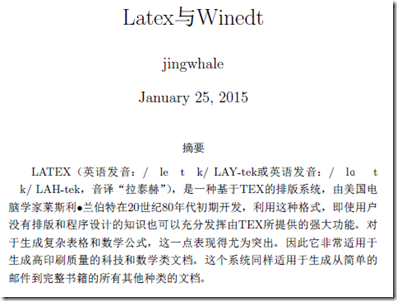

如果\date{} 命令的参数为空，则不显示日期信息。如果不出现\date 命令，则默认显示当前的日期。
#### **5.章节目录**
在book 和report 文档类中，可以使用\part、\chapter、\section 、\subsection、\subsubsection、\paragraph、\subparagraph 这些章节命令，在article 文档类中，除了\chapter 不能用，其它的都可以用。
用\tableofcontents 命令可以自动从各章节标题生成目录。
例如下面的代码：
\documentclass[UTF8]{ctexart}
\usepackage{hyperref}
\begin{document}
\tableofcontents
\part{部分标题}
%\chapter{章标题}这一章我们介绍这些内容。
\section{节标题}这一节我们介绍这些内容。
\subsection{小节标题}这一小节我们介绍这些内容。
\subsubsection{子节标题}这一子节我们介绍这些内容。
\paragraph{段标题}这一段我们介绍这些内容。
\subparagraph{小段标题}这一小段我们介绍这些内容。
\end{document}
显示效果如下：

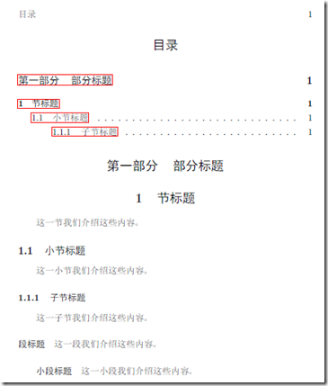

要调整章节标题在目录页中的格式，可以用titletoc 宏包。该宏包的基本命令参数如下:
\titlecontents{标题层次}[左间距]{整体格式}{标题序号}{标题内容}{指引线和页码}[下间距]
#### **6.参考文献**
引用文献的基本环境是：
\begin{thebibliography}{}
\bibitem[显示符号]{引用标签} Book Title, Author
\end{thebibliography}
其中\begin{thebibliography}{}的大括号内填入的数字表示最大标号值。
\bibitem表示一条文献记录。其中[显示符号]表示在参考文献区域显示的标号，可不填，默认使用数字1,2,3进行编号。引用标签则是在正文中引用的标签。参考文献的引用和其他的引用有点不同，需要用\cite{引用标签}来引用。
在LaTeX 中使用参考文献很容易，代码如下：
\documentclass[UTF8]{ctexart}
\begin{document}
\begin{thebibliography}{123456}
\bibitem {JW1}Jingwhale, T.A.O.C.P. , Yunlong Zhang , 2015,Vol. 1.
\bibitem {JW2}Jingwhale, T.A.O.C.P. , Yunlong Zhang , 2015,Vol. 6.
\bibitem {JW2}Jingwhale, T.A.O.C.P. , Yunlong Zhang , 2015,Vol. 8.
\end{thebibliography}
\end{document}
显示效果如下：

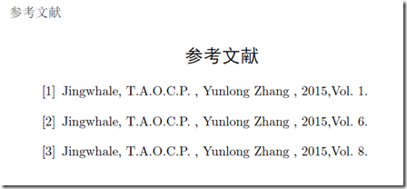

TIPS：
▪默认thebibliography会自动添加标题Reference，所以无需重复添加
▪默认参考文献的行间距为一行，这有时候显得太大了。可以在\begin{thebibliography}{}后添加\addtolength{\itemsep}{-1.5ex}来缩小行间距。-1.5ex表示每行缩小1.5ex。其实细心观察可以发现，thebibliography其实是一个枚举环境，因此对于itemize和enumerate，可以用同样的方法缩小行间距。
▪thebibliography是十分繁琐的。因为你还需要把作者等信息一个个地填上去。有没有什么更好的方法呢？答案是：有的。那就是bibtex！bibtex是一个引用数据库，一般以bib后缀结尾。各大论文网站都会提供bibtex格式的文献引用。这里不做详解，可以到网上搜所一下。
#### **7.插入表格**
插入表格经常使用的是tabular 环境，这个环境是LaTeX 中预先定义好的。
①.tabular 环境插入表格
在WinEdt中点击
，选择Tabular，选择3行3列表格，代码如下：
\begin{tabular}{||||}
  \hline
  % after \\: \hline or \cline{col1-col2} \cline{col3-col4} ...
   &  &  \\
   &  &  \\
   &  &  \\
  \hline
\end{tabular}
▪首先，tabular 环境的参数|l|c|r| 指明了各列的对齐方式，l、c 和r 分别表示左对齐、居中对齐和右对齐。中间的竖线| 指明各列之间有竖线分隔，如果在某些地方不需要竖线，去掉相应位置的| 即可。
▪表格各行的元素之间用& 号分隔，两行内容用\\ 分隔。\hline 表示两行之间的横线；你可以用连续两个\hline 得到双横线，或者去掉\hline 以不显示该横线。
▪如果需要在某个单元格中填写多行内容，不能直接用\\ 或\newline 命令，而应该将它们放在一个盒子里面（比如\parbox 盒子）。
我们修改代码如下：
\documentclass[UTF8]{ctexart}
\begin{document}
\begin{tabular}{|l|c|r|}
  \hline
  % after \\: \hline or \cline{col1-col2} \cline{col3-col4} ...
  左列 & 中列 & 右列 \\
  \hline
  2行1列 & 2行2列 & 2行3列 \\
  \hline
  3行1列 & 3行2列 & 3行3列 \\
  \hline
  4行1列 & 4行2列 & 4行3列 \\
  \hline
\end{tabular}
\end{document}
显示效果如下：

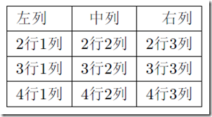

②.跨列表格
复杂的表格经常需要跨行和跨列，在tabular 环境中，我们可以用命令\multicolumn 得到跨列表格，而跨行表格需要使用multirow 宏包，我们暂不介绍。
\documentclass[UTF8]{ctexart}
\begin{document}
\begin{tabular}{|l|c|r|}
  \hline
  % after \\: \hline or \cline{col1-col2} \cline{col3-col4} ...
  左列 & 中列 & 右列 \\
  \hline
  2行1列 & 2行2列 & 2行3列 \\
  \hline
  \multicolumn{2}{|c|}{跨越2015} & 3行3列 \\
  \hline
  4行1列 & 4行2列 & 4行3列 \\
  \hline
\end{tabular}
\end{document}
显示效果如下：

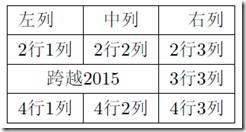

\multicolumn 命令的第一个参数指明要横跨的列数，第二个参数指明对齐和边框线，第三个参数指明该单元格的内容。
③.浮动表格
前面所说的插入表格的例子中，表格是在tabular 环境对应的位置排版出来的。如果表格高度大于当前页剩余高度，表格就会被放置到下一页中，造成这一页下部留出很大空白。大部分时候我们并不需要严格限定表格出现的位置，而只要求表格在该段正文的附近出现即可。此时，我们可以用table 浮动环境来达到自动调整位置的效果。
我们只需，在WinEdt中点击
，代码如下：
\begin{table}
  \centering
  
  \caption{}\label{}
将表格代码插进去就行了，示例代码如下：
\documentclass[UTF8]{ctexart}
\begin{document}
\begin{table}[htbp!]
  \centering
  \begin{tabular}{|l|c|r|}
  \hline
  % after \\: \hline or \cline{col1-col2} \cline{col3-col4} ...
  左列 & 中列 & 右列 \\
  \hline
  2行1列 & 2行2列 & 2行3列 \\
  \hline
  3行1列 & 3行2列 & 3行3列 \\
  \hline
  4行1列 & 4行2列 & 4行3列 \\
  \hline
\end{tabular}
  \caption{示例表格}\label{we}
\end{table}
\end{document}
其中的可选参数里，h（here，当前位置）、t（top，页面顶部）、b（bottom，页面底部）、p（page，单独一页）表明允许将表格放置在哪些位置，而! 表示不管某些浮动的限制。用table 浮动环境，还可以用\caption命令指明表格的名称，并得到表格的自动编号。
#### 8.插入图片
在LATEX 文档中插入现有的图形，可以使用graphics。我们这里只介绍graphicx 宏包。需要载入graphicx 宏包
\usepackage{graphicx}
①.图文混排。
命令：\includegraphics[选项]{图形文件} 。如下的代码：
\documentclass[UTF8]{ctexart}
\usepackage{graphicx}
\begin{document}
和Microsoft Office Word 等所见即所得的办公软件不同，用
\raisebox{-2mm}{\includegraphics[scale=0.8]{picture/tupian.jpg}}
排版文档，首先要用文本编辑器编辑好tex文档，然后通过各种程序编译，得到pdf 文档用于打印或者阅读。
\end{document}
显示效果如下：

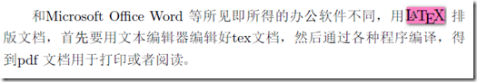

▪\includegraphics 命令有许多选项，上面例子中使用的选项scale=0.03 指明了整体的伸缩因子，常用的选项还有宽度值和高度值选项，例如width=64mm 和height=48mm 等等。如果宽度值和高度值只指明一项，将按同比例对另一项作伸缩。
▪默认情况下，图片是和正文的基线对齐的，当图片高度比行距大时，结果不是很美观。可以用\raisebox命令稍微降低图片的位置。
②.图文分开
如果插入的图片需要独立居中显示。这可以通过把插入的图片放在center 环境中来实现。如下面的代码：
\documentclass[UTF8]{ctexart}
\usepackage{graphicx}
\begin{document}
和Microsoft Office Word 等所见即所得的办公软件不同，用
\begin{center}
\includegraphics{picture/tupian.jpg}
\end{center}
排版文档，首先要用文本编辑器编辑好tex文档，然后通过各种程序编译，得到pdf 文档用于打印或者阅读。
\end{document}
显示效果如下：

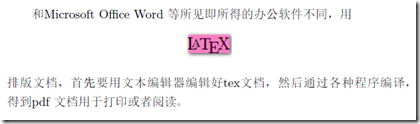

图片最好设置宽和高，让它按照我们的约定显示。图片的伸缩因子需要计算有些麻烦，如果将它设为页芯宽度\textwidth 的某个因子，如\includegraphics[width=0.9\textwidth]{picture/tupian.jpg}，图片将页芯宽度显示。
③.浮动图片
同表格的插入情形类似，自动调整图片的位置。用figure 浮动环境来达到这个效果。
在WinEdt中点击
，出现代码代码如下：
\begin{figure}
  \centering
  % Requires \usepackage{graphicx}
  \includegraphics[width=]{}\\
  \caption{}\label{}
\end{figure}
修改代码如下：
\documentclass[UTF8]{ctexart}
\usepackage{graphicx}
\begin{document}
和Microsoft Office Word 等所见即所得的办公软件不同，用
\begin{figure}[h]
  \centering
  % Requires \usepackage{graphicx}
  \includegraphics{picture/tupian.jpg}\\
  \caption{latex}
\end{figure}
排版文档，首先要用文本编辑器编辑好tex文档，然后通过各种程序编译，得到pdf文档用于打印或者阅读。
\end{document}
显示效果如下：

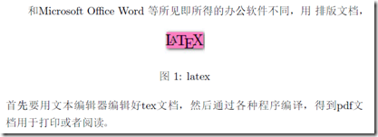

#### 9.插入公式
在LATEX 中，数学公式有两种：即行内公式（inline formula）和行间公式（displayed formula）。
一般地，对于行内公式，我们常用... 形式；而对于行间公式，我们常用...
形式。
行内公式和正文在同一行中显示，示例如下：
\documentclass[UTF8]{ctexart}
\usepackage{graphicx}
\begin{document}
From $ a+b>c $, we have ...
\end{document}
显示效果如下：

行间公式在单独一行居中显示，示例如下：
\documentclass[UTF8]{ctexart}
\usepackage{graphicx}
\begin{document}
Since
\[ x^n + y^n = z^n, \]
we have...
\end{document}

显示效果如下：

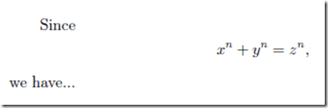

①公式编号
用
...
形式来输入行间公式，除了输入麻烦外还有其它缺点。但它有一个特有的好处，就是可以用\eqno命令指定公式的编号，例如：
$$x_1+y_1>z_1 \eqno{(1)}$$
另外，我们可以用equation 环境来得到自动编号的行间公式。例如：
\begin{equation}
x^n+y^n=z^n
\end{equation}
显示效果如下：

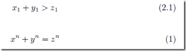

②数学函数
点击WinEdt的

，选择你要编辑的公式或符号，进行编辑即可，示例如下：
\[
\int\frac{1}{x} dx = \ln |x| + C
\]
$[
$int$ $frac{1}{x} dx = \ln |x| + C$
]

 
③配对括号
我们可以用\left 和\right命令来得到自动调整大小的括号，例如

自动调整大小的括号有时候效果仍然差强人意，这时候你也可以自己指定括号的大小：
\[ \Bigg< \bigg\{ \Big[ \big( xyz \big) \Big] \bigg\} \Bigg> \]

注意：{ 和} 是特殊字符，需要用\{ 和\} 来表示。
④多行公式
要方便地输入多行公式，可以使用美国数学会的amsmath 宏包
\usepackage{amsmath}
得到对齐的公式，用align 环境。例如：
\begin{align}
x + y &= 5 \\
2x + 3y &= 8
\end{align}
其中& 符号后面的字符就是各行间对齐的位置。
显示效果如下：

 
各行之间是不对齐的,可以用gather 环境的多行公式里面，
\begin{gather}
x + y = 5 \\
2x + 3y = 8
\end{gather}
前面两个环境中的多行公式都是自动编号的。如果不要编号，可以用对应的gather* 和align* 环境。将{}修改为对应的gather* 和align*即可。
⑤折行公式
一个公式太长需要拆为几行，这种折行公式应该只需要一个编号，可以使用equation 环境中的\split 环境。例如：

\begin{equation}
\begin{split}
(3+3)\cdot111 &= 3\cdot111 + 3\cdot111 \\
&= 666
\end{split}
\end{equation}

⑥复杂公式

\documentclass{article}

\usepackage{amsmath}

\begin{document}

\begin{equation}
\left.
\begin{aligned}
x+y &> 5 \\
y-y &> 11
\end{aligned}
\ \right\}\Rightarrow x^2 - y^2 > 55
\end{equation}

\end{document}

⑦定理环境
定理命题的撰写的简单例子：

\newtheorem{thm}{Theorem}[subsection]
\newtheorem{cor}[thm]{Corollary}
\begin{thm}
This is a theorem.
\end{thm}
\begin{cor}
This is a corollary.
\end{cor}

这里的例子是对于article 文档类来说的，如果是book 文档类，最前面的subsection应改为section。
### 四.中文排版
#### 1.使用LaTeX 排版中文文档
传统的方法有两种：一是用CJK 宏包，二是用CCT 宏包。这里先介绍CJK 的中文排版。
CJK 是国外人编写的，不仅支持中文，而且也支持其它双字节语言（实际上CJK 就是Chinese，Japanese 和Korean 这三个词语的缩写）。安装之后就可使用。

\documentclass{article}
\usepackage{CJK}
\begin{document}
\begin{CJK}{GB}{gbsn}
欢迎来到CJK！这里使用的是CJK宏包里有的文鼎宋体。
\end{CJK}
\end{document}

然后就用latex 编译就可以得到中文文档了。
▪要把中文部分放在
\begin{CJK} 和\end{CJK}
之间。
▪上面代码中的GB 指的是编码，对于简体中文来说，常见的有GB 编码和GBK 编码两种。
▪而gbsn 指使用的字体为文鼎宋体。

CTeX 里另外多了GBK 编码的六种中文字体（宋体、仿宋、楷体、黑体、隶书和幼圆），如果你安装了CTeX，就可以类似下面的例子来使用这几种字体：

\documentclass{article}
\usepackage{CJK}
%\begin{document}
\begin{CJK}{GBK}{song}
CTeX里中文默认用宋体！
\CJKfamily}{GBK}{hei} 这是CTeX里的黑体！
\CJKfamily{fs} 这是CTeX里的仿宋体！
\CJKfamily{kai} 这是CTeX里的楷体！
\CJKfamily{li} 这是CTeX里的隶书！
\CJKfamily{you} 这是CTeX里的幼圆体！
\end{CJK}
\end{document}

CCT 和CJK 就是两种外挂而已，很容易就出现比如pdf 书签乱码之类的问题。XeTeX 和LuaTeX 从底端就支持各种文字包括中文，而且能够直接使用系统自带的字体，生成的文档更为美观。本文介绍用XeTeX 排版LaTeX 文档的方法。
XeTeX 对TeX 的改动主要集中在字体的使用上，因此原来的LaTeX 文档稍为修改下就能够用XeTeX 编译了。最新的MiKTeX（CTeX）和TeXLive 套装都包含XeTeX 程序。示例如下：

% !TEX program = xelatex
\documentclass [12pt ,a4paper ]{article}
\usepackage[cm -default ]{ fontspec}
\usepackage{xunicode}
\usepackage{xltxtra}
\setmainfont[BoldFont=SimHei ,ItalicFont=KaiTi_GB2312 ]{ SimSun}
\setsansfont[BoldFont=SimHei ]{ KaiTi_GB2312}
\setmonofont{NSimSun}
\XeTeXlinebreaklocale "zh"
\XeTeXlinebreakskip = 0pt plus 1pt
\begin{document}
\XeTeX\ Show: $\alpha$ , $a^2+b^2=c^2$
中文字体！
\end{document}

然后使用xelatex 编译，就得到一个中文文档了。当然里面还有很多细节要注意。
#### 2.字体大小

在LaTeX 中可以用各种命令来改变文本字体的大小，它的实际大小和文档类的正常字体大小（即\normalsize 的大小）设置有关。在代码里，直接添加字体命令即可。
#### 3.段落对齐
①居中对齐
在LaTeX 中，可以用center 环境得到居中的文本段落，其中可以用\\ 换行。例如：

LATEX（英语发音：/ˈleɪtɛk/ LAY-tek或英语发音：/ˈlɑːtɛk/ LAH-tek，音译“拉泰赫”），是一种基于TEX的排版系统，由美国电脑学家莱斯利•兰伯特在20世纪80年代初期开发，利用这种格式，即使用户没有排版和程序设计的知识也可以充分发挥由TEX所提供的强大功能。
\begin{center}
对于生成复杂表格和数学公式，这一点表现得尤为突出。
\end{center}
因此它非常适用于生成高印刷质量的科技和数学类文档。这个系统同样适用于生成从简单的邮件到完整书籍的所有其他种类的文档。

 

②单侧对齐
可以用flushleft 和flushright 环境分别得到向左对齐和向右对齐的文本段落。例如：

\begin{flushleft}
LATEX（英语发音：/ˈleɪtɛk/ ），
\end{flushleft}
\begin{flushright}
是一种基于TEX的排版系统，
\end{flushright}
由美国电脑学家莱斯利•兰伯特在20世纪80年代初期开发，利用这种格式，即使用户没有排版和程序设计的知识也可以充分发挥由TEX所提供的强大功能。

③调整页面布局
现在我们来说说如何定制页面的布局，比如正文区域的宽度和高度，和各个边距的大小。LATEX 中一般推荐用geometry 宏包来调整页面的布局。例如本文档（页面为B5 纸张大小）的页面布局就是用如下的代码设定的：
\usepackage[text={125mm,195mm},centering]{geometry}
其中的geometry 包的text={width,height} 选项指明了页面正文区域的宽度和高度大小，而后面的centering 选项表示将正文区域自动居中（即上下边距相等，而且左右边距也相等）。
## 第三部分 如何做论文模板
本节以清华大学论文模板为例，主要是通过学习模板总结如何去做。
清华大学论文模板下载地址：https://github.com/cnblogs-/latex-model
### 1.ThuThesis 的主要文件及功能介绍：

thuthesis.cls和thuthesis.cfg 可由thuthesis.ins和thuthesis.dtx生成。
### 2.建立步骤
思想：让形式与内容分离，这也是前端的思想。
①最主要的就是写宏。
▪thuthesis模板类。按照论文要求定义字体、目录、字号、行高等等。
▪写thubib参考文献样式模板
▪thutiles.sye：包含的宏包。
②建立data文件夹用于存放文章的内容

建立figures用于存储图片
建立ref存放参考文献
③建立main.tex，调用之前写的宏，写论文，引用相应的数据到相应的区块。

%%% Local Variables:
%%% mode: latex
%%% TeX-master: t
%%% End:

\documentclass[doctor]{thuthesis}
% \documentclass[%
%   bachelor|master|doctor, % mandatory option
%   xetex|pdftex|dvips|dvipdfm, % optional
%   secret,
%   openany|openright,
%   arialtoc,arialtitle]{thuthesis}

% 所有其它可能用到的包都统一放到这里了，可以根据自己的实际添加或者删除。
\usepackage{thutils}

% 你可以在这里修改配置文件中的定义，导言区可以使用中文。
% \def\myname{薛瑞尼}

\begin{document}

% 定义所有的eps文件在 figures 子目录下
\graphicspath{{figures/}}

%%% 封面部分
\frontmatter
\input{data/cover}
\makecover

% 目录
\tableofcontents

% 符号对照表
\input{data/denotation}

%%% 正文部分
\mainmatter
\include{data/chap01}
\include{data/chap02}

%%% 其它部分
\backmatter

% 本科生要这几个索引，研究生不要。选择性留下。
\makeatletter
\ifthu@bachelor
  % 插图索引
  \listoffigures
  % 表格索引
  \listoftables
  % 公式索引
  \listofequations
\fi
\makeatother

% 参考文献
\bibliographystyle{thubib}
\bibliography{ref/refs}

% 致谢
\include{data/ack}

% 附录
\begin{appendix}
\input{data/appendix01}
\end{appendix}

% 个人简历
\include{data/resume}
\end{document}

## 参考：
1.LaTex Help e-Book
2.http://zzg34b.w3.c361.com/index.htm
3.latex排版学习笔记
完