LaTeX 作为一款「史诗级」文章排版编译器，一直都有着优秀、高效的排版体验和简洁、一致的排版效果。但是 LaTeX 相对复杂的语法使用，让我们很多时候都需要花费大量时间在查阅 LaTeX 的参考文档上，才能得到我们想要的文字效果。并且有时候，复杂的图像、图表还不是很适合用 LaTeX 直接生成。下面我来推荐几个小工具，它们在我们撰写 LaTeX 文档的时候可能会帮上大忙。

## OCR 公式识别

很多时候我们在查看、阅读参考文献的时候，可能会希望将文献中的公式用 LaTeX 的格式重新写入我们自己的论文，但是复杂的公式实在不好实现，最后往往只好截图作罢。

这里我推荐一个软件叫做 Mathpix。Mathpix 的强大之处就在于，它可以利用 OCR 技术将一个图片形式的 LaTeX 公式还原为 LaTeX 源代码，这样我们就可以直接复制 LaTeX 源代码到我们自己的论文之中，再也不需要截一个 PDF 中模糊的公式图片了。

我们使用 Mathpix 转换公式的基本操作步骤就是：

*   快捷键 `⌃Ctrl+⌘Command+M`（macOS）唤起截图，并圈出相应的 LaTeX 公式区域：  
    

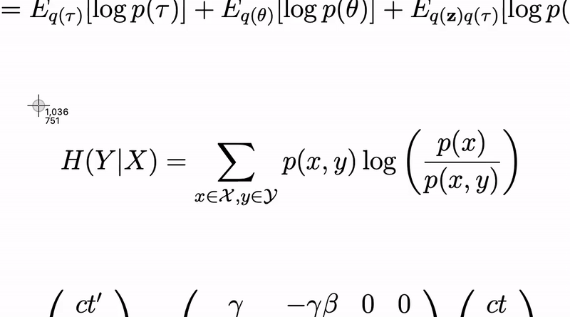

圈出识别区域（操作动图来自 Mathpix 官网）

*   经过识别后，我们在菜单栏就可以得到相应的 LaTeX 源代码：

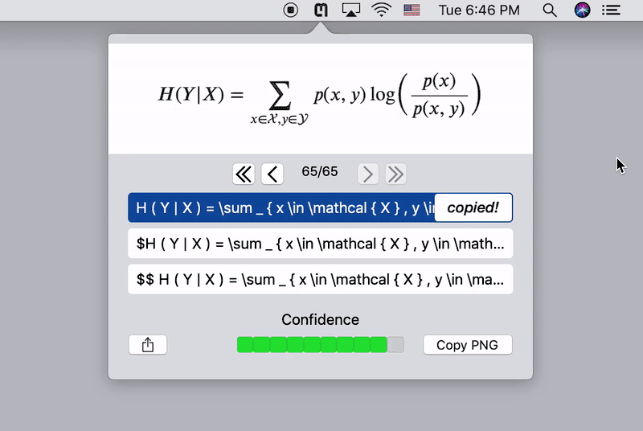

查看、修改并复制识别结果（操作动图来自 Mathpix 官网）

几乎 100% 的识别率，以及直截了当的操作步骤让 Mathpix 极大地简化了我们利用 LaTeX 插入参考引文中的公式的繁琐步骤。识别好的纯文本形式的 LaTeX 源代码，直接就可以复制进入我们的论文，高效简单。

我们可以在 [Mathpix 官网](https://mathpix.com/) 上面下载到 macOS、Windows 和 Ubuntu 版本（是的，有 Linux 版本！）的 Mathpix。

## 手写公式识别

除了直接从参考文献上面引用公式，我们有时候也需要将自己的公式以 LaTeX 的形式插入到论文之中。复杂的公式定义和符号往往会让我们花费过多的时间查阅 LaTeX 符号文档，才能撰写出相应的公式。而直接手写公式往往就没那么费脑细胞。下面我介绍的这三个工具能帮我们将手写的公式直接转化为 LaTeX 源代码。

### Nebo

自从五年前 MyScript Calculator 的横空出世，其强大的笔迹识别功能就震撼人心。与 MyScript Calculator 共用技术的一系列笔迹识别产品，比如 MathPad、MyScript Memo、MyScript Stylus 等等，都成功让 MyScript 的手写识别技术深入人心。当然，时至今日，上面提到的很大一部分产品都随着技术更迭被「退休」了。

到了今天，MyScript Nebo，这款手写笔记应用，可能就是 MyScript 公司笔迹识别技术的集大成者。

**推荐阅读：**[MyScript Nebo，用 Apple Pencil 做笔记的最佳搭档丨App+1](https://sspai.com/post/35364)

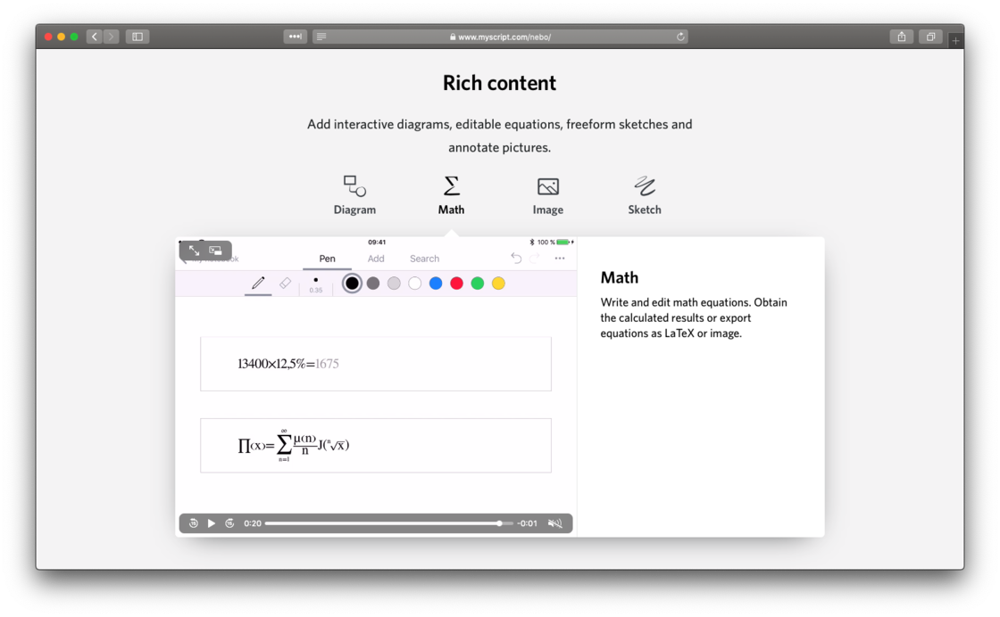

利用 MyScript Nebo 手写数学公式

我们几乎可以在 Nebo 上面看到 MyScript 公司历史上推出软件的全部身影。这里面，我们仅仅来谈谈 MathPad 的「集成」。在 Nebo 上书写并编辑数学公式，Nebo 不仅可以自动生成运算结果，还能够支持以 LaTeX 或图片的格式导出计算公式。这可能就是 MathPad 「退休之后」，其技术的发扬光大了。

不过很遗憾的是，Nebo 仅支持 Apple Pencil 绘制公式，想直接用手指书写公式的同学可能需要继续往下面看啦。👇

### Detexify

Detexify 是一个在 macOS 上面利用触控板绘制公式的利器。不同于之前的工具，Detexify 专注于按字符进行识别 LaTeX 符号，除了符号外，Detexify 还可以给出相应 LaTeX 包的使用推荐，很为方便。我们只需要利用快捷键 `⌃Ctrl+⇧Shift+D` 唤出 Detexify 的手写界面，之后利用触控板画出我们想要的字符，Detexify 就可以自动帮我们将其转换为相应的 LaTeX 表达式。

推荐阅读**：**[Detexify，在触控板上快速手写 LaTeX 符号 | App+1](https://sspai.com/post/39249)  

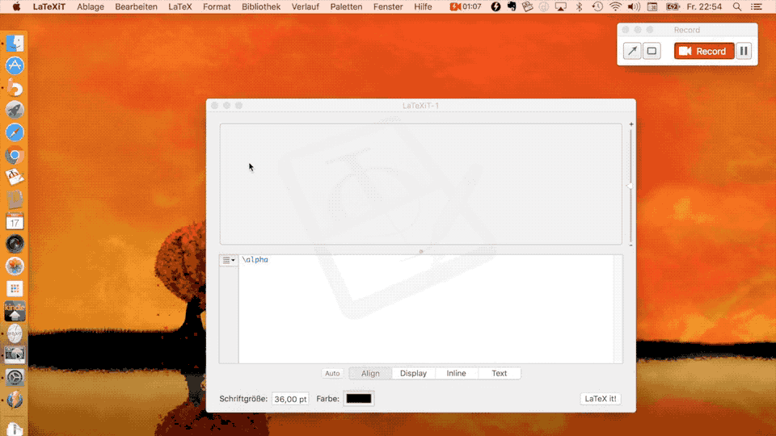

Detexify 利用触控板绘制公式（截取自官网视频）

除了 macOS 客户端，在 [Detexify 的官网](http://detexify.kirelabs.org/classify.html) 上面我们也可以直接使用它绘制 LaTeX 字符。

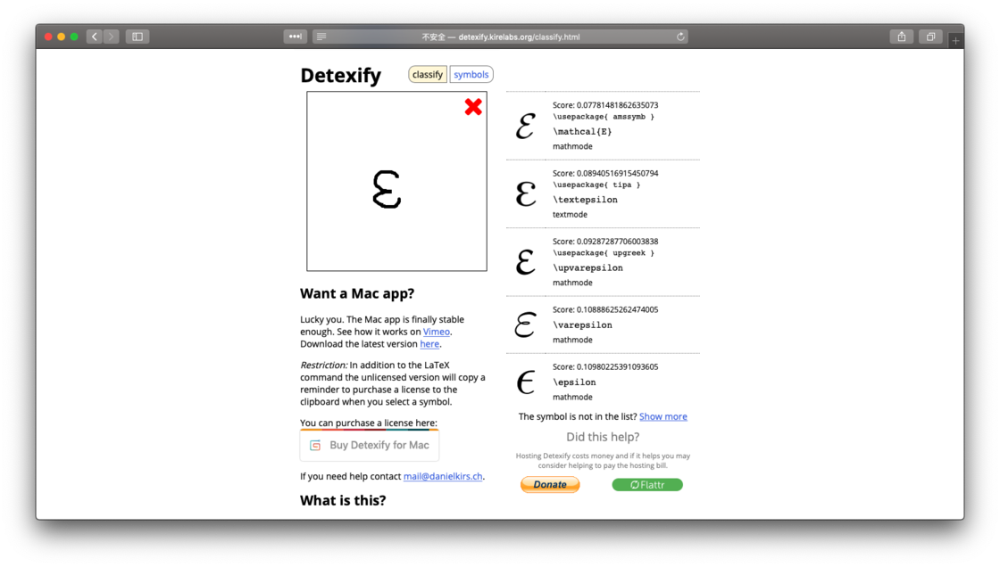

Detexify 网页版本

### MathKey

MathKey 是一个更为强大的手写公式转 LaTeX 的工具。除了上面介绍的将手写字迹转换为 LaTeX 格式的公式，MathKey 还可以将生成的公式直接转换为精致的图片，这样我们就可以将公式插入任何文本编辑器中，而无需担心编辑器对 LaTeX 的支持是否完善。

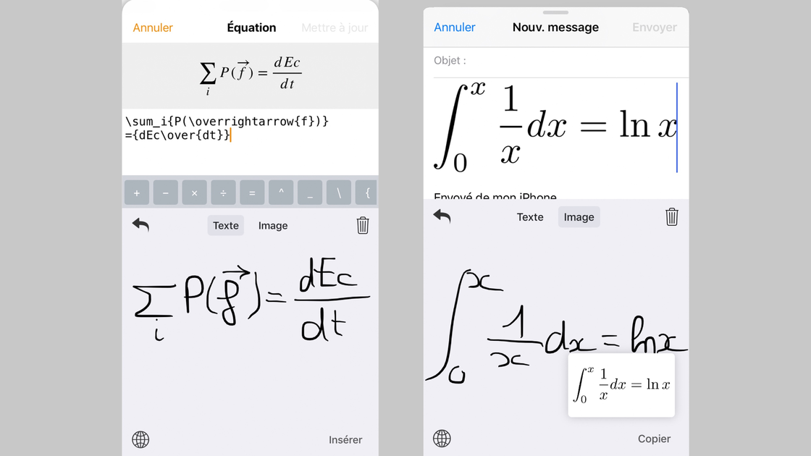

MathKey

MathKey 的官网在：[MathKey App](https://mathkey-app.com/)，有 iOS 和 macOS 版本的应用。同时，MathKey 包含在了 Setapp 应用包中，订阅 Setapp 的同学不必单独购买。

## 图像绘制

撰写专业论文怎么能少得了函数、公式图像的绘制？直接用 LaTeX 绘制函数图像确实不太方便，有时候直接借助外部工具生成相应的图像照片或许比其他方法都更简洁。

### Grapher

很多人可能都不知道，macOS 上自带有相对专业的 Grapher 软件。我们可以直接利用 Grapher 绘制函数图像。

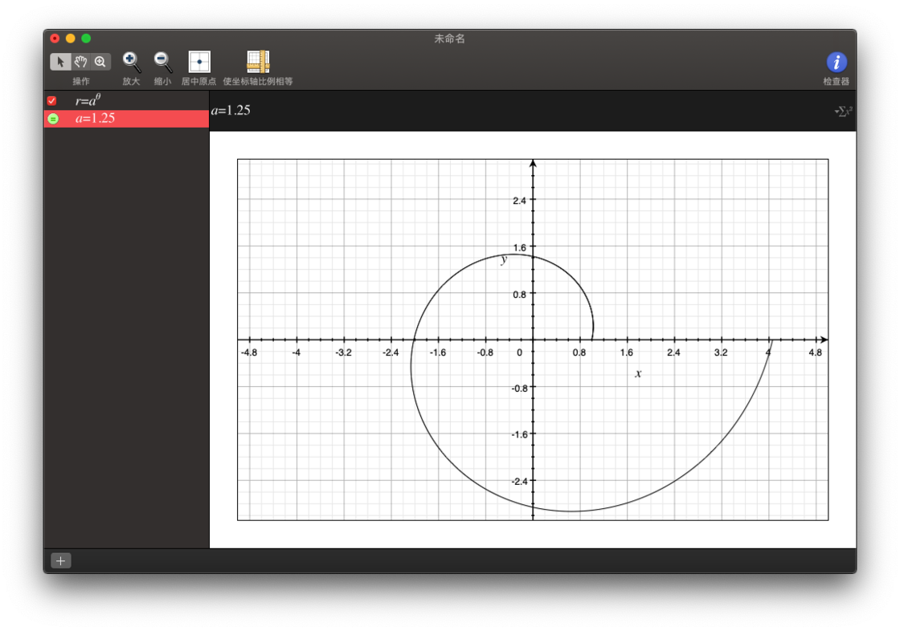

利用 Grapher 绘制方程图像

在 Grapher 的公式编辑区域右上角，我们可以唤出图形化的公式编辑器。我们可以利用它编写我们需要绘制为图像的函数方程，直观方便。

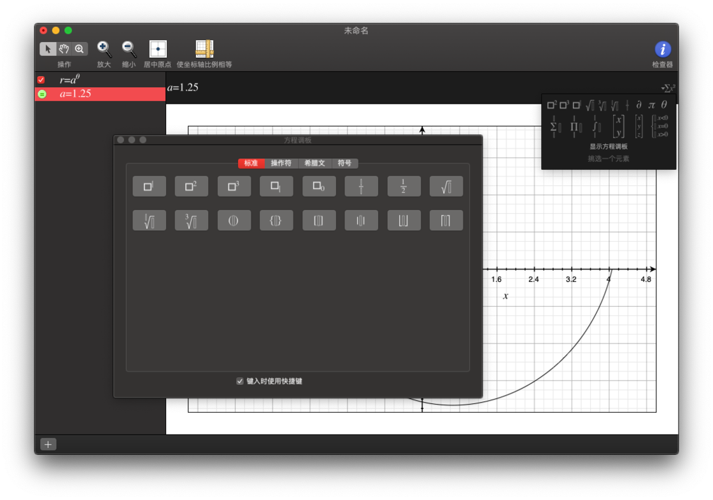

图形化的公式编辑界面

除了绘制函数方程组的图像以外，我们在绘制过程中所使用到的函数方程公式等等，都可以直接以 LaTeX 的形式导出。我们选中所需要的公式，单击右键，即可看到拷贝为 LaTeX 表达式的选项。

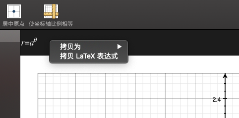

将绘制使用的公式导出为 LaTeX 格式的文本

### Desmos - Graphing Calculator

除了 Grapher，Desmos 这个在线的函数图像绘制器也很好用。Desmos 在线图像绘制器和 Grapher 的操作模式类似，同样也可以绘制复杂的多元方程组所代表的函数图像。Desmos 用户友好的方面在于：

*   我们可以登录，从而保存我们曾经绘制过的函数图像
*   同时，我们也可以导出 PNG 格式的函数图像的图片，直接嵌入我们正在撰写的论文之中
*   不仅如此，我们还可以直接将绘制好的图像通过链接的形式直接分享给我们的同学，方便至极
*   我们甚至可以直接通过 `<iframe>` 的形式将图像嵌入任何一个自己的网页上面

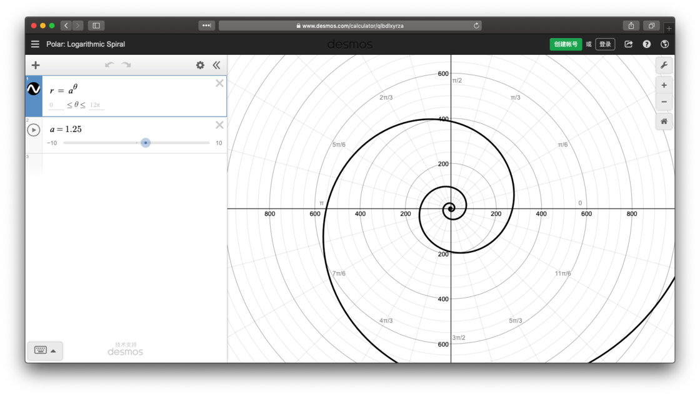

Desmos 在线图像绘制

Desmos 的官网位于：[Desmos | Graphing Calculator](https://www.desmos.com/calculator)，我们可以直接访问其网站制作图像。

## 在线 LaTeX 编辑器

最后，**我来推荐** **OverLeaf，这个强大的在线 LaTeX 编辑器。**

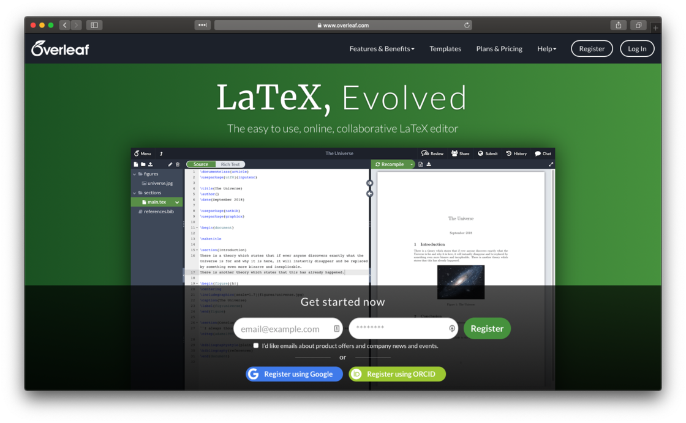

Overleaf 官网

Overleaf 的官网位于：[Overleaf - LaTeX, Evolved](https://www.overleaf.com/)。它是一个强大的 LaTeX 在线编辑器，不仅支持各种语言、各种扩展包等复杂的 LaTeX 格式，更为重要的是：

*   Overleaf 是一个，也可能是唯一一个，支持在线协同合作的 LaTeX 编辑器
*   Overleaf 还有着超级庞大的模板库，不仅有正式的作业、论文、毕业设计的参考模板，还有很多漂亮的简历、PPT 等

除此之外，最值得一提的一点是：Overleaf 的 LaTeX 参考文档是我使用 LaTeX 以来参考次数最多，且找到有价值信息最为丰富的一处。无需注册，我们直接访问：[Overleaf - LaTeX Documentation](https://www.overleaf.com/learn) 就可以查阅简明易懂的 LaTeX 参考文档，直观准确，高效方便。（不过是全英文的。）

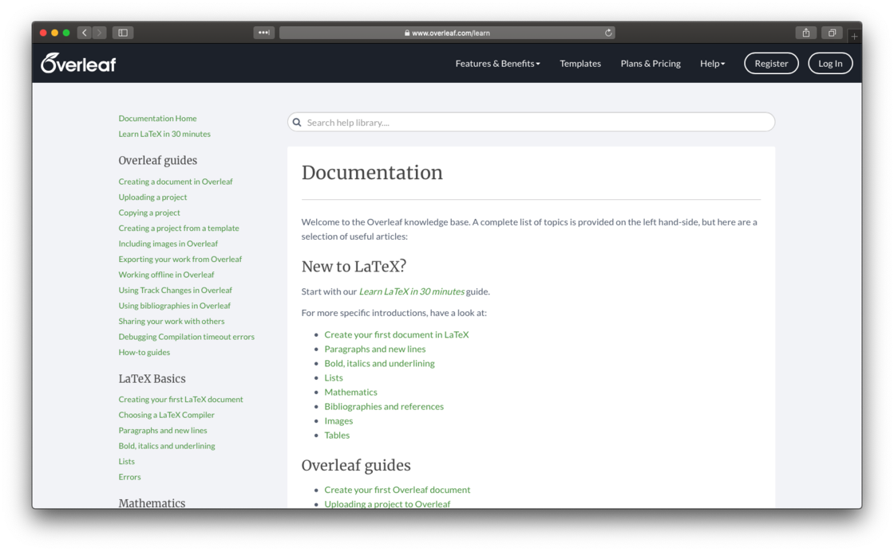

Overleaf 全面且易懂的 LaTeX 参考指南

Overleaf 提供的参考文档，从 30 分钟入门 LaTeX，到基础操作、数学环境等等，应有尽有、一应俱全。这部分内容也是我今天推荐 Overleaf 最大的原因之一。

## 小结

复杂的 LaTeX 语法、不容易配置的 LaTeX 环境、和需要频繁阅读外文参考文献的撰写过程，让很多觉得 LaTeX 学习过程陡峭的同学望而却步。不得不承认，LaTeX 本身确实没有 Office 全家桶那种「所见即所得」的直观，其中文资料也确实有所欠缺。但是这些复杂的问题都没法影响 LaTeX 在文字排版、论文撰写的领域占有一席之地。

我相信这次推荐的这几个小工具，能够帮助你在使用 LaTeX 时不再那么煎熬，从而顺畅地撰写心中的思考，也能够轻松排版出专业的论文。感谢阅读。🥇

\> 下载少数派 [客户端](https://sspai.com/page/client)、关注 [少数派公众号](http://sspai.com/s/KEPQ) ，让你的学习更有效率 ⏱

\> 特惠、好用的硬件产品，尽在 [少数派sspai官方店铺](https://shop549593764.taobao.com/?spm=a230r.7195193.1997079397.2.2ddc7e0bPqKQHc) 🛒