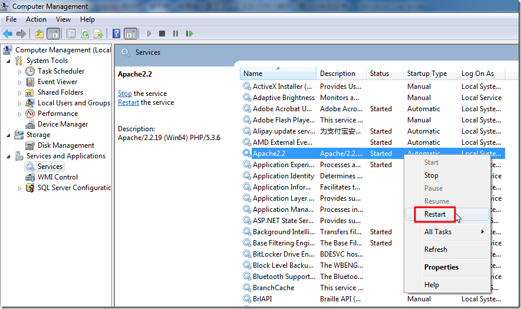
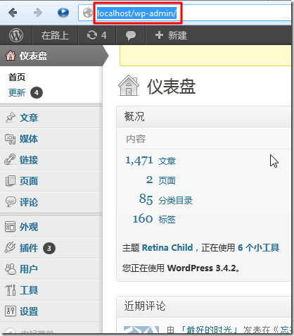

【问题】
本地localhost的wordpress；
登陆后，发现有插件要升级，就点击升级了。
结果由于速度太慢，被我直接取消了，然后想要进入：
http://localhost/wp-admin/
结果就一直显示：
正在执行例行维护，请一分钟后回来。
【解决过程】
1.过了很长时间后，再去
http://localhost/wp-admin/
结果还是同样的显示。
2.后来想起来了，试试去重启apache服务器试试：

然后再去进入：
http://localhost/wp-admin/
就正常了。

【总结】
如果出现wordpress升级被中断，而一直显示“正在执行例行维护，请一分钟后回来。”，那么可以去重启apache服务器，就可以恢复正常了。