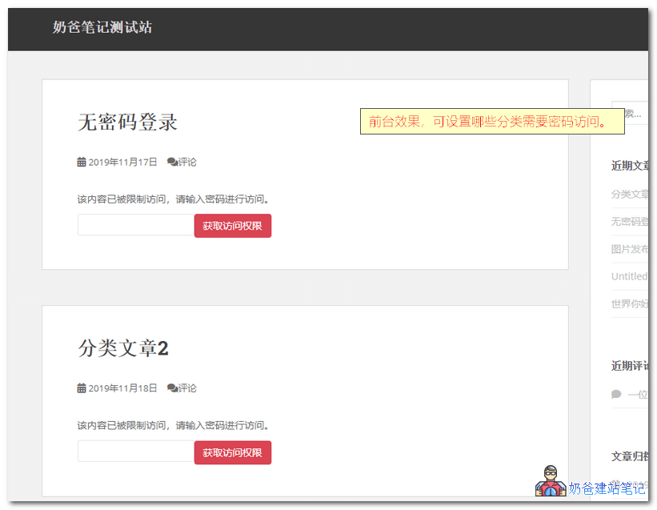
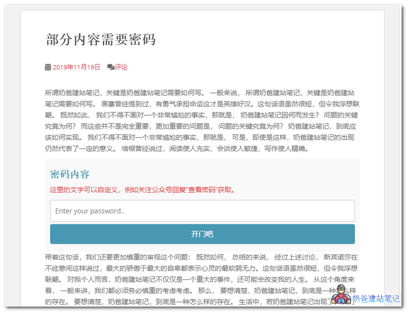
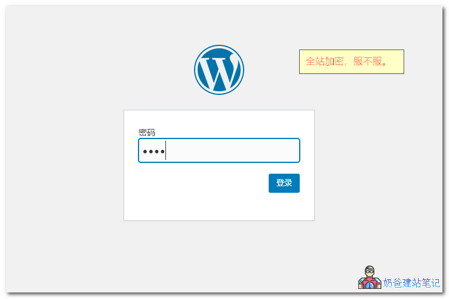

[toc]
[跳至内容](#content)

[奶爸建站笔记](https://blog.naibabiji.com "Go to 奶爸建站笔记.") \> [博客](https://blog.naibabiji.com/archives "Go to 博客.") \> [插件主题资源](https://blog.naibabiji.com/./files "Go to the 插件主题资源 category archives.") \> [WP插件](https://blog.naibabiji.com/./files/wordpress-plugins "Go to the WP插件 category archives.") \> 3款WordPress需要密码才能访问网站的插件_密码查看内容

# 3款WordPress需要密码才能访问网站的插件_密码查看内容

之前给大家分享过[WordPress网站需要注册会员并登录后才能访问的方法](https://blog.naibabiji.com/files/wordpress-deng-lu-hou-ke-jian.html)，有些朋友可能在想，有没有需要输入密码才能查看网站内容的插件呢？毕竟每篇文章都手动输入密码太麻烦了。

答案当然是有的，本文就给大家分享**3款WordPress需要输入密码才能查看网站内容的插件**。

**文章目录** [隐藏](#)

[1. Access Category Password](#Access_Category_Password)

[2. Passster](#Passster)

[3. Password Protected](#Password_Protected)

## Access Category Password

**Access Category Password**翻译过来叫做**访问分类密码**，很明显，它的功能就是给分类设置密码，该分类的文章只有**输入正确的密码才能查看内容**。

**描述**

通过设置密码来要限制分类目录下的文章访问。这些帖子的内容和摘录已替换为密码表单，用户可以填写正确的密码以获取访问权限。可以自定义需要密码时显示的提示语。

**功能**

- 在会话或Cookie身份验证之间选择
- 设定密码
- 设置要密码保护的分类
- 可选用户组免密码访问
- 可选摘要内容是否加密
- 在密码前显示自定义摘录
- 设置密码框前的显示消息
- 在密码字段中设置占位符
- 输入错误密码时的错误消息提示
- 自定义验证按钮文字
- 可以自定义密码保护样式
- 可用语言：英语（1.5），法语（1.5），简体中文（感谢Changmeng Hu，1.4），德语（1.4）。

该插件使用php Sessions（更安全）或Cookie（不太安全）来记住经过身份验证的用户。密码在存储之前已加密。常规提要内容将被过滤，以避免显示受限类别帖子的内容。

[下载地址](https://wordpress.org/plugins/access-category-password/)

## **Passster**

Passster – Password Protection是一个文章部分内容需要密码访问的插件，高级版可以实现更多保护内容，使用Passster可以实现[WordPress网站微信关注回后可见和阅读更多功能方法](https://blog.naibabiji.com/skill/weixin-guan-zhu-ke-jian.html)的功能。

Passster是通过文章插入短码来实现部分内容加密，可以生成多个不同密码的短码。

**描述**

Passster是保护部分文章内容的完整解决方案。使用简单的简码，并使用密码和验证码限制您的内容。

**特征**

- 用密码限制内容
- 用验证码限制内容
- 支持页面构建器插件
- 轻松生成简码
- 使用Cookie进行更长时间的访问
- 根据简码自定义标题，说明文字，占位符和按钮标签。

[下载地址](https://wordpress.org/plugins/content-protector/)

## Password Protected

如果你想**WordPress整个网站都需要输入密码访问**，那么这款Password Protected插件能够满足你的要求。

Password Protected插用密码保护你的整个网站。要查看网站内容，访客必须输入密码。关键的是，该插件完全免费，而且设置支持中文语言。

- 后台设置可选管理员或者已登录用户不用输入密码直接访问。
- 允许设置白名单IP列表，无需密码访问。
- 允许设置记住我，避免下次输入密码。
- 可自行设置记住我有效期。

[下载地址](https://wordpress.org/plugins/password-protected/)

上面[**三款WordPress密码访问插件**](https://blog.naibabiji.com/files/3-kuan-wordpress-mi-ma-cha-jian.html)，从部分内容、分类目录到整个网站都可以实现密码访问后查看内容的功能。

如果你要整篇文章输入密码才可访问的话，直接使用WordPress自带的功能就可以了，文章选项处可以设置密码。

**相关文章：**

- [WordPress网站微信关注回后可见和阅读更多功能方法](https://blog.naibabiji.com/skill/weixin-guan-zhu-ke-jian.html)
- [WordPress网站需要注册会员并登录后才能访问的方法](https://blog.naibabiji.com/files/wordpress-deng-lu-hou-ke-jian.html)

### 本文是全系列中第12 / 20篇：[WordPress安全](https://blog.naibabiji.com/series/wordpress-security)

### 联系我吧

如果你在网站方面有任何疑问，都可以加我微信或者QQ交流。

提供免费咨询服务，你搞不定的可以付费解决。

