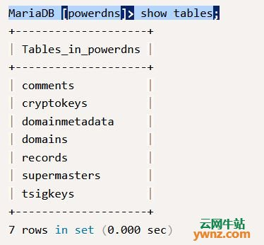
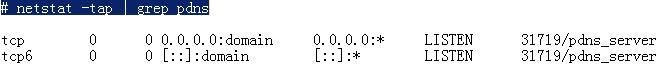
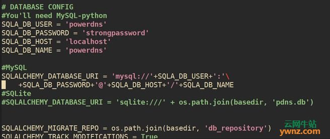
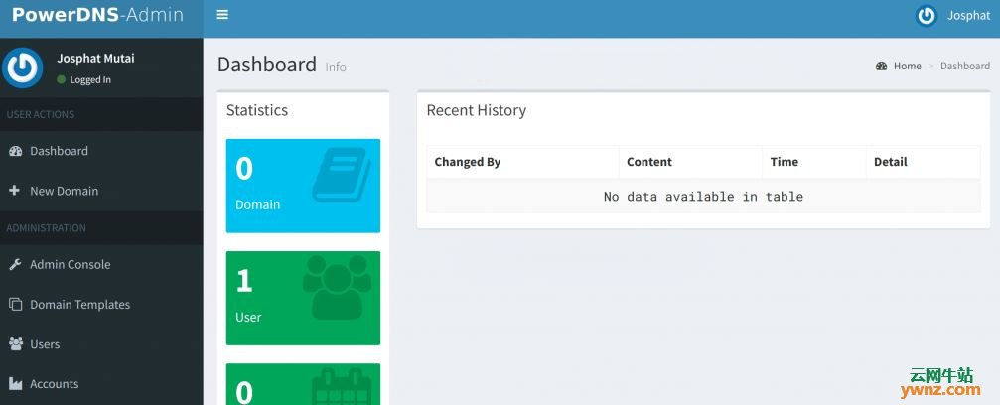

# 在Ubuntu 18.04/Debian 9上安装PowerDNS和PowerDNS-Admin的方法

2019-02-20 22:01:16作者:叶云稿源:云网牛站

本文介绍在Ubuntu 18.04/Debian 9操作系统上安装PowerDNS和PowerDNS-Admin的方法，它可以运行在大多数Linux发行版上，完成安装需要MariaDB数据库。

**一、安装和配置MariaDB数据库**

我们需要安装数据库，PowerDNS将使用它来存储区域文件，请注意，你还可以选择使用BIND等文本文件，我们选择的数据库服务器是MariaDB，参考：
[在Debian 9/Debian 8系统中安装MariaDB 10.4数据库的步骤](https://ywnz.com/linuxysjk/3882.html)
[在Ubuntu 18.04系统上安装MariaDB 10.4的步骤](https://ywnz.com/linuxysjk/3871.html)
### 安装并运行数据库后，继续在MariaDB中创建PowerDNS数据库和用户帐户：
$ mysql -u root -p
```
\>CREATE DATABASE powerdns;
```
接下来是创建powerdns数据库用户并分配权限：
```
\>GRANT ALL ON powerdns.* TO 'powerdns'@'localhost' \
\>IDENTIFIED BY 'strongpassword';
```
刷新权限以更新用户设置：
```
>FLUSH PRIVILEGES;
```
切换到powerdns数据库以创建表：
```
\>USE powerdns;
```
创建所需的表：
```
CREATE TABLE domains (
id                    INT AUTO_INCREMENT,
name                  VARCHAR(255) NOT NULL,
master                VARCHAR(128) DEFAULT NULL,
last_check            INT DEFAULT NULL,
type                  VARCHAR(6) NOT NULL,
notified_serial       INT UNSIGNED DEFAULT NULL,
account               VARCHAR(40) CHARACTER SET 'utf8' DEFAULT NULL,
PRIMARY KEY (id)
) Engine=InnoDB CHARACTER SET 'latin1';
CREATE UNIQUE INDEX name_index ON domains(name);
CREATE TABLE records (
id                    BIGINT AUTO_INCREMENT,
domain_id             INT DEFAULT NULL,
name                  VARCHAR(255) DEFAULT NULL,
type                  VARCHAR(10) DEFAULT NULL,
content               VARCHAR(64000) DEFAULT NULL,
ttl                   INT DEFAULT NULL,
prio                  INT DEFAULT NULL,
change_date           INT DEFAULT NULL,
disabled              TINYINT(1) DEFAULT 0,
ordername             VARCHAR(255) BINARY DEFAULT NULL,
auth                  TINYINT(1) DEFAULT 1,
PRIMARY KEY (id)
) Engine=InnoDB CHARACTER SET 'latin1';
CREATE INDEX nametype_index ON records(name,type);
CREATE INDEX domain\_id ON records(domain\_id);
CREATE INDEX ordername ON records (ordername);
CREATE TABLE supermasters (
ip                    VARCHAR(64) NOT NULL,
nameserver            VARCHAR(255) NOT NULL,
account               VARCHAR(40) CHARACTER SET 'utf8' NOT NULL,
PRIMARY KEY (ip, nameserver)
) Engine=InnoDB CHARACTER SET 'latin1';
CREATE TABLE comments (
id                    INT AUTO_INCREMENT,
domain_id             INT NOT NULL,
name                  VARCHAR(255) NOT NULL,
type                  VARCHAR(10) NOT NULL,
modified_at           INT NOT NULL,
account               VARCHAR(40) CHARACTER SET 'utf8' DEFAULT NULL,
comment               TEXT CHARACTER SET 'utf8' NOT NULL,
PRIMARY KEY (id)
) Engine=InnoDB CHARACTER SET 'latin1';
CREATE INDEX comments\_name\_type_idx ON comments (name, type);
CREATE INDEX comments\_order\_idx ON comments (domain\_id, modified\_at);
CREATE TABLE domainmetadata (
id                    INT AUTO_INCREMENT,
domain_id             INT NOT NULL,
kind                  VARCHAR(32),
content               TEXT,
PRIMARY KEY (id)
) Engine=InnoDB CHARACTER SET 'latin1';
CREATE INDEX domainmetadata\_idx ON domainmetadata (domain\_id, kind);
CREATE TABLE cryptokeys (
id                    INT AUTO_INCREMENT,
domain_id             INT NOT NULL,
flags                 INT NOT NULL,
active                BOOL,
content               TEXT,
PRIMARY KEY(id)
) Engine=InnoDB CHARACTER SET 'latin1';
CREATE INDEX domainidindex ON cryptokeys(domain_id);
CREATE TABLE tsigkeys (
id                    INT AUTO_INCREMENT,
name                  VARCHAR(255),
algorithm             VARCHAR(50),
secret                VARCHAR(255),
PRIMARY KEY (id)
) Engine=InnoDB CHARACTER SET 'latin1';
CREATE UNIQUE INDEX namealgoindex ON tsigkeys(name, algorithm);
```
可以确认你的表已创建：
MariaDB \[powerdns\]> show tables;

现在我们有了一个数据库和一个空表，PowerDNS现在应该可以用它启动了。
**二、在Ubuntu 18.04/Debian 9上安装PowerDNS**
Ubuntu 18.04自带systemd-resolve，你需要禁用它，因为它绑定到端口53，这将与PowerDNS端口冲突。
运行以下命令以禁用已解析的服务：
\$sudo systemctl disable systemd-resolved
\$sudo systemctl stop systemd-resolved
另外，删除符号链接的resolv.conf文件：
\$ ls -lh /etc/resolv.conf 
lrwxrwxrwx 1 root root 39 Feb 20 15:50 /etc/resolv.conf -> ../run/systemd/resolve/stub-resolv.conf
\$ sudo rm /etc/resolv.conf
然后创建新的resolv.conf文件：
\$sudo echo "nameserver 8.8.8.8" > /etc/resolv.conf
请注意，可以从官方apt存储库或PowerDNS存储库安装PowerDNS，要从apt存储库安装，请运行：
\$sudo apt-get update
\$sudo apt-get install pdns-server pdns-backend-mysql
为Ubuntu 18.04添加官方PowerDNS存储库：
\$ cat /etc/apt/sources.list.d/pdns.list
deb \[arch=amd64\] http://repo.powerdns.com/ubuntu bionic-auth-41 main
导入GPG密钥：
\$curl https://repo.powerdns.com/FD380FBB-pub.asc | sudo apt-key add -
更新软件包列表并安装PowerDNS软件包（pdns-server）和MySQL后端（pdns-backend-mysql）：
\$sudo apt-get update
\$sudo apt-get install pdns-server pdns-backend-mysql
对于Debian 9，从apt存储库安装软件包而不添加新的repo：
\$sudo apt-get update
\$sudo apt-get install pdns-server pdns-backend-mysql
当询问是否使用dbconfig-common配置PowerDNS数据库时，请回答No。
然后配置PowerDNS以使用MySQL后端，这是我对PowerDNS的MySQL配置：
\# cat /etc/powerdns/pdns.d/pdns.local.gmysql.conf 
\# MySQL Configuration
\# Launch gmysql backend
launch+=gmysql
\# gmysql parameters
gmysql-host=localhost
gmysql-port=3306
gmysql-dbname=powerdns
gmysql-user=powerdns
gmysql-password=strongpassword
gmysql-dnssec=yes
\# gmysql-socket=
重新启动pdns服务：
\$sudo systemctl restart pdns
现在可以测试PowerDNS以确认该服务是否在线：
\# netstat -tap | grep pdns

检查PowerDNS服务是否正确响应：
\# dig @127.0.0.1
; &lt;<&gt;\> DiG 9.11.3-1ubuntu1.1-Ubuntu &lt;<&gt;> @127.0.0.1
; (1 server found)
;; global options: +cmd
;; Got answer:
;; ->>HEADER<<- opcode: QUERY, status: REFUSED, id: 65465
;; flags: qr rd; QUERY: 1, ANSWER: 0, AUTHORITY: 0, ADDITIONAL: 1
;; WARNING: recursion requested but not available
;; OPT PSEUDOSECTION:
; EDNS: version: 0, flags:; udp: 1680
;; QUESTION SECTION:
;.  IN  NS
;; Query time: 0 msec
;; SERVER: 127.0.0.1#53(127.0.0.1)
;; WHEN: Wed Feb 20 15:57:10 2019
;; MSG SIZE  rcvd: 28
**三、在Ubuntu 18.04/Debian 9上安装PowerDNS-Admin**
PowerDNS-Admin是一个具有以下高级功能的PowerDNS Web界面：
多域管理。
域模板。
用户管理。
基于域的用户访问管理。
用户活动记录。
本地DB/LDAP/Active Directory用户身份验证。
支持SAML身份验证。
Google OAuth身份验证。
Github OAuth身份验证。
支持双因素身份验证（TOTP）。
仪表板和pdns服务统计信息。
DynDNS 2协议支持。
直接使用IPv6地址编辑IPv6 PTR（不再编辑文字地址）。
**安装Python 3开发包：**
\$sudo apt-get install python3-dev
从requirements.txt文件安装构建python库所需的包：
\$sudo apt-get install -y libmysqlclient-dev python-mysqldb libsasl2-dev libffi-dev \
libldap2-dev libssl-dev libxml2-dev libxslt1-dev libxmlsec1-dev pkg-config

**安装yarn以构建资产文件：**
\$sudo curl -sS https://dl.yarnpkg.com/debian/pubkey.gpg | apt-key add -
\$sudo echo "deb https://dl.yarnpkg.com/debian/ stable main" > /etc/apt/sources.list.d/yarn.list
\$sudo apt-get update 
\$sudo apt-get install yarn
### 结帐源代码并创建virtualenv：
\$git clone https://github.com/ngoduykhanh/PowerDNS-Admin.git /opt/web/powerdns-admin
\$cd /opt/web/powerdns-admin
\$virtualenv -p python3 flask
输出：
Already using interpreter /usr/bin/python3
Using base prefix '/usr'
New python executable in /opt/web/powerdns-admin/flask/bin/python3
Also creating executable in /opt/web/powerdns-admin/flask/bin/python
Installing setuptools, pkg_resources, pip, wheel...done.
### 激活python3环境并安装库：
\$./flask/bin/activate
\$pip install -r requirements.txt
### 创建和配置数据库：
```
$ mysql -u root -p
\>CREATE DATABASE powerdnsadmin;
\>GRANT ALL PRIVILEGES ON powerdnsadmin.* TO 'pdnsadminuser'@'%' \
\>IDENTIFIED BY 'strongpassword';
\>FLUSH PRIVILEGES;
\>quit
```
### 在运行PowerDNS-Admin之前，请确保你具有config.py可用，让我们从模板中创建一个：
\$cp config_template.py config.py
将文件编辑为：
\$vim config.py
这些是必需的配置：
数据库连接信息、PNDS API服务端点和API密钥、使用的端口号、绑定地址。
注释掉SQLite SQLALCHEMY\_DATABASE\_URI行并取消注释MySQL：
```
\# DATABASE CONFIG
#You'll need MySQL-python
SQLA\_DB\_USER = 'powerdns'
SQLA\_DB\_PASSWORD = 'strongpassword'
SQLA\_DB\_HOST = 'localhost'
SQLA\_DB\_NAME = 'powerdns'
#MySQL
SQLALCHEMY\_DATABASE\_URI = 'mysql://'+SQLA\_DB\_USER+':'\
+SQLA\_DB\_PASSWORD+'@'+SQLA\_DB\_HOST+'/'+SQLA\_DB\_NAME
#SQLite
#SQLALCHEMY\_DATABASE\_URI = 'sqlite:///' + os.path.join(basedir, 'pdns.db')
```
见下面的截图：



一旦你的config.py准备好了，通过运行命令创建数据库模式：
```
(flask)$ flask db migrate -m "Init DB"
INFO \[alembic.runtime.migration\] Context impl MySQLImpl.
INFO \[alembic.runtime.migration\] Will assume non-transactional DDL.
INFO \[alembic.autogenerate.compare\] Detected removed index 'domainidindex' on 'cryptokeys'
INFO \[alembic.autogenerate.compare\] Detected removed table 'cryptokeys'
INFO \[alembic.autogenerate.compare\] Detected removed index 'namealgoindex' on 'tsigkeys'
INFO \[alembic.autogenerate.compare\] Detected removed table 'tsigkeys'
INFO \[alembic.autogenerate.compare\] Detected removed table 'supermasters'
INFO \[alembic.autogenerate.compare\] Detected removed index 'nametype_index' on 'records'
INFO \[alembic.autogenerate.compare\] Detected removed table 'records'
INFO \[alembic.autogenerate.compare\] Detected removed index 'domainmetadata_idx' on 'domainmetadata'
INFO \[alembic.autogenerate.compare\] Detected removed table 'domainmetadata'
INFO \[alembic.autogenerate.compare\] Detected removed index 'name_index' on 'domains'
INFO \[alembic.autogenerate.compare\] Detected removed table 'domains'
INFO \[alembic.autogenerate.compare\] Detected removed index 'comments\_name\_type_idx' on 'comments'
INFO \[alembic.autogenerate.compare\] Detected removed index 'comments\_order\_idx' on 'comments'
INFO \[alembic.autogenerate.compare\] Detected removed table 'comments'
Generating /opt/web/powerdns-
admin/migrations/versions/42ca771ac430\_init\_db.py ... done
```
### 使用yarn生成资产文件：

(flask)$ yarn install --pure-lockfile
```
yarn install v1.9.4
\[1/4\] Resolving packages...
\[2/4\] Fetching packages...
\[3/4\] Linking dependencies...
\[4/4\] Building fresh packages...
Done in 14.59s.
(flask)$ flask assets build
Building bundle: generated/login.js
\[INFO\] Building bundle: generated/login.js
Building bundle: generated/login.css
\[INFO\] Building bundle: generated/login.css
Building bundle: generated/main.js
\[INFO\] Building bundle: generated/main.js
Building bundle: generated/main.css
\[INFO\] Building bundle: generated/main.css
```
### 测试你的PowerDNS-Admin运行正常：

(flask)$ ./run.py
```
\[INFO\] * Running on http://127.0.0.1:9191/ (Press CTRL+C to quit)
\[INFO\] * Restarting with stat
\[WARNING\] * Debugger is active!
\[INFO\] * Debugger PIN: 466-405-858
```
**四、配置systemd服务和Nginx**
我们将使用systemd管理PowerDNS-Admin，创建如下的服务单元文件：
$ sudo vim /etc/systemd/system/powerdns-admin.service
```
\[Unit\]
Description=PowerDNS-Admin
After=network.target
\[Service\]
User=root
Group=root
WorkingDirectory=/opt/web/powerdns-admin
ExecStart=/opt/web/powerdns-admin/flask/bin/gunicorn --workers 2 --bind unix:/opt/web/powerdns-admin/powerdns-admin.sock app:app
\[Install\]
WantedBy=multi-user.target
```
启动Powerdns-Admin服务并将其设置为在启动时启动：
```
\$sudo systemctl daemon-reload
\$udo systemctl start powerdns-admin
\$sudo systemctl enable powerdns-admin
```
可以运行systemctl status powerdns-admin命令确认状态是否正在运行，没问题的话会返回相关的成功信息。

**五、为Powerdns-Admin安装和配置Nginx**
使用以下命令安装Nginx：
\$sudo apt-get install nginx
### 配置Nginx：
\$sudo vim /etc/nginx/conf.d/powerdns-admin.conf
添加如下内容：
```
server {
listen *:80;
server_name               powerdns-admin.example.com www.powerdns-admin.example.com;
index                     index.html index.htm index.php;
root                      /opt/web/powerdns-admin;
access_log                /var/log/nginx/powerdns-admin.local.access.log combined;
error_log                 /var/log/nginx/powerdns-admin.local.error.log;
client\_max\_body_size              10m;
client\_body\_buffer_size           128k;
proxy_redirect                    off;
proxy\_connect\_timeout             90;
proxy\_send\_timeout                90;
proxy\_read\_timeout                90;
proxy_buffers                     32 4k;
proxy\_buffer\_size                 8k;
proxy\_set\_header                  Host $host;
proxy\_set\_header                  X-Real-IP $remote_addr;
proxy\_set\_header                  X-Forwarded-For $proxy\_add\_x\_forwarded\_for;
proxy\_headers\_hash\_bucket\_size    64;
location ~ ^/static/  {
include  /etc/nginx/mime.types;
root /opt/web/powerdns-admin/app;
location ~*  \\.(jpg|jpeg|png|gif)$ {
expires 365d;
}

location ~* ^.+.(css|js)$ {
expires 7d;
}
}
location / {
proxy_pass            http://unix:/opt/web/powerdns-admin/powerdns-admin.sock;
proxy\_read\_timeout    120;
proxy\_connect\_timeout 120;
proxy_redirect        off;
}
}
```
检查nginx syntax然后重启nginx服务：
```
\# nginx -t
nginx: the configuration file /etc/nginx/nginx.conf syntax is ok
nginx: configuration file /etc/nginx/nginx.conf test is successful
\# systemctl restart nginx
```
访问PowerDNS-Admin Web界面，地址是http://powerdns-admin.example.com/：

单击创建帐户按钮并注册用户，第一个用户将处于管理员角色。
当你使用创建的用户名和密码登录时，会出现如下的画面：



至此，你可以在Ubuntu 18.04/Debian 9服务器上使用PowerDNS-Admin管理PowerDNS了。


© ywnz.com 版权所有