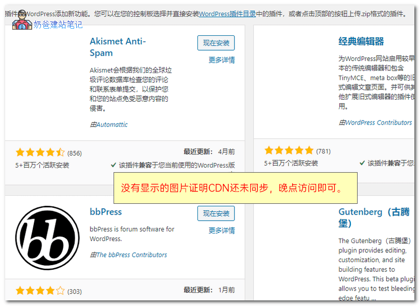
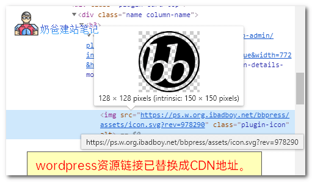

# 最佳解决国内WordPress网站无法更新和安装插件的方法

[Dotnet9](https://dotnet9.com/user/1) • 2020年3月18日 16:13 • [WordPress建站](https://dotnet9.com/category/more-share/wordpress) • 阅读 1704

WordPress的CDN自动拦截国内访问流量，导致我们采用国内服务器的WP网站没有办法正常安装和更新主题插件，之前介绍过用kill 429来解决，今天推荐一款成功率更高的插件：WP-China-Yes

# WP China Yes插件介绍

WP China Yes同样是一款国人开发的插件，开源免费，功能和kill 429一样，用来解决国内服务器没有办法正常更新和安装WordPress插件主题的痛点。

kill 429基于正向代理WordPress资源，而WP-China-Yes基于反向代理WordPress资源，并且使用了百度云CDN服务，稳定性相对要更高一些。

WP China Yes设置的加速节点是直接为你的站点与WordPress总部服务器的一切通信做加速，加速范围包括但不限于：插件、主题商城的资源下载、作品图片、作者头像、主题预览等……

# WP China Yes使用方法

1、从WP官网或者去GitHub下载，然后上传到网站后台安装。

2、启用插件，正常使用即可。

由于采用的是CDN缓存，所以你会看到后台有些图片没办法显示，当用户请求后，CDN服务器开始向WP服务器请求，然后就会出现在CDN服务器上了。

通过F12审查发现，这些图片的地址已经换到了作者提供的CDN地址上。

# 常见问题

速度为什么这么慢——加速节点使用CDN缓存数据，对于访问人数较少的冷门资源访问速度会慢很多。若遇到访问超时的情况请等10分钟再试，这段时间CDN会自动去WordPress官方服务器拉取资源供使用。

原文出处：快报【奶爸建站笔记】

原文链接：https://kuaibao.qq.com/s/20200305A0SE8300?refer=cp_1026

本文观点不代表Dotnet9立场，转载请联系原作者。
