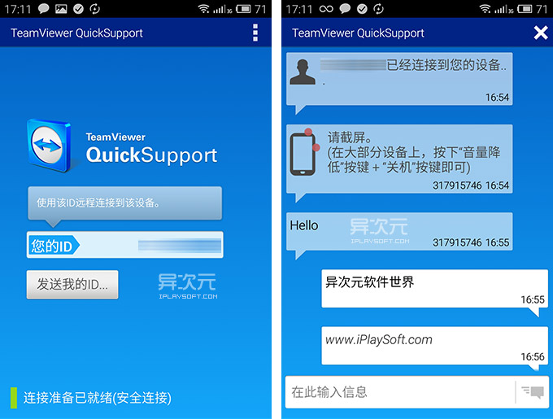
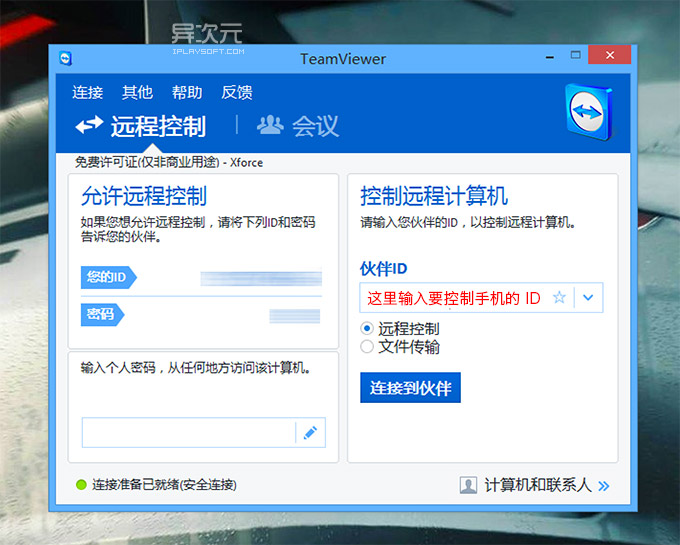
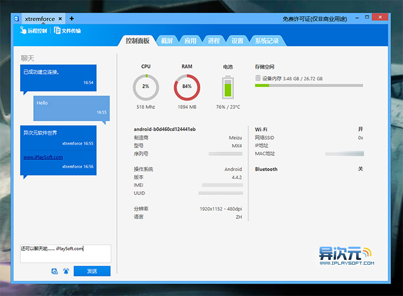
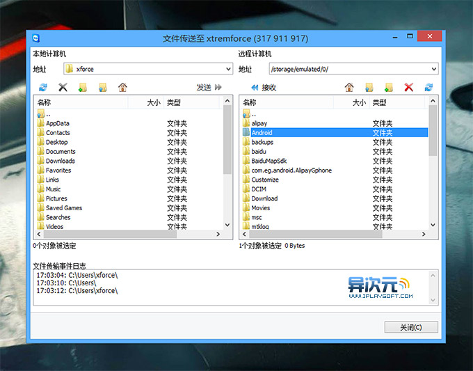

从名字就应该能看出来它和 TeamViewer 师出同门。用了这软件之后感觉很奇怪，如此优秀的应用怎么没什么人气？TeamViewer 也基本没见过推广，如今的广大用户群都是口碑传出来的，你怎么能如此低调？而且软件对个人用户都是免费的（只要安装时选择个人用户就可以了）
想要在电脑上远程控制手机，首先要在电脑上下载并安装 TeamViewer 电脑版 (Windows / Mac / Linux 都可以)，这个作为控制端；然后在准备要受控制的 Android / iOS 手机平板上安装 Teamviewer QuickSupport，这个作为受控端，然后即可开始。(下载地址位于文章结尾处)
Teamviewer QuickSupport 可以支持 Android 和 iOS 平台，可惜，由于苹果的限制，iOS 版的软件相比安卓版的功能会有删减，下面会提到。
远程控制：这是最重点推荐的杀手锏功能，可以让你的 Android 手机能被 TeamViewer 远程连接并控制，换句话说就是支持电脑远程操控手机。可惜该功能仅支持 Android，iOS 并不支持
双向文件传送：可以像 FTP 文件管理那样和 Android 手机远程互传文件（iOS 仅支持 PC 到设备的单向传输 T_T）
进程管理：像 Windows 的任务管理器一样管理远程安卓手机的运行任务，远程关闭进程
实时截图：如果网速不给力，你可以让远程手机截图后自动发送给你，省流量啊
卸载应用：可以远程卸载手机上的应用
远程修改 WiFi 设置：如修改 WiFi 密码啦，添加新的 WIFI 连接等等，都OK
聊天功能：和被控制的手机聊天，还能像 QQ 一样震屏，只是屏幕不会震动，而是发出声音提醒被控制手机输入
推送文本至手机剪贴板：可以方便地将一些文本、网址等内容推送到移动端设备上的剪贴板
还有其它小功能，大家可以自己去体验……
Teamviewer QuickSupport 软件使用简单说明：
首先，请根据你的操作系统在电脑上安装 TeamViewer 的桌面版。然后，在 Android 手机或 iOS 的设备上安装 Teamviewer QuickSupport。必须注意的是：Android 版本的 Teamviewer QuickSupport 的远程控制是需要 ROOT 权限的，请确保在安装前 ROOT 好你的设备。
首次安装好并启动软件之后，Teamviewer QuickSupport 会自动分配一串数字ID (下图左，这图里我抹去了自己的 ID)。

接下来你就可以从电脑端输入这个ID来连接你的移动设备了(如下图)，连接成功后会手机便会登入到上图右的界面。得益于 Teamviewer 强大方便的远程连接技术，你并不需要关心公网 IP 地址、端口、防火土·啬这些乱七八糟的东西，完全不需任何设置。

连接上之后，手机会弹出「是否允许连接」的对话框，确定之后便可以在电脑上远程调戏你的设备(如下图)。软件功能很多，用起来也非常简单。而且，它并不像很多软件一样要求你的设备和电脑处于同一个 WIFI 局域网网络，即使异地， 不论时 3G、4G、WiFi，只要能上网都可以连接进行远程控制。

点击左上角的「远程控制」可以远程操控 Android 手机，并实时看到手机的画面，操作也非常方便！实际测试，远程连接的速度虽然有一定的延时，但体验上感觉还可以接受的。一般情况下，帮家长、妹子排除手机疑难杂症，安装或设置个软件什么的完全没有问题。

文件传输功能可以实现电脑与手机之间的文件双向传输，可以直接操作手机的文件夹，新建删除重命名等，可以方便完成各种文件操作。嗯嗯，坏人们请别趁机会把妹子的照片全拿下哦！

其它的远程截屏、远程卸载应用、远程停止进程、聊天、远程添加修改 WiFi 连接等等的功能就不多做演示了，大家可以亲自体验一下。
评价：
Teamviewer QuickSupport 作为目前发现的第一款如此好用的远程控制手机/平板的软件，称它神器不为过！连接速度很OK，远程控制时电脑上用鼠标做单点触摸，底下有安卓的虚拟按键，进入远程时，手机不会熄屏，而是降低亮度到很低的程度，如果锁屏了，也会自动点亮屏幕到输入密码界面，这个很人性化。
有了这货，无论是家长还是妹子遇到手机上的问题，我们都能方便地远程连接并操作手机了，应用得当可以解决很多问题，非常实用！唯一可惜的是，目前由于苹果本身的限制，软件对 iOS 设备的支持还不够好，不能远程控制，文件传输也只能单向。但如果你的目标设备是 Android，那么这款软件绝对能让你兴奋！