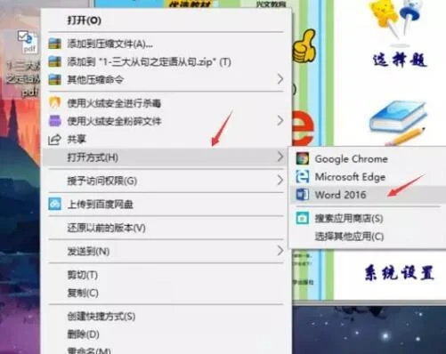
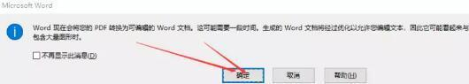
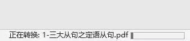
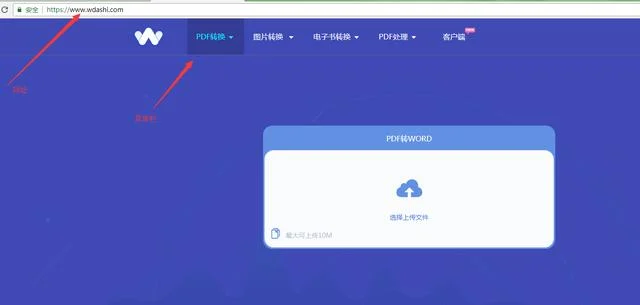

# 不可错过的PDF转可编辑word的方法

[2018-08-16](https://kknews.cc/archive/20180816/) *由 转转大师在线pdf转换 發表于[新闻](https://kknews.cc/news/)*

PDF转word，相信很多人都会用到吧，尤其是学生党和上班族，写论文要用到，工作要用到，其实PDF转word非常简单。但是PDF转成可编辑形式的word就不是那么简单了。

网上有很多网站提供了免费的PDF转word，但基本上很少有转成可编辑的word的，就连部分收费的软件，也没有这个功能。

但其实这个功能每个人的电脑都有这个，只是你没发现而已。

这就是电脑的软件，是微软的，不是WPS(记得用WPS转换是收费的)。

温馨提示：至少得是word2010，版本越高越好，我用的是2016

步骤

### 01 找到PDF文件，右键，打开方式选择word

打开文件

### 02 会弹出提示，点击确定即可转换成可编辑的word。

pdf转word

右下角有转换的进度，一般来说很快，几秒钟就转换成功了。

转换进度

### 03 然后就可以另存为word文档。

排版可能和PDF稍微有点出入，可以稍微排版一下就好。

记得另存为word文档，这样子就是真正的word形式了。

当然，说到用网站在线转换其实也还是有的，比如说W大师。

在线转换网站

轻松玩转PDF。

十几个关于PDF的功能，玩转PDF!只要文件不大，可以免费转换!

当然另外一个方法就是利用OCR文字识别工具。

### 总结

> 微软word自带的功能进行转换，最方便快捷，无需联网
>
> 网站在线转换，功能更多，速度慢一点
> 
> CR文字识别，速度最慢，一个个扫描识别

[點我分享到Facebook](#)

