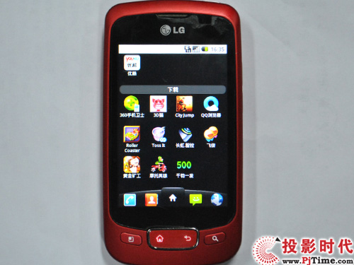
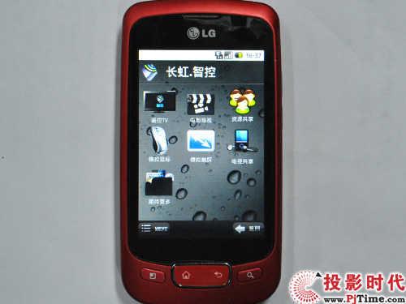
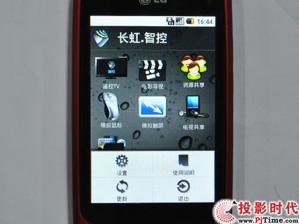
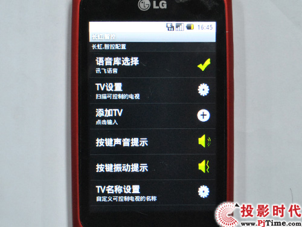
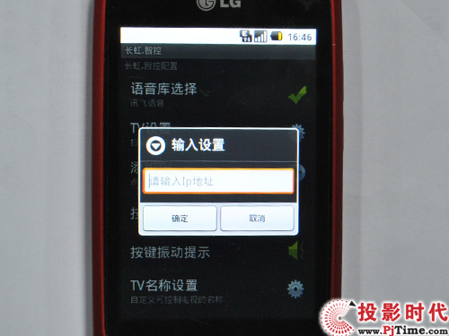
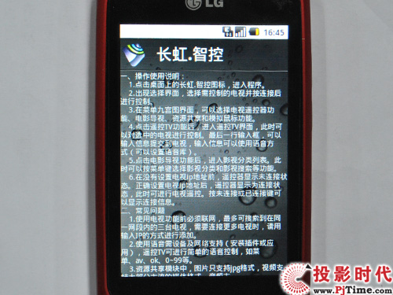

内容导航：
    日前，长虹推出了全高清3D多屏互动智能电视“智尚A9000”系列电视，该系列产品采用了时下最主流的安卓2.2长虹订制系统，和强大的双核1G处理器，并配备了集成全键盘、触控板、麦克风的无线智能遥控器，真正让电视机实现全智能化操作。
    在多屏互动方面，用户只要在手机或pad上安装长虹专门针对智能3D电视研发的多屏互动智控系统APP应用，即可轻松实现手机与电视之间的智能多屏互动。用户可以通过智控系统自动搜索并连接无线局域网内的电视，自由推送手机内的图片、音频、全高清视频至电视屏幕；还可以利用多屏互动系统，实现由手机操纵及摇控电视、语音输入、触摸游戏、电影导视等多屏互功能。
    下面pjtime来详细为大家介绍一下，在android智能手机端安装多屏互动APP应用后的功能特点。

在android手机安装多屏互动软件

运行多屏互动软件
    首先将长虹多屏互动应用软件移进android智能手机，并进行安装。完成之后找到长虹智控点击运行。在上图长虹多屏互动界面可以看到，该应用提供了遥控TV、电视导视、资源共享、模拟鼠标、模拟触屏、电视共享和更多期待几个功能。

长虹多屏互动界面
    点击左下角的MENU按钮，可以调查菜单，菜单拥有设置、使用说明、更新和推出几个按钮。

多屏互动 设置菜单
    在设置菜单可以进行各种参数和功能的详细设置，包括语音库选择、TV设置、添加TV、按键音、TV名称设置等等。

多屏互动 添加电视机
    其中“TV设置”用于扫描附近的电视机设备，不过该软件最多能自动扫描到3台电视机，如果周围电视机较多的花，可以在“添加TV”中直接输入指定电视机的IP地址进行设备添加。

多屏互动 使用说明
    在使用说明菜单下，有长虹多屏互动软件的详细功能使用方法。用户有不明白的地方可以多翻看一下。