时间：2018-10-31     来源： 系统之家     游览量： 42716次
　　Hyper-V是一款由微软官方针对windows系统用户发布的虚拟化产品软件，该软件的功能大致与Vmware相似，其主要帮助用户在windows系统下创建多个操作系统，这也意味着微软会更加直接地与市场先行者VMware展开竞争，但竞争的方式会有所不同。其实对于Hyper-V中文版与Vmware较比，两者的功能相差无几，只不过用户在初次使用Hyper-V中文版时，不知道如何进行安装，故此小编为大家带来了Hyper-V中文版的安装方法，下面我们来了解下吧!

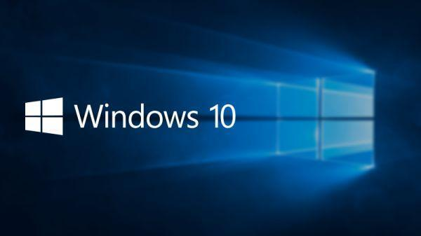

### win10 自带虚拟机Hyper-V安装win7的教程讲解：
1、 WIN+R 输入control 回车 打开控制面板--程序和功能—启用或关闭windows功能

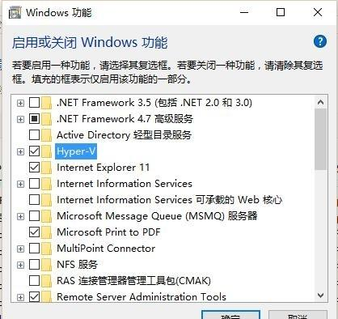

2.勾选Hyper-V 确定后等待安装完成，重启电脑
3.Hyper-V功能管理器固定到开始屏幕方便打开

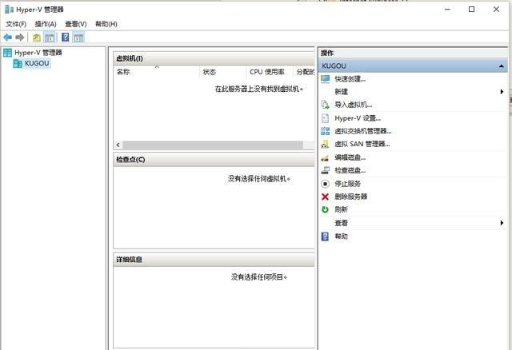

打开Hyper-V管理器
4.先配置好虚拟交换机 新建外部交换机网络 (虚拟机装完系统后可以直接上网)

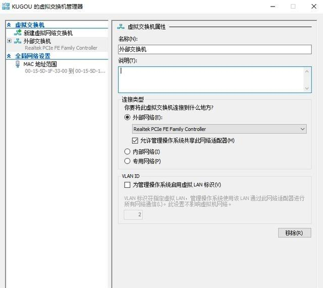

添加外部虚拟交换机
5.新建虚拟机 名称位置随您意，看您自己电脑的存储空间

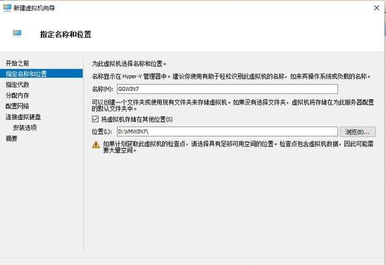

指定虚拟机名称位置
因为装WIN7，所以选一代

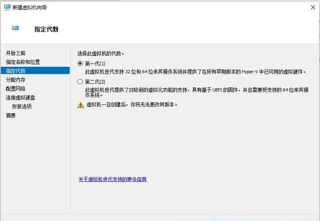

win7选一代。二代支持UEFI 安全启动
最少分配1G 勾选动态内存(主要我内存小)

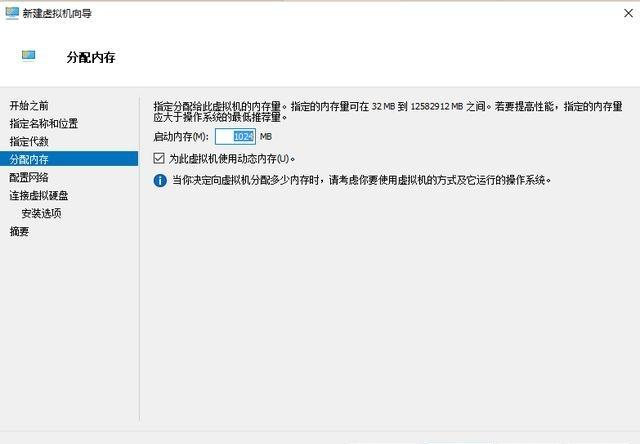

分配内存
选择前面创建的外部交换机

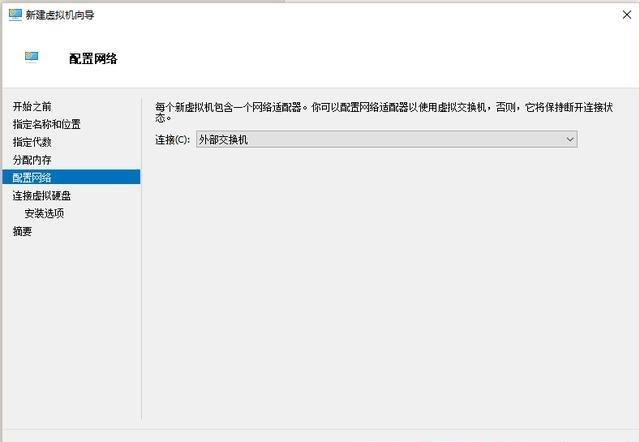

选择前面创建的外部虚拟交换机
创建虚拟硬盘

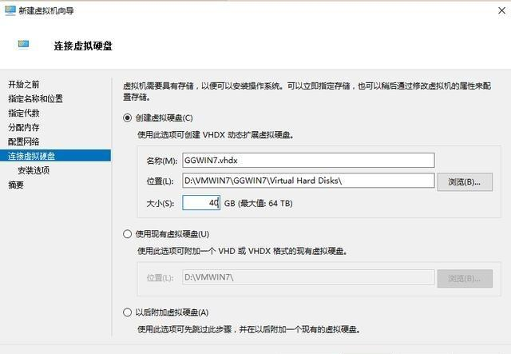

选择win7安装映像

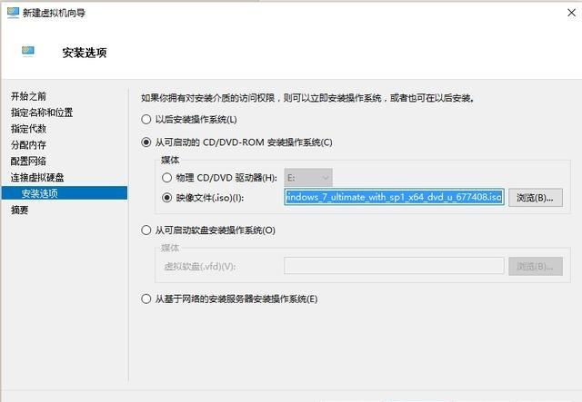

装载win7映像

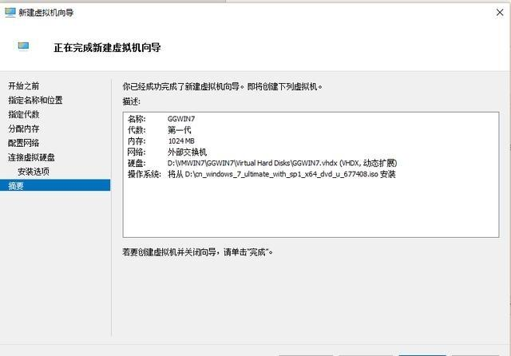

完成新建虚拟机
完成
6.Hyper-V设置RemoteFX GPU (我的显卡不行，所以勾不了，最低要有1G的显存 支持DX10以上)

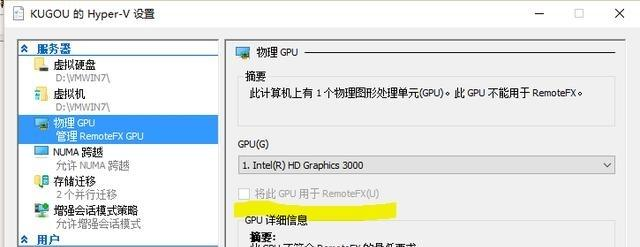

配置虚拟显卡
7.设置虚拟机 1添加RemoteFX GPU 2.调整动态内存范围 调整CPU个数等

添加虚拟显卡

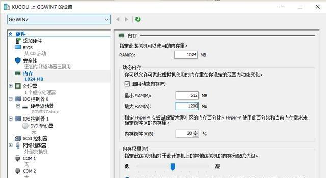

调整内存，CPU
8启动-连接虚拟机开始安装win7系统

8.安装完成激活系统，打补丁 RDP 升级到8.1 服务端好像是8.0(具体是哪几个不记得了，反正我是都打了 在不重要的补丁里面)

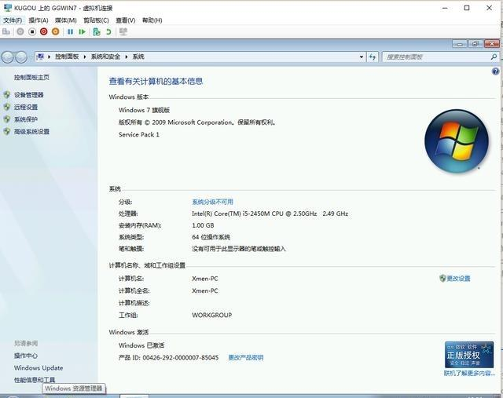

安装完以后创建检查点，再激活

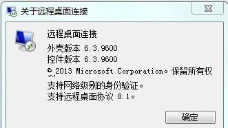

以上介绍为win10自带虚拟机Hyper-V安装win7 的全部详细讲解，谢谢大家！