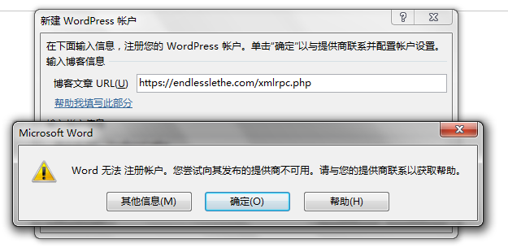
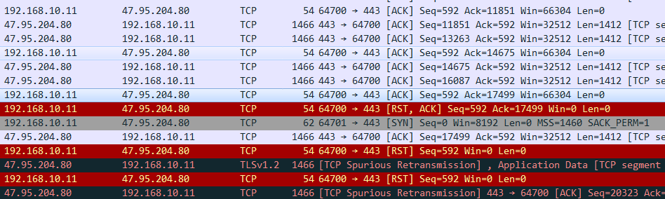
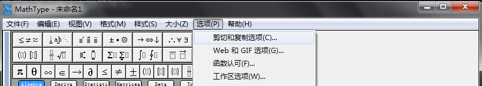
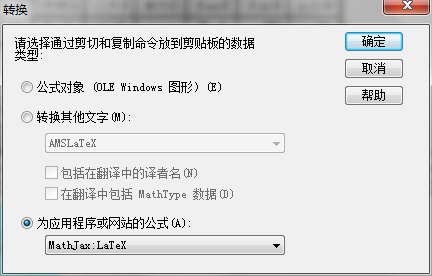
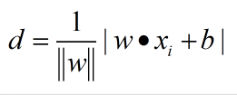

***EndlessLethe原创文章，转载请注明：***  *转载自*[小楼吹彻玉笙寒](https://endlesslethe.com/wordpress/)

***本文链接地址:***  [给WordPress的文章插入数学公式](https://endlesslethe.com/insert-math-formula-into-wordpress.html)

**问题背景**
1. 我使用OneNote写总结。
2. 在总结数论相关的算法时，文章会包含数学公式。
3. 数学公式是MS特有的格式。
4. 直接将OneNote复制到WordPress会导致几乎所有格式的丢失，数学公式无法显示
**解决经历**
1. 尝试从OneNote导出。只支持导出doc和pdf
2. 导出doc，doc效果很好，但不能直接复制到WordPress中

1. 导出pdf，pdf效果很好，但唯一能插入到WordPress的方法是作为附件插入。即使安装了增强插件，也只是能将pdf显示出来。这样带来的问题是，搜索引擎无法抓取，显示效果也不好。

1. 导出MS公式，见后文
2. 从word作为起点，word可以导出的格式就有很多了，包括.html、.mht。
1. 导出.html，和pdf类似，无法作为文章一部分显示。
1. 导出.mht，和pdf类似，无法作为文章一部分显示。
1. 通过Word，调用Server的PRC远程过程调用接口，见后文
**Word的“发布到博客功能”**
在比较早的时候，WordPress可以设置启用xml-prc远程发布，现在应该是默认开启这个功能了。
但我在使用Word发布的时候出现了下图的情况：

经过WireShark抓包，大致原因是一段时间后Client端的Word不再监听端口，导致Client传回RST标志，文章传输失败：

综上，Word使用xml-rpc的方法失败。
**使用MathType完成MS公式到Mathjax的转换**
MS内置公式是MathType的精简版（衍生版），这有一些历史因素在里面。
而对于我们，这是个好消息，因为我们可以将内置公式导出到MathType里，通过配置复制粘贴选项：

最后的问题是，复制出来的格式不能正确被插件识别，需要将首尾的"\(""\)"修改为"\\(""\\)"。
比如：

**最终解决方案**
在OneNote写好的文章，复制到atom中对应.md文件，将原有的MS公式替换为Mathjax，并添加到空白处。
使用“MathJax-LaTeX”的WordPress插件解析公式。
部分跨行或者复杂的公式截图。
**总结**
最终方案实际效果很好，但如果公式较多的话，从MS公式转换到Mathjax需要逐一修改，不如word调用xml-rpc上传方便。
**参考资料**

1. [用XML-RPC协议读写WordPress上的文章](https://endlesslethe.com/goto/http://blog.csdn.net/adermxl/article/details/8188704)

2. [Markdown中实时显示数学公式的方法](https://endlesslethe.com/goto/https://www.cnblogs.com/xiaogang999/p/5743623.html)

3. [用LaTeX for WordPress插件在WordPress中写数学公式](https://endlesslethe.com/goto/https://www.codelast.com/%E5%8E%9F%E5%88%9B%E7%94%A8latex-for-wordpress%E6%8F%92%E4%BB%B6%E5%9C%A8wordpress%E4%B8%AD%E5%86%99%E6%95%B0%E5%AD%A6%E5%85%AC%E5%BC%8F/)

4. [Mathjax doc](https://endlesslethe.com/goto/http://docs.mathjax.org/en/latest/start.html)