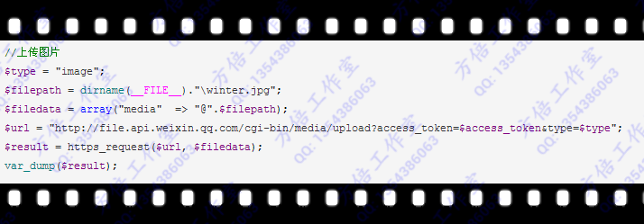
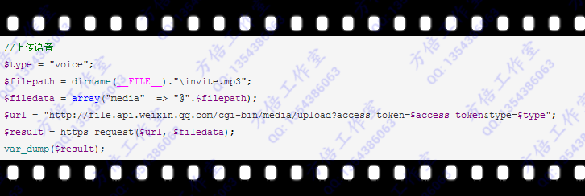
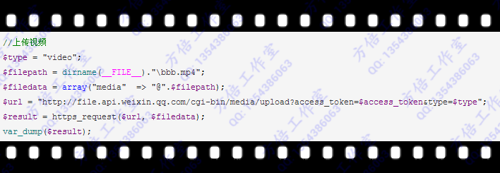
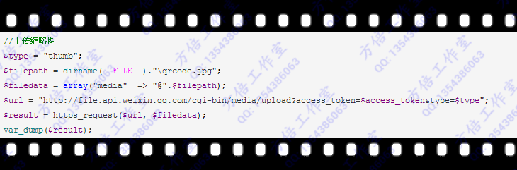
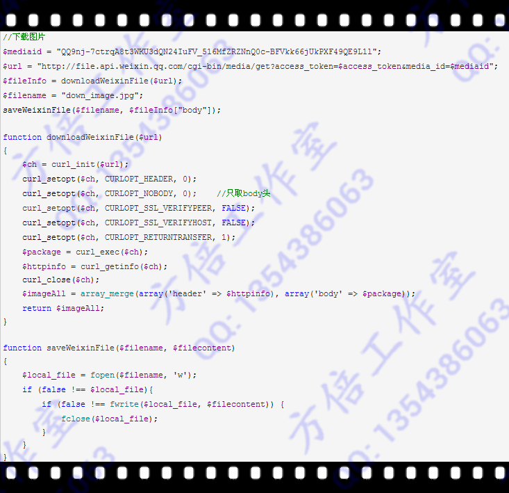
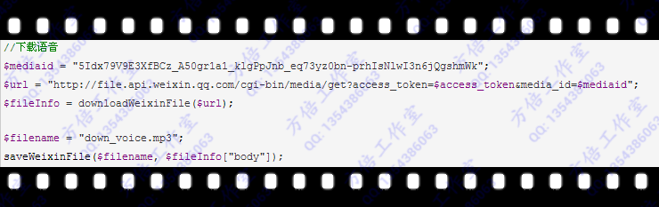

微信公众账号在回复图片、语音、视频的时候，将使用media_id来调用相关文件，很多朋友咨询这个如何开发实现。本文将介绍在微信公众平台开发过程中，如何上传下载多媒体文件。

**一、上传多媒体文件**

公众号可调用本接口来上传图片、语音、视频等文件到微信服务器，上传后服务器会返回对应的media_id，公众号此后可根据该media_id来获取多媒体。请注意，media_id是可复用的，调用该接口需http协议。

通常，文件上传是通过html表单进行的，但通过CURL可以不经过浏览器，直接在服务器端进行表单的POST提交，完成文件上传功能。
需要注意的是：文件名必须是完整绝对路径，另外需要绝对路径前加上“@”以示区分。

在Windows服务器上，格式示例为：”@F:\israel\upload\winter.jpg”，而在Linux服务器上，格式示例为：”@home/israel/upload/winter.jpg”。

http请求方式: POST/FORM

http://file.api.weixin.qq.com/cgi-bin/media/upload?access_token=ACCESS_TOKEN&type=TYPE

参数说明

|     |     |     |
| --- | --- | --- |
| **参数** | **是否必须** | **说明** |
| access_token | 是   | 调用接口凭证 |
| type | 是   | 媒体文件类型，分别有图片（image）、语音（voice）、视频（video）和缩略图（thumb） |
| media | 是   | form-data中媒体文件标识，有filename、filelength、content-type等信息 |

**上传图片**

返回结果

{ "type": "image", "media_id": "QQ9nj-7ctrqA8t3WKU3dQN24IuFV_516MfZRZNnQ0c-BFVkk66jUkPXF49QE9L1l", "created_at": 1389793969 }

**上传语音**

返回结果

{ "type": "voice", "media_id": "5Idx79V9E3XfBCz_A50gr1a1_klgPpJnb_eq73yz0bn-prhIsNlwI3n6jQgshmWk", "created_at": 1389794760 }

**上传视频**

返回结果

{ "type": "video", "media_id": "Jm-Wq0nXtA_oN1qNydQRP03dCsB0R2t5gCHDM3QNkBmMRE1WBaorVJNQTBRHvK9-", "created_at": 1389794768 }

**上传缩略图**

返回结果

{ "type": "thumb", "thumb_media_id": "2RhP0caRKHVOmZO5AKelHkK--vqPPwgUaRp5-WE63dvmmPRWiYVKgvNblIp_gv79", "created_at": 1389794771 }

参数说明

|     |     |
| --- | --- |
| **参数** | **描述** |
| type | 媒体文件类型，分别有图片（image）、语音（voice）、视频（video）和缩略图（thumb，主要用于视频与音乐格式的缩略图） |
| media_id | 媒体文件上传后，获取时的唯一标识 |
| created_at | 媒体文件上传时间戳 |

注意事项
上传的多媒体文件有格式和大小限制，如下：
  图片（image）: 128K，支持JPG格式
  语音（voice）：256K，播放长度不超过60s，支持AMR\MP3格式
  视频（video）：1MB，支持MP4格式
  缩略图（thumb）：64KB，支持JPG格式
媒体文件在后台保存时间为3天，即3天后media_id失效。对于需要重复使用的多媒体文件，可以每3天循环上传一次，更新media_id。

**二、下载多媒体文件**
公众号可调用本接口来获取多媒体文件。请注意，视频文件不支持下载，调用该接口需http协议。
下载文件使用获取图片数据，写入新文件的方法。
http请求方式: GET

http://file.api.weixin.qq.com/cgi-bin/media/get?access_token=ACCESS_TOKEN&media_id=MEDIA_ID

参数说明

|     |     |     |
| --- | --- | --- |
| **参数** | **是否必须** | **说明** |
| access_token | 是   | 调用接口凭证 |
| media_id | 是   | 媒体文件ID |

**下载图片**
代码实现

返回HTTP头示例如下

{ "url": "http://file.api.weixin.qq.com/cgi-bin/media/get?access_token=My4oqLEyFVrgFF-XOZagdvbTt9XywYjGwMg_GxkPwql7-f0BpnvXFCOKBUyAf0agmZfMChW5ECSyTAgAoaoU2WMyj7aVHmB17ce4HzLRZ3XFTbm2vpKt_9gYA29xrwIKpnvH-BYmNFSddt7re5ZrIg&media_id=QQ9nj-7ctrqA8t3WKU3dQN24IuFV_516MfZRZNnQ0c-BFVkk66jUkPXF49QE9L1l", "content_type": "image/jpeg", "http_code": 200, "header_size": 308, "request_size": 316, "filetime": -1, "ssl_verify_result": 0, "redirect_count": 0, "total_time": 1.36, "namelookup_time": 1.016, "connect_time": 1.078, "pretransfer_time": 1.078, "size_upload": 0, "size_download": 105542, "speed_download": 77604, "speed_upload": 0, "download_content_length": 105542, "upload_content_length": 0, "starttransfer_time": 1.141, "redirect_time": 0 }

**下载语音**
代码实现

返回HTTP头如下

{ "url": "http://file.api.weixin.qq.com/cgi-bin/media/get?access_token=My4oqLEyFVrgFF-XOZagdvbTt9XywYjGwMg_GxkPwql7-f0BpnvXFCOKBUyAf0agmZfMChW5ECSyTAgAoaoU2WMyj7aVHmB17ce4HzLRZ3XFTbm2vpKt_9gYA29xrwIKpnvH-BYmNFSddt7re5ZrIg&media_id=5Idx79V9E3XfBCz_A50gr1a1_klgPpJnb_eq73yz0bn-prhIsNlwI3n6jQgshmWk", "content_type": "audio/amr", "http_code": 200, "header_size": 306, "request_size": 316, "filetime": -1, "ssl_verify_result": 0, "redirect_count": 0, "total_time": 0.125, "namelookup_time": 0.031, "connect_time": 0.063, "pretransfer_time": 0.063, "size_upload": 0, "size_download": 10470, "speed_download": 83760, "speed_upload": 0, "download_content_length": 10470, "upload_content_length": 0, "starttransfer_time": 0.125, "redirect_time": 0 }

可以看出，MP3的语音格式被压缩成AMR格式了。

**下载缩略图**
实现代码

返回HTTP头如下

{ "url": "http://file.api.weixin.qq.com/cgi-bin/media/get?access_token=My4oqLEyFVrgFF-XOZagdvbTt9XywYjGwMg_GxkPwql7-f0BpnvXFCOKBUyAf0agmZfMChW5ECSyTAgAoaoU2WMyj7aVHmB17ce4HzLRZ3XFTbm2vpKt_9gYA29xrwIKpnvH-BYmNFSddt7re5ZrIg&media_id=2RhP0caRKHVOmZO5AKelHkK--vqPPwgUaRp5-WE63dvmmPRWiYVKgvNblIp_gv79", "content_type": "image/jpeg", "http_code": 200, "header_size": 306, "request_size": 316, "filetime": -1, "ssl_verify_result": 0, "redirect_count": 0, "total_time": 0.094, "namelookup_time": 0, "connect_time": 0.047, "pretransfer_time": 0.047, "size_upload": 0, "size_download": 6057, "speed_download": 64436, "speed_upload": 0, "download_content_length": 6057, "upload_content_length": 0, "starttransfer_time": 0.094, "redirect_time": 0 }

 至于回复相应的消息，就是利用消息接口或者客服接口，构造成相应的消息就行了，和构造文本，图文消息的方法是一样的。
方倍工作室微信公众平台账号关注方法：
1. 微信通讯录-添加朋友-查找公众号-搜索“方倍工作室”
2. 微信通讯录-添加朋友-搜号码-输入“pondbaystudio”
3. 使用微信扫描下面的二维码

