# 4K分辨率对普通用户必要性

引言
这几日有朋友问我有关4K分辨率的一些问题，因为这是一项新的技术，我自己兴趣也比较大，所以从网路上整理了一些资料，外加上自己的一些理解及其观点写下了这篇帖子，希望对大家有所帮助
正文
今年CES上4K分辨率成为了大家关注的一个焦点，不管是芯片厂商还是电视厂商都在争相推出4K分辨率设备，俨然已经“4K成风”，除了一窝蜂的4K电视，就连某些平板都达到了4K分辨率。

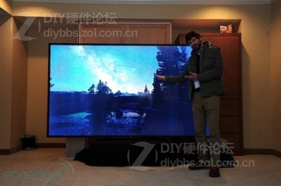

图1 CES上展示的110寸显示器

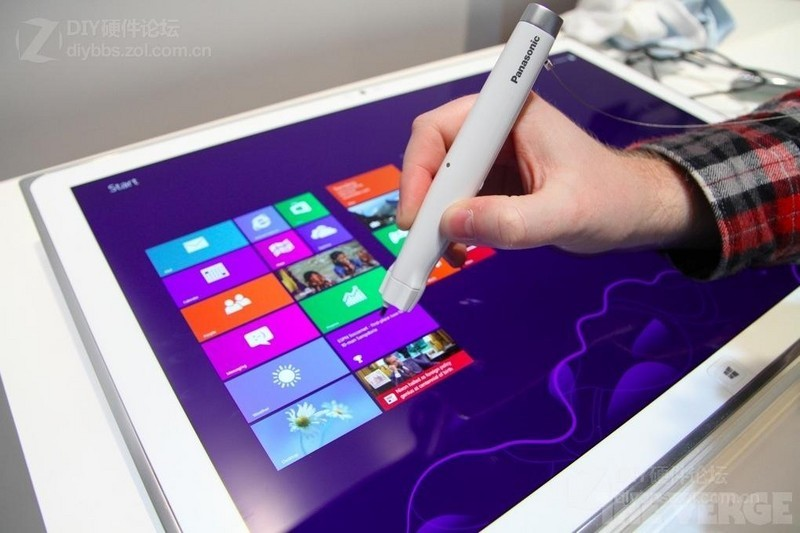

图2 CES上展示的20寸平板
4K分辨率之理论知识讲解篇
那么，什么是4K分辨率呢？
4K分辨率是发展的趋势即4096×2160的像素分辨率，它是2K投影机和高清电视分辨率的4倍，属于超高清分辨率。在此分辨率下，观众将可以看清画面中的每一个细节，每一个特写。影院如果采用惊人的4096×2160像素，因此无论在影院的哪个位置，观众都可以清楚的看到画面的每一个细节，影片色彩鲜艳、文字清晰锐丽，再配合超真实音效，这种感觉真的是一种难以言传的享受。 1080p 能够显示的有效像素为2,073,600（1920×1080），Quad Full HD 能够显示的有效像素为8,294,400（3840×2160），4K 至少能提供近千万像素的显示品质，显示细腻度为 1080p 的 4 倍以上。 4K 分辨率（4K Resolution）是一种新兴的数字电影及数字内容的解析度标准，4k 的名称得自其横向解析度约为 4000 像素（pixel），电影行业常见的 4K 分辨率包括 Full Aperture 4K（4096 x 3112）、Academy 4K（3656 × 2664）等多种标准。

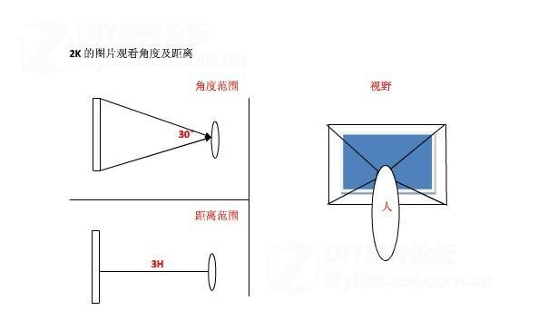

图1、2K分辨率观看角度及距离

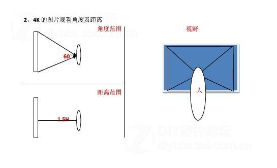

图2、4K分辨率观看角度及距离
目前市场上主要的4K规格如下图

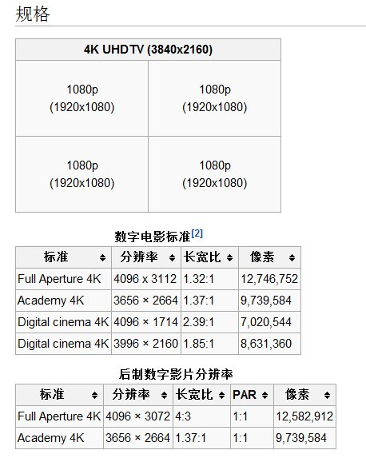

在从百科上找到一张
通用分辨率列表（电脑图形DAR代表显示高宽比率，Pixels代表像素）

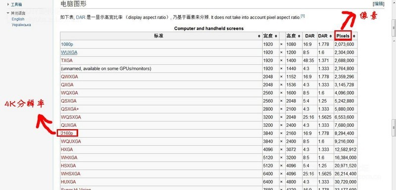

从上图中我们可以看到其实电脑图形上的4K分辨率其实就是我们平常所说的1080P的升级版2160P显示分辨率达到3840X2160（注：电脑图形的4K分辨率与电视以及电影的分辨率是不一样的）要注意的地方：1080p 能够显示的有效像素为2,073,600（1920×1080），Quad Full HD 能够显示的有效像素为8,294,400（3840×2160），4K 至少能提供近千万像素的显示品质，显示细腻度为 1080p 的 4 倍以上。 4K 分辨率（4K Resolution）是一种新兴的数字电影及数字内容的解析度标准，4k 的名称得自其横向解析度约为 4000 像素（pixel），电影行业常见的 4K 分辨率包括 Full Aperture 4K（4096 x 3112）、Academy 4K（3656 × 2664）等多种标准。对于主流的家电设备厂商而言，他们更倾向于制造接近 4K 的 Quad Full HD（3840×2160）设备，因为这个分辨率标准的显示比例为 16:9，与消费者目前接受的观看比例比较接近。
那有人要问了，4K分辨率有说的那么神奇么？我们这里可以举一个比较简单的例子（由于手上没有4K分辨率的显示器，这货目前市面实在是太贵了。。）
示例一
相信各位应该都知道iPad吧？iPad2与iPad3有一个区别就是分辨率上的提升,iPad2是1024X768分辨率，而iPad3是2048×1530分辨率，在近距离观察两者的界面的时候能明确的感觉出清晰度的差异。

这里又要牵扯到一个情况，为什么上图显示的两者屏幕差别并不大呢？答案：是因为人的观察角度以及距离限定了，如果你是进距离观察的话，你会发现清晰度可以明确的观察出来

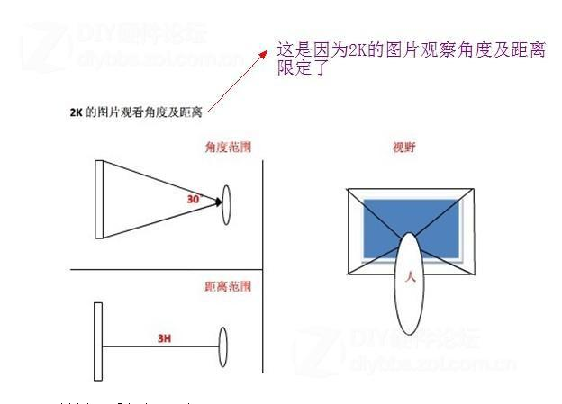

示例二
游戏下的分辨率也是比较容易观察出来的以下是上古卷轴的游戏截图第一张取的游戏分辨率1024X768分辨率下的截图

第二张取值为2560X1440分辨率下的游戏截图（注：由于论坛传图限制，保留了2560X1440分辨率，但在PS处理中缩小了图片大小，所以画质会有所损失）

接着我们把两者合成一张照片进行一个对比，会出现以下图示

两者之间一看是有非常明显的差距的,非常直观的地方就在于视野的把握，4K的成像视野明显的更加扩大，图片细节也更加清晰
我们在用两张张更直观图来体现一下

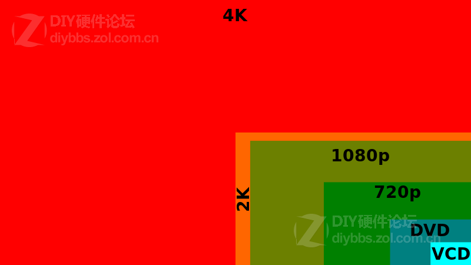

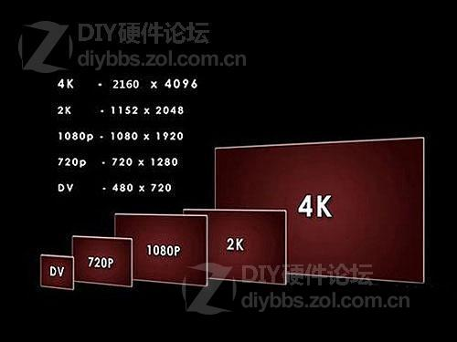

4K分辨率讲解之硬件篇
那么，4K分辨率下，在我们目前所知的DIY硬件有哪些是支持这个分辨率的呢？（以下只列出部分支持的硬件，如果有不足的欢迎高手补充）
CPU部分

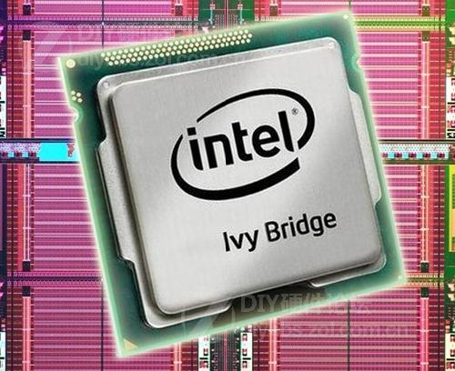

英特尔在10月份更新了一次IvyBridge的驱动程序，此次更新HD4000核心集显将支持4Kx2K（4096x2160）视频输出，以及硬件加速4K视频解码。要实现4K分辨率的输出用户必须要用两个DP接口连接到4K面板中。下一代的Haswell处理器（下一代Haswell处理器只需要一个DP或HDMI接口便可以输出4k分辨率信号）

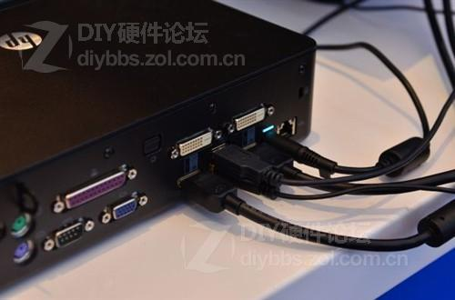

主板部分

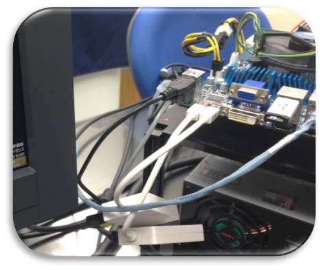

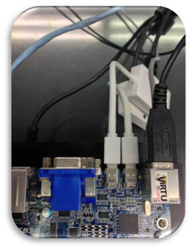

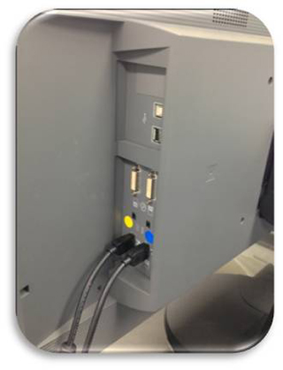

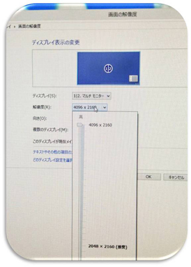

目前技嘉有几款双雷电接口主板Z77X-UP5 TH、Z77X-UP4 TH、Z77MX-D3H TH是可以支持4K分辨率输出的，但是要注意的情况是，这种双雷电接口的需要两个DP口进行同时输出的。
显卡部分

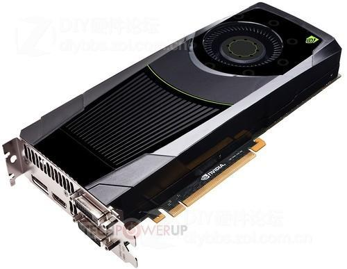

显卡的部分Radeon HD7970系列与GeForce GTX660Ti也可以支持4K分辨率。
也就是说，如果现在想要体验4K分辨率带来的体验效果，需要以下硬件：双雷电接口主板搭配HD4000任何CPU（或支持4K分辨率的Radeon HD7970/GeForce GTX 660TI显卡）外加四台1080P的显示器，就可以达成。
4K分辨率的普及所遇见的障碍
虽然4K分辨率带来的体验是1080P完全不能比拟的，但是在目前的市面上遇到了很大的阻力
价格成本的高昂（主要体现在显示器部分）
目前市面上支持4K分辨率的显示器很少，并且价格比较高昂，主板、CPU以及显卡部分相对来说价格还是在可接受范围内，相信想要体验4K分辨率的朋友应该不会在乎基本的硬件价格，但是一台能支持4K分辨率的显示器的价格之高昂就有点难以接受了。不过通过一个折中的办法可以实现4K，就是显示器拼接，目前含有两个雷电接口的主板和部分中高端显卡都支持多显示器拼接，这样就实现了较低成本的4K分辨率。
片源的稀少
如果经常观看全高清格式电影的消费者可以看到，我们一般观看的全高清影片或者蓝光碟镜像文件的大小约在10GB到50GB不等，如果将分辨率增加到4K的水平，那么一部电影的容量可能会达到200GB。电影容量的提升也就会对用户硬盘容量和目前碟片容量技术造成压力，产生新的问题。
片源下载带来的问题
一句话：天朝的网络你们懂的
总结：
虽然目前4K技术仍处于研发阶段，还存在很多挑战和制约因素，但是没有厂商会停下研发的脚步，4K超高清分辨率拥有很多优势，处理的全高清图像在一些4K电视上呈现出的非常丰富的细节，让人对图像增强的技术大感敬畏。所以4K是未来的分辨率的主流，只是目前4K受到许许多多方面的限制，但相信，在不久的将来，4K一定能像目前的1080P一样开始普及开来。

标签： 分辨率