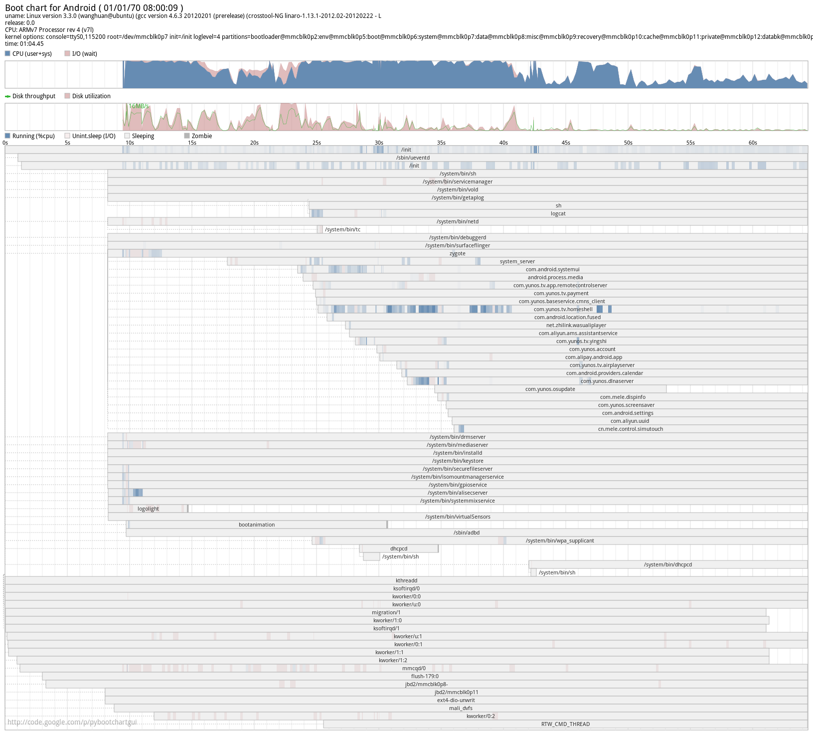

# Android启动速度优化
### 一、在开机启动中，可以借助bootchart 工具分析android的启动过程。
bootchart是一个用于linux启动过程性能分析的开源软件工具，在系统启动过程自动收集CPU占用率、进程等信息，并以图形方式显示分析结果，可用作指导优化系统启动过程。
### 1、UBuntu下安装bootchart工具
需要安装的工具有两个bootchart和pybootchartgui，执行命令如下：
```
$sudo apt-get install bootchart
$sudo apt-get install pybootchartgui
```
需要注意的是：在ubuntu 10.04 版本上的bootchart 制作android 启动图的时候报错，应该是10.04版本的问题。换到13.04 就可以了。
### 2、在Android支持bootchart 
Android系统编译时，默认的没有打开bootchart的编译开关，即没有把bootchart编译进系统中。Android对bootchar 的支持在init 中。在init 中加入对bootchart 的支持。重新编译init .然后把支持bootchart的系统重新烧机。
1）、系统已经编译过，现在只是要添加bootchart进系统中，执行以下命令：‘
```
$ touch system/core/init/init.c
$ m INIT_BOOTCHART=true
```
2）、在bootchar.h 中 修改 BOOTCHART：
```
#ifndef BOOTCHART
#define  BOOTCHART  1
#endif
```
重新编译init
3）、.
```
export INIT_BOOTCHART=true
mmm system/core/init
```
3、生成bootchart 日志
1）、将编译生成的带有bootchart工具的Android系统重新烧录到开发板上，并启动系统
2）、在UBuntu上通过adb connect连接到开发板，然后执行：
```
adb shell 'echo 120 > /data/bootchart-start'
```
3）、执行命令：
```
adb shell 'mkdir /data/bootchart'  
```
4）、重新启动开发板 ，adb connect 后查看：
```
root@android:/data # cat bootchart-start                                       
60
root@android:/data # ls bootchart                                              
header
kernel_pacct
proc_diskstats.log
proc_ps.log
proc_stat.log
root@android:/data 
```
到此为止，bootchart执行测量后生成的测量数据已经完成，看上面有3个.log文件，下面需要将这些数据进一步处理成易读、易分析的图片。
4、bootchart测量结果的图形化过程
1）、在bootchart 目录下执行 tar –czf bootchar.tgz  * 生成bootchart.tgz 。或者利用android的打包工具：system/core/init/grab-bootchart.sh  执行 grab-bootchart.sh 会自动打包在当前目录生成bootchart.tgz。
执行
```
bootchart  -f png bootchart.tgz 
root@louie-ali:~/ali/bin# adb devices
List of devices attached 
10.32.185.29:5555 device
 
root@louie-ali:~/ali/bin# ./grab-bootchart.sh 
12 KB/s (620 bytes in 0.048s)
482 KB/s (177369 bytes in 0.358s)
513 KB/s (5027077 bytes in 9.556s)
509 KB/s (329064 bytes in 0.630s)
look at bootchart.tgz
root@louie-ali:~/ali/bin# bootchart -f png bootchart.tgz 
parsing 'bootchart.tgz'
parsing 'header'
parsing 'proc_stat.log'
parsing 'proc_ps.log'
warning: no parent for pid '2' with ppid '0'
parsing 'proc_diskstats.log'
parsing 'kernel_pacct'
merged 0 logger processes
pruned 71 process, 0 exploders, 1 threads, and 0 runs
False
bootchart written to 'bootchart.png'
```
生成的启动图如下：





### 二、 优化 preloaded-classes
Android开机启动速度慢，涉及的原因很多，从硬件的角度看：EMMC flash 比NAND FLASH的速度快。从软件的角度看主要系统上主要有两个地方：preload classes  resource和scan packages。查阅了相关的资料，有人总结了一下（http://blog.csdn.net/jackyu613/article/details/6044297）： 
· preloaded-classes list中预加载的类位于dalvik zygote进程的heap中。在zygote衍生一个新的dalvik进程后，新进程只需加载heap中没有预加载的类（这些后加载进来的类成为该进程所private独有的），这样便加快了应用程序的启动速度。实际上这是一种以空间换时间的办法，因为几乎没有一个应用程序能够使用到所有的预加载类，必定有很多类对于该应用程序来说是冗余的。但是也正如Google所说，智能手机开机远没有启动应用程序频繁——用户开机一次，但直到下次再开机之前可能要运行多个应用程序。因此牺牲一点启动时间来换取应用程序加载时的较快速度是合算的。
· preloaded-classes list已经是Google Android工程师使用众多测试工具分析，加以手动微调后形成的最优化预加载列表，涵盖了智能机上最长见的应用类型所需要的各种类。很难想象我们自己能够有什么手段能够获得比这样更优的一个预加载列表。所以，除非你的Android系统是被移植到非智能手机设备上使用（例如MID、EBOOK，可以不需要Telephony相关的类），不建议去“优化”preloaded-classes list。
· 在zygote中单起一个线程来做preload，是否可行？答案是否定的。首先在zygote中不可以新开线程，其次，就算新开一个线程，在目前智能机硬件条件下（单核CPU），除非有频繁大量的存储IO，否则我们不能看到我们期望加速启动效果。
关于scan packages的问题。同样参考上面提到的那篇帖子，我们从中可以知道一个事实：越少的apk安装，越短的启动时间。事实上确实如此，apk安装的多少的确影响开机速度，但相比而言，scan packages所花费的时间远没有preload classe多。似乎这里没有多少油水可榨，但起码我们知道了：尽量减少产品中预置的apk数量可以提升启动速度（哪怕精简到极致也许只节省了2s）。
 
Android zygote 启动的时候会预加载一些类，预加载的类根据frameworks\base\preloaded-classes 。这个是下载android代码的时候已经确定的。是google 给出的参考。和这个文件相关：framework/base/tools/preload/WritePreloadedClassFile.java 在这个文件中定义了需要预加载类的规则并且生成frameworks\base\preloaded-classes。预加载类的规则如下：
```
/*
* The set of classes to preload. We preload a class if:
*
*  a) it's loaded in the bootclasspath (i.e., is a system class)
*  b) it takes > MIN_LOAD_TIME_MICROS us to load, and
*  c) it's loaded by more than one process, or it's loaded by an
*     application (i.e., not a long running service)
*/
```
就是
a)系统级的类， 加载时间大于 
b) MIN_LOAD_TIME_MICROS的类 
c) 被应用加载次数大于两次的类。
```
MIN_LOAD_TIME_MICROS 定义如下：
 static final int MIN_LOAD_TIME_MICROS = 1250;
```
根据这个思路和上面的分析，能够优化的就是减少预加载的类。由于我们的产品是机顶盒不是手机，手机相关的jar包都可以裁掉，因此可以去掉这部分相关的jar包。去掉这部分的jar包，
1 修改frameworks\base\preloaded-classes， 
2 在android 系统中裁剪。
我们的盒子的做法是裁剪：
```
anghuan@ubuntu:~/magic$ ls out/target/product/magicbox/system/framework/
AliSecure.jar	apache-xml.jar  bouncycastle.jar                   core.jar        framework-res.apk  libyunos.jar   requestsync.jar  uiautomator.jar
am.jar                   AuiJar.jar      bu.jar                             core-junit.jar  ime.jar            monkey.jar     services.jar
android.policy.jar       aui-res.apk     com.android.location.provider.jar  ext.jar         input.jar          oujavalib.jar  settings.jar
android.test.runner.jar  bmgr.jar        content.jar                        framework.jar   javax.obex.jar     pm.jar         svc.jar
 ```
但是这样也带来一部分额外的开销，就是加载失败的时间消耗。
加载完 classes 以后系统还要加载relsource 。在原生系统中，加载类和资源是一个顺序的过程：
```
static void preload() {
	preloadClasses();
	preloadResources();
}
```
可以采用同步的方式：
```
private static Thread mCThread = new Thread(new Runnable(){
@Override
public void run(){
preloadClasses();
}
});
private static Thread mRThread = new Thread(new Runnable(){
@Override
public void run(){
preloadResources();
}
});
static void asyncPreload(){
try{
mCThread.start();
mRThread.start();
mCThread.join();
mRThread.join();
}catch(InterruptedException e){
Log.e(TAG,"asyncPreload failed");
}
} 
```
这个要考虑硬件的规格：如果是多核CPU 性能可能比较好，如果是单核的，从上面的bootchart.png 上可以看出，在system_server 的启动时间段中 CPU的利用率非常高，优化的性能也可能打折。 
### 三、Launcher的优化。
   从上面的bootchart.png 中，可以看到launcher的启动时间比较长.