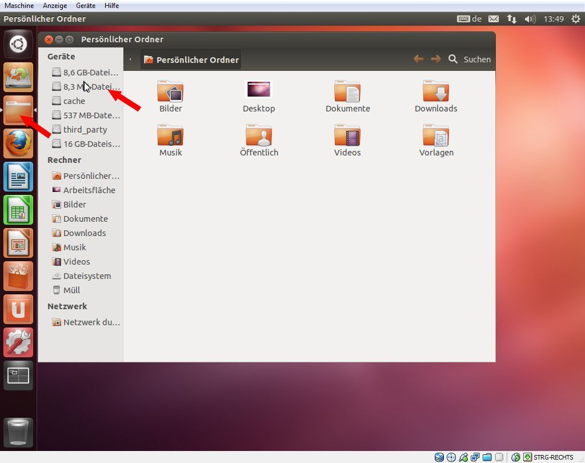
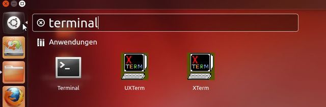
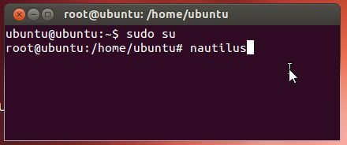
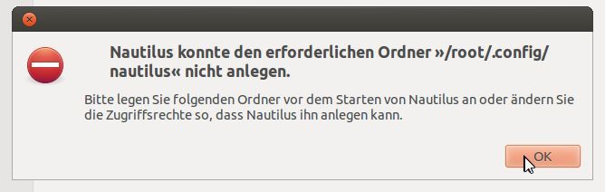

# InstallingARM-EmulatorOnAndroidx864RC2

### [German Edition]
In Part 2 I’ve discussed, how to install Android x86 on an Eee PC 701 G (or on another netbook). And in Part 3 I’ve shown (for my German readers) how to manage and extend the German keyboard layout in a way, that Umlauts, and @ are accessible and the keys y and z are on the right places. Now I like to introduce the procedure, to setup an ARM emulator, that enables Android x 86 to execute apps like Angry Birds.
Some background information

This article on builddroid.org describes, how to install an ARM emulator on Android-x86. Intel has developed such an emulator, that will be shipped with Android-x86 on Medfield based smartphones. Daniel Fages was able to extract the ARM emulator from an Medfield smartphone image. He used a tricky approach to integrate the ARM emulator in his Android-x86 installation.

For me it was to much labor, because it requires to re-compile Android kernel files. Android-x86 4.0 RC2 now includes the necessary settings to incorporate an AMR emulator. Only the ARM binary libraries are omitted (due to license reasons). Using this background knowledge given here and here, it will be easy, to integrate the missing libhoudini libraries. The biggest challenge was to drop unneeded steps from above descriptions and to access system directory as root. For my German readres I have created a how to in Part 3.
Install the missing libraries
According to [5, 6] it is mandatory, to copy the missing library files to the corresponding system directories.
Download the library libhoudini.so and copy the file to /system/lib/
Download the library libdvm_houdini.so and copy the file to /system/lib/
Download the archiv arm libs, extract the .tgz archive to a local folder and extract the resulting .tar archive to a new folder /system/lib/arm/
I’ve used 7-Zip to extract the .tgz archive and the .tar file into a separate folder arm.
How to access system folders to copy library files?
One problem will be: How to access the folder system of your android x86 install? This folder is write protected and we need root access. I’ve booted Eee P with a Ubuntu live system from a USB thumb. The ESC key invokes on Eee PC the BIOS boot menu, and we will be able to select the boot media. After the Ubuntu desktop is visible, click in the left launcher bar to Personal folder (user folder). This opens nautilus file manager window.

Use the USB thumb driver or SD card entry in the folder window’s left navigation pane in group Devices. This mounts the media containing the library files already downloaded. Afterward copy the library files and the subfolder arm to the Ubuntu desktop. Then close the folder window.
Open a terminal windows (select the upper most button Dash-start page in the left launcher bar, enter “terminal” in search box and launch terminal with a double click).

Enter the following commands in the open terminal window:
sudo su
nautilus
and press the enter key after each command line.

The error message reports, that nautilus could not create a .config file in folder /root/ may be closed with OK button.

Reduce the size of the file manager window, so that you could see the window and also the Ubuntu desktop. Navigate in nautilus folder window to device “Android-x86” and open the directory android-4.0.RC2. Then navigate to subfolder system –> lib. Move the library files (according to the instructions given above) to the appropriate folders:
libhoudini.so to /system/lib/
libdvm_houdini.so to /system/lib/
Create a new directory /system/lib/arm/
Move the extracted files from the desktop’s arm subfolder to /system/lib/arm/
Shutdown Ubuntu and re-boot Eee PC with android x86. Afterward the ARM emulator should be useable. A first test may be: open Google Play Store and search for Angry Birds. If that app is available, download it and launch Angry Birds.
Articles:
i: Running Angry Birds on an Eee PC 701G with Android x86 – Part 1
ii: Installing Android x86 4 RC2 on an Asus PC 701G – Part 2
iii: Modify keyboard settings in Android x86 4 RC2 – Part 3
iv: Installing ARM-Emulator on Android x86 4 RC2 – Part 4
Similar articles:
a: Running Honeycomb on a Eee PC 701G
b: Testdrive: Android x86 3.2 RC2 on Eee PC & MSI Wind U 100
c: Running Android x86 ICS RC1 on Eee PC 701G and other Netbooks
d: Installing Android x86 on a SD card
Links:
1: Android-x86.org project page
2: Android x 86 4RC2 release notes
3: Download page
4: Open files with root-rights on Nautilus
5: Add ARM-Emulator to Android-x86
6: BuildDroid: Add ARM support to Android-x86
