# 最全面的Android Studio使用教程

Android Studio是一套面世时间还不长的IDE（即集成开发环境），目前已经免费向谷歌及Android的开发人员发放。Android Studio以IntelliJ IDEA为基础，后者同样是一套相当出色的Android开发环境。在今天的文章中，我们将共同了解如何创建一个全新Android项目，同时充分发挥 Android Studio所提供的各项功能优势。
## 1.项目设置
在开始畅游Android Studio的世界之前，大家首先需要点击此处下载并进行安装。请注意，各位必须事先安装好JDK 6或者更高版本。如果是在Windows系统环境下，先启动.exe文件、而后按照安装向导的指示一步步完成。如果大家使用的是OS X系统，则首先双击启动磁盘镜像，然后将Android Studio拖拽到自己的应用程序文件夹当中。
在成功完成了以上各项步骤后，那么大家的开发环境应该已经得到了正确设置。接下来，我们可以准备好利用Android Studio创建自己的第一款Android应用程序了。当大家第一次启动Android Studio时，应该会看到该软件的欢迎屏幕，其中还提供一些选项、指导我们以此为起点迈出Android应用开发的第一步。


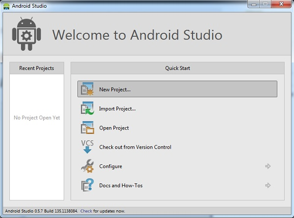


在今天的教程中，我们将选择“New Project（新项目）”选项。不过如果大家希望把Eclipse等其它环境中的现有项目转化为Android Studio项目，也可以选择“Import Project（导入项目）”。Android Studio能够将Eclipse项目转换为Android Studio项目，并在项目中为用户提供必要的配置文件。
如果大家在选项列表中点击了“Open Project（打开项目）”，则可以开启已经利用Android Studio或者IntelliJ IDEA创建出的项目。而选择“Check out from Version Control（版本控制检查）”的话，大家能够对处于版本控制之下的项目副本进行检查。通过这种方式，我们可以将现有项目作为基础、快速构建起新的针对 性版本。
由于我们需要从零开始，因此这里选择“新项目”。这时大家会看到一份选项列表，旨在对我们的新项目作出配置。在今天的教程中，我们将创建一款简单的 应用程序，主要目的是为大家演示Android Studio中最为重要的一部分功能特性。相信大家也和我一样，会认为“HelloWorld”这个名称最适合本次开发出的新项目。


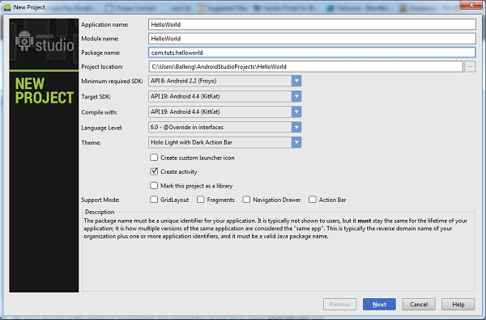

正如大家在上面这幅截图中所看到，我把自己的应用程序命名为HelloWorld，并为其设定了模块名称。如果大家对IntelliJ IDEA不太熟悉，可能不知道模块这东西到底是什么。模块实际上就是一个可以进行编译、运行、测试以及调试的独立功能单元。模块当中包含有源代码、编译脚 本以及用于特定任务的其它组成部分。
在创建新项目时，大家还可以为该项目设定软件包名称。在默认情况下，Android Studio会将项目包名称的最后一项元素设置为模块名称，但只要愿意、大家可以随意对其作出变更。
其它设定内容还包括项目在设备上的保存位置、最低与推荐SDK、项目编译需要使用的SDK以及项目主题等等。大家也可以要求Android Studio创建一个Activity类、为其自定义一个启动图标，或者设定该项目是否支持GridLayout、Fragments、 Navigation Drawer或者Action Bar等。
这里我们不会为自己的应用程序创建自定义图标，因此大家可以取消“Create custom launch icon（创建自定义启动图标）”项目前的勾选框。点击“Next（下一步）”继续进行其它项目设置步骤。
由于我们在之前的步骤中勾选了“Create activity（创建activity）”项目的勾选框，因此这里导航会要求大家对Android Studio将为我们创建的Activity类进行配置。


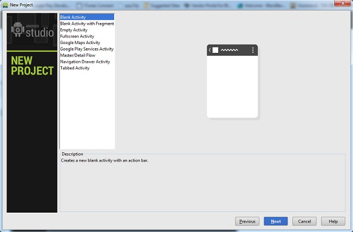


由于我们将从空白Activity类开始进行配置，因此大家可以点击“Next”执行设置流程的下面几个步骤。这里大家需要对该Activity 类、主布局以及片段布局进行命名。大家也可以设置导航类型，在今天的示例项目中我们将其设置为“None”。下面这幅截图显示的是我们的设置方案看起来是 什么样子。


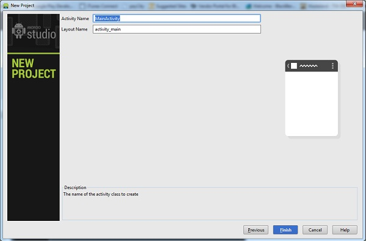


在点击“Finish”之后，大家会看到如下图所示的Android Studio用户界面。其中窗口左侧为项目资源管理器，右侧则为工作区。在Android Studio中对项目进行设置之后，现在我们可以逐一查看Android Studio当中的各项关键功能。


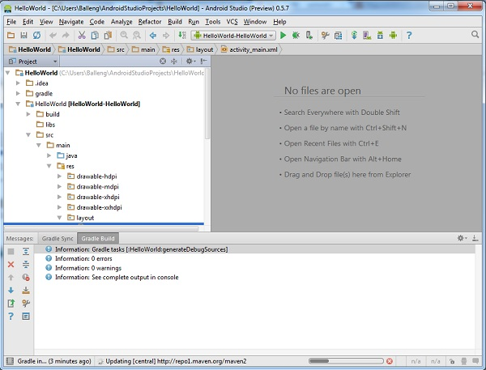


回到顶部
## 2. Android虚拟设备
所谓Android虚拟设备——或者简称AVD——是一套模拟器配置方案，它允许大家设定出与实际情况相符的Android设备型号。这就让开发者 在多种多样的设备平台上运行并测试应用程序变得更为轻松。在Android虚拟设备功能的支持下，大家可以为Android模拟器指定需要模拟的硬件与软 件组合。
创建Android虚拟设备的首选方式是通过AVD Manager。大家可以在Android Studio用户界面的Tools菜单中依次选择Android〉AVD Manager。


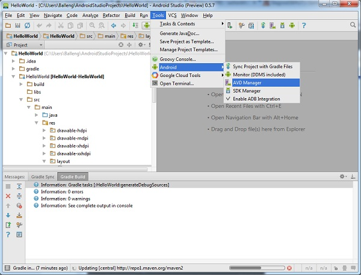


如果大家之前对开发环境的设置工作正确无误，那么Android虚拟设备管理器的界面应该如下图所示。


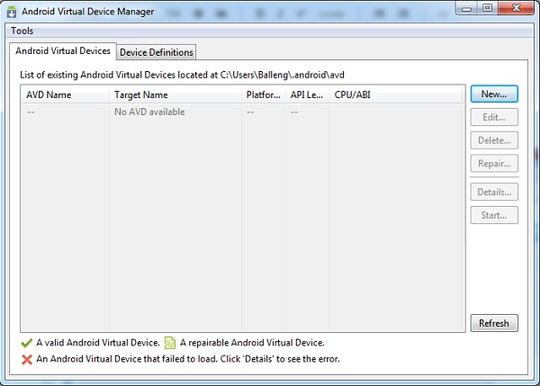


要创建新的AVD，我们需要点击右侧的“New…”、为AVD设定名称并如下图所示对虚拟设备进行配置。最后点击“OK”以创建自己的第一套AVD。


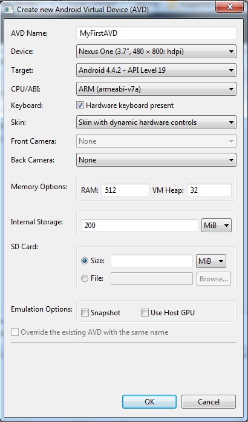


要使用我们刚刚创建好的AVD，首先需要在AVD管理器的列表中将其选中，然后点击窗口右侧的“Start…”。如果大家的AVD设置过程正确无误，那么Android模拟器在启动后应该如下图所示。


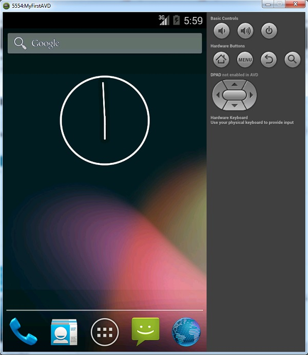


既然Android模拟器已经成功启动并开始运行，现在是时候启动我们的应用程序了。在“Run”菜单中选择“Run ‘helloworld’”——没错，在Android模拟器中运行应用程序就是这么简单。


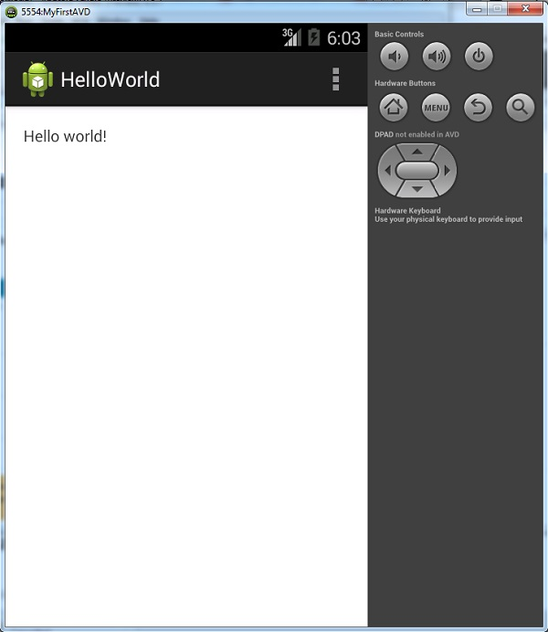


回到顶部
## 3.实时布局（Live Layout）
Android Studio中的实时布局功能允许大家在无需将应用程序运行在设备或者模拟器中的前提下，直接预览应用的用户界面。实时布局是一款极为强大的工具，能够帮助开发者节约大量时间。在实时布局的帮助下，查看应用程序用户界面的任务变得轻松而且快捷。
要使用实时布局，我们需要双击对应XML布局文件并选择工作区下方的“Text”标签。接下来选择工作区右侧的“Preview”标签来预览当前布局。我们对XML布局作出的任何变更都会直接反映在右侧的预览窗口当中。大家可以查看下面这幅截图来深入理解这项功能。


实时布局功能为我们带来了诸多值得称道的显著优势。举例来说，大家可以在Preview面板的第一项菜单中选择选项，从而对当前正在使用的XML布 局随意作出调整。譬如说，大家可以分别创建不同的纵向与横向显示视图，Android Studio会承担起创建必要文件夹及文件的任务。
Preview面板中的第二项菜单允许大家变更显示在Preview面板内的设备大小。第三项菜单的作用则是调整设备在Preview面板中的朝向，这样我们就能更轻松地查看同一套布局方案在不同显示模式（纵向与横向）下的效果与主题。
Preview面板中的第四项菜单允许我们轻松访问Activity或者布局所使用的个别片段。Preview面板还允许大家变更在实时布局中使用的语言，从而轻松预览不同语言在布局方案中的显示效果。最右边的菜单的作用则是调整API版本。
Preview面板中还包含多项控制机制，例如对布局进行缩放、重新Preview面板或者截取当前屏幕。
回到顶部
## 4.模板
Android Studio还为开发人员提供多种模板选项，从而大大提升开发速度。这些模板能自动创建Activity以及必要的XML文件。大家还可以利用这些模板创建出较为基础的Android应用程序，并将其运行在实体设备或者模拟器当中。
在Android Studio当中，我们可以在创建新的Activity时一同创建出对应模板。右键点击窗口左侧项目浏览器中的“package name”并在菜单中选择“New”，而后从选项列表中点选“Activity”。Android Studio随后会为开发者列出模板清单，其中包括Blank Activity、Fullscreen Activity以及Tabbed Activity。


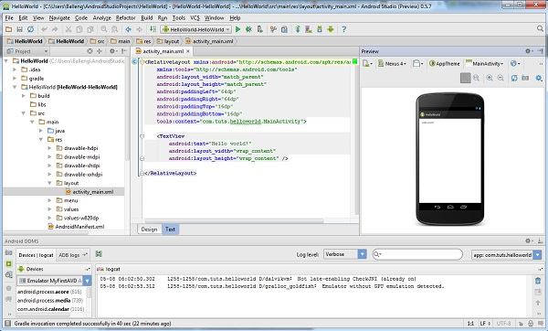


大家还可以从菜单中选择“Image Asset”，接下来的向导会指引我们一步步完成创建流程。下面让我们一起来看看如何以Login Activity模板为基础创建一套新的Activity。首先在Acivity模板列表中选择Login Activity选项以启动创建向导。


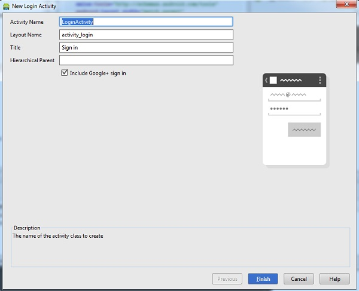


如大家在上面的截图中所见，我已经将新建的Activity命名为LoginActivity——也就是为activity login设定Layout Name——并为该Activity添加了一个名为Sign In的标题。在默认情况下，对话框中的Include Google+ sign in项目已经被勾选。由于我们不打算在今天的示例中使用Google+登录功能，因此取消该勾选项。
大家可以选择为这套新的Activity设定Hierarchical Parent（分层结构）。这样当我们点击设备上的后退按钮时，应用就将通过导航返回至上一界面。我们将这一字段留空。在点击“Finish”之 后，Android Studio会为我们创建出必要的文件及文件夹。如果一切进展顺利，我们将在项目当中看到新的Activity与Layout。
下一布工作是在manifest文件中对新Activity进行设置，这样它就能在应用程序启动时作为主Activity加以使用了。请大家一起来看下面的manifest文件内容，其中LoginActivity类拥有自己的活动节点。
```
<application
android:allowBackup="true"
android:icon="@drawable/ic_launcher"
android:label="@string/app_name"
android:theme="@style/AppTheme"\>
<activity
android:name="com.tuts.HelloWorld.MainActivity"
android:label="@string/app_name">
<intent-filter>
<actionandroid:name="android.intent.action.MAIN"\/\>
<categoryandroid:name="android.intent.category.LAUNCHER"\/\>
</intent-filter>
</activity>

<activity
android:name="com.tuts.HelloWorld.LoginActivity"
android:label="@string/title_activity_login"
android:windowSoftInputMode="adjustResize|stateVisible">
</activity>

</application>
```

为了在应用程序当中启动我们刚刚创建的LoginActivity，首先需要移除原有LoginActivity类的活动节点，然后利用 com.tuts.HelloWorld.LoginActivity代替先前的com.tuts.HelloWorld.MainActivity。这 样一来，应用程序现在就将使用LoginActivity类作为其主Activity。
```
<application
android:allowBackup="true"
android:icon="@drawable/ic_launcher"
android:label="@string/app_name"
android:theme="@style/AppTheme">

<activity
android:name="za.co.helloworld.LoginActivity"
android:label="@string/app_name">

<intent-filter>
<actionandroid:name="android.intent.action.MAIN"/>
<categoryandroid:name="android.intent.category.LAUNCHER"/>
</intent-filter>
</activity>
</application>
```
当我们在模拟器当中创建并运行自己的应用程序时，首先应该会看到如下图所示的显示内容。这意味着我们已经成功利用刚刚创建的LoginActivity类取代了原有的空白Activity类。

回到顶部
## 5.Lint工具
对代码进行测试是一回事，但同样重要的是、我们还需要在编写代码的同时引入各种最佳实践。这不仅能够显著改进性能表现，也能增加应用程序的整体稳定性。另外，经过合理结构调整的项目在维护方面也更为轻松。
Android Studio中提供的Android Lint是一款静态分析工具，它负责对项目源代码加以分析。它能够检测出应用程序中的潜在漏洞以及其它可能被编译器所忽略的其它代码问题。
就以下面这幅截图为例，大家可以看到该布局中的LinearLayout并未得到实际使用。Android Lint的优势在于，它能帮助我们重视警告或报错信息的出现原因，从而更轻松地修复或者解决这些问题。

请大家养成重复使用Android Studio Lint工具的好习惯，这能帮助我们准确检测到项目当中存在的潜在问题。Lint工具甚至能告诉我们应用程序中是否存在重复的图片或者编译内容。
要运行Lint工具，大家首先需要在Android Studio的“Analyze”菜单中选择“Inspect Code…”。当Android Studio完成了对项目的检测之后，它会在窗口底部显示出分析结果。请注意，除了Android Lint之外，Android Studio还提供一系列其它检查功能。只需双击某个已经发现的问题，系统就会帮助大家定位到对应文件中存在问题的位置。

回到顶部
## 6.富布局编辑器
Android Studio提供一套富布局编辑器，大家可以在其中随意拖拽各类用户界面组件。大家还可以在多屏幕配置中同时查看多种布局的显示效果，这一点我们在前文中已经提到过。
这款富布局编辑器在使用方面非常直观简单。我们首先需要一套要处理的布局方案。浏览到项目中res文件夹下的layout文件夹，右键点击layout文件夹，然后在弹出的菜单中选择New>Layout resource file。
下面为新布局设定一个名称与root元素，而后点击“OK”。Android Studio会自动在窗口右侧的编辑器当中打开该布局。

在编辑器的底部，大家会看到两个标签，分别是Design与Text。点击Text标签后编辑器将被激活，这样我们就能对当前选定的布局方案作出变更。
点击Design标签则会激活另一套编辑器内容，其中显示出布局的预览效果。要向布局当中添加其它功能性组件，我们只需将其从布局左侧的组件列表中拖出并放入布局内即可。是的，就这么简单。

回到顶部
## 总结
在今天的教程中，我们已经简要了解了Android Studio的各项核心功能。它的使用方式与IntelliJ IDEA非常相似，但其中包含的一系列重要改进大大加快了Android应用的开发速度，并让整个流程更轻松、更愉快。