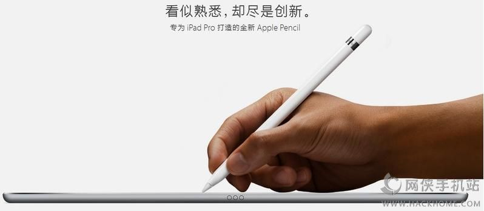
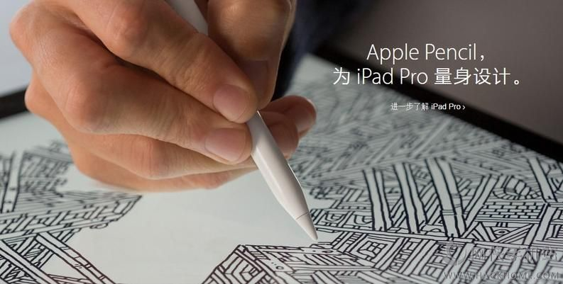
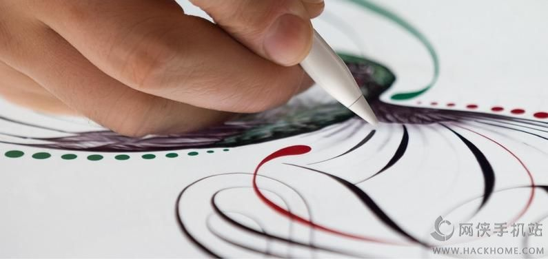
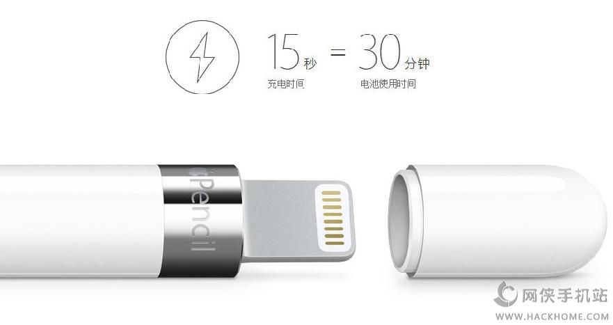

iPad Pro平板配搭的Apple Pencil手写笔具有哪些功能？这个手写笔又如何实现功能？小板栗为大家分享Apple Pencil的使用教程，见证奇迹的时候已到！

关于　Apple Penci　我们称其为苹果铅笔，或者苹果笔，这是一个非常强大的辅助工具，可以帮助商务[办公](https://www.hackhome.com/zt/sjbgrj/ "手机办公软件")人士、设计人员、[教育](https://www.hackhome.com/zt/sjjyrjdq/ "手机教育软件专区")界、医疗界的使用者们更加方面的使用　iPad　Pro　来做到一些非常 iPad 难以办到的事情，例如更好编写文档和表格，更好的绘制图像，更好的设计3D图片。

为此，苹果联合微软、Adobe以及3D4Medical推出一系列的配套应用，苹果铅笔可以跟你的手指同时使用，Apple Pencil 甚至搭载了一个 Lightening 接口，[充电](https://www.hackhome.com/zt/chongdian/ "充电软件专区")更方便，仅需充电 15 秒，就能使用半小时。而完全充满，足以使用 12 小时，让你尽情地涂写、作画、添加附注和编辑。

新的[备忘](https://www.hackhome.com/zt/sjbjbwrj/ "手机笔记备忘应用软件")录应用可以跟 Apple Pencil 很好的契合，Apple Pencil 也能够识别力度写出粗细不同的笔画。Adobe 表示这是首次在一款[移动](https://www.hackhome.com/zt/zgydsjyyt/ "中国移动手机营业厅专区")终端上使用 Adobe 的 TypeKit [字体](https://www.hackhome.com/zt/font/ "字体专区")。来自于医疗行业，名字叫做 3D4Medical，3D4Medical 可以显示[高清](https://www.hackhome.com/zt/sjgqbz/ "手机高清壁纸专区")晰度的人体结构，让医学院的学生和适用于医疗行业，我勒个去很屌的样子！

总结[一下](https://www.hackhome.com/zt/yixia/ "一下") iPad Pro 的具体参数，颜色有三个种，金色、白色和灰色，价格分别是：32GB 799美元 ，128G 949美元，128GB　4G版1079美元，比一个笔记本还贵！另外。 99美元的苹果铅笔，100美元的苹果键盘，将会在十月开卖。

下面是一些源自苹果官方的关于iPad Pro的苹果铅笔使用场景介绍。

你开始使用 iPad Pro，有时可能需要更精准的表现。因此我们精心设计出 Apple Pencil，进一步扩展 Multi-Touch 的多样功能。尽管 Apple Pencil 所含技术与我们以往打造的截然不同，但初次拿起它，仍会立即感觉十分熟悉。而且，它几乎能让你触及每一颗像素，助你创作出丰富多彩的效果，自由挥洒无限创意。

**用 Apple Pencil，种种障碍一笔勾销**

也许你从未见过 Apple Pencil，但已懂得怎么使用它。从上手的第一刻，它就开始助你实现心中所想，并可能超越所想。无论你在公园写生、画一幅水彩画，还是绘制一张蓝图，只需 Apple Pencil 这一个装备，就能获得各种各样的工具。一笔在手，一切都顺手。

**高度灵敏，下笔行云流水**

Apple Pencil 迅捷的响应能力，使它从众多创意工具中脱颖而出。因为从你下笔作画到内容呈现在屏幕上，两者之间的延迟非常微小，反应时间短到几乎令人难以察觉。

iPad Pro 能判断你是在使用手指，还是在用 Apple Pencil。当它感应到 Apple Pencil 时，辅助[系统](https://www.hackhome.com/zt/shoujixitong/ "手机系统专区")会以令人惊叹的速度，每秒 240 次[扫描](https://www.hackhome.com/zt/sjsmrj/ "手机扫描软件专区")显示屏，所收集的数据点相当于平时你用手指的两倍。这些数据结合 Apple 设计的软件，仅需数毫秒，就能让你脑中的意[念](https://www.hackhome.com/zt/nian/ "念")变成眼前显示屏上的大作。

**轻重不同，粗细随之变化**

在 Apple Pencil 纤长的笔身内，藏着多个精密复杂的压力感应器，可测量各种不同的按压力度。这些感应器的位置经过悉心设置，能够精准判断你按压在 Apple Pencil 笔尖上的力量。加大力度，线条变粗犷；轻轻触碰，线条则细若发丝。各种各样的创意效果，数不胜数，让你无限的创造力也能尽情发挥。

**倾斜笔锋，左右笔触深浅**

Apple Pencil 笔尖内的两个倾斜角度感应器，能准确计算手的方向和倾斜角度。在你书写或[绘图](https://www.hackhome.com/zt/sjhtrj/ "手机绘图软件专区")时，Multi-Touch 显示屏能侦测到每个感应器的相应位置。所以，你只需像用炭笔或传统铅笔一样，将 Apple Pencil 倾斜，即可创作出深浅不同的明暗效果。

**12 小时电池续航力，让创意电力十足**

滑开 Apple Pencil 的磁性笔帽，就能看到 Lightning 接口，只要将它插入 iPad Pro 即可充电。我们为接口做了轻微的加长设计，所以就算 iPad Pro 套在硅胶保护壳内，也不妨碍充电。着急了吗？仅需充电 15 秒，就能使用半小时。而完全充满，足以使用 12 小时，让你尽情地涂写、作画、添加附注和编辑*。

**在你熟悉的 App 中，描绘出新意**

配合一系列内置 app 使用 Apple Pencil，可充分发挥 iOS 9 的功能。同时 Apple Pencil 还适用于 App Store 中的各个 iPad app。所以，你能轻松找到提升创意和[效率](https://www.hackhome.com/zt/xlrjapp/ "手机效率软件专区")的全新[空间](https://www.hackhome.com/zt/kjsjb/ "空间手机版专区")。

**邮件**

有了 Apple Pencil，邮件的创意性瞬间激增。在你的下一封邮件中，发送些创意十足的东西。或者使用 Apple Pencil，亲笔为 PDF 或其他文件加注，让你的工作呈现崭新一面。

**Paper by FiftyThree**

无论你要在 Paper by FiftyThree 上记录什么，功能简便的 Apple Pencil 都是理想搭档。利用涂画、书写、绘图、勾勒和[涂色](https://www.hackhome.com/zt/tuseapp/ "涂色app大全")工具创作新的设计，为你的演讲绘制图表，或者构思下一个精彩创意。

以上就是嗨客小编带来的全部内容，[百度](https://www.hackhome.com/zt/bdrjdq/ "百度专区")一下“嗨客Apple Pencil”更多资讯等着你。