# GoodNotes 5 - 手感最好的手写笔记 APP 应用 (识别手写文字搜索 / 涂鸦 / PDF 批注)

新版发布  [文档办公](https://www.iplaysoft.com/category/document)    [iOS](https://www.iplaysoft.com/os/ios-platform)   2019-01-27

88,517 9 下载

自从苹果发布了 [Apple Pencil](https://www.iplaysoft.com/go/applepencil) \+ [iPad Pro](https://www.iplaysoft.com/go/ipad) 的组合以来，人们才纷纷体会到原来电子平板也能带来如此接近真实纸笔的书写和画图体验，从此打开了一个新世界的大门。

在[绘画](https://www.iplaysoft.com/tag/画画)领域我们有 [SketchBook](https://www.iplaysoft.com/sketchbook.html)、[ProCreate](https://www.iplaysoft.com/procreate.html) 等顶尖的画画软件，而在**手写笔记应用**中，除了曾推荐过的 [Notability](https://www.iplaysoft.com/notability.html) 之外，最受人追捧的 APP 莫过于就是这款大名鼎鼎的——**GoodNotes** 了！它凭借出色的手感、细腻的笔迹模拟以及丰富的[笔记](https://www.iplaysoft.com/tag/笔记)功能吸引了大量的忠实用户……

### 被誉为 iOS 最好的手写笔记应用

**GoodNotes** 是苹果 [iOS](https://www.iplaysoft.com/os/ios-platform) 平台上最好的手写笔记软件 APP 之一，其优秀的墨水笔触模拟算法、支持压感、加上书写感觉流畅跟手，配合 [Apple Pencil](https://www.iplaysoft.com/go/applepencil) (非强制) 使得它的手感和口碑在同类应用中脱颖而出，因此也常年占据[效率](https://www.iplaysoft.com/tag/效率)类 APP 付费排行榜的前列。

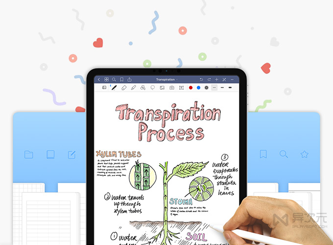

[GoodNotes](https://www.iplaysoft.com/goodnotes.html) 支持各种手写涂鸦，有着不同的笔尖(钢笔 / 圆珠笔 / 画笔)、粗细、颜色可以选择；支持插入文字、图片、图形；支持形状识别 (比如手画圆圈自动变正圆形)；可以打开 PDF、Word (doc) 和 PTT 进行批注和注释，也能将笔记导出成 PDF。笔记数据可以通过 iCloud 在 iPhone 和 iPad 之间同步。

\[ GoodNotes 5 iPad 版截图 \]

|     |     |     |     |     |     |
| --- | --- | --- | --- | --- | --- |
|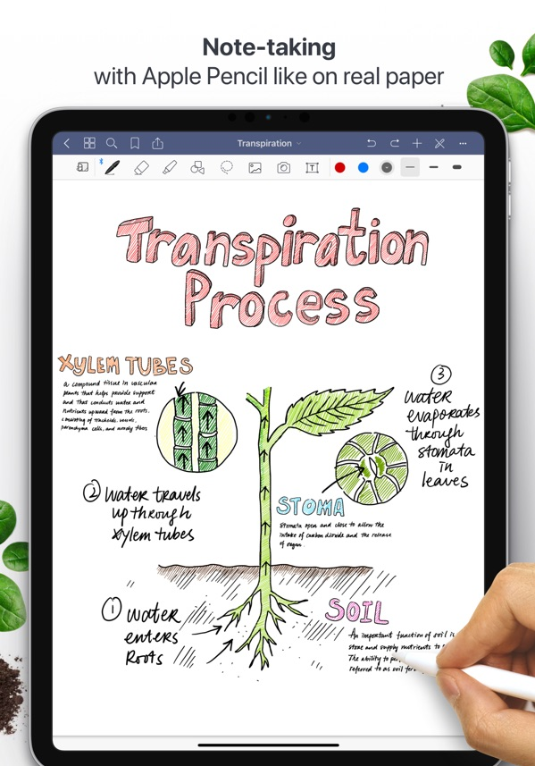|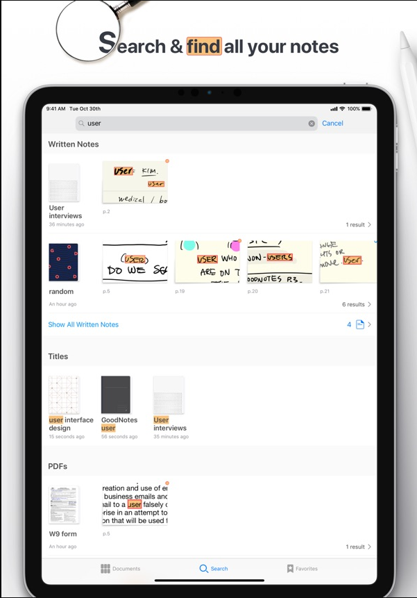 |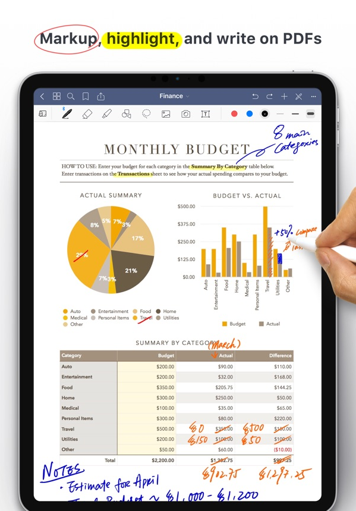|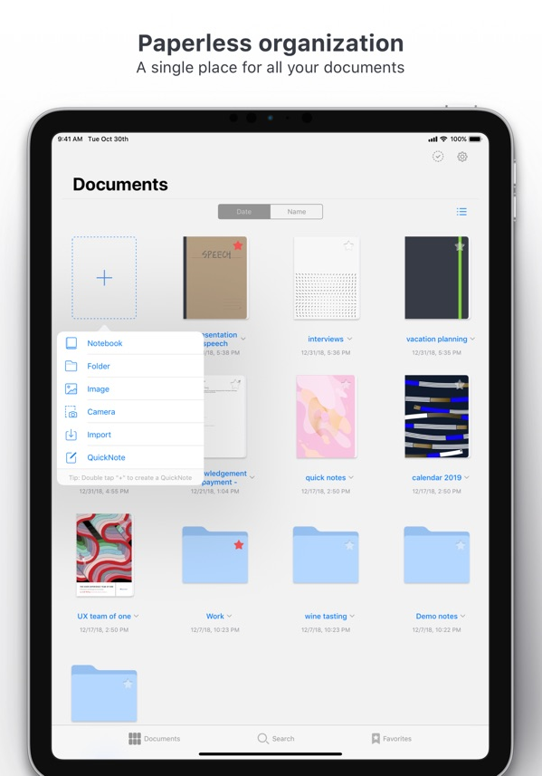 |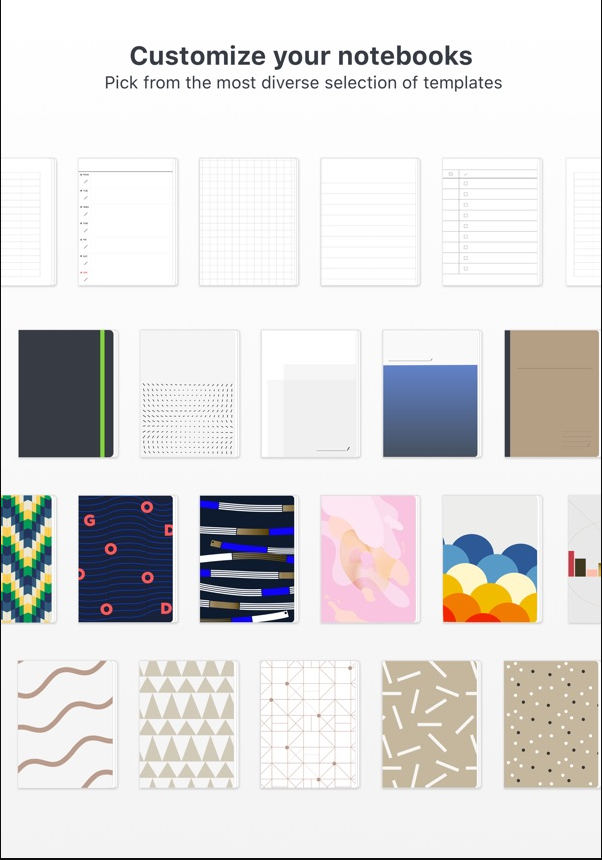|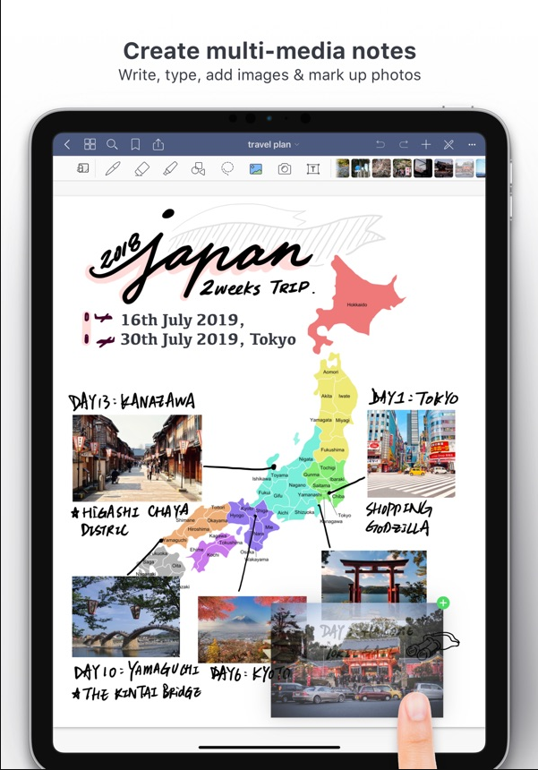|

你可以新建空白的纸张开始写笔记，也能从相机、照片、iCloud Drive、[Dropbox](https://www.iplaysoft.com/dropbox.html)、Google Drive、OneDrive、Box、WebDAV 等云存储[网盘](https://www.iplaysoft.com/tag/网盘)导入图片或[文档](https://www.iplaysoft.com/tag/文档)来进行标注。该软件基本拥有手写笔记该有的全部功能。

而最新的版本还包含一些新特性。比如现在允许你创建无限级别的文件夹和子文件夹来组织所有的笔记；其次也新增了「全局搜索」功能，允许您同时[搜索](https://www.iplaysoft.com/tag/搜索)全部的手写笔记、键入文本、笔记本标题和 PDF 文件。

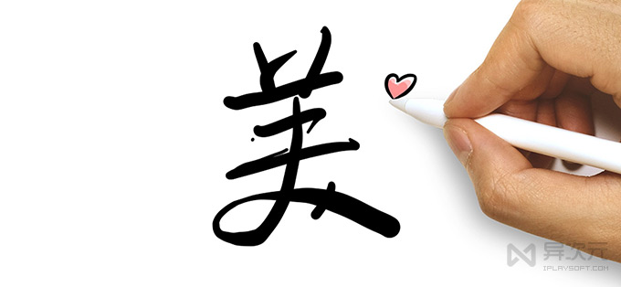

比较厚道的是，如果你曾以原价购入过 GoodNotes 4，那么还可以免费升级到最新的 GoodNotes 5。如之前是以优惠价购入，也只需补齐差价即可升级。

### OCR 搜索手写文字，轻松查找笔记

我们都知道纸笔书写有着一些天生的缺陷，比如无法复制和搜索、不便携带等。为此，GoodNotes 给我们带来了一项非常赞的“黑科技”，就是类似「[印象笔记](https://www.iplaysoft.com/yinxiangbiji.html)」提供的功能一样，通过 [OCR 文字识别技](https://www.iplaysoft.com/tag/ocr)术来「**搜索你的手写笔记**」！

\[ GoodNotes 5 iPhone 版截图 \]

|     |     |     |     |     |     |
| --- | --- | --- | --- | --- | --- |
|
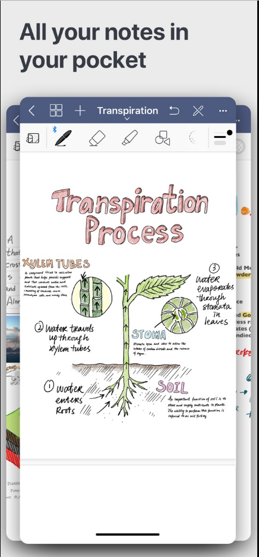|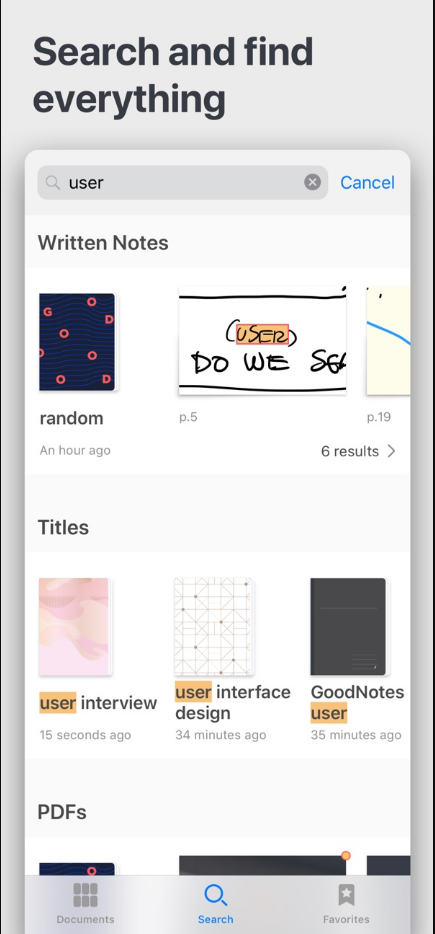| 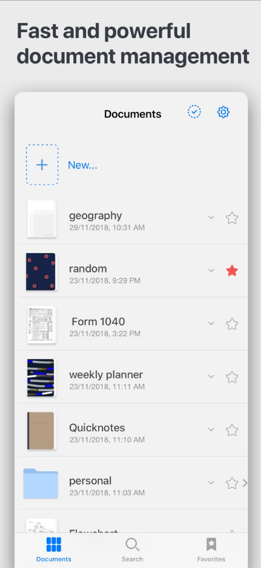| 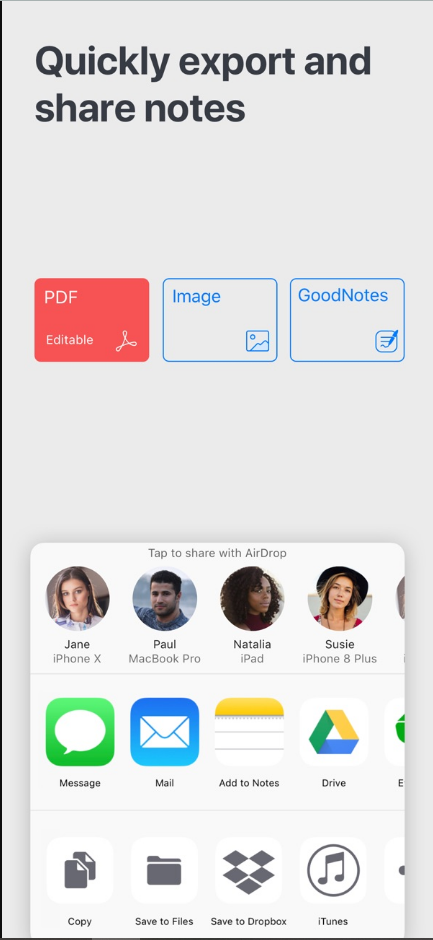 | 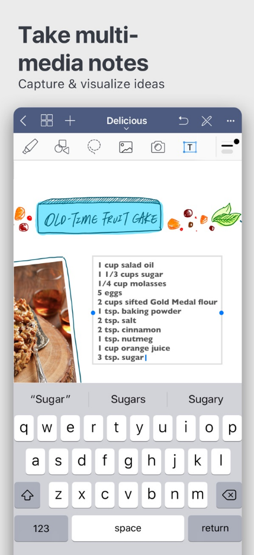|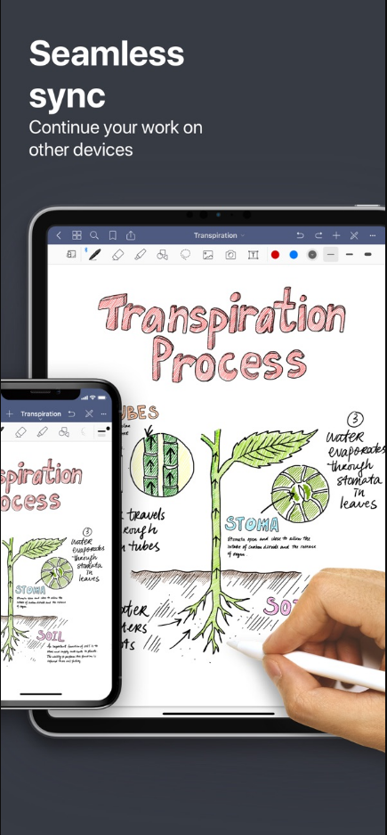 |

即便你的字写得比较潦草，**GoodNotes** 还能保持着较高的识别率，可以非常方便地检索找到过往做过的文档笔记。

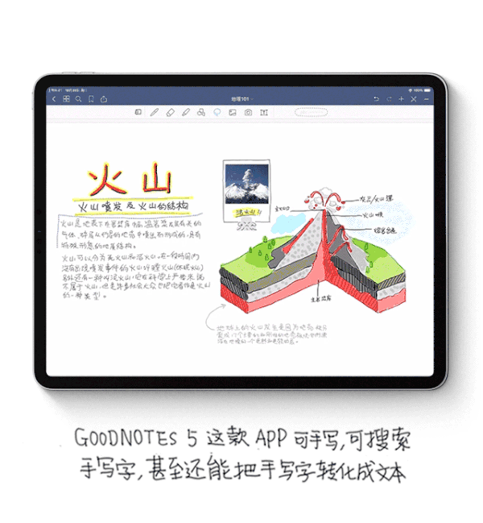

在整理、回顾和日常找[资料](https://www.iplaysoft.com/tag/资料)时，GoodNotes 的这个特性可以让你的手写笔记变得垂手可得，完美解决了纸笔手写无法搜索的缺陷，简直是超级无敌实用的高效利器！

### 总结：

无论是[办公](https://www.iplaysoft.com/tag/办公)还是[学习](https://www.iplaysoft.com/tag/学习)，**GoodNotes** 手写笔记都能满足你对资料阅读、做笔记、写标注等的需求。加上 Apple Pencil 的话，你的 iPad 瞬间就能变成笔记[神器](https://www.iplaysoft.com/tag/神器)！

比较可惜的是，GoodNotes 仅有 iOS 版本，Android 以及 Windows、macOS 等的用户都无法使用。而 [Notability](https://www.iplaysoft.com/notability.html) 提供了 Mac 版、[Myscript Nebo](https://www.iplaysoft.com/myscript-nebo.html) 提供了 Windows 版等，有时可以在电脑上回顾和查询笔记，这点倒是更方便一些。

### 相关文件下载地址

官方网站：[访问](https://www.goodnotes.com/)  
软件性质：付费  
同类软件：[Notability](https://www.iplaysoft.com/notability.html)  |  [Myscript Nebo](https://www.iplaysoft.com/myscript-nebo.html)

本文作者
*   生产日期：异次纪元 19年01月27日 - 19时32分20秒
*   文章链接：https://www.iplaysoft.com/goodnotes.html \[[复制](#)\] (转载时请注明本文出处及文章链接)

