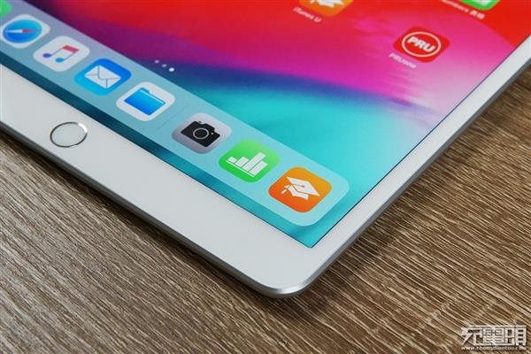
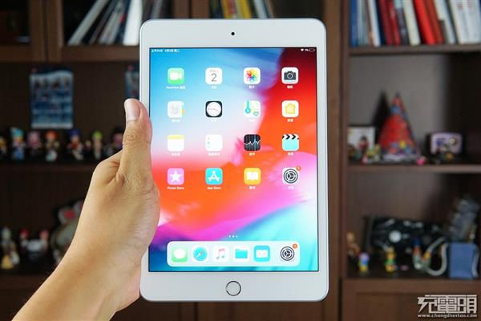
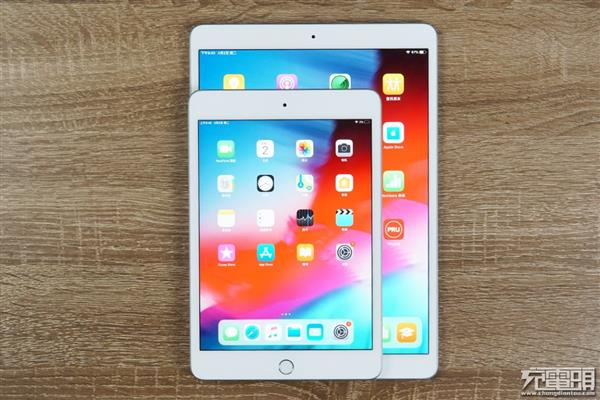
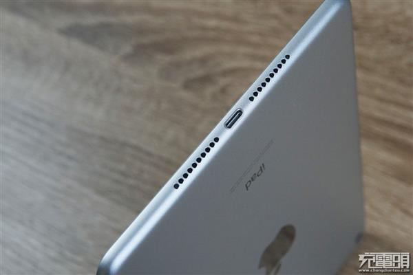
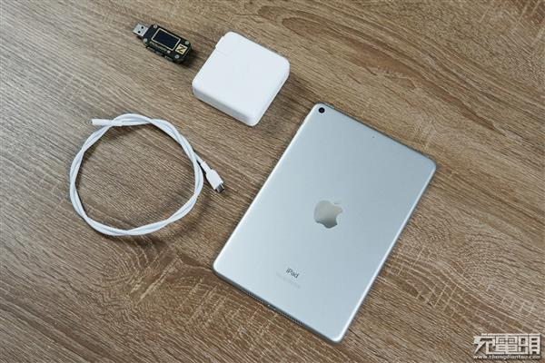
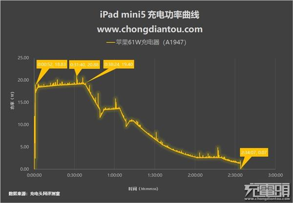
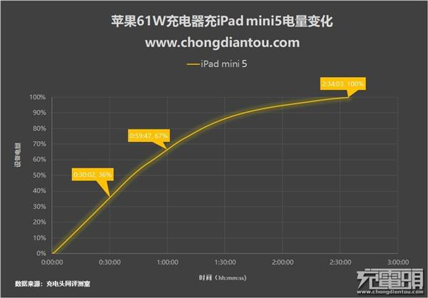
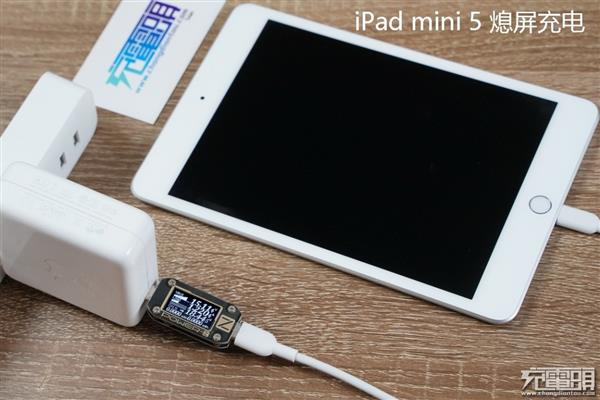
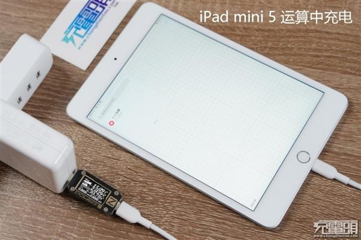

**到底有没有PD快充？iPad mini 5 0%~100%充电测试**

苹果iPad系列包含了iPad Air、iPad Pro、iPad mini，在尺寸上iPad mini屏幕、体积更为小巧，适合随身携带，双手操控更为方便，很适合玩类型于“王者荣耀”这类的MOBA游戏，所以也被网友称之为“苹果游戏机”

近期，苹果悄然在官网上架了新款iPad mini 5，这是mini系列的第五代平板产品，它搭载了强悍的A12处理器芯片，被网友们称之为“最强游戏机”。
配置虽然强悍，但我们非常关心它的充电速度，能否支持当前最热门的USB PD快速充电？
为此我们准备了一台iPad mini 5与苹果61W（A1947）PD充电器进行充电测试，下面我们就一起来看看。

iPad mini 5的外观沿用了苹果传统的iPad造型设计，跑马大边框几乎没有什么变化，在全面屏大行其道的今天，看来很有“年代”感。但对于握持感来说，大边框却又非常友好，不会有误触情况发生。

这一块屏幕尺寸为7.9英寸，分辨率为2048 x 1536，支持 Apple Pencil。

单手拿着玩也毫无压力，就像一台加大版本的手机。

整体大小与iPad Air 3对比，可以看到iPad mini尺寸上的确“迷你”不少，这个尺寸用来玩王者荣耀真的很棒。

**iPad mini 5的电池容量为19.1Wh，充电接口用的是苹果专属的Lightning接口，并没有采用当下流行、兼容性广的USB-C接口，有些遗憾。**

****
废话不多说，接下来我们开始充电跑分环节，0%~100%全程充电测试。

把iPad mini 5用到自动关机，使用苹果61W（A1947）PD充电器给它充电，用ChargerLAB Power-Z KM001进行上位机监测并记录数据，制程表格如下图所示：

从上图中可以看出，**在0%没电关机状态时，它握手了Apple 5V 2.4A充电模式，不到1分钟自动开机后转换成了以USB PD快充进行充电。**

**在充电52秒时，它的功率达到了18.83W；随后功率回落并逐渐上升，在38分钟左右达到了19.4W；紧接着功率逐渐下降，在经过几次较大波动后于2小时34分完成充电，功率落至0.07W。**

**全程充电最功率达20.88W。**
****

电量变化方面，iPad mini 5的电池容量为19.1Wh，**充电半小时电量充至36%，1小时充至67%**，随着电池饱和度越来越高，功率逐步下降，后续电池容量增加的速度也开始放缓，**最终充满耗时2小时34分钟。**

****
熄屏待机情况下，充电功率维持在18-20W之间，此时受到系统限制，因为电池容量较小限制功率为0.7C的充电倍率。

然后切换到正常使用模式，例如亮屏、游戏、例如其他运算，**充电功率会突破30W大关。**此时充电的功率是“电池受电功率” + “机器运行功率”，所以POWER-Z屏幕中可以看到功率瞬间冲了上去。

**总结：**

iPad mini 5 搭载了强悍的A12处理器，性能足够优秀，实打实的“最强游戏机”。但它未采用当下流行、兼容广泛的USB-C接口，而是继续采用Lightning接口，有些遗憾。好在它支持PD快充，但是要注意的是，想要给它快充就必须使用MFi认证的USB-C to Lightning线。

充电测试方面，**iPad mini 5 0%~100% 充电最高功率为20.88W，充电半小时能充进36%电量，充电1小时能充进67%，全程耗时2小时34分钟。**

支持USB PD快充的iPad Pro充电功率最高可达30W+，相对于大尺寸iPad系列，iPad mini 5由于搭载的电池容量较小，所以苹果在充电功率上也做了一定的限制，充**电功率被限制在20W，电池倍率约为0.7C。**

同样情况也发生在iPhone 8身上，虽然iPhone 8支持 PD快充但也因为电池小的原因功率被限制在12W。

**对于充电器选择方面，虽然他的待机输入功率只有18-20W左右，但运行时充电功率会突破30W，所以最好还是选择一款30W的USB PD充电器，以便在正常使用iPad mini 5时获得最佳的充电体验。**

那么同期登场的最新iPad Air 3充电是否支持USB PD快充？功率又会是多少呢？别急，马上就会进行推送。

文章出处：[充电头网](http://www.chongdiantou.com/wp/archives/33313.html)