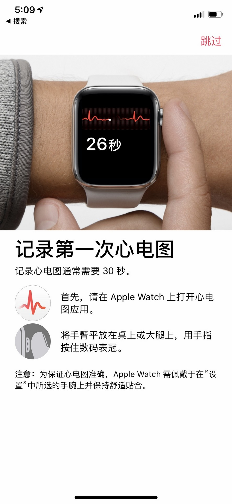
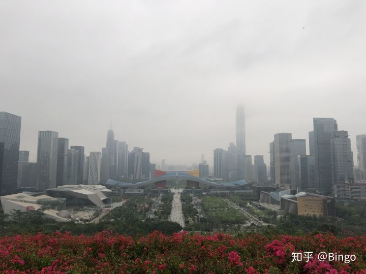
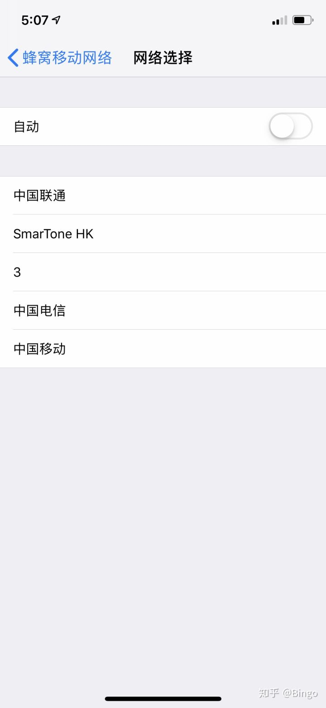
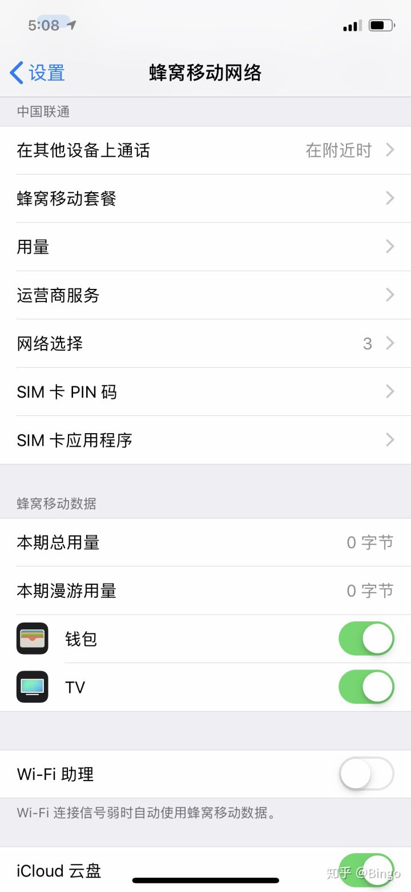

# 2019年最新IOS12.2+WatchOS5.2心电图ecg激活教程

[Bingo](https://www.zhihu.com/people/chen-zheng-bin)

懂些电脑会点法律，热衷音乐玩玩摄影，搞搞户外自驾，兼职采购。

本教程是写给手机已经升级了IOS12.2系统后要新配对手表的朋友看的，心电图在之前版本配对激活可用的，升级后也将继续可用，不需重新开通ECG。由于新版系统加了地区验证，所以激活比之前麻烦一点。

2019年4月，激活ECG前提：

1.  美版/港版apple watch 4
2.  手机升级到IOS12.2，手表升级到Watch OS 5.2
3.  手机能连上一个ECG开通地区的信号基站

以上条件缺一不可。

对于国内来说，最方便激活的地区是深圳。满足条件1，2后，***如果你的卡可以手动选择运营商（非电信卡）的话***，可以前往莲花山邓小平铜像前，（或任意口岸，或任何可搜到香港信号的地方）此处可以搜到不错的香港运营商“3”的信号，不需要开数据漫游，不需要重新配对手表，连上以后打开手机健康app的心电图，根据提示激活即可。激活完后可以切回大陆运营商，就此心电图激活完成，可正常使用。

拖邓爷爷的福，一次成功激活心电图。

此处，空旷，HK信号几乎满格。

就是这个位置，“3”信号很好。

Watch 4代确实进步很大，速度快，屏幕大+新功能，初代一代二代可以无脑升级了。

2019年4月上旬美版watch 4 44mm cellular的几乎全新单表头价格大约2400元，供参考。

另外，网传用香港卡在内地不连香港基站也能激活，亲测用之前AT&T的美国卡连深圳基站（此时运营商信息是AT&T，不过基站还是国内运营商的），没能激活ECG，这个方法估计不可用。

发布于 2019-04-14

[心电图](https://www.zhihu.com/topic/19593594)

[Apple Watch](https://www.zhihu.com/topic/20008783)

