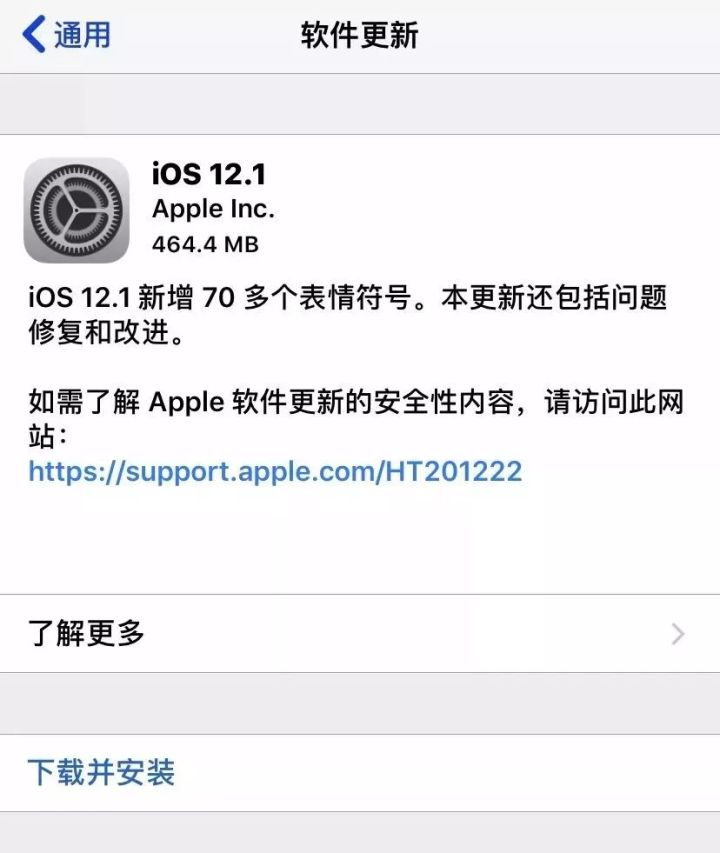
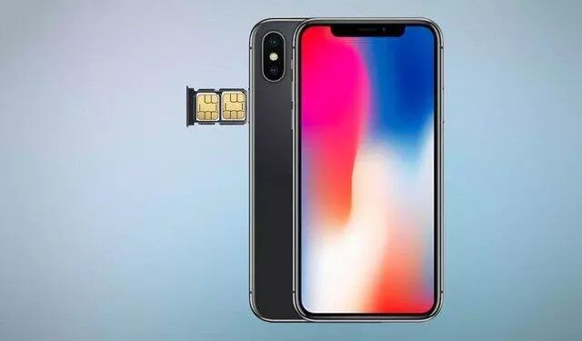
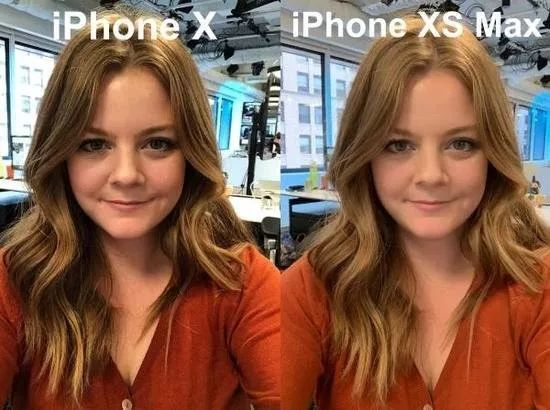
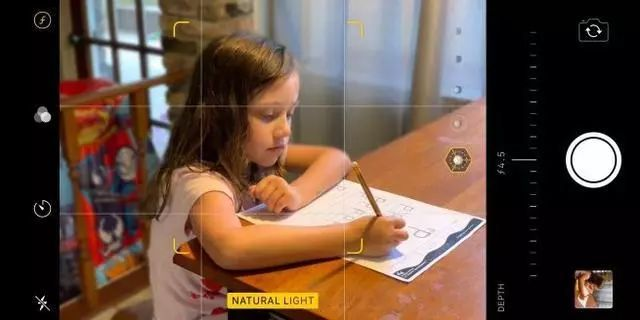
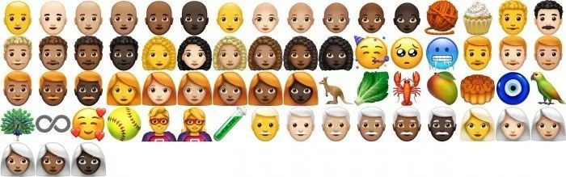

#

# **升级iOS 12.1后，蜂窝网络信号依旧差？**

[科技每日推送](https://www.zhihu.com/org/ke-ji-mei-ri-tui-song)
已认证的官方帐号

#

#

> 这是要让人抛弃苹果的节奏？

10月31日，苹果正式推出了iOS 12.1系统更新，不少网友都在问推不推荐升级系统，那么就先来看看iOS 12.1究竟更新了什么呢？

- ***1****** ***-**双SIM卡**

iOS 12.1版最重要的更新莫过于对eSIM卡的支持。要知道，国际版iPhone Xs、全球版iPhone Xs Max和iPhone XR都是支持双卡双待的，但却只有国行版采用了实体双卡槽的设计，而其他国家和地区所售的版本，都是采用单卡槽+eSIM卡实现的双卡双待。

所以买了非国行版iPhone Xs系列的用户，现在也能上双卡双待了。

- ***2****** ***-**取消“美颜”功能**

之前备受老外吐槽的自动美颜问题，也是此次的iOS 12.1修复对象之一，苹果修改了iOS 12中智能HDR算法，从而保留了更多的面部细节，升级之后的苹果自拍将回到以前不带任何美化模式。

但是这个功能对国内用户影响并不大，因为我们还有各种修图软件。

- ***3****** ***-**信号问题**
iPhone Xs和iPhone Xs Max饱受诟病的信号问题，也在iOS 12.1中也得到了修复，但苹果并未明确指出在哪些方面做了改进。

但是也有不少已经更新iOS 12.1系统的网友反映，更新之后蜂窝网络更差了。

- ***4****** ***-**实时景深控制**

用户可以在拍照的时候进行背景虚化程度调节，并实时预览，但实时景深功能对SOC要求很高，目前只适用于iPhone Xs、iPhone Xs Max和iPhone XR用户，对绝大多数用户来说还是没有什么用。

- ***5****** ***-**表情符号**
iOS 12.1新增了70多个表情符号，包括红发。白发和卷发的新形象，新的光头表情符号，更丰富的笑脸及动物、运动和美食表情符号。

还有一些其他的漏洞修复，这里就不展开了：

> 现可使用面容ID或触控ID更换或还原子女的“屏幕使用时间”密码；
> 解决了两名用户在多台iPhone上登录同一Apple ID时，会导致信息合并在同一主题下的问题；

> 修复了“电话”应用中，无法显示部分语音留言的问题；
> 修复了可能导致“屏幕使用时间”的活动中，不报告特定信息的问题；
> 解决了导致“家人共享”中无法添加或移除家庭成员的问题；
> 针对iPhone Xs、iPhone 8和iPhone 8 Plus,增加了性能管理功能来避免设备意外关机，包括在意外关机出现时，可以选择停用此功能；
> “电池健康”现可告知用户，它无法验证iPhone Xs、iPhone Xs Max和iPhone XR中的电池是否为Apple正品电池；
> 改进了“旁白”在相机、Siri和Safari浏览器中的可靠性；
> 修复了可能导致MDM设备注册针对部分企业级用户，报告“无效秒杀文件”错误的问题。

可以看出，这次更新的iOS 12.1系统主要是针对今年几款苹果新机系统问题上的修复，所以基哥推荐iPhone 7及之后的机型可以收到通知就进行更新，对于iPhone 7之前的机型并没有太大提升，可以选择升或者选择不升。