> _•更新于2018 年 11月 20日11:00PM_：  
> **_1\. 有朋友咨询关于iPad型号、容量等硬件问题，和笔记相关的在下面的回答里基本都涵盖了，屏幕大小、容量、是否4G等看的是实际需求，但型号推荐我真的不在行:( 有关此方面问题，建议询问身边人/科技博主或在实体店体验～_**
> 
> **_2\. 真的是男的！请原谅以“小姐姐”开头的问题我选择忽略！！_**  
> ***
> _•更新于2018 年3月31日9:00PM_：  
> 更新两个常问的问题，【 请下拉至正文阅读】：  
> _**1\. PDF Expert 可以直接复制图片到Goodnotes吗**_？  
> **-可以！可以！可以！（条件请看“原答案”上方的更新）**  
> _**2\. iOS11分屏真的好麻烦。**_  
> -简单介绍一下更新至iOS11 使用Dock栏后的分屏方法。  
> -针对高校课程学习同时需要笔记、ppt和书三种东西，试着提供一些运用iPad的解决思路。
> 
> ***
> _•更新于2017年11月2日1:05PM_：  
> 没想到现在一直还有朋友在评论里问问题，这里我把常见问题po出来让大家参考：  
> _**1\. 用的什么笔？有没有延迟、防误触？**_  
> -苹果自己的Apple pencil ，几乎无延迟，防误触做得很好，真的不用担心。  
> _**2\. iPad型号是什么？64G够了吗？**_  
> -我是老款iPad pro 9.7， 32G wifi+cellular，所以评论里好多担心64G够不够的，如果没有下载或者大量存储视频的需求完全够用了。  
> _**3\. 你用的几个软件是免费的吗？**_  
> -pdf expert和goodnotes不是  
> _**4\. iPad贴膜了吗？贴膜会不会影响写字？**_  
> -至今未贴膜，日常使用不需要贴膜，直到朋友把我的iPad拿去当车载导航以后屏幕上有一个亮丽的划痕。贴膜影不影响写字未知，但是划痕并不影响写字呢。  
> _**5\. iPad配键盘了吗？**_  
> -既有Logitech Create那款带背光的键盘，也有Apple家原装的键盘。**不推荐买任何键盘**，如果要买推荐后者，因为一，iPad不适合拿来用做主力设备打字办公。首先，几乎所有办公软件在iPad上都不很流畅，其次，无法适应非桌面打字，比如放在腿上，因为电脑太小放腿上不稳，使用时非常影响效率，还不如屏幕键盘快。二，Apple家的键盘轻！真的轻！容易拆卸！而且别看它凸起一块，上手反倒觉得美观。Logitech的键盘跟iPad一样重，而且装上iPad卡得不牢容易摔出来，因为我iPad另外一个功能是解决iPhone没电+没流量的问题，所以旅游拍照的时候有这么大一个键盘套在iPad上非常影响手感的……  
> _**6\. 你的GRE书还要吗？**_  
> -在6月学期结束的时候已经卖给本地人了，8本曼哈顿+3本OG卖了$75，感觉赚了一笔。楼主已转考GMAT750，申请到了某学校的金融专业准备去读研并找工作了。  
> _**7\. 买不起iPad，怎么办？**_  
> -**选择你喜欢的方式学习，而不要局限于硬件**。
> 
> ***
> 
> _•更新于2017年2月18日11:49PM：_  
> 啊啦这么多人点赞受宠若惊！能帮助到这么多人心里很感动！
> 
> 1\. 不用纸质笔记，并不是因为纸质笔记不好。没有任何这个意思。  
> 2\. iPad Pro+Pencil的组合除了没有纸笔的摩擦触感（？）以外，和普通纸书写没有区别，但多了纸质笔记无法提供的、我更看中的一些功能，如多样的批注文具、不用再到处背着书和笔记本、以及所有资料归为一处的便携性。这对书写介质没有要求的人来说，是一个很好的Alternative。
> 
> **我想，讨论换用iPad做笔记，是为了更高效学习。**

* * *

离写第一个答案也有一年半的时间了，很高兴得到大家的支持！我坚持使用iPad作为学习工具，并一直持续至今，在中国、英国和美国的大学课堂都有尝试，**果断认为iPad+笔记应用提高了我的笔记效率，并且降低了整理笔记和负重的负担**。

在使用期间我也一直在尝试更有效率的使用方法，今天对于大家提出的一些问题，再次分享操作经验：

**一、可不可以把PDF Expert上的图片复制到Goodnotes中？**

**可以。**前提是老师提供PPT而非pdf。方法如下：

1.  分屏打开pdf Expert和Goodnotes两个软件，打开笔记和老师提前下发的ppt。

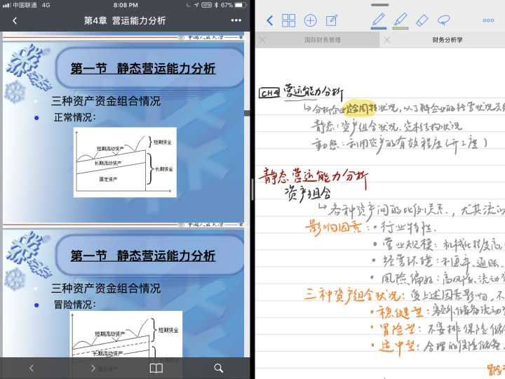

在这个例子中我发现，PPT上“三种资产资金组合情况”有图片解释，我希望能导入图片到笔记中。

2\. **重点：长按PPT上的图片，然后直接拖动到笔记中**

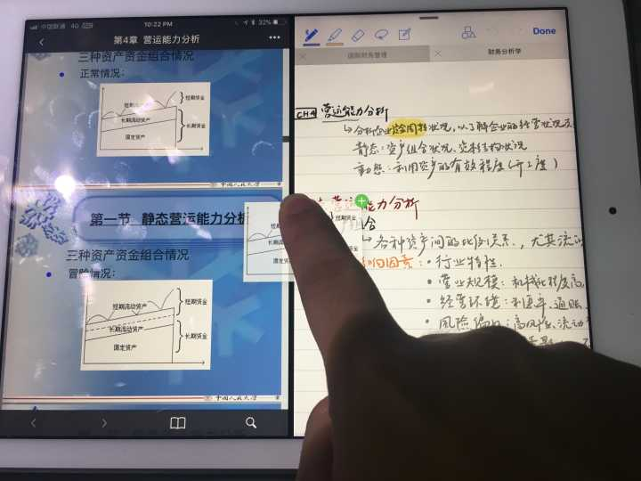

3\. 成功，并可调整图片大小

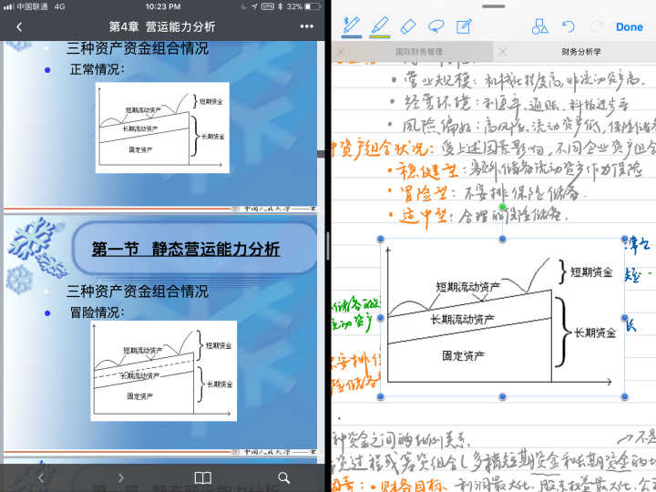

4\. 在图片上做笔记。

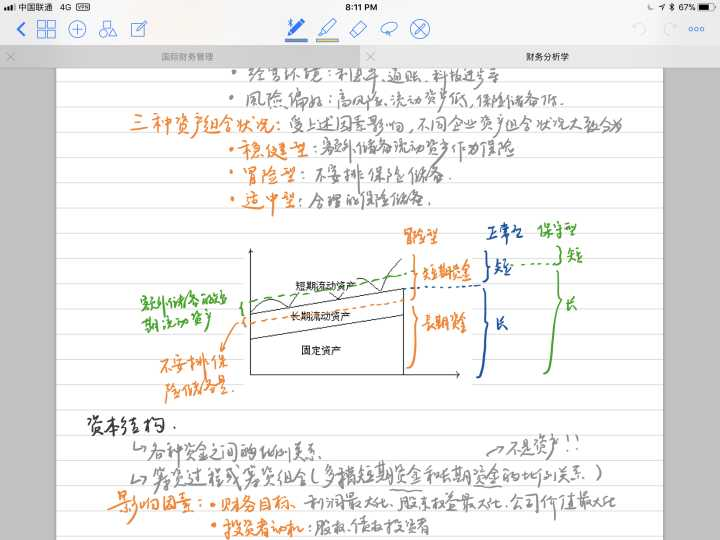

这个功能直到近期我才发现可行。本来，iOS11在发布之日起就支持应用间Drag and Drop，但我第一次尝试之后，出现了一串文件路径。然而不知道什么时候这个bug被修复了。

拖动表格的时候依然有这个问题（如下图），什么时候发邮件给pdf expert问一下怎么解决……

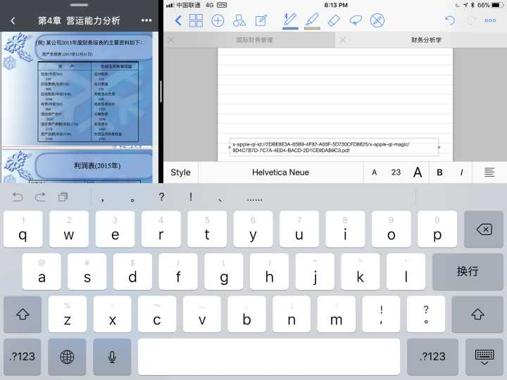

**老师提供的是课程PDF，怎么办？**

PDF文件无法拖动图片到另一个应用。

但你如果觉得拿着iPad照投影仪清晰度太低，不妨试试这两个方法：

【方法1】：**在pdf上笔记**。这么做倒是一了百了，并且，老师为了方便同学打印，在pdf上提供了如图所示的笔记区。这种情况，大家直接在这上面记笔记，不用迷恋笔记本，期末复习的时候再归纳总结，既提高效率又省事儿。

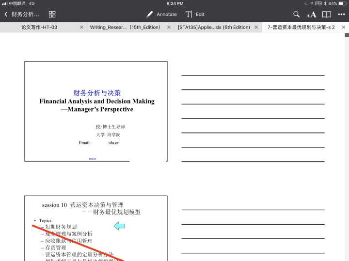

【方法2】：一个四海皆OK的方法：**系统截图**。请不要嫌这个方法慢，我自己不紧不慢**完成整套操作只用了18秒**，比拿着iPad照PPT兴许还快一些。

步骤：

1.  对PDF截图（同时按一下边框上的电源键和home键），截完之后点击右下角准备编辑。

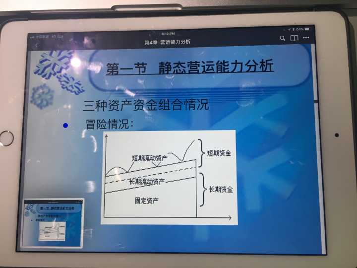

2.裁剪（Crop）截图中你需要的部分，然后点击左上角“完成”（Done）-保存到照片（Save to Photo）

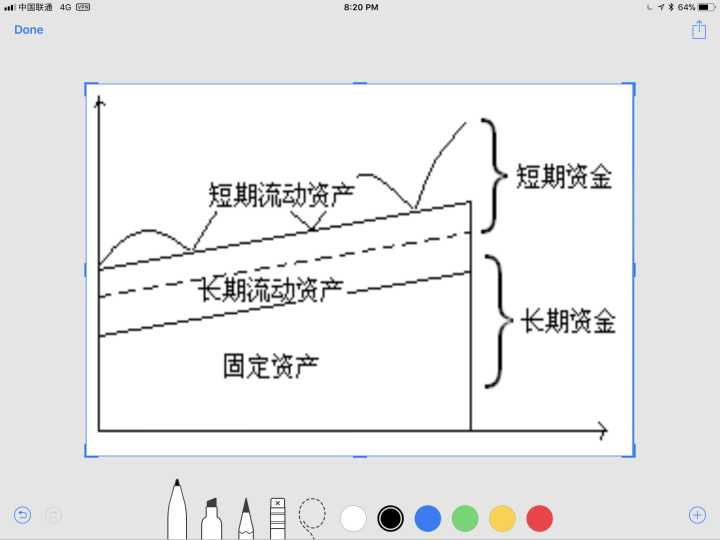

3.在Goodnotes中插入这张图片，点击左上角加号“+”-图片（image）即可。

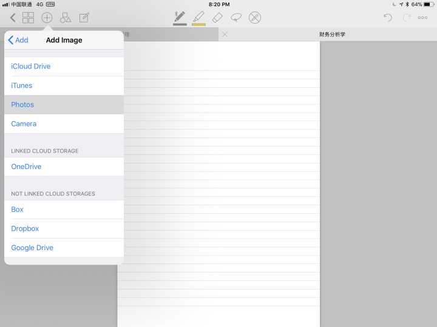

**二、我会带书、PPT和笔记一起复习，太重了。有没有减轻负担的方法？**

国内一个特点是，中文教材的电子版非常少。当然不排除一些火热的教材，有扫描版在网上流传。如果有扫描版，直接分屏阅读，在PPT上做笔记，只需一个iPad就可以。然而在较多的情况下，纸质课本是没法离手的。

目前我们学校主流的笔记方法是，电脑打字，并同时打开PPT查看。

只是，电脑可以完成的这一整套功能，搬到iPad上照样能完成。这里提供一种方法，期待能让你不再背着笨重的电脑，往返于教室寝室图书馆。

1.  将课件提前导入到iPad上或者icloud中。

提示：PDF Expert的云服务支持微软的onedrive。把文件上传到onedrive后，在pdf expert上绑定你的微软onedrive账号，就能使用云服务了。不需要苹果电脑！不需要非得用iCloud！PDF Expert还支持使用WebDav的网盘，但是国内大多主流网盘似乎并不支持。 科普：

[为什么国内各大云存储服务都不支持 WebDAV？​www.zhihu.com](https://www.zhihu.com/question/21511143)

2\. 以1:2的方式分屏浏览ppt和笔记。

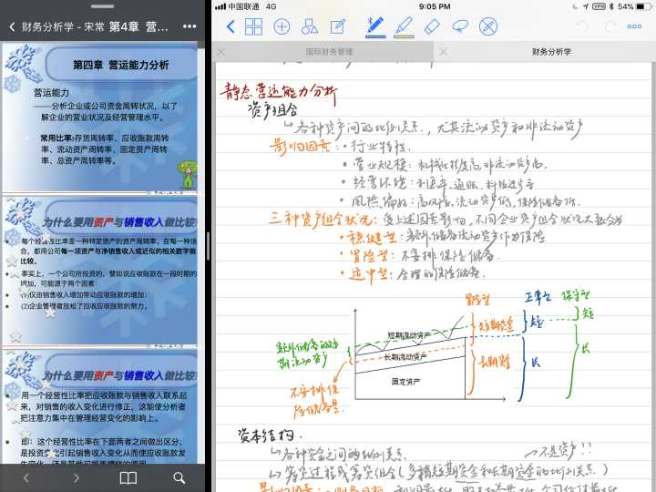

这样的好处是：**既拥有大块笔记区域**，可以在不怎么需要放大和拖移的情况下写字。**又有足够的PPT浏览区域**，其实看PPT不需要很大的屏幕，够用就可以。这样的观看方式，在9.7寸（我目前的设备）屏幕上已有足够高的辨识度，在10.5寸的屏幕观感会正好合适，12.9寸观看体验会更好。

如下图所示，**在几乎无放大的情况下，屏幕笔记行宽与主流横格笔记本的行宽保持一致**（这个笔记本似乎偏窄一点？图示为iPad pro 9.7寸的实物对比）；

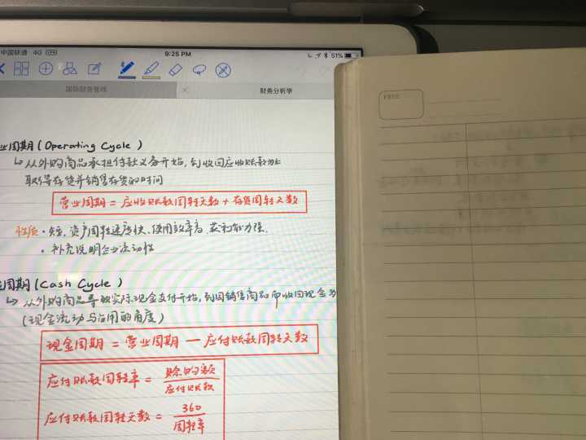

书与iPad如图所示的摆放方式，让你能同时看书、看课件和记笔记，至少在重量上让你减轻很多烦恼。

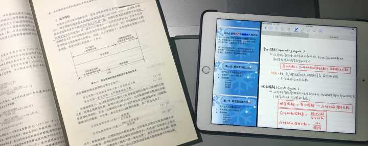

**三、iOS11的Dock栏不太适应，怎么用？**

不少朋友仍然在问iOS11的分屏功能怎么用，这里简单介绍一下。与iOS10不同，iOS11的分屏不再是从右边栏向左滑动选择APP，而是从Dock栏中拖拽APP。这里有一些我个人感觉实用的窍门：

1\. 拖动常用的需要分屏的APP到dock中。比如我常用的就是两个学习软件、邮件、某视频软件和浏览器。这么做在分屏的时候会方便一些。

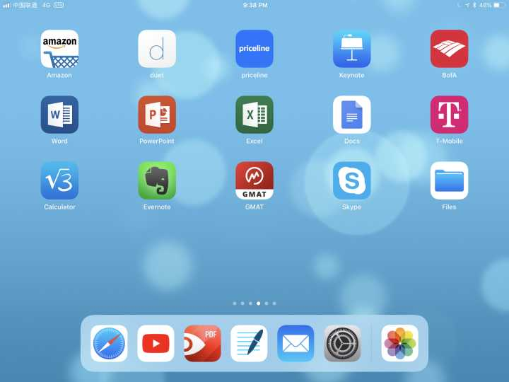

2\. 打开一个app。打开后，上滑呼出Dock，并将另一个需要分屏的app往上拖动到中间区域，形成一个app浮窗。

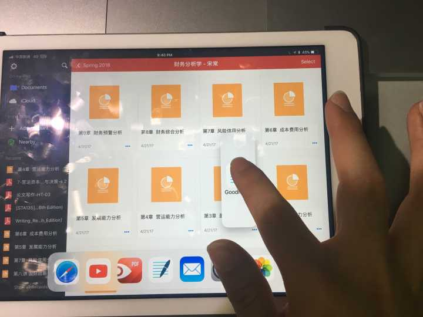

3\. 看到后打开的app浮窗顶部有横线了吗？左手写字的朋友可以 按住顶部横线，将其滑动到左边，然后按住顶部横线向上滑动，即完成分屏（Split）。取消分屏可以将顶部横线向下滑，就重新返回app浮窗状态。app浮窗按住顶部横线继续向右滑动，可以使其隐藏到右侧边栏。需要使用的时候，直接从右侧边栏呼出。

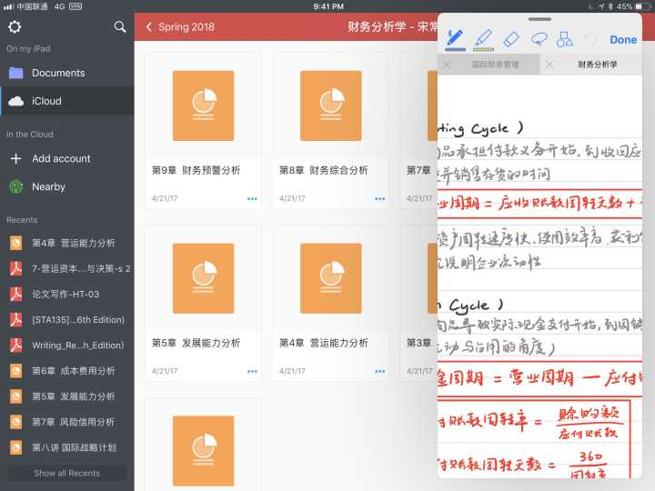

4\. 分屏之后能互换左右两个APP的位置、调整屏幕比例。

**四、你这么搞，学习成绩好吗？**

没错！真的有人私戳这个问题给我！

我的回答是：好呀。

***

原答案：

iPad pro做笔记绝对是一个提高效率和节约纸张的做法，已经完全抛弃手写笔记本。

现大三，从大一开始一直用iPad做笔记。这期间换过两次iPad，试过打字也试过手写。以前使用**iPad mini+印象笔记+打字／拍课堂ppt**组合，现在使用**iPad pro+Goodnotes+PDF Expert+Apple Pencil手写**组合。同时辅助一些神奇好用的app。

一直有纯真的无纸化笔记的想法，实践了两年多，分享一些经验希望能对大家有帮助。

你如果也有这样的想法，一定要**坚持**使用iPad做笔记，试着改变你的笔记习惯，才能在效率上有所提升。

**一、打字：iPad mini+印象笔记**

这个组合用了两年，考虑到当时没有在iPad上写字流畅且设计简单的触控笔，于是选择了便携性强的iPad mini和打字专用的印象笔记。两年下来积累了不少东西，笔记大概如图，条数大约三百多条：

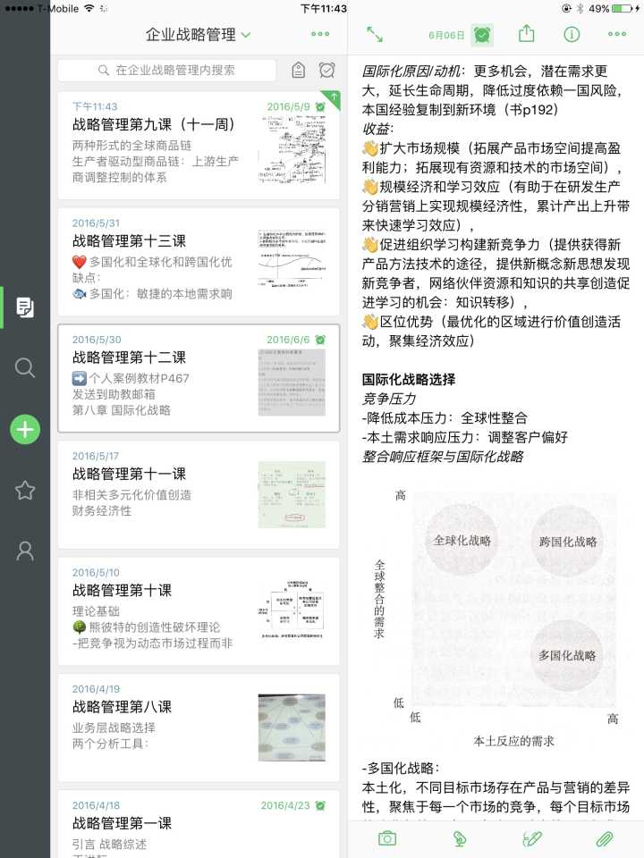

试了很久，觉得上课的时候iPad mini打字最方便的姿势是竖屏+双手握住，因为这个时候左右两边拇指正好能分别控制一半多一点的键盘区域，打字速度没有想象中的慢，而且方便其他功能的控制。

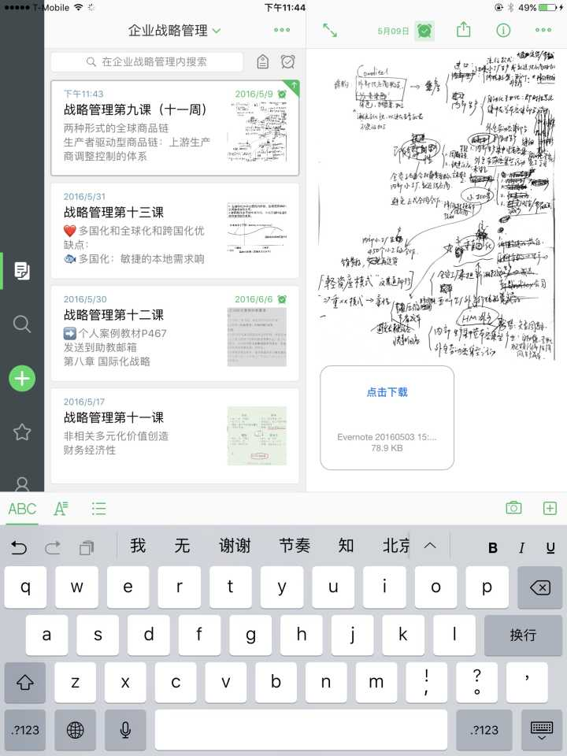

觉得有亮点的地方在于：  
1\. 对于那种转瞬即逝的ppt，右手拇指直接移到相机图标，点开即照，一气呵成。  
2\. 存档每节课发下来的纸质文件十分方便，直接扫描到今天的Evernote笔记中，随时recap，不怕弄丢。  
3\. 我用那个闹铃（Reminder）来提醒我下一次交作业的时间……我一般设在前一天晚上8点  
4\. 录音很方便，可以录下来反复听。  
5\. 有Mac版，能同步到我的电脑上。  
6\. 比起纸质笔记，电子版容易搜索，直接定位老师讲的知识点。

觉得不好的地方在于：  
1\. 对数学公式太不友好，虽然有Sketch功能，但手绘与打字的笔记之间、手绘与其他插入的图片之间感觉十分剥离，没能融合到一起，做不到随心所欲批注。另外在批注图片的时候iPad迷之发烫，因此还从mini2换到了mini4，还是发烫。  
2\. 如果能插入整个ppt或者pdf来批注的话是最好的，但是这样一来云同步那60M可能一天就能用完吧。

**二、手写：Goodnotes+PDF Expert+Apple Pencil**  
在iPad pro 9.7推出以后，加了Apple Pencil和Logitech的某背光键盘保护壳。

听说pencil写字很流畅，果然如此，用第三方笔记软件几乎0延迟，更不用说在自家note上的顺畅表现了。

在选择软件的时候，我恰好是从这篇帖子看到的软件推荐，感谢某答主 带我入坑！

**_笔记：只使用过Goodnotes一款_**，但不愿意再换，主要有以下的好处：

1\. 随时写随时批注，自由插图。图片是我自己在学驾驶知识的时候做的笔记。

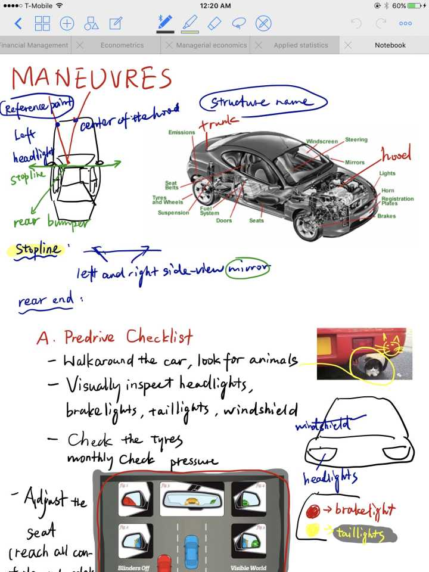

2\. （使用Apple Pencil）写字特别流畅，两个学期从来没有在书写体验上出过毛病。  
3\. 因为流畅的体验，不管是文字类、画图表还是公式类的笔记，比起纸质来说，直接在pad上调颜  
色、荧光笔特别方便，还不怕写错。

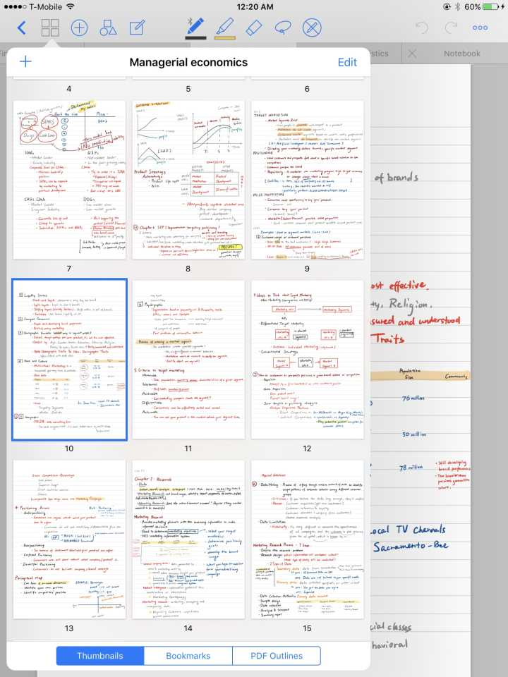

4.1 神奇的功能，一个是套索，你可以任意移动你指定的选区。这非常适合跳跃型的讲师，先给你structure，再细讲其中某一两点。发现某一知识点需要更多的空间，可以把下面写过的全部框起来整体下移。对手写笔记有格式要求的人来说简直不能再赞。

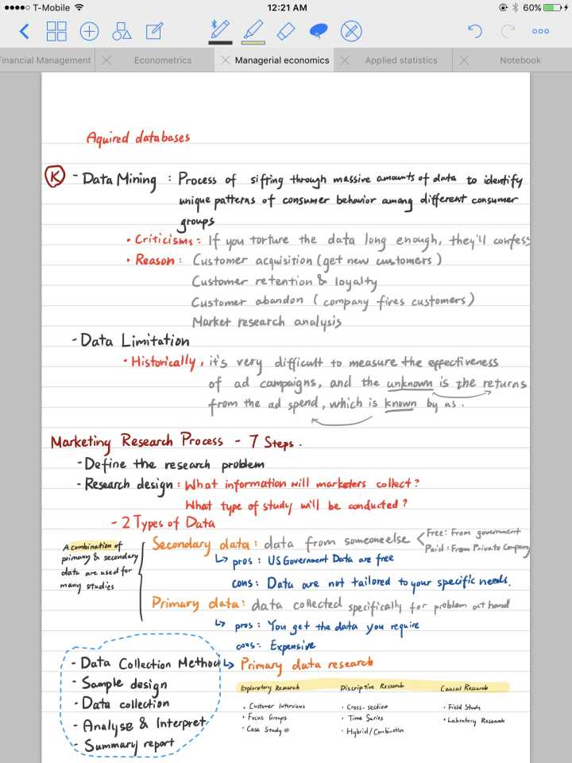

4.2 另一个，可以搜索手写的内容，而且还挺快（英文）。我很在意这个因素，是因为我原以为换手写之后就不能搜索笔记内容，最后发现（字写好一点的话）竟然是可以的。

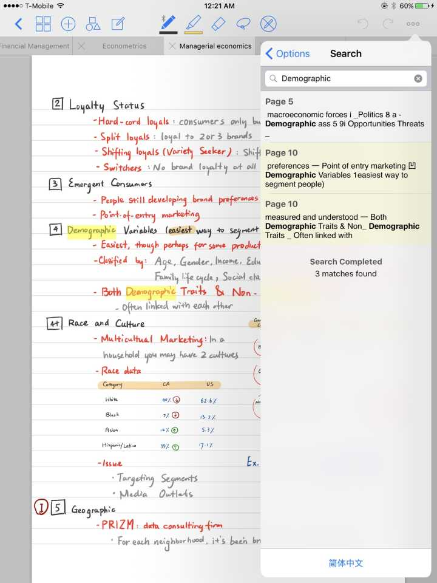

_**PDF阅读：PDF Expert**_，够用了。

上课各种课本阅读是免不了的，还有老师提前发出来的lecture notes要预习，发的阅读材料要看还得随机抽一句来考。

因此这里面装各种书，以及lecture notes+文章。

首先是**导入文件**。PDF Expert支持**iCloud**，用水果电脑的好处就是**直接**把文件**拖**到Finder里面PDF Expert文件夹里以后，iPad上就能立刻显示出来，整个过程以秒计算。前提是电脑上也要有相同软件。

批注什么的都是基本功能，我说一下我一般的使用方法：**分屏批注+笔记**。

上课只带iPad和Apple Pencil，提前下载好讲义，或者到了教室再下载都行 ️，然后PDF Expert和Goodnotes左右分屏，右手写字的朋友把笔记调到右手，讲义调到左手。两边同时开启写字模式，由于Apple pencil自动防误触，可以用手指翻页和移动笔记，用pencil写字，毫无违和感。

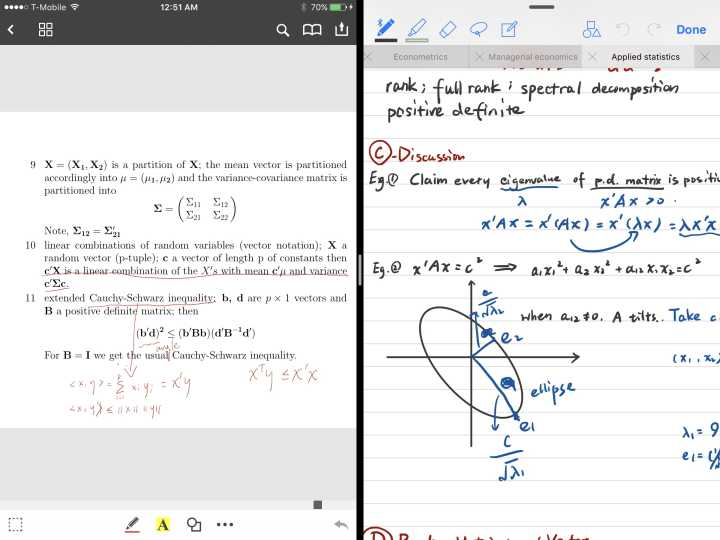

坚持了两个学期之后，再也没有打印ppt，一个pad一支笔基本改变了我以前的笔记习惯。周围几个朋友还被我怂恿上了贼船hh。

接下来有几个我在用的神奇的软件：（常用的都在这一页了）

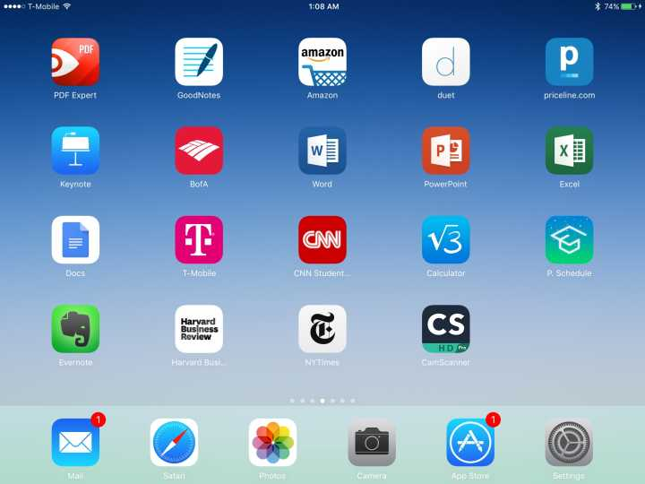

Calculator，图标是蓝色的根号三。

【更新：现在名字叫MyScript Caculator，官方价格是$2.99，有限免的时候。重点是...这家公司也开始推出一款笔记软件叫MyScript Nebo了，主打功能同样是识别手写的公式】

别的不说，手写自动识别然后计算就是个很大的亮点。我最喜欢等式左边未知数直接打问号，等式写出来以后自动补充未知数值。太方便了。

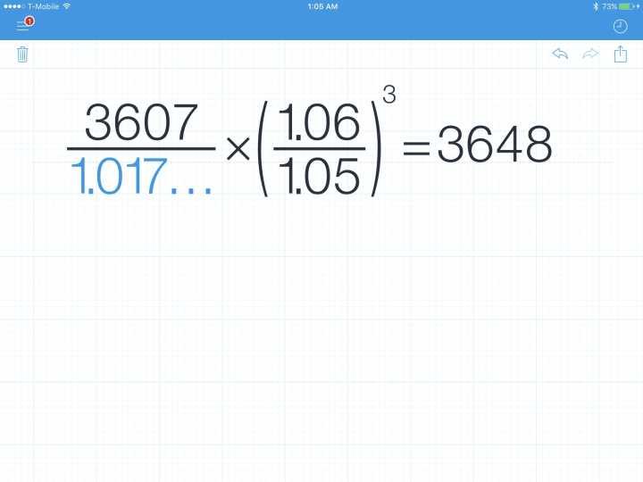

那个Duet很神奇，和电脑接上数据线之后，你的ipad就能直接当作电脑的第二块屏幕。延展出来可以在电脑上多任务处理。虽然我下这个软件纯粹是因为好奇。

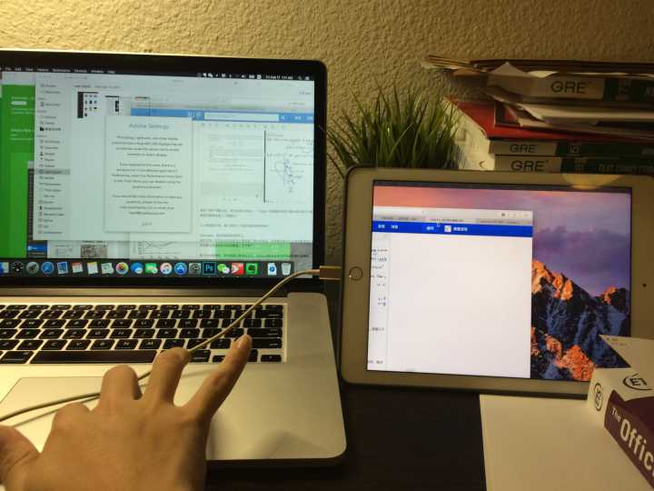

另外这一页其他的什么office啊这些都算是必备常用了。

以上是我的分享。从我个人而言iPad pro记课堂笔记是一个正确的选择。

**是不是应该求点个赞**