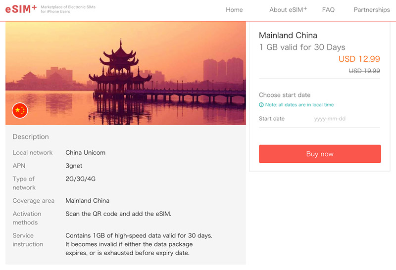
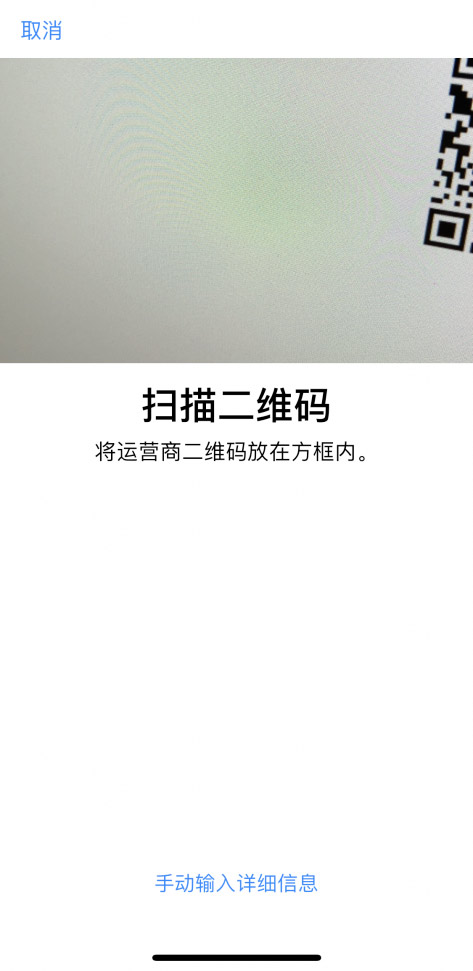
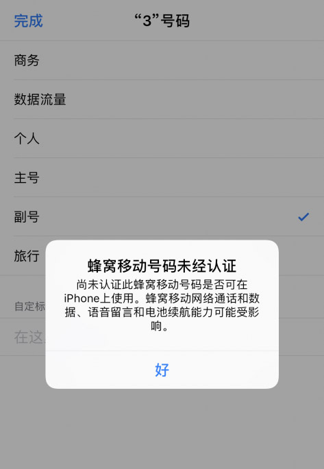

### 【官方服务】手机使用中遇到问题了？

苹果今年发布的iPhone XS（Max）及XR手机，其实全部都是支持双卡双待的，但由于国内电信运营商暂时未全面开展eSIM（关于什么是eSIM，请看我站这篇文章[《eSIM卡是什么？esim卡和sim卡有什么区别？》](http://iphone.poppur.com/JiaoCheng/eSIM-Card.html)）业务，所以苹果只能在国行版的iPhone XS Max和XR上改用了双面SIM卡槽的物理方式来实现一机双号。至于机身更小的国行版iPhone XS和国外所有的iPhone XS及XR手机，它们都是通过eSIM（虚拟SIM卡）技术实现一机双号双卡双待。哪如果你买的正好是国行版的iPhone XS或美版、日版的iPhone XS Max或XR，是不是就没办法实现一机双号呢？当然不是！

其实，除了国行的iPhone XS Max和XR以外，其它所有今年新出的苹果手机都内置了eSIM芯片（国行iPhone XS也有的，但被软件屏蔽了），在升级了iOS12.1后，都已正式开启了eSIM功能的支持，只要你的电信运营商开通了eSIM号下发的功能，就都线上申请eSIM从而使用双卡双待的功能。但在国内，因为联通，电信和移动虽然也开始支持Apple Watch的eSIM服务，但也只限于部分城市并且仅限于苹果手表。因为一旦eSIM业务在手机端全面展开的话，国内三大运营商可能会面临一些未曾想过的技术障碍或麻烦（yong hu liu shi），所以现在谁也不敢轻易说在手机内开启eSIM下发手机号的功能。

可如果我还是想在iPhone XS上用双卡双待，譬如我在日本或美国旅游的时候带回来一台iPhone XS，怎么才能在国内成功开启双卡双待功能使用呢？如果你是指望在现有手机号上，再开一个联通、移动或电信手机号的话，以eSIM的方式目前的确做不到，但如果你只是想多一张手机卡（号）用来做流量卡（不接打电话），又或只是测试一下目前手上这台IPhone XS是不是真能支持eSIM，那是可以的，并且实现方式非常的简单。实现本次iPhone eSIM功能测试的方法，其实是利用了香港3HK（和记黄埔）的境外旅游流量卡的功能，由于香港人经常出国旅游嘛，以前没有eSIM虚拟号卡的时候，人们可能要在当地购买一张电话卡，然后拆SIM换上去，首先那个拆iPhone SIM槽的插针不一定好搞到，再有就是不少人换下来的主卡最后弄丢了还得去补卡很麻烦。而有了eSIM就不用那么麻烦了，只要线上扫描一个二维码，立刻就能激活任何地方的手机号。3HK就为这些经常旅游的用户提供了按月计算的流量包方案，你选了中国大陆，然后购买一个1GB的流量包，它就会给你发送一个二维码，只要你在iPhone XS添加eSIM的位置扫描这个二维码，立刻就能添加成功。

### 国行iPhone XS、美版日版iPhone XS Max及XR开通eSIM双卡的具体步骤

1、首先，电脑浏览器打开[https://esim.plus/](https://esim.plus/)，在下方输入框输入 China，就会列出一个 Mainland China的套餐，点击去

2、从图里看到，这个eSIM的套餐，是跟中国联通合作的，它提供了30天内1GB的上网流量（不能接打电话和收发短信），价格是12.99美金（非常贵），所以只能是尝尝鲜了  

3、在购买后，网页上会显示一个二维码，此时你打开iPhone -> 设置 -> 蜂窝移动网络 -> 加入移动网络（蓝字），它就会出现一个扫描二维码界面，你对着屏幕上的二维码扫描（此时手机必须能联网）

4、输入PIN码（一般是0000）

5、询问你要把这个新号码作为主号还是副号

6、还是在 设置 -> 蜂窝移动网络 -> 蜂窝移动数据，选择新的副卡作为数据流量卡

7、看是否能正常上网

要注意的是，本套餐12.99美金1GB流量，所以大家就体验一下就好！更多iPhone的使用技巧，欢迎**添加我们微信公众号 POPPUR** 接收不定期的文章推送

上一篇：[英特尔再推5G基带，或为2019年5G iPhone测试做准备](http://iphone.poppur.com/iPhoneX/8386.html)  
下一篇：[iPhone XR在日本销量不及预期，苹果为提升人气用尽招数](http://iphone.poppur.com/iPhoneX/8436.html)