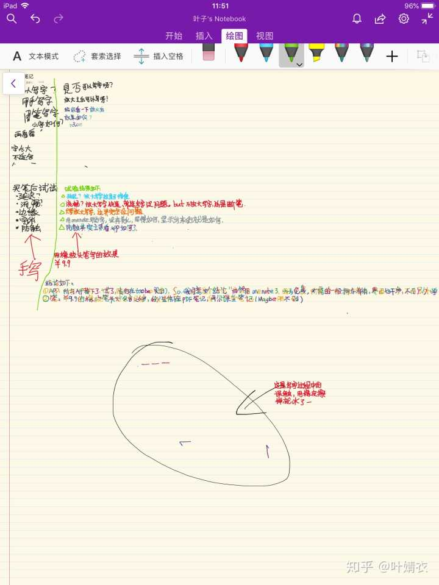
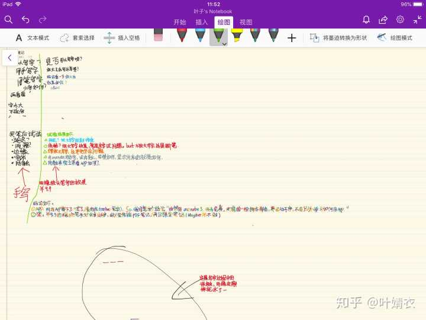

第一，我的是ipad air2，想用Apple pencil那么完美的笔除非换ipad，用了四年了，等下个月的秋季发布会之后再说吧，因此，我不想花一两百去买替代笔体验，万一9月份我存到钱换ipad呢

第二，已经逛了好久知乎看了，比如如何选触控笔？某某某触控笔比较？如何用ipad学习？哪些ipad适合的笔记app？这些app比较？所以，我在taobao两块钱买了notability goidnotes noteplus等，听说以后更新都要登陆别人ID，严重有可能，app崩溃，里面笔记全部消失，我有点强迫症，受不了这个，所以看你的情况吧。我就选的微软的免费app onenotes，我不需要复杂的功能，只要一般的操作满足就可以了。最重要理由是界面简洁，操作简单（我很不喜欢为了这个去特意学习钻研如何用这个app…）

好了 上图看看比较吧

关于写字，真的，只要放大了，基本没问题了，主要我要求不高。有的人喜欢好看的字体，这个我就没法验证了，看有的人发图，字真的真的很好看啊……

不知道你用的是哪一款ipad，我是ipad2018+apple pencil，说实话也是因为qiong，没有选择ipadpro，但是依然强烈推荐苹果笔，它的兼容性和功能是最好的，手写十分舒服，感觉不到延迟，有压感。之前还想买某宝的普通电磁笔，不到200，就是那种完全不挑设备，手机都能写字的，但是肯定没有苹果笔好用。现在国行苹果笔700，我买的东南亚版600就搞定了，除了不好保修没有任何区别，还是建议买苹果自家产品。

至于罗技，没用过不知道，450的价格也便宜不了多少，而且目测压感不行甚至没有，给小孩子画画用的，都不推荐。

为了给你最直观的感受，我用sketchbook给你画两笔，就和真实铅笔没什么区别，倾斜涂色，竖直划线，手劲大一些颜色就深，压感非常优秀✍

那岩都说过ipad上触控笔除了apple pencil其他的都不要买，体验很差。因为apple闭源除了apple pencil别的休想用的很舒服。当然apple pencil很贵但是体验真的无语伦比，经得起时间的考验，想想曾经的ipadmini2,仍然经久不衰，可见苹果自家的商品品质是没的说，当然smartkeyboard就不推荐了，因为它不是苹果研发的。但是如果不写字画画的话，触控笔没什么用，一般触控笔还不如手好用，要是为了增加效率的话经常写字画画，apple pencil是不二之选

除了Apple pencil和官方合作的罗技，其他的不做推荐

如果随便画画玩玩还是某宝几十元一支的电容笔即可 如果要写字记笔记画画强烈推荐apple pencil 之前试过adonit dash 效果和pencil差太远了 手感延迟精准度都差太远了 最后还是选择了pencil 就是贵了一点 但是非常好用哦

我之前也是这样想，去年也买保护套也送的其他笔，但是、、直到我前两个月买了apple的pencil......其他的笔都是垃圾我只想说

等罗技的触控笔吧，也是苹果官方唯一支持的第三方触控笔。

如果你现在就想买的话，那除了Apple pencil其他的买了都会后悔。