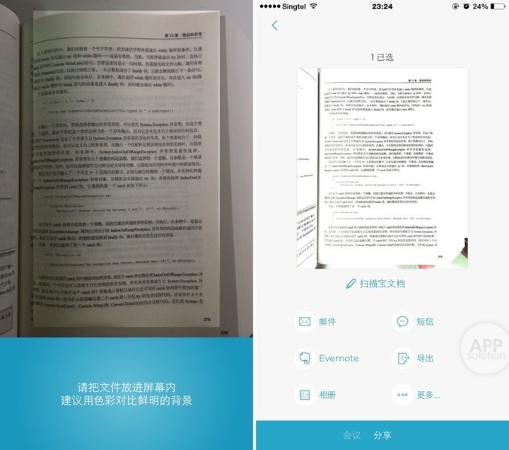
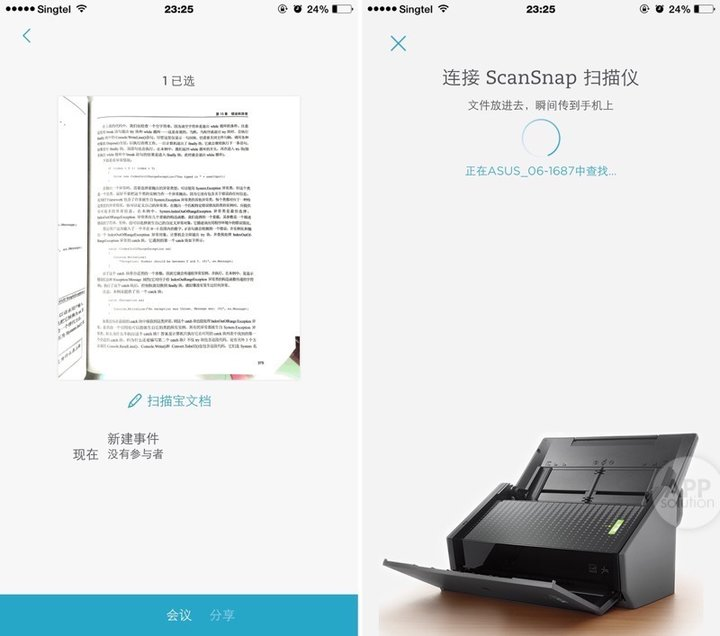
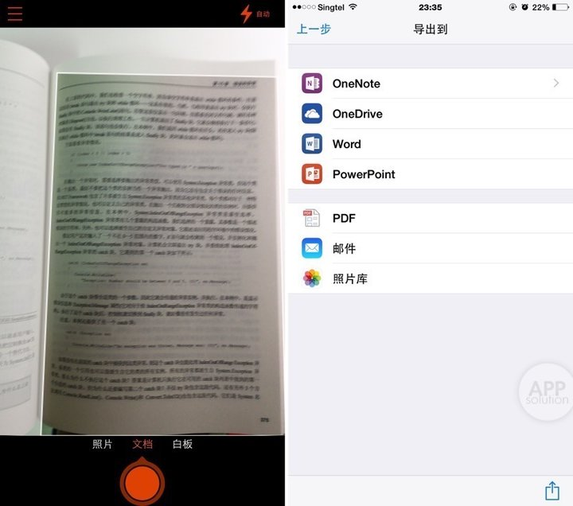
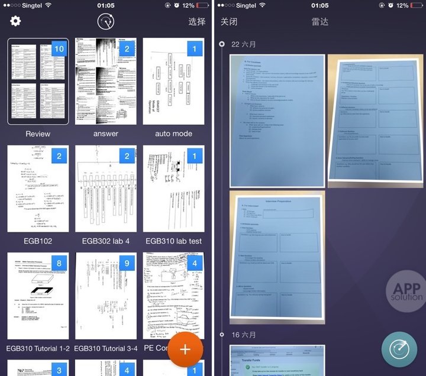
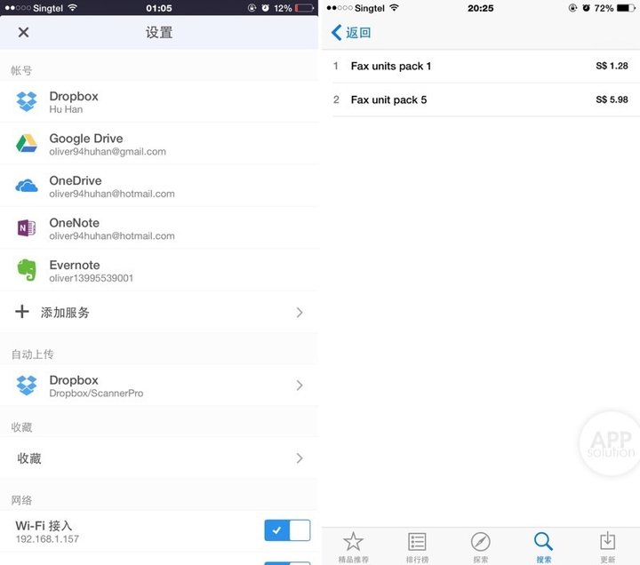
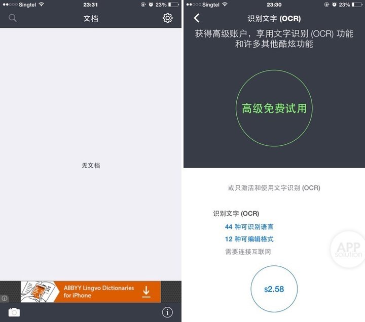
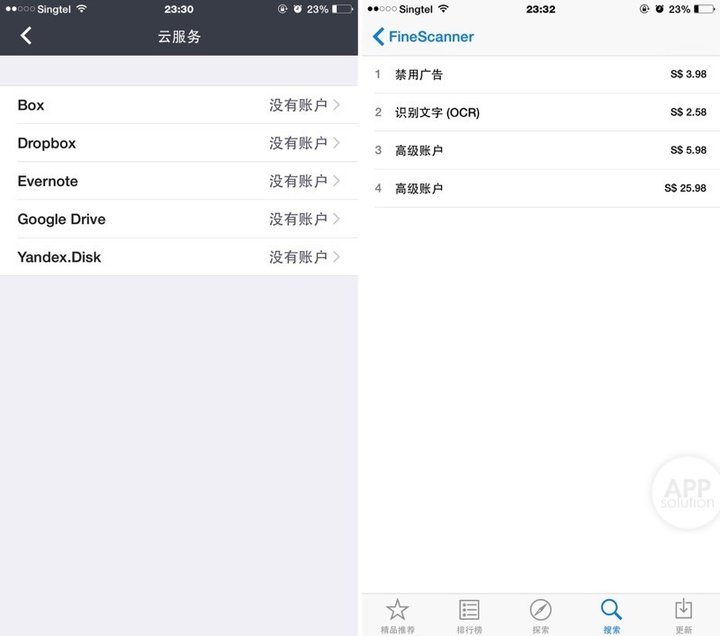

不可否认，智能手机的出现给了我们很多想象空间。以前如果需要拷贝重要资料的人通常都会拿着它到处找复印店；而现在，我们所做的只是掏出手机，拍个照片它便马上生成 PDF 文件自动上传到 Dropbox 等网盘在云端保存，随处访问，永不丢失。

在 iOS 发展初期，扫描应用便是各大软件厂商的一个竞争非常激烈的战场。市面上耳熟能详的 Scanner Pro 6 by Readdle 和 FineScanner 等等都有各自大量的用户支持，可是它们之前都不是完全免费的（某些免费但内购感人）。

今年，有两位重量级选手的加入使扫描应用的角逐达到了白热化的阶段，那就是微软和印象笔记，它们的扫描软件不仅概念新颖而且完全免费！

今天我们就便捷程度、功能完善、网络云储存支持和收费情况四个方面来对比横评刚刚大版本更新的老牌扫描软件 Scanner Pro 6 by Readdle，FineScanner 和两位重量级新选手扫描宝和 Office Lens。

### 扫描宝 #iOS

**便捷程度**

扫描宝无疑是这四个软件中最便捷的一个，官方号称最快的扫描软件果然名不虚传，打开软件直接启动相机开始扫描。由于印象笔记自家的图像识别技术，相机可以自动识别你拍的是文档还是图片，识别后再按该种类情况导出相应地文件格式，如果你已绑定了印象笔记账号，默认自动上传印象笔记，也就是说从打开手机到文件扫描完成到上传全部都是自动的，而且期间软件的反应速度非常快。

**功能完善**

扫描宝支持单页或者多页扫描，但是不支持相片导入，当然可能是官方鼓励用户要扫描的话最好都直接使用扫描宝内置相机，但如果你有用原生相机拍过照的重要资料，扫描宝对此就无能为力了。

扫描宝还配合印象笔记里的会议功能，可扫描后新建事件与参与会议人员快速分享。

不过扫描宝还有一个很特别的功能，相当于一个扫描仪客户端，当然此功能只支持音箱笔记自家的 ScanSnap 扫描仪，当两个设备连接在同一 WiFi 网络下之后，扫描仪扫描后的文件可直接导入扫描宝进行编辑和分享。（当然我绝不会说这个扫描仪就要花 ￥3998 呢。）

**网络云储存支持**

扫描宝只支持自家印象笔记的云储存服务，其他云储存服务只能用 iOS 8 分享扩展功能实现了。

**收费情况**

扫描宝完全免费，当然印象笔记免费账户每个月上传文件上限只有 60 MB，所以仅对轻量使用的用户完全免费，重度使用的用户可能还需要升级到付费的标准账户或者高级账户。

印象笔记•扫描宝适用于 iOS 7.0+ 的 iPhone 和 iPad 设备，iOS 版 27.4 MB，完全免费。

### Office Lens #iOS #Android

**便捷程度**

Office Lens 在便捷程度上仅次于扫描宝，也是一打开软件就是相机页面，但少了图像自动识别技术，Office Lens 在扫描前你首先要选择你扫描的文件类型，扫描后除了导出到 PDF，再就是各种微软办公软件了，除了导出过程因为会连接 OneDrive 服务所以会有明显延迟，比扫描宝稍微慢一点。

**功能完善**

Office Lens 相较于扫描宝好的一点是它支持相片导入扫描，但是同时它却去掉了多页文件扫描功能，每次扫描的每一个页面都会生成一个单独的文件，希望这个是微软的小疏忽而不是故意为之，要不然就太不方便了。

当然 Office Lens 也有它的独家功能，那边是对自家 Word 文档的原生支持，你所扫描的文件可直接转换成可编辑的 Word 文档，相较于市面上昂贵的带 OCR 识别的扫描应用来说，Office Lens 免费且原生的转换支持无疑是它强大竞争力的来源。

**网络云储存支持**

与扫描宝一样，Office Lens 仅支持自家的网络云储存 OneDrive 自动上传，如要使用其它云储存服务也只能使用 iOS 8 分享扩展实现了。

**收费情况**

微软在移动端的收费态度与桌面端完全是天壤之别，Office Lens 不但完全免费也没有上传限制，再加上 OneDrive 免费的 15 GB 空间，Office Lens 可以说是真正意义上的完全免费了。

Office Lens 适用于 iOS 7.0+ 的 iPhone 和 Android 4.0+ 设备，iOS 版 12.2 MB，Android 版 32.14 MB，完全免费。

### Scanner Pro 6 by Readdle #iOS

**便捷程度**

Scanner Pro 6 by Readdle 作为一个老牌扫描软件，在设计思路上还是遵循传统扫描软件的逻辑，一打开软件首先是文档页面，要点击加号才可进行扫描步骤，所以在便捷程度上远不如扫描宝和 Office Lens。

不过最近七月大版本更新后，Scanner Pro 6 by Readdle 加入了雷达扫描功能，及自动扫描相册中所有的文档照片并预扫描好供你挑选，也算是在便捷程度上加了点分。

**功能完善**

在便捷程度上虽有所缺失，但 Scanner Pro 6 by Readdle 却相对是功能最完善的，无论是多页扫描和照片导入，还有可再编辑扫描文档功能，不光是扫描过程中任何一步你都可以反悔至上一步然后修改，就算是扫描完成后你发现扫描得并不满意，你也可以一步一步退回去修改，不用全部重来，非常贴心。

**网络云储存支持**

Scanner Pro 6 by Readdle 支持所有网络云储存服务，你可以自行选择可自动上传的网络云储存服务。

**收费情况**

Scanner Pro 6 by Readdle 目前降价只需 ￥18 元，虽然有内购但是尚未找到内购入口，亲测购买了完整版后即可享受到软件中得全部功能。

Scanner Pro 6 by Readdle 适用于 iOS 7.0+ 的 iPhone 和 iPad 设备，iOS 版 56.6 MB，￥18，有内购。

### FineScanner #iOS

**便捷程度**

FineScanner 的 UI 逻辑与传统扫描软件大同小异。

**功能完善**

FineScanner 是名厂 ABBYY 的作品，这家软件厂商素以高质量图像识别技术闻名，而且其自带的 OCR 图像识别技术官方宣传可识别 44 种语言，12 种可编辑格式，这方面比扫描全能王的功能要强大许多。

**网络云储存支持**

FineScanner 支持所有网络云储存服务。

**收费情况**

ABBYY 向来也以内购凶猛闻名，其中的特色功能均需付费，而且还是在购买了付费的 PRO 版后仍有内购，实为土豪用户的不二之选。

FineScanner 适用于 iOS 7.0+ 的 iPhone 和 iPad 设备，iOS 版 19.3 MB，有免费版，付费版 ￥30，有内购。

### 小结

全而简，一直都是移动 App 好坏的评判标准，但往往鱼与熊掌不可兼得，要想做成真正的全而简的 App 还是很有难度的。

比如扫描宝是真的只能扫描，如果你用手机自带相机拍下来的文档它可是不会为你工作的；

比如 Office Lens 每次只能扫描一张纸，不可以进行多页文档的连续扫描；

比如 Scanner Pro 6 by Readdle 虽然扫描编辑功能全面可是在扫描便捷度上远远落后于前两者；

FineScanner 在功能上虽然与 Scanner Pro 6 by Readdle 不相上下而且还支持 OCR 文字识别技术，可是内购简直可怕，而且是包月会员制，使用成本很大；

所以我建议，如果你是属于喜欢快速扫描的人群，可以使用扫描宝（配上印象笔记效果更加）；如果你是属于喜欢扫描文档后可以直接转换成 Word 编辑的人群，可以使用 Office Lens；如果你对扫描速度没有要求，只希望有尽量多而全的功能满足你，那么 Scanner Pro 6 by Readdle 便是不二之选；至于 FineScanner，土豪用户请随意。