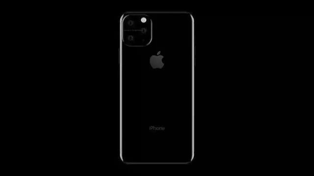

## 软银总裁曝光了新 iPhone 预售时间，iPhone11 更便宜了 | 最前线

原创：  宋文倩  36氪

据外媒爆料，iPhone 11 的三款机型价格分别为：5181 元、6911 元、7603 元。

****文 | ****宋文倩

****头图来源|****  IC photo

下半年手机市场最受关注的机型莫过于新款iPhone发布。

照例来说，苹果新品发布时间通常在9月的一个周二或周三，并在第二个周五预售，不过在发布8月6日，软银总裁宫内谦在周一财报会上的发言暗示，新iPhone将在9月底前10天即9月20日预售，与往年新品上市时间相似。由此推算，今年发布会约在9月10日前后。

据MacDailyNews报道，当宫内谦被问及如何让今年新iPhone符合10月1日生效的日本修订版《电信企业法》时，宫内谦回答：“我真的在考虑这十天应该做些什么。对不起，我不该那么说。没人知道新iPhone什么时候会发布……”

这句话隐含的信息是10月1日之前的10天，即9月20日新iPhone将上市，而软银需就此考虑新iPhone上市的相关事项。

苹果秋季发布会历来被高度关注，2019新款iPhone持续曝光，据天风国际分析师郭明錤预测，今天苹果秋季发布会将推出3款新iPhone，是去年iPhoneXS、XSMax和XR的升级版，具体包括6.5英寸OLED屏型号、5.8英寸OLED屏型号和6.1英寸LCD屏型号。

****据外媒公布的新iPhone XR渲染图，配色高达9种，除了红、粉、黄、蓝等传统配色，还添加了蒂芙尼蓝和薰衣草等配色，提供更多选择性。****

图片来源：TechWeb

在外观和配置方面，新款 iPhone 总体提升并不大，大体延续上一代的定位。机身尺寸和去年类似，保留大尺寸的“刘海”跟屏幕边缘的黑边。内存层面，主要改进的部分是采用了性能更强的A13处理器，以及背部摄像头变成“浴霸”样式（1200万像素主摄+1200万像素变焦副摄的双摄组合，支持2倍的光学变焦）。

另外，新机型可能配备**新型Taptic引擎**，淘汰现有的3D Touch屏幕。

图片来源：盘点科技

似乎是因为新款iPhone的性能提升有限，苹果希望在硬件联动上花心思。据日本新闻博客Macotakara爆料称，新iPhone 11将可以给苹果智能手表Watch和无线耳机AirPods进行无线充电。

另外，相比于苹果上一代 iPhone XS Max 动辄过万的价格，苹果对于新机型的定价策略也产生了变化，在外媒对于新iPhone的价格预测中，三款新机售价都有所下降：

> iPhone 11R的价格为749美元，约5181元人民币。
> iPhone 11的价格为999美元，约6911元人民币；
> iPhone 11 Max的价格为1099美元，约7603人民币；

当然，新iPhone的具体售价只有等发布会后才能确认。外界预测的降价调整源于激烈的市场竞争，毕竟目前智能手机全球出货量下滑，iPhone的销路不容乐观，来自Counterpoint的报告显示，iPhone在今年二季度的出货量约为3640 万台，同比降幅约为11.9%，苹果是所有上榜品牌中跌幅最大的一个。

此外今年新iPhone不支持5G网络，而华为首款5G商用手机Mate 20 X 5G版已确定将于8月16日正式开始发售，综合官方商城及电商平台数据，预约量已近30万。据苹果最新的Q3财报，iPhone这一支柱型收入对苹果营收的贡献首次低于50%，秋季发布会在即，难有超预期的新品，苹果在手机市场的战事艰难。

在看