# 如何在 iPad 上使用无线蓝牙鼠标，iPhone 也支持吗？

2019-06-21  11762  来源：爱思助手

随着 iPadOS 预览版的发布，苹果首次在 iPad 中加入了鼠标支持。那么 iPad 用户如何在自己的设备上使用无线鼠标？外媒 9to5Mac 发布了相关的信息，我们不妨一起来了解一下。

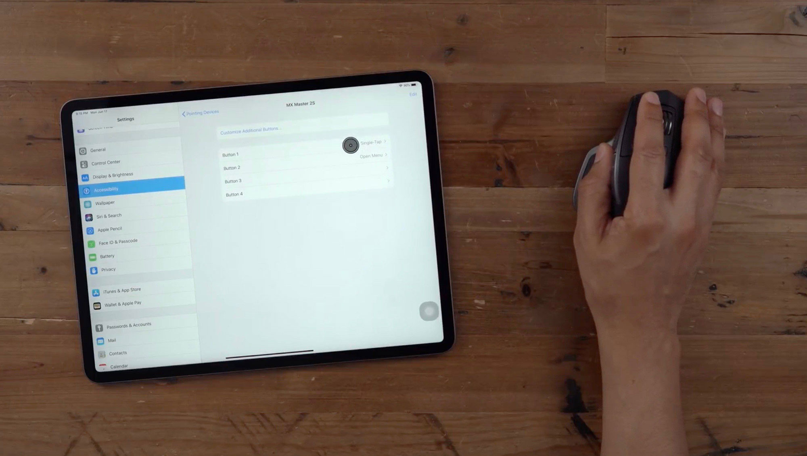

该网站测试的鼠标是来自于罗技的 MX Master 2S 无线鼠，配对流程如下：

1.打开设置 App，选择辅助功能；
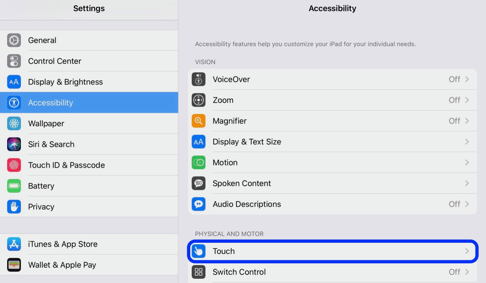

2.点击“触控”设置中的“辅助触控”开关，并将其开启；
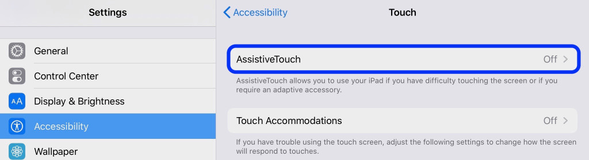

3.点击下面的“定点设备”；

4.需要确保蓝牙鼠标的电源开关已经开启，然后点击“蓝牙设备...”;
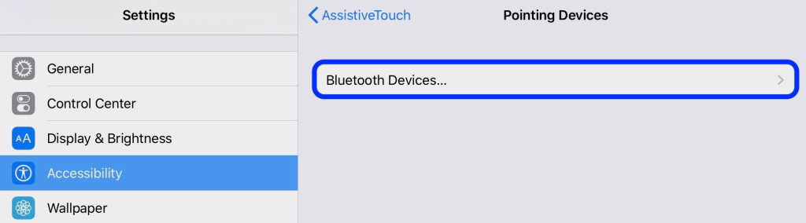

5.在设备列表中选择蓝牙鼠标；
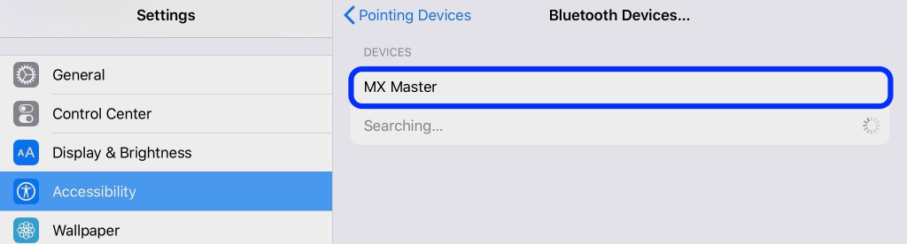
6.确认配对完成；

7.开启辅助触控并配对鼠标后，iPad 上就会出现类似“小白点”的圆形鼠标指针；
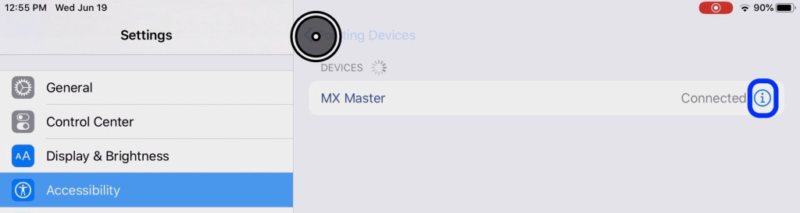
8.继续点击右侧的“i”信息按钮进行定制设置；
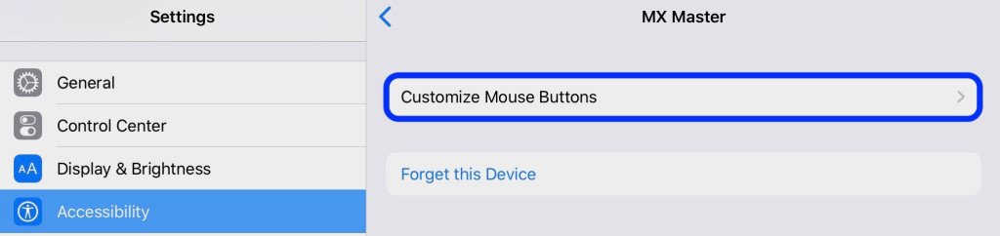

9.选择自定义鼠标按钮；
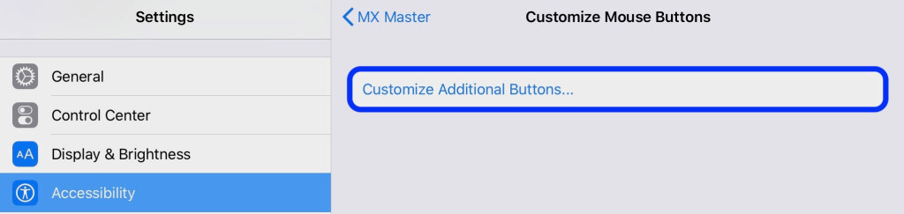
10.你可以点击想要定制的鼠标按键，从列表中选择想要赋予其的快捷操作功能，比如侧键进入后台、中键锁屏等。
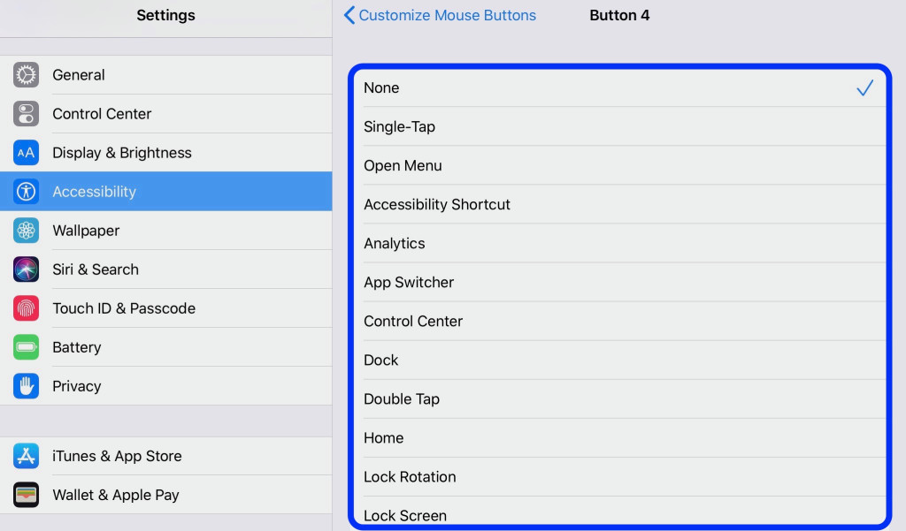

11.iPadOS 支持多个快捷键按钮，可根据你的鼠标具体情况定制；
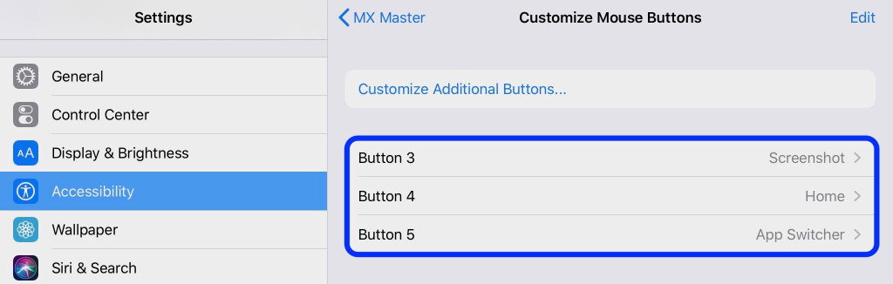

12.在辅助触控设置页的下面还可以调整鼠标指针移动速度，也可以选择是否始终显示菜单。
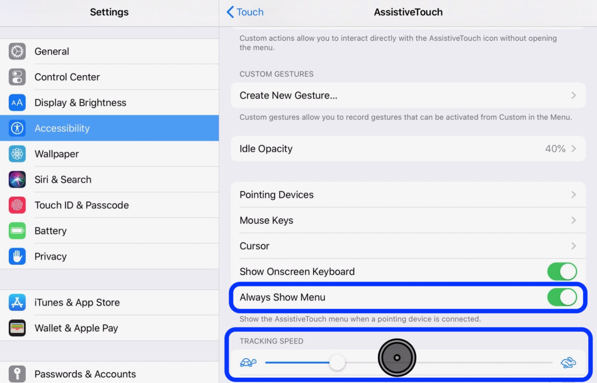

值得注意的是，从 iOS 13 开始，你也可以在 iPhone 上使用鼠标，这应该比较适合冬天较寒冷的地区的用户，比如戴手套时无法触控。
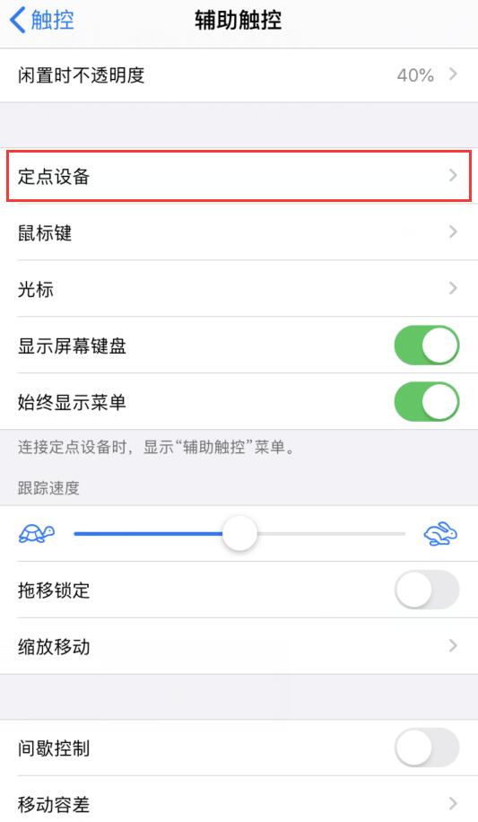