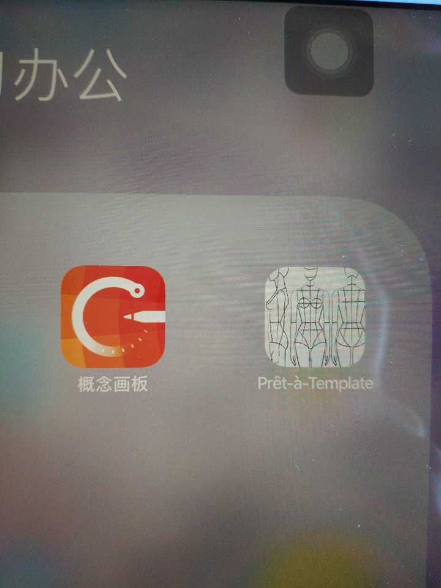
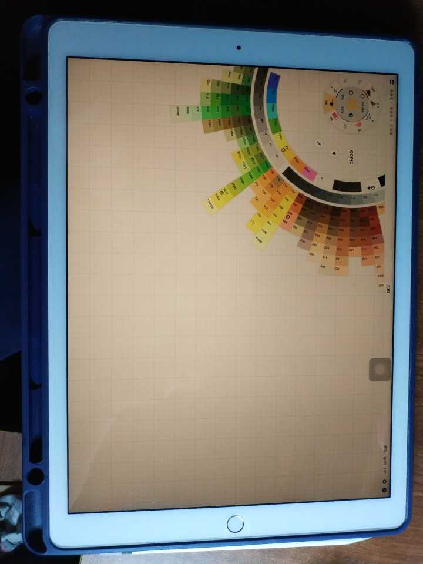
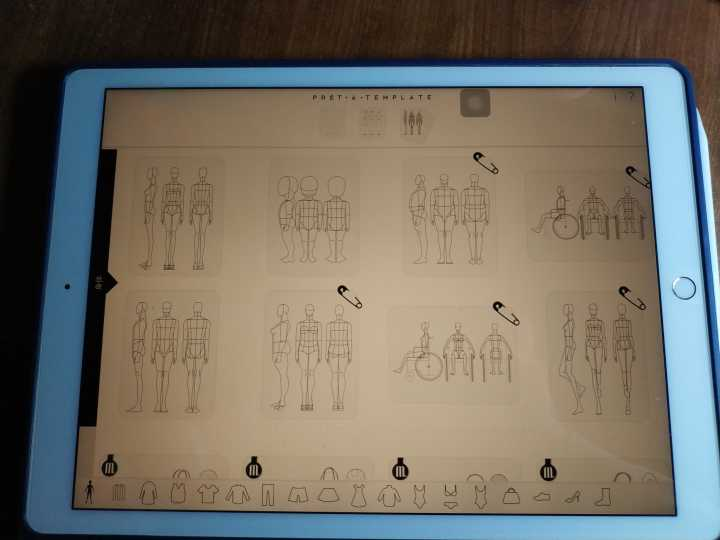
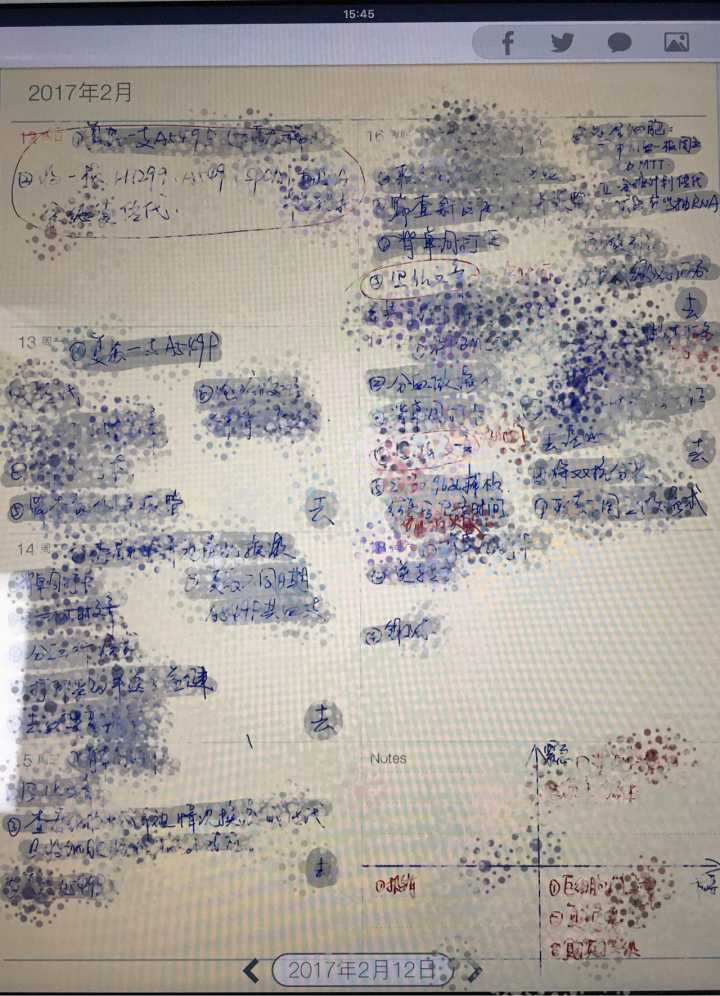
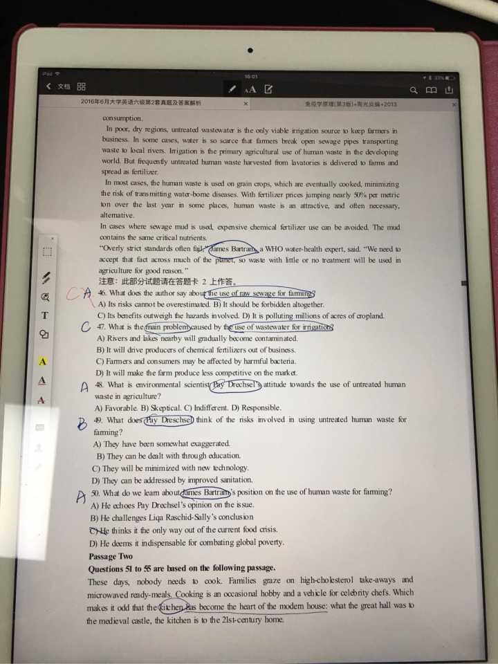
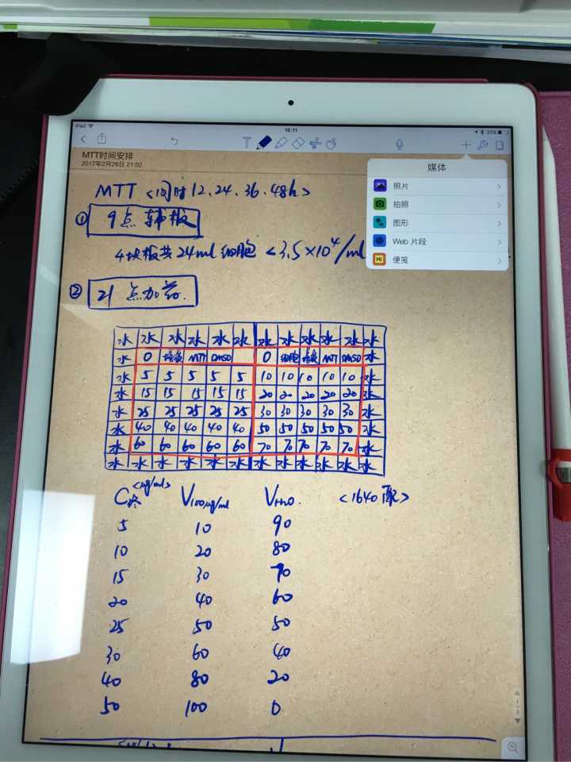
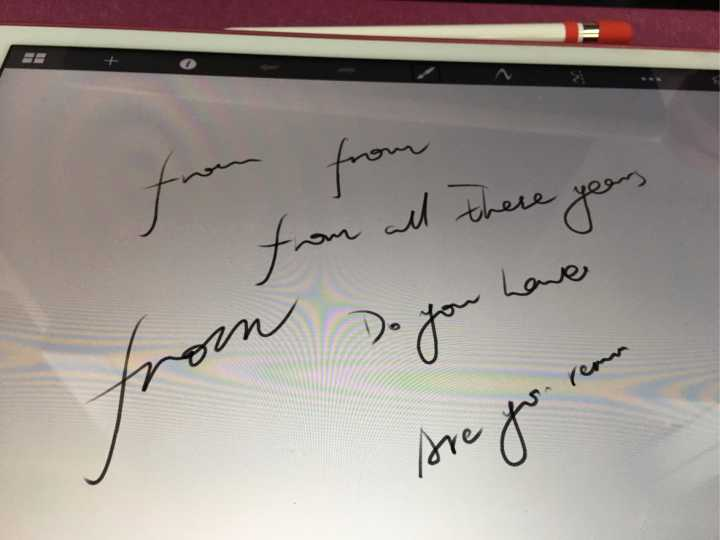

[toc]
### 2018.5.30 第三次更新

**notability**更新后能搜索手写内容了，好腻害！

其实哈，我试过很多手写笔记的app，之前没有推荐的goodnotes，marginnote我都试过，最后根据自己的喜好选择了notability, upad。其实功能大同小异。

现在，我觉得其他很有必要的办公用app的话，推荐scanner pro和printer pro，很棒。
***
### 更新一下
概念画板，画画无压力，面板也很友好，新手也能轻松入门，功能很强大。除了apple pencil ，貌似还针对其他厂家的触控笔做了优化。不免费，一次性买断。

还发现一个设计类的app，pret－a–template，设计服装鞋子包包头套围巾等等都很好用，还有很多素材、模板和笔可以用，但免费用户能够使用的内容较少。付费内容采用订阅制，无法买断。

***
－－－－－以下为原回答－－－－－－－

就说一下我经常用的吧。

**1\. upad3(笔记)  **
支持多种稿纸，背景色，自定义笔色笔径，四种不同的笔(笔锋和透明度不同)，不过透明度不能自由设定，但做做笔记也够用。当然也支持键盘打字啦，但有具有加密及分档功能。我用的最多的笔记软件，尤其是有日历，周历，月历方便日程记录。还可以设置左右利手。可以裁剪后移动复制粘贴。至于云备份，国外的软件备份都比较麻烦，没用过。不可以插入录音。  

  
**2\. pdf expert(阅读并笔记)**  
我一般会买pdf的书或下的文献直接用这个app去看，直接手划标记辅助键盘笔记对于标记多于笔记的文档来说也很够用。对于一些要做较多笔记的文档，pencil能发挥更大的用处，不但可以做到自定义笔锋，笔径，还可以自定义透明度，画框和圈，删除线下划线荧光笔都好用的不得了。注释也能用，只是我不怎么用。印章、手写签名我不常用。更新后还加了审阅模式，不怎么用，不好发表意见，试过后更新答案。现在做什么卷子题目，我都转成pdf用这个app来做，也省了打印的耗材消耗更为环保，更重要的是，省了点儿时间。云备份的话，可以用icloud，但icloud免费空间小，我是不会常用的，如果需要备份，我一般会通过各种方法(其他应用打开，通过邮件发送等)转存至网盘。  

  
**3\. notablity（笔记）  **
这个app呢，上手非常简单，两种笔(又分别分为两种笔锋，共四种)，自定义笔色笔径，透明度不可自定义，带自定义裁剪并拷贝or剪切的功能，纸张的话，15种背景，可设置带不带笔记线。可加密可分档。可插入录音，但感觉操作麻烦，没怎么用过。可以插入照片图形便签及web片段。我一般用来打草稿，褐色的背景看起来挺好用的。。。  

  
**4\. sketchbookx**
绘画的话，对于我只是业余爱好，所以不太专业。 还没怎么用过，但觉得笔锋还挺好看的，写出来的字的确像纸上手写。不过拍出来细节都看不到了。（字丑、画图技术差请忽视。，。）  

  
procreate，这个算是专业画手用的吧，我也装了，但一开始不会设置画笔导致画不出来东西就废用了。。但看自带的效果图，感觉很厉害。。。呆萌艺术科幻唯美CG都能hold住。。。此生，我应该用不上。。。  

5\. 结语：国内的app我还是有关注的，但目前我不知道哪些好用。有道云笔记，wps这一类几乎不支持，体验很糟糕，但他们云备份我还是比较喜欢的。