# 让iPad物尽其用：大学生的APP清单分享

原创 JRS玩机社 2020-07-27 21:29:34

> 买前生产力，买后爱奇艺，真的是这样吗？

说到iPad，相信不少人都会想到这句话。iPad最开始的定位就是“娱乐平板”，它有着强大的性能，方便好用的iOS系统，以及大尺寸的高清屏幕，确实是看视频、玩游戏的优选。不过，随着Apple Pencil、iPad OS、妙控键盘的引入，iPad也有了“生产力”的影子，最新的iPad Pro 2020甚至打出了这样的Slogan：

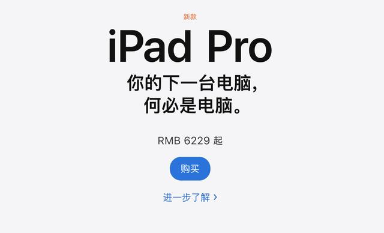

当然就目前的情况来看，“替代电脑”还不现实，但毋庸置疑的是，iPad是大学生学习生活的绝佳伴侣，越来越多的人选择购买iPad用于学习。

去年考研上岸之后，我发了这样一篇文章：

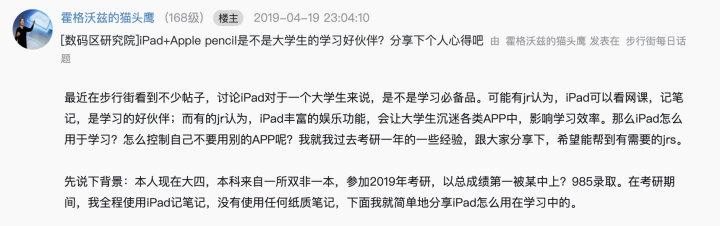

在这1年间，我的iPad也历经数次更换，从Pro 9.7换到Pro 10.5，再换到现在的Pro 11。流水的iPad，铁打的APP，今天就给大家带来我的APP清单。

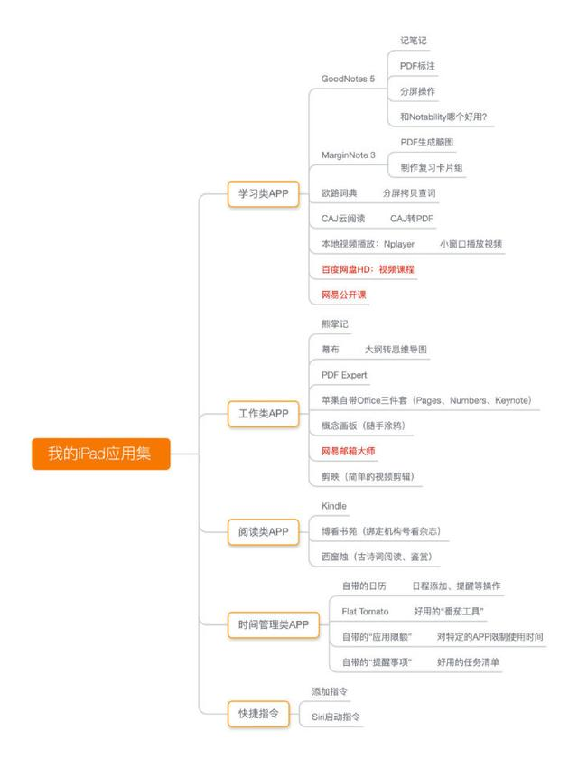

*红色字体的APP不在本文中讲解

# 一、学习类APP

工欲善其事，必先利其器。要想让你手里的iPad和Apple Pencil在学习上发挥作用，势必需要一系列笔记APP的支持。

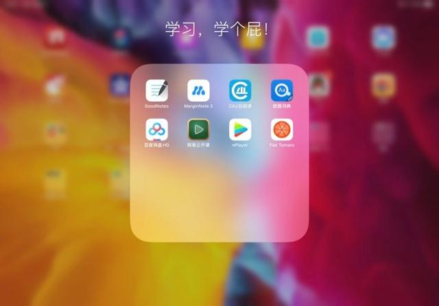

# 1、日常笔记/标注：GoodNotes 5

俗话说：好记性不如烂笔头。对于习惯了手写记笔记的我来说，iPad的最重要用途就是记笔记。电子笔记比起传统纸笔，优势明显：首先，可以使用各种颜色的字体，可以用荧光笔标记重点，“一笔搞定”，而不需要像传统纸笔那样带一堆彩色笔；其次，一个APP可以装很多很多的笔记，携带更方便；再次就是笔记APP的搜索功能，可以快速找到你要的功能；最后，电子笔记可以很方便地插入图表，比如PPT，书本插图，类似于剪报。

在多款记笔记的APP中，我用得最顺手的就是Notability和GoodNotes 5，这两款APP可以说各有千秋，不过我最终还是选择了GoodNotes 5。目前我主要用它来进行日常的笔记和短论文的阅读。

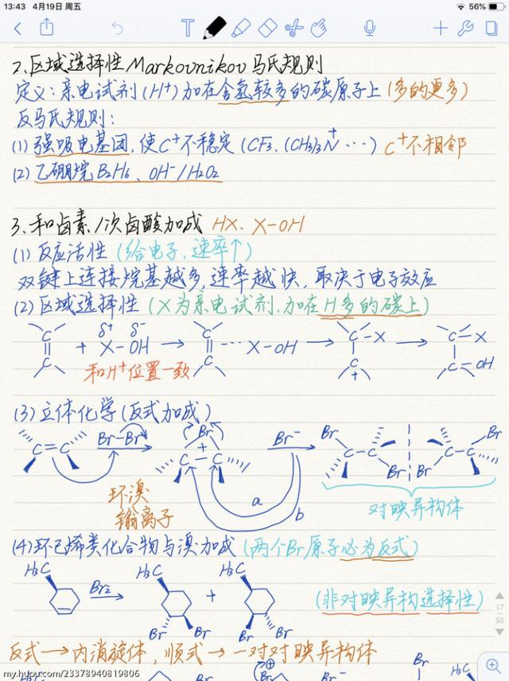

▲Notability

这款APP最大的优点就是“无限笔记页面”，哗啦哗啦一直往下拉，非常适合做草稿纸，此外还可以在笔记内直接嵌入录音；不过模板形式较为单一，写字感觉不如GoodNote 5，而且不支持Office文档（doc，ppt等）的标注。

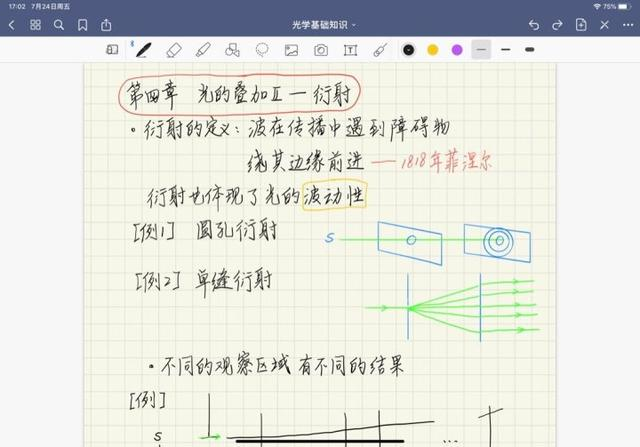

▲GoodNotes 5笔记界面

我之所以最终选择了GoodNotes 5，最主要还是因为良好的写字手感。这款APP是我认为的写字感觉最接近于真实纸笔的APP。

看PDF的课本和论文，我开始用的是PDF Expert，后来还是觉得GoodNotes 5更好用：

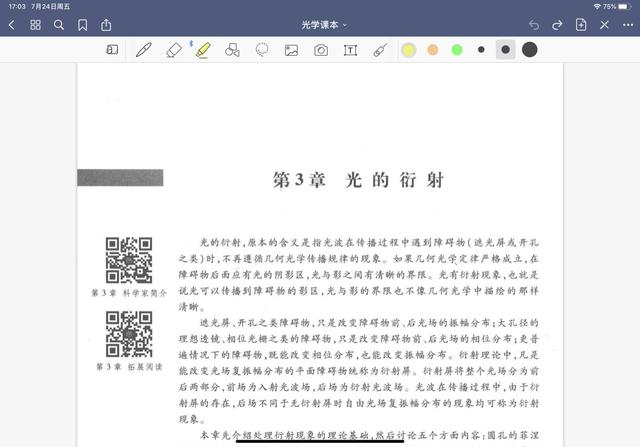

▲GoodNotes 5 标注PDF

在分屏功能上，GoodNotes 5的操作比Notability要稍微繁琐一些：点击Dock栏的APP图标，在后台界面右上角点击“+”号，即可开启另一个GoodNotes窗口，拖动Dock栏的图标即可分屏：

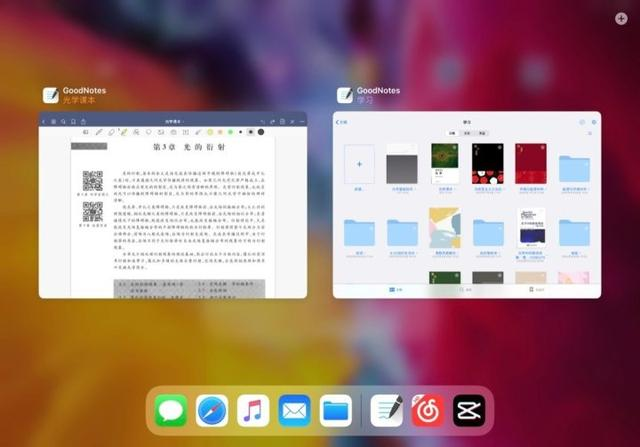

▲GoodNotes 5分屏

一边看书一边记笔记问题也不大，不过如果经常分屏的话，12.9寸比较适合，11寸我觉得有一点小了。

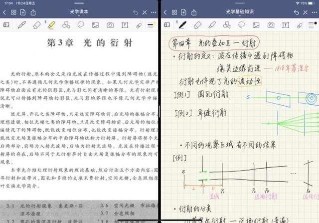

▲GoodNotes 5分屏示例

这样分屏的好处在于，如果看到书里有什么图表要摘录到笔记，直接用APP自带的“套索”工具，复制粘贴就行。

GoodNotes 5除了自带的众多模板之外，还可以去淘宝或者网上找一些第三方模板的资源，可以拿来做手帐。

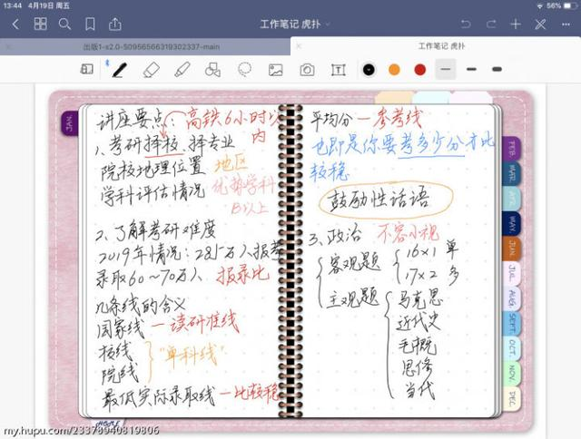

▲GoodNotes 5第三方模板

最后就是笔记的同步问题，GoodNotes 5支持iCloud同步笔记，可以同步到其它平台，以后更换了iPad也不用担心笔记丢失。

个人觉得，GoodNotes 5是一款非常不错的“全能”笔记APP，适合日常笔记，课件、论文标注。如果经常使用，建议购买正版，以免重要笔记丢失。

# 2、“拆解”书本：MarginNote 3

在研究生阶段的学习中，我也接触了MarginNote 3，这可以说是一款全新的笔记APP，可以将书本整理成思维导图，更方便记忆。目前我主要拿它阅读专业课本和综述类论文。

我个人看书，无论是课本、论文，都喜欢做笔记，加深印象；但对于篇幅较长的书来说，记笔记虽然可以加深印象，但是却不能将知识“分门别类”，复习起来缺乏条理性。MarginNote 3可以将PDF制作成思维导图，将书本“拆解”，有利于整理和归类。

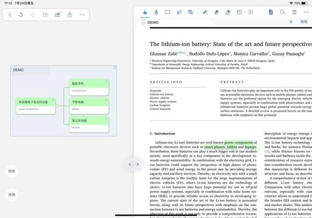

▲MarginNote 3界面

它的界面分成左右两侧，我们直接用“手”这个工具，拖动你想建立思维导图的文字，即可生成思维导图，拖动即可修改思维导图的分支关系。

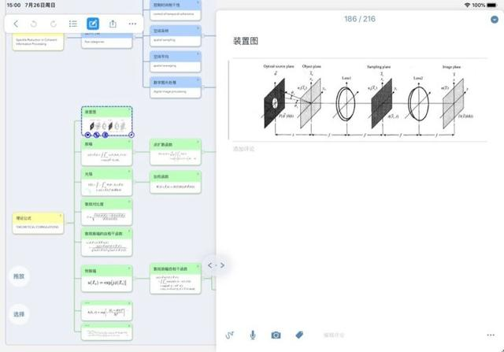

▲思维导图每一个节点都可以自定义，可以用不同颜色表示，还可以用Apple pencil标注，有问题还可以点击“研究”按钮，目前可以链接到维基百科、知乎和谷歌翻译。

在同一个笔记本下，还可以放置多个思维导图，你可以把同一类型的多篇文章全部归类到一个笔记本中，来自不同文档的摘录也可以放到同一个图中，还可以用虚线建立联系。

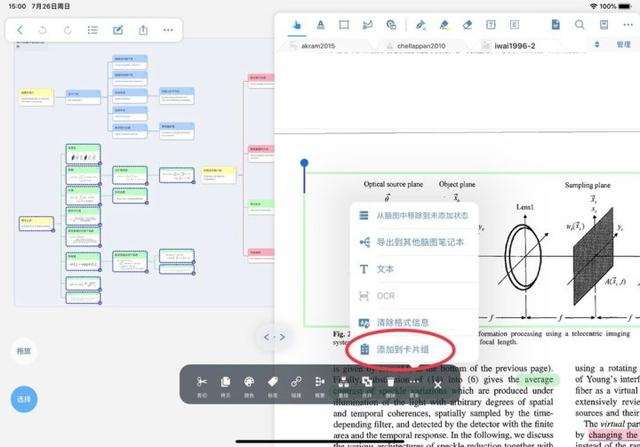

▲多选某一些节点，加入卡片组

加入卡片组有什么作用呢？这就不得不提及MarginNote 3的另外一大功能——复习。

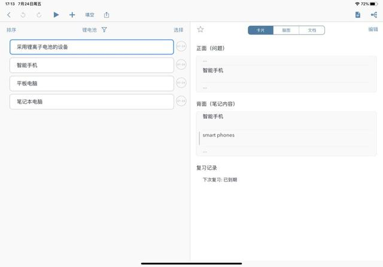

▲复习模式

每一个思维导图节点，都是一张卡片，卡片的正面就是标题，背面就是你框选的内容，点击“▶︎”符号，即可进入这样一个页面：

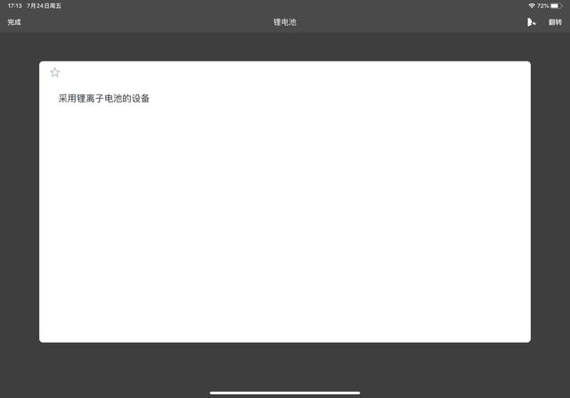

▲考试模式

点击一下，答案就出来了。我们可以利用这个功能，对一些需要反复记忆的东西，比如公式、单词等，进行多次自测，加深记忆。

思维导图现在已经成了大家广泛使用的一个工具，用来对知识进行归类整理，让复习更具有条理性。而MarginNote 3，则免去了我们手动制作思维导图的麻烦，复习模式更是可以对一些知识点实现“重点突破”，确实是学习的又一大“神器”。

# 3、转换工具人：CAJ云阅读

中国知网出品的APP，可以阅读知网CAJ格式的论文。其实它不仅可以阅读，还可以一键转换为PDF：

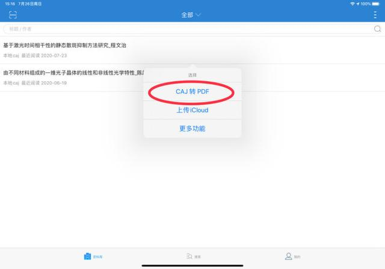

▲一键转换功能

直接右滑就可以看到菜单。转化为PDF之后，GoodNotes 5、MarginNote3就能轮番上阵了，不需要用那个功能很少、界面简陋的云阅读来看论文。

所以我把它当“工具人”用。

# 4、查词神器：欧路词典

适配iPadOS的词典类APP非常多，也有一些经典的词典可以选择：

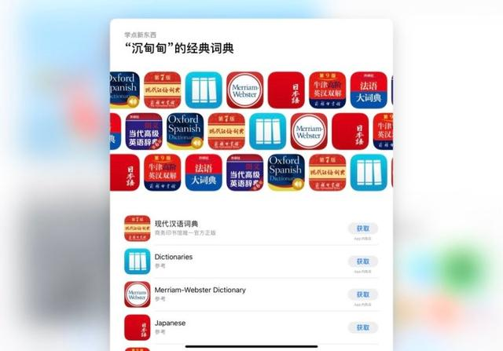

▲AppStore的词典合辑

但是今天推荐的APP是欧路词典，一款非常适合论文阅读的词典APP。在不少学科英文文献的阅读中，常常会涉及不少专业词汇，GoodNotes也好，MarginNote也罢，都能调用系统自带的词典，不过在专业词汇面前，自带词典经常抓瞎。而欧路词典完美地解决了我的需求，面对化学类专业词汇游刃有余。

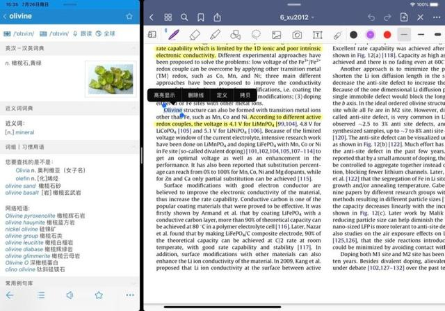

▲分屏查词

我太喜欢这个功能了，只需要点击“拷贝”，欧路词典就能自动帮你查词，不需要手动复制粘贴。实测专业词汇的查词准确率非常高，在线的“联网翻译”也相当精准。

此外，欧路词典还可以背单词、甚至全文翻译。这些功能因为我平时没怎么用不太熟，就不在这里讲了，有需要的可以自己去了解一下。

# 5、本地视频播放器：nplayer

nplayer是一款非常好用的本地视频播放器，支持“画中画”模式。

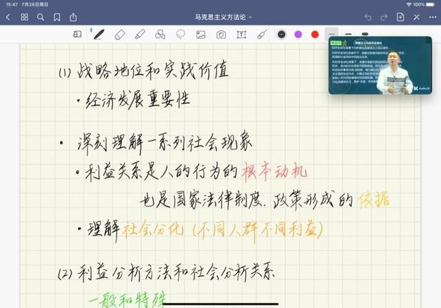

考研的时候相信大家都有很多网课，包括英语、政治和数学，这个APP能让你一边听课一边记笔记，不需要其它的设备。

* * *

# 二、工作类APP

说到“生产力”，大家肯定会想到Office，在iPad平台上也有不少不错的办公软件，配合一把蓝牙键盘，可以临时地充当笔记本用，写一些东西。

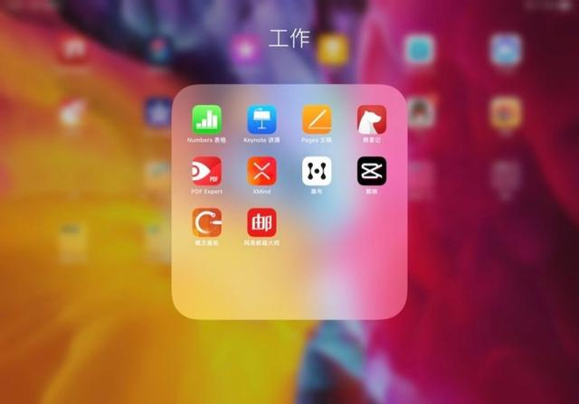

# 1、支持markdown格式的编辑器：熊掌记

对我们这种需要“一文多发”的作者来说，markdown堪称“神器”。它可以通过转换小工具，直接转化为微信公众号所需要的排版样式；还可以搭配图床使用，无论在哪发布都不会丢图，省去了手动上传图片的烦恼；部分网站（比如知乎）更是支持一键导入.md格式的文档，非常便捷。

iPad端的markdown编辑器，我选择了熊掌记，它界面美观，操作方便，也支持markdown语法。

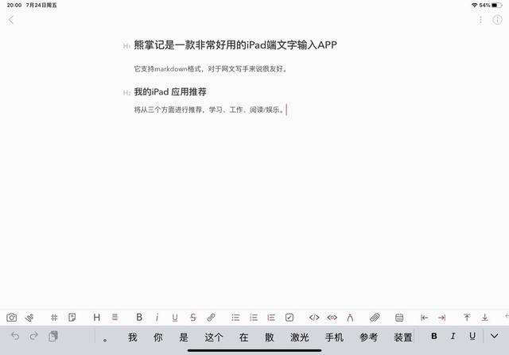

▲熊掌记界面

还可以插入待办事项、代码块、图片，甚至可以用Apple Pencil手写，再插入到笔记当中。有了熊掌记，在iPad上写公众号的推文，也不是什么难事儿。

# 2、思维导图：幕布

iPadOS平台也有不少好用的思维导图APP，幕布就是其中一个。和传统的思维导图（比如XMind）不同，它默认就是大纲模式，用起来更顺手（当然XMind也可以切换为大纲模式，只不过它默认是脑图模式）。

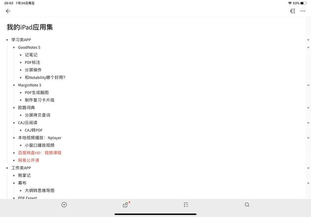

▲幕布界面

前面提到了，思维导图可以让思路更加有条理化，不仅在学习中如此，在工作中也是这样，这篇文章也是先用幕布APP做好思维导图，再组织内容的。

# 3、自带的Office三件套

iPad自带了苹果的Office三件套——Pages、Numbers和Keynote。Office套件也是我经常要使用的，更是“生产力”的标配。

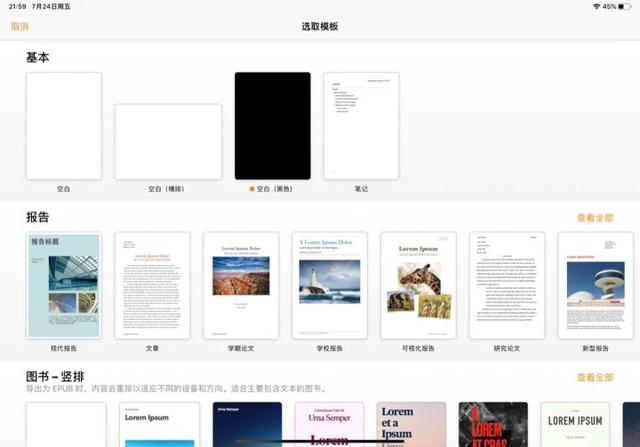

▲Pages自带模板

Pages常见的功能都有，自带的模板也不少，支持保存为doc格式。

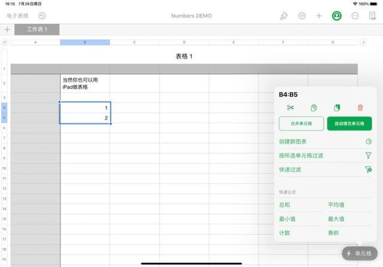

▲Numbers

Numbers自带了一些简单的公式，如果只是制作一些简单的表格，Numbers完全可以胜任。

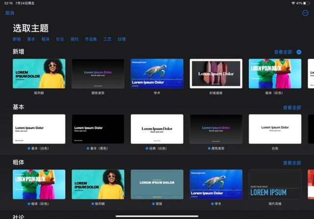

▲Keynote自带模板

iPadOS上还有很多优秀的Office软件，比如Microsoft Office、WPS Office等，具体用哪一款还是取决于个人的使用习惯，实测用Pages写的文档，在Office上打开会有一些字体兼容的问题，所以如果你搭配Windows电脑使用，或者需要在Windows电脑上做汇报，我觉得还是用Microsoft Office或者WPS更好。

# 4、PDF签名神器：PDF Expert

最开始我用这款APP来标注PDF，后来实在不习惯它的写字触感，换成了GoodNotes 5。不过我依旧保留了这款APP，主要是它的签名功能太好用了。

疫情期间，很多时候需要远程办公，PDF Expert可以设置好签名，直接插入到PDF文档中：

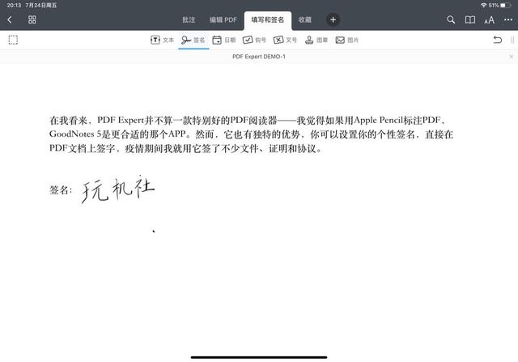

▲PDF Expert签名功能

除了签名之外，它还可以保存图章，或者填写✅和❎，堪称“填表神器”。

# 5、简单的视频剪辑：剪映

iPadOS上最强大的视频剪辑软件应该就是LumaFusion，这是一款专业级别的视频剪辑APP，B站上不少up主也有演示过。不过对于简单的视频来说，有点“大炮打蚊子”了，系统自带的iMovie固然可以胜任，但是模板有点少，对比了几款APP之后，我选择了剪映。

剪映比较适合短视频剪辑，尤其适合抖音。上面有很多模板，可以轻松剪出“网红视频”，本文开头的视频，也是用iPad上的剪映制作的。

不过剪映不能横屏使用，对于习惯横屏用iPad的我来说有点不适应。

# 6、随手涂鸦：概念画板

人的思维有时候是很跳跃、很抽象的，灵感可能稍纵即逝，而涂鸦，是保留灵感的最佳方式。iPadOS平台上也有不少专业的绘画软件，比如procreat，不过对于我这种“灵魂画手”来说，概念画板够用了。

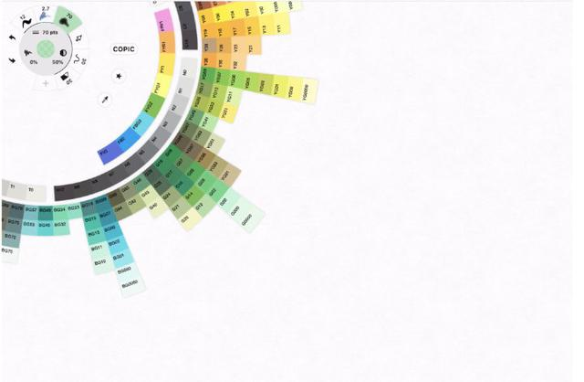

▲概念画板界面

各种笔刷基本齐全，色轮里可选的色彩也比较多，会画画的完全可以用这款APP创作出一幅相当不错的画作，对于我等没学过画的人来说，这款APP也是绝佳的涂鸦工具，可以随手记录下自己的一些想法。

* * *

# 三、阅读类APP

iPad的屏幕，无论是分辨率还是色彩表现，都比绝大多数的手机要好，再加上大屏幕的优势，使得它成为当之无愧的“阅读神器”。

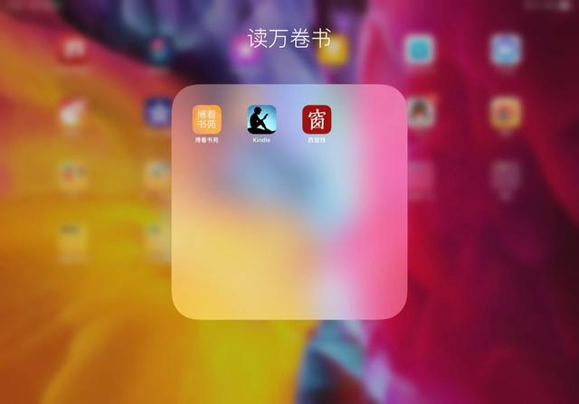

# 1、电子书库：Kindle

相信有不少人因为一时兴起，购买了Kindle阅读器，结果没过多久就吃灰，沦为盖泡面的神器。不得不说，现在快节奏的生活挤占了人们的阅读时间，现在能静下心阅读的人越来越少了。

尽管如此，Kindle APP的体验还是非常不错的，亚马逊网站上买的电子书可以直接推送到iPad上进行阅读：

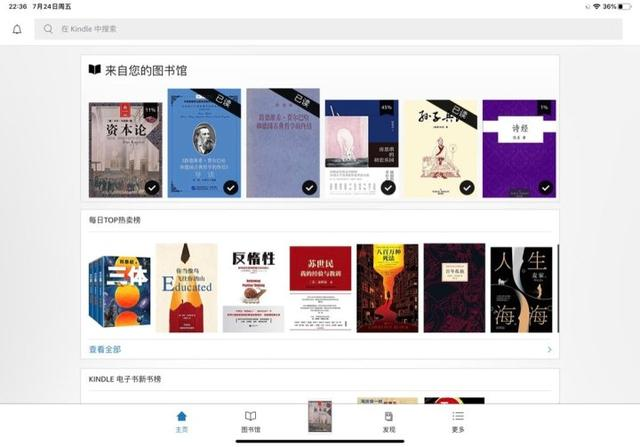

▲Kindle APP

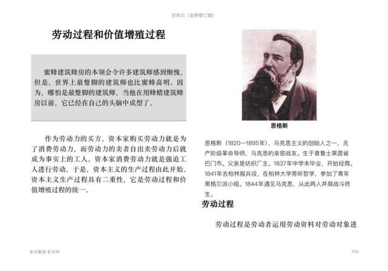

▲电子书阅读

横屏和竖屏时候的排版有一些不同，横屏分成两栏，竖屏更像传统的书籍，可以根据个人喜好选择。

# 2、电子杂志阅读：博看书苑

博看书苑是一款非常好用的APP，添加机构号之后可以获得相应的权限，有不少杂志可以免费看。

（机构号的账号密码大家可以自行去网上找）

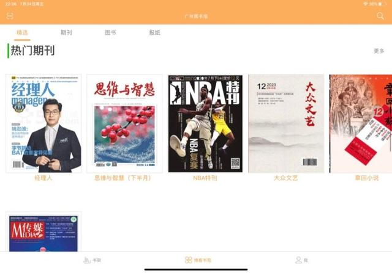

▲博看书苑

杂志的排版非常精美，跟真实的杂志没什么区别，有一些杂志有文字版（精简了排版）和图片版（杂志原排版）可以选。

▲杂志界面

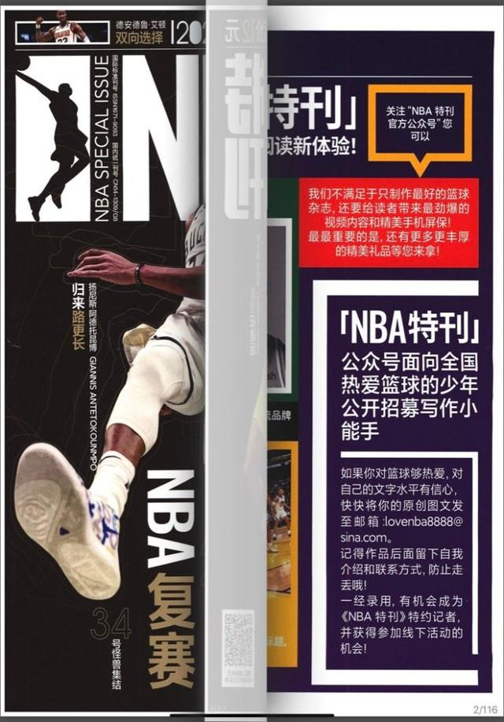

▲还有这种逼真的翻页特效

# 3、古诗词阅读：西窗烛

中华民族五千年的文化给我们留下了不少宝贵的文化遗产，而诗词就是其中重要的一部分。如果要在iPad上阅读各种古诗词，我个人推荐西窗烛这款APP。

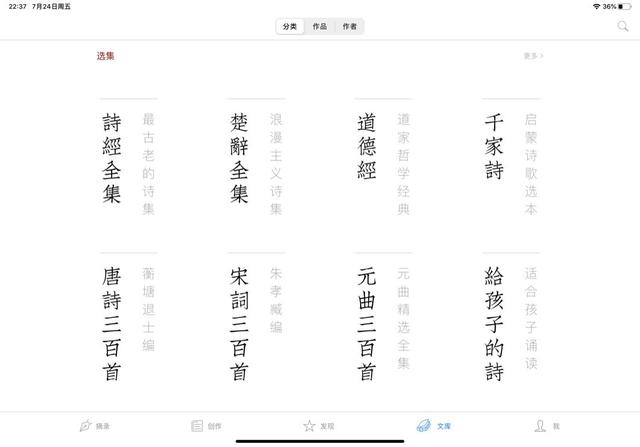

▲西窗烛的诗词库

除了上面这些，还有《论语》《中庸》这样的儒家经典著作，四大名著，还有像《西厢记》《老残游记》这些非常经典的书籍。更难得的是，APP还根据情景进行分类，比如夏天有什么诗，边塞诗有哪些，找起诗词来更方便。

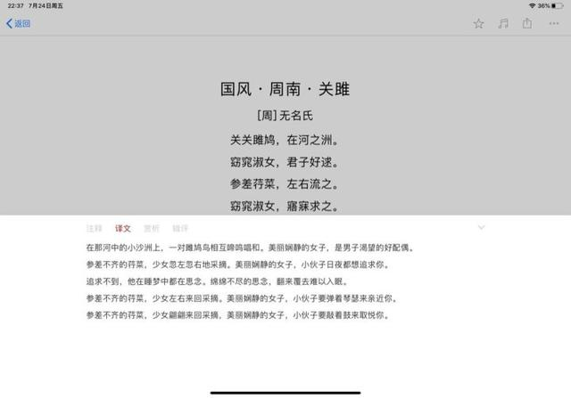

▲诗词译文

注释、译文、赏析都很齐全，再也不用担心读不懂诗词了。

伴随着《中华诗词大会》的热播，不少朋友也在学习中国古代的诗词，我觉得西窗烛是一款非常不错的古诗词学习APP。我也很喜欢它的名字，出自李商隐的《夜雨寄北》——何当共剪西窗烛，却话巴山夜雨时。

* * *

# 四、时间管理APP

今年，“时间管理”突然成为了一个热词，当然这里要讲的“时间管理”和那个不太一样。现在不少人都有做计划的习惯，制定每天的计划，用计划推送行动。

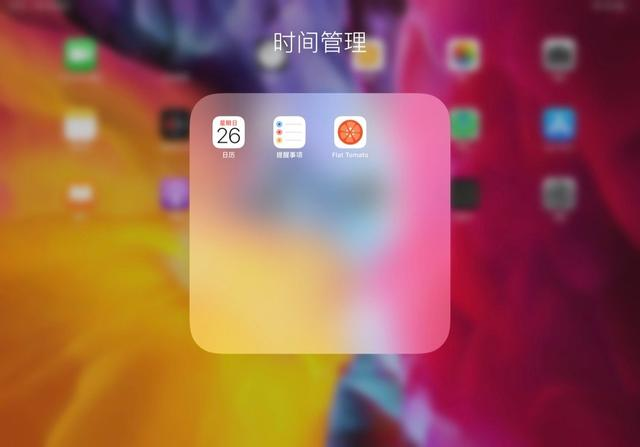

# 1、自带日历

自带的日历是一款非常好用的日程计划神器，如果有iPad和Mac，还可以实现多平台同步，不需要去下载别的第三方APP。

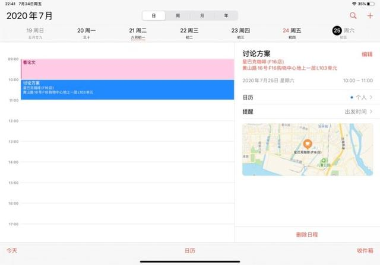

▲可以设置提醒时间和地点

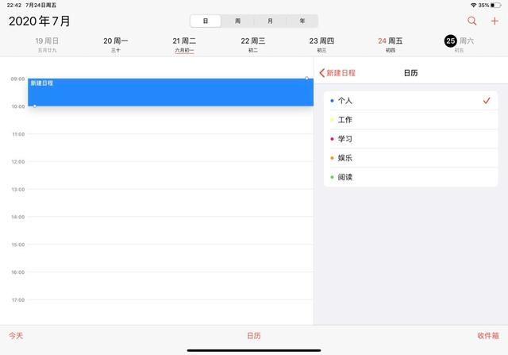

▲可以用不同颜色来标注不同活动

俗话说：一日之计在于晨。我个人习惯早上起来，用MacBook制定好日程，用iPad就可以随时查看了。

# 2、自带的提醒事项

除了日历之外，提醒事项也是一个时间管理的神器，它是一个任务清单。如果说日历是帮助你规划“成块”的时间，那么“提醒事项”就是帮你记住某个“节点”。

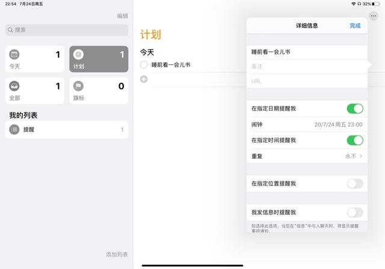

▲设置提醒日期、时间甚至地点

日历和提醒事项“点面结合”，多平台同步，确实非常好用。我个人也尝试过不少第三方的时间管理APP，比如滴答清单、Sorted等等，但是用多了还是觉得系统自带的好用，功能齐全，而且多平台同步也不用额外下载APP。

# 3、番茄钟：Flat Tomato

“番茄工作法”是一种非常流行的时间管理方法，一个周期30分钟，25分钟工作，5分钟休息，每进行4个周期，休息时间延长到15分钟。

在iPad平台也有大量的番茄钟软件，我也对比过好几款，最后选择了这款Flat Tomato。

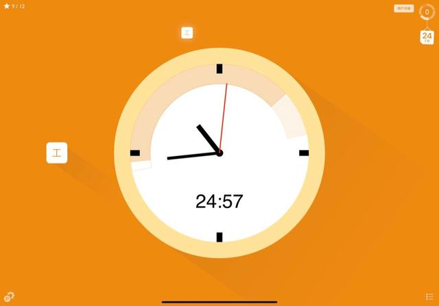

▲Flat Tomato主界面

这款APP的操作非常简单，可以选择手动或者自动控制，点击一下即可开始计时，时间到了会提醒。

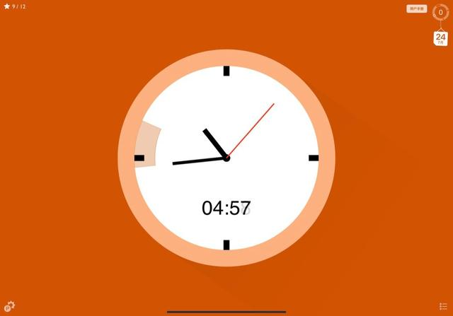

▲休息时间

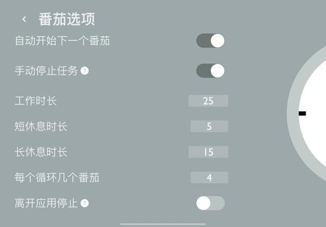

▲工作和休息时间可根据个人习惯调整

# 4、自控力：APP应用限额

这也是系统自带的一个宝藏功能。很多人在学习/工作的时候总是忍不住玩手机，针对这一点，Forest（专注森林）之类的APP，成为了人们常用的自控工具。然而我们还要用iPad学习呢，在这种条件下，“APP应用限额”大显身手。

首先建议用iPad复习重要考试（比如考研、考公、法考）的朋友，你的iPad不要安装与学习无关的APP！

那可能有人会问，iPad自带的浏览器，包括微信和QQ，都会成为分神的“罪魁祸首”，怎么办？那就用APP应用限额给它们“上锁”。

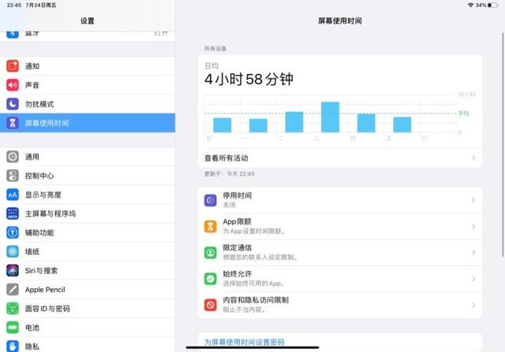

▲在“设置-屏幕使用时间”里面

选择“APP限额”，选择几个你认为会分神的APP，给它们设定每天最多使用的时间即可：

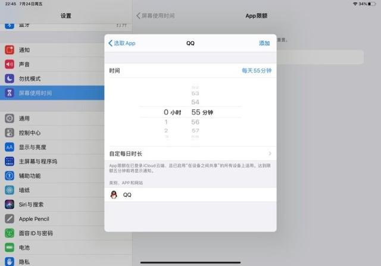

▲对特定APP设定使用时间

到了限额会怎样呢？会不让你打开这个APP，但这其实只是一种“软约束”而不是“硬控制”，自制力不强的人可以让朋友帮你设置一个屏幕使用时间密码。

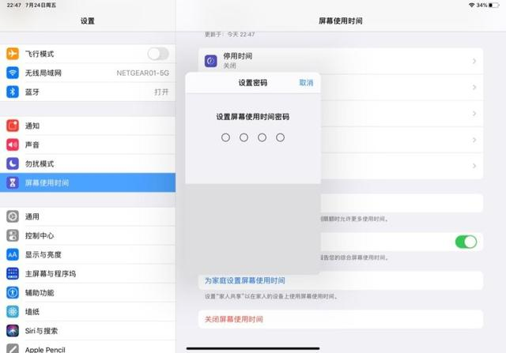

▲设置屏幕使用时间密码

到点后，如果要解除限额，需要输入这个密码：

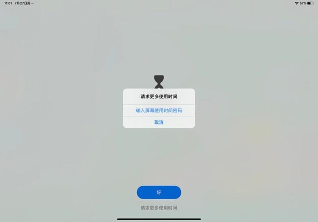

▲第一次可以给你用1分钟，后面就需要输入密码了

不得不说，“APP应用限额”这一功能确实是改变“买前生产力、买后爱奇艺”状况的神器，然而自控力这种东西更多是看个人，这种功能只是作为辅助手段，帮助你更好地自控而已，指望依靠这种功能让一个自制力差的人变得更自律，我觉得不太现实。

* * *

# 五、快捷指令

iPadOS系统上还有一个非常好用的功能，就是“快捷指令”，你可以将一些常用的操作设置成快捷指令，省去了手动操作的麻烦。

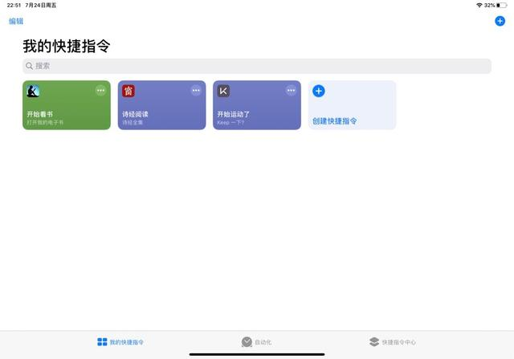

▲我自己用的几个快捷指令

比如“开始看书”，点击之后就会自动打开Kindle APP，跳到我上次阅读的那个位置，在视频里也有演示，就不用手动开启APP了。

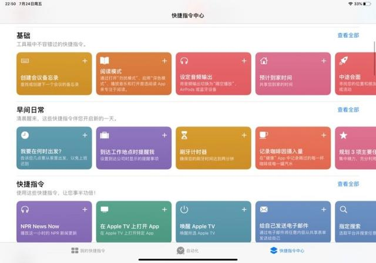

▲系统自带了一些快捷指令，可以用智能家居设备联动

不过，系统自带的终归有限，借助第三方指令，可以让你的iPad更好用。

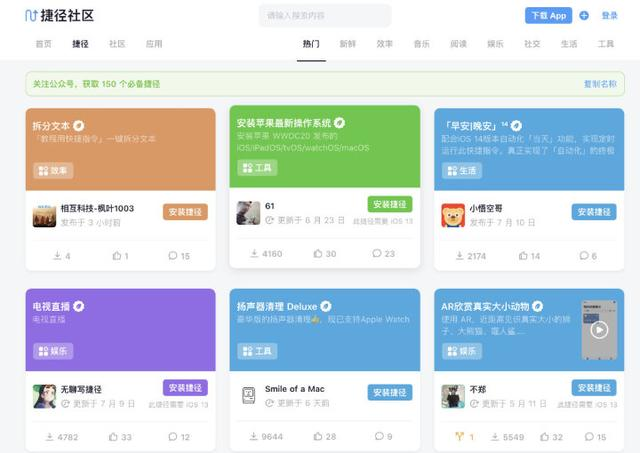

在“捷径社区”等论坛，我们可以找到不少好用的快捷指令，可以根据自己的需要下载。

* * *

# 六、写在最后

去年那篇文章的标题是“iPad+Apple Pencil是不是大学生学习的好伙伴？”，一年过去了，我的答案是：当然是。我周围也有越来越多的同学开始使用iPad+Apple pencil来学习。

不过，我觉得还是看个人的自制力，有些人自制力很差，游戏卸了下，下了又卸，如果你是这种人，我建议你采用更强硬的控制手段，不要买iPad学习了，直接一支笔，一本草稿本，几本书，这种最传统的学习方式，兴许是最有利的；而对于自制力较强，目标明确，计划合理的人群，iPad自然会成为你学习的好帮手，这个不需要顾虑（我也相信你不会顾虑）。

今天一共推荐了18款APP，都是我个人常用，觉得不错的应用，推荐给大家，权当抛砖引玉。昨天晚上和几个老朋友聚会，刚巧大家都有iPad，职业也不同：医学生会用Altas看人体解剖图；室内设计师用CAD看图王看图纸；教师则用Office看课件，并做修改。由于我自己所学的专业也没有什么特别的APP，所以今天推荐的这些，适合大多数大学生/研究生使用。

如果大家的iPad有一些不错的APP，欢迎留言分享。让iPad物尽其用，而不是单纯的娱乐平板。

* * *

# 选哪款iPad好？

iPad建议买128G的，兼顾了日常使用和娱乐需求，如果只是记笔记看论文，64G也足够了。

目前Apple官网在售的iPad有以下几款：

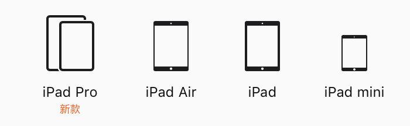

入门级的iPad 2019（10.2寸）、中端的iPad Air 3（10.5寸），高端iPad Pro（11寸和12.9寸），还有一款iPad mini 5（7.9寸）

这几款中，除了iPad Pro之外，别的型号都用Apple Pencil一代。配置上，iPad 2019采用A10处理器，Air3和mini5是A12，Pro是A12Z。

# 1、iPad mini 5

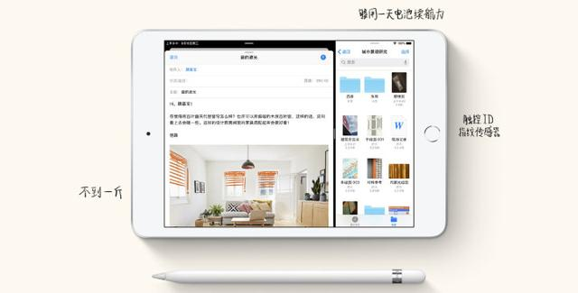

iPad mini 5如果拿来记笔记，我觉得还是稍微小了点，毕竟现在手机都接近7寸了。不过如果阅读居多，我觉得还是不错的，一手掌握，看电子书刚刚好。

# 2、iPad Air 3

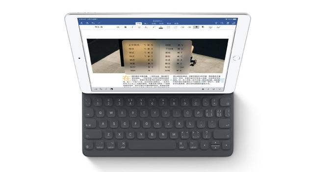

iPad Air 3是目前我觉得最适合大学生的一款iPad，屏幕够大（10.5寸），性能足够。目前官网上Air3还有送AirPods的教育优惠，可以一起买了。

# 3、iPad Pro 2020

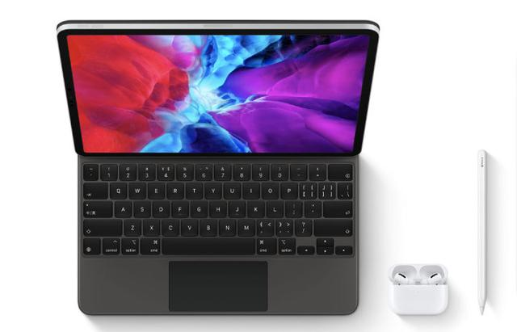

全面屏的iPad Pro，它有多强大就不用我多说了，预算多的直接买就完事儿了。不过，就目前的情况而言，它替代不了MacBook和Windows PC，鼠标操作还不是很完善，相应的软件配套还不够成熟。

9月份苹果会举行发布会，届时会有新的iPad型号上市，准大学生不妨等等看。

# iPad需要买什么配件？

iPad需要搭配一些配件，才能更好地发挥它的强大功能，这里推荐一些实用不贵的iPad配件。

# 1、Apple Pencil

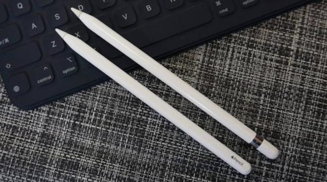

如果有笔记需求，那么Apple Pencil绝对是必需品！必需品！必需品！任何第三方的笔都替代不了，预算吃紧可以买二手的笔。

要注意不要买错了，只有iPad Pro 2018/2020才支持二代笔，其余型号都是一代笔。

# 2、贴膜

iPad的几种膜我都尝试过了，简单地给大家分享一下使用体验吧。

*不贴膜：我目前的状态，感觉良好，写字也不怎么打滑

*钢化膜：写字会打滑，屏幕清晰度高，贴膜简单

*类纸膜：写字非常舒适，但是屏幕清晰度有一定损失，贴膜难度大

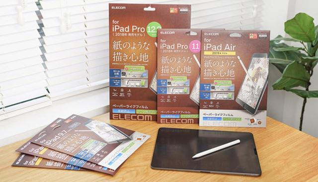

▲日本elecom是比较常见的类纸膜品牌

# 3、保护套

带笔使用的情况下，最好买带笔槽的保护套：

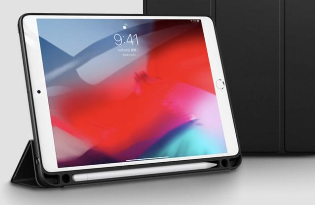

二代笔型号，我自己用这种磁吸式带搭扣的：

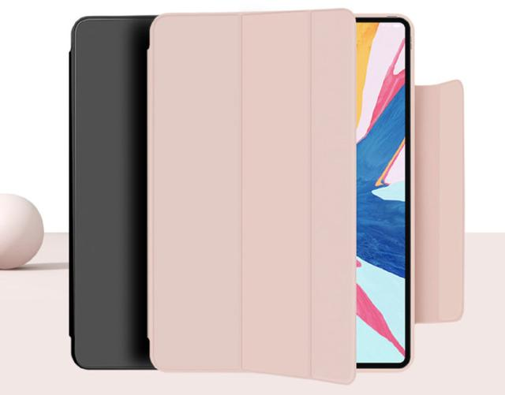

需要用笔的时候，搭扣可以吸附到背面，不影响使用。

# 4、蓝牙键盘

蓝牙键盘不是iPad的必备配件，如果需要经常用iPad码字，不妨考虑买一把蓝牙键盘。

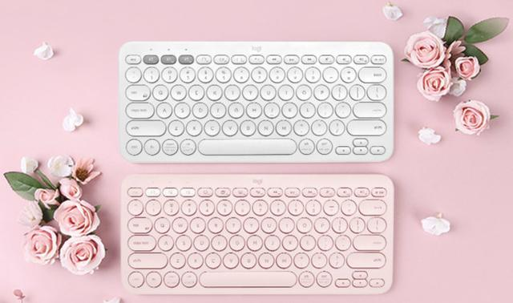

▲罗技K380，一款非常经典的蓝牙键盘，支持多设备连接，操作简便

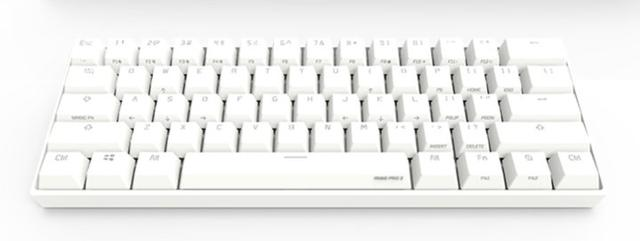

▲Anne Pro 2，一把手感不错的61键蓝牙机械键盘，实测iPad连接很稳定

# 5、充电头和充电线

我觉得有必要为iPad配一个PD快充头，毕竟iPad原装头只有12W的功率，iPad Pro的原装头也不过18W；而iPad Air 3、Pro都支持PD快充，最高功率可以到35W上下；mini5也能达到20W，因此假如要获得更快的充电速度，需要一个更高功率的充电头。

现在PD充电越来越流行，不少轻薄本都支持PD快充，PD充电头可以充手机，可以充iPad，也可以充笔记本，“一头”搞定多设备充电需求。

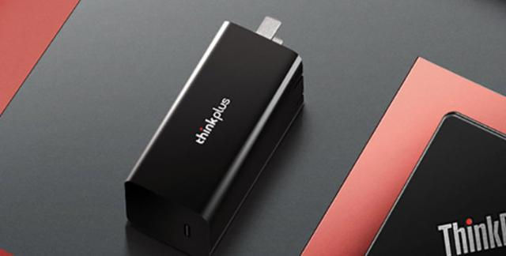

▲联想Thinkplus“口红”快充头，新款支持折叠插脚

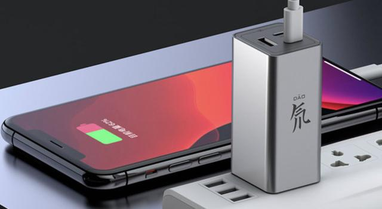

▲努比亚“氘锋”快充头，三口设计

如果想要iPad快充，必须买一根c to lightning的线，记得买MFi认证的就行（iPad Pro自带c to c线，因此不需要）

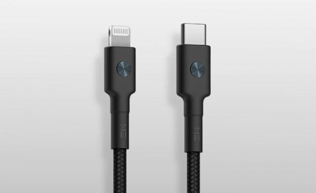

▲苹果PD快充线

* * *

# 真正的结尾

虽然我不认为现在的iPad可以替代Mac/PC，但随着时间的推移，还真的不好说。现在的iPad Pro，接上一个扩展坞，再配上妙控键盘，已经可以完成不少原来只能在电脑上完成的任务。尽管iPad一开始的定位是娱乐平板，但苹果近年来一再发掘iPad的生产力潜力，iPad OS现在已经拥有相当完善的文件管理系统，跟PC/Mac完全一致的网页浏览体验，在可见的将来，iPad或许能拥有媲美PC/Mac的生产力。

在我看来，iPad对于一个大学生来讲，是手机、PC之后的第三设备，是大学期间学习娱乐的好伙伴。这篇文章的写作目的，更多地是让大家充分利用手里的iPad。

> 这么好的设备，只是拿来看视频打游戏，甚至拿来盖泡面，是不是有点可惜呢？

