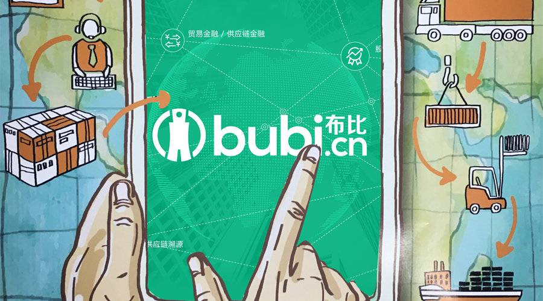

# 区块链凉了？我们来看一些真问题

**区块链渐渐凉了。  
**

它甚至不再是人们茶余饭后讨论的主题，甚至转变成为一场狂欢之后的玩笑谈资，以至于虎嗅4月1号发文称，“从今天起，虎嗅正式拥抱区块链”，但大家却真的一点也不当真了。

**既然它凉了，虎嗅精选终于敢放心的来聊聊区块链领域里的真问题了。**

首先，他是不是具有变革意义的一项技术，答案是，会带来变革。然而若你再问，那我们离那场变革还有多远，我们就推荐你来听听本期的大咖私房话了。

虎嗅精选团队本期特邀请到布比联合创始人、兼布萌总经理杨帆做客虎嗅“大咖私房话”来聊一聊区块链的底层逻辑及如何落地行业应用，并告诉大家，面对众说纷纭的“区块链+数字资产”，我们该如何分辨真假？

  

布比区块链，自2012年起专注于区块链技术和产品的创新，已经拥有数十项核心专利技术；布萌系布比区块链旗下开放、可信、平等的数字资产网络。据杨帆称，截止到2月底，布萌已上线机构总数达17家，近3个月月均交易量超过600万笔，链上资产类型包括商业积分、保险卡单、游戏道具、卡券、理财产品等近十大类，资产总值超过30亿人民币。

  

争议犹存

  

有消息称，截至2018年1月，比特币、以太坊等区块链数字资产的总市值已超越腾讯。风口之下，日韩等国已经制定了一系列的法令和措施，对区块链数字资产的交易、持有和税收等环节进行明确，美国纳斯达克也宣布将于2018年上半年开放比特币期货交易。

但反观，国内区块链的问题也显而易见：缺乏成熟的自主知识产权和被市场广泛接受的数字资产，长期来看不利于金融安全;

**对企业端，**虽然一大批企业也在积极布局区块链数字资产领域，但这种数字资产在法律上的地位并不明晰，导致企业打擦边球的现象屡见不鲜;

**对用户端，**多数消费者对区块链数字资产的认知不足，不能准确认知区块链资产的优劣，尤其在三四线城市，不法分子借以‘区块链’的名义进行诈骗，造成严重的经济损失。

总之，目前在国内，一方面，区块链技术的快速炒热使得“区块链+X”愈发多样，产品溯源、数字资产安全、智能合约等，不乏有一些创业者在技术和业务上取得双向成功；另一方面，国内区块链发展，整体发力较晚，一系列ICO泡沫的来袭也让区块链逐渐冷静下来，淡出人们的视线。

泡沫之下更要冷静看待

  
区块链，本质是一种共享且去中心化的分布式账本，任何人都可以参与每个节点的记录，记录的同时也会验证其他节点记录结果的正确性，并形成链条。这种特质使得所有数据、信息变得真实、透明、安全、不可篡改。

但目前区块链存在过度炒作的情况，若要真正走到广泛应用，仍需时日。

也有业内人士指出，从文娱、汽车到供应链领域，真正的应用落地很可能将会在2018年出现。可以预见，区块链很快将会出现更多的成熟应用，**其魅力将在于各类场景的运用与重构。**

聊什么？

**主题： 区块链的真实瓶颈与挑战**

> 1\. 区块链的底层逻辑和应用都有哪些，哪些行业会率先爆发？
> 
> 2\. 针对“区块链+X”的模式如何冷静看待和入局？
> 
> 3\. 区块链是重技术还是重应用？
> 
> 4\. 区块链在技术上还存在哪些难题亟待解决？

活动信息

> 时间：2018年4月13日（周五）15:00-17:00
> 
> 地点：北京市 东城区（具体地址抢位后可见）
> 
> 时长：两小时左右
> 
> 形式：一位大咖+25位参与者，就话题展开私密、双向、高质量交流。
> 
> 第一个环节圆桌主人主题分享1小时；第二个环节圆桌主人与虎嗅会员自由交流。

为了保证交流质量，我们热切期待你提前准备好问题，在活动开始前48小时交给小秘书，我们也会跟主讲嘉宾沟通，尽量保证分享听到你想知道的细节。

  

参与方式

  

> 请直接[点击这里](https://www.huxiu.com/table/content/739.html)即可抢席位，或者在虎嗅APP—“精选”—“大咖私房话”中，直接点击“立即抢位”。

  

抢到席位的同学，请联系虎嗅小秘书

  

> 微信号：huxiuvip302 大秘秘
> 
> 小秘书会给你发邀请函、收集问题，以及通知其他与会信息。

  

同时也欢迎您在下方评论您想参与的私房话主题，说不定下次我们就会举办哦

本内容为作者独立观点，不代表虎嗅立场。  
  
未经允许不得转载，授权事宜请联系hezuo@huxiu.com

正在改变与想要改变世界的人，都在 [虎嗅APP](https://www.huxiu.com/app.html)

赞赏

支持一下

