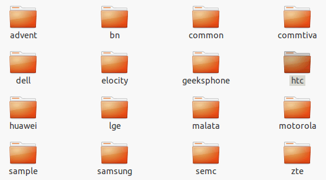
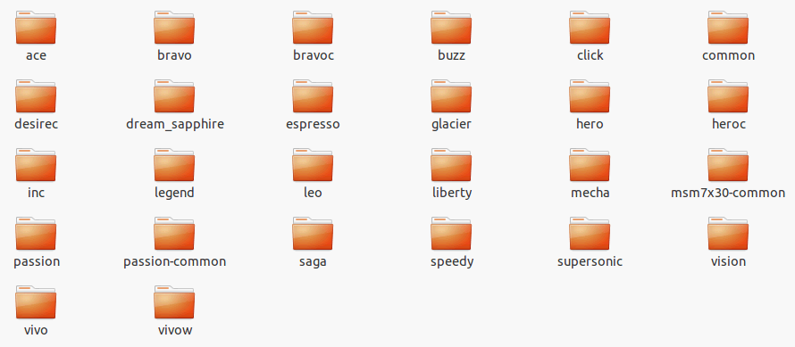
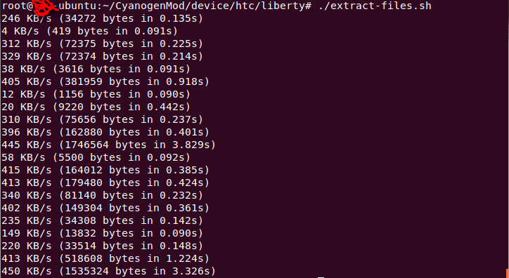
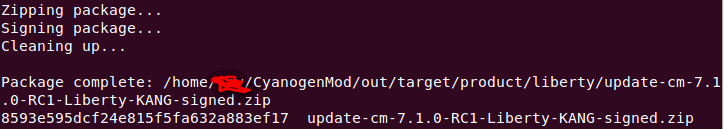
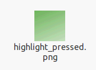
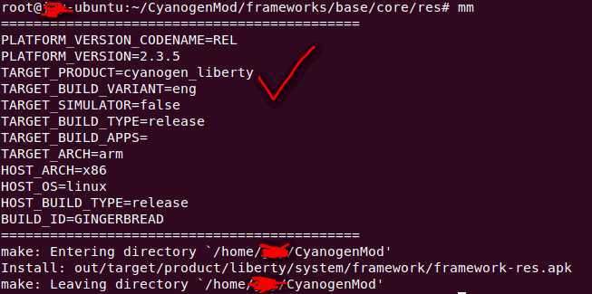
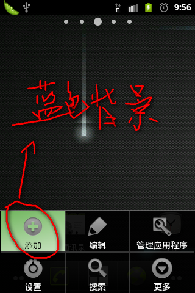

# CyanogenMod源码下载和编译(Android ROM定制基础篇)

本来想下载Android官方源代码，没想到android.git.kernel.org维护，不能访问，非常遗憾，并因此还郁闷了几天。 
后来转投MIUI,没找到它的源码，不知道它的"超过40万人社区开发团队"是什么意思，求解具体开发人员几何，都是谁？
后来一想，竟然忘记了CyanogenMod这茬，这可是的的确确的开源啊，我的手机一直也在用CyanogenMod系统的，感觉确实不错。
1.准备
我得环境如下，
```
VirtualBox 4.1.2.r73507
Ubuntu11.10 Beta2(32位)
```
下载CyanogenMod的gingerbread分支
Ubuntu的环境配置大家可以参考我前面写的《Android拓展系列(3)--Android源码下载》，也可以参考
```
http://source.android.com/。
```
这里着重说下Android 2.3以上需要借助JAVA6，安装Java6，我推荐如下安装：
```
$ sudo add-apt-repository "deb http://archive.canonical.com/ lucid partner"
$ sudo add-apt-repository "deb-src http://archive.canonical.com/ubuntu lucid partner"
$ sudo apt-getupdate
$ sudo apt-getinstall sun-java6-jdk
```
其中第二句可能会出错，不过没关系，跳过即可。 
2.安装repo
因为android.git官方已经不能访问，所以我这里提供一个repo文件的下载地址，免的大家到处搜索：
```
http://115.com/file/cl15goo2#repo
```
把repo拷贝到ubuntu根目录下得bin下
操作方法：
```
$mkdir bin
```
//下载的repo脚本拷贝本地bin文件夹下
//设置本地repo的可执行权限
```
$chmod a+x ~/bin/repo
$alias repo="~/bin/repo"
```
//这里我用特意用别名，大家也可以按常规方法把repo的路径添加到PATH中
3.ubuntu中环境的配置
JDK前面已经说了，其他的软件列表如下：
```
$sudo apt-getinstall git-core gnupg flex bison gperf libsdl1.2-dev libesd0-dev libwxgtk2.6-dev squashfs-tools build-essential zip curl libncurses5-dev zlib1g-dev sun-java6-jdk pngcrush schedtool 
```
这些软件都安装好之后我们开始下载CyanogenMod源码。
4.下载CyanogenMod源码
```
//从用户根目录下开始
//创建CyanogenMod文件夹来放置后面所有的代码
$mkdir CyanogenMod
//获取gingerbread的分支源代码
$repo init -u git://github.com/CyanogenMod/android.git -b gingerbread 
//同步服务器代码到本地，-j16据网友反应是多开网络连接，从而能提高下载速度
$repo sync -j16
```
这个过程非常的漫长，大家慢慢的等吧，本人是晚上睡觉的时候下载，第二天早上醒来就Done了。
5.编译源码
在CyanogenMod/device目录下有很多款手机的对应版本：





里面有个htc，本人是htc G9，也就是Liberty，我们点击看看：





我的liberty静静的优雅的舒服的躺在那里。
所以本人决定编译一个我手头上的liberty对应的系统版本，编译完成后我们直接刷机。
第一步：读取手机上的一些私有配置文件
```
$cd CyanogenMod/device/htc/liberty
$./extract-files.sh
```
图示如下：


第二步：生成编译脚本文件
```
$cd ~/CyanogenMod/vendor/cyanogen 
$./get-rommanager
$./extract-google-files
```
//复制编译脚本文件到CyanogenMod目录下，后面编译整个系统用的就是这个文件
```
$cp ~/CyanogenMod/vendor/cyanogen/products/cyanogen_lieberty.mk  ~/CyanogenMod/buildspec.mk
```
贴上进行时图片：


第三步：编译脚本
回到CyanogenMod目录下，执行脚本。
//初始化脚本，这个是后面的重要基础步骤
```
$source build/envsetup.sh
```
//选择编译的产品
//这个命令需要一小会儿时间，但是又没提示，耐性等待一下
```
$lunch cyanogen_liberty-eng
```
//开始编译
```
$make -j4 CYANOGEN_WITH_GOOGLE=trueotapackage
```
这个过程也是相当的漫长，还好一般情况下我们只是第一次需要项目整个编译，后面只需要编译某个模块。
可惜完成的时候我忘记截图了，可惜不能上图了。
在编译的过程中，我们有一点要特别注意，虚拟机的内存不要太小，本人刚开始分配虚拟机512M内存，一会儿就出错，重新编译又一会儿出错，如此重复，而且还导致某个文件被破坏掉了（values-cs/strings.xml中某行少一个右尖括号，这个我百思不得其解），后来我把虚拟机内存调到1024M就一直编译通过了。
第四步：生产刷机zip包。
```
./vendor/cyanogen/tools/squisher
```
有图为赏：





用这个zip包，我刷到我手机上，一切正常。
6.定制ROM
有了以上的环境后，我们就可以大展手脚，深度定制ROM, 做自己的操作系统，自己的CyanogenMod，自己的MIUI，自己的Android系统。
举个最简单的例子：
我们换一下默认menu菜单的选中背景图，我们进入CyanogenMod/frameworks/base/core/res/res/mdpi目录下(因为htc liberty的分辨率是480x320)，找到图片highlight_pressed.png，替换为绿色的背景：





那么修改资源文件后，我们需要重新编译framework-res.apk:
```
//回到根目录
$cd
//切换到管理员权限
$sudo -s
//进入CyanogenMod目录，并初始化脚本文件
$cd CyanogenMod
$source build/envsetup.h
//选择产品
$lunch cyanogen_liberty-eng
//进入资源编译目录(或者它的子目录也可以)
$cd frameworks/base/core/res
//开始编译framework-res.apk
$mm
```
编译完成，示意图如下：





在CyanogenMod/out/target/product/liberty/system/framework目录下生成了一个framework-res.apk文件，就是我们修改Menu选中项图片后新打的资源包。
现在我们需要把这个资源包更新到手机中。
USB连上手机后，一切正常的话(adb当然也是事前要装好的哦)，打开终端：
```
//使其可写
$adb remount
//替换手机中资源包
$adb push ~/CyanogenMod/out/target/product/liberty/system/framework/framework-res.apk /system/framework/
//重启手机后生效
$adb reboot
```
重启后，进入桌面，我们点击Menu，选择一项：





修改资源包，可以修改样式，显示图片，调整布局等等。
你也可以直接修改framework代码，在framework/base/core/java目录下，修改对应的类，比如逻辑处理，样式重绘等等，然后同上面类似编译，把生成的framework.jar替换掉手机的/system/framework下的framework.jar，重启手机即可看到效果。
你也可以添加系统应用，删除系统应用等等，这里特别提到一点，系统应用可以通过如下命令删除(具有root权限)：
```
$adb remount
$adb shell
#cd system/app
//用rm删除系统FM应用
#rm FM.apk
```
有了这些基础知识，我相信我们后面的深度定制ROM一定非常精彩！
7.小结
本文以CyanogenMod源码编译总结了Android改造系统的一个基本环境，是我们之后ROM系统定制，优化的基础，是android深入学习的必会技能，特此分享，共勉！ 