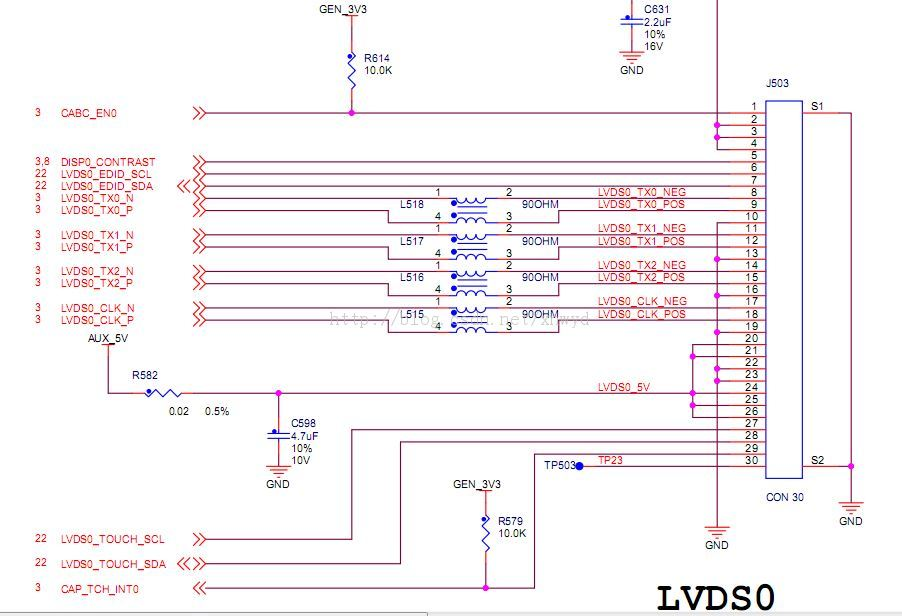
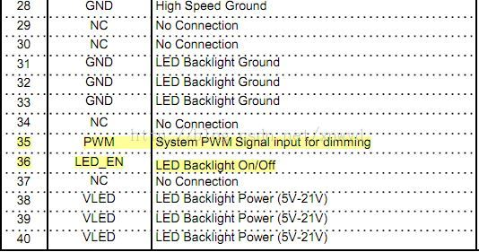
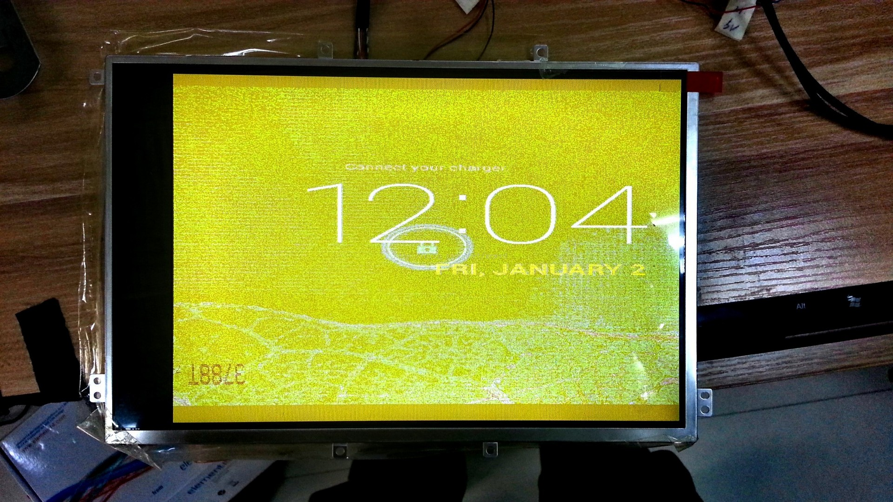
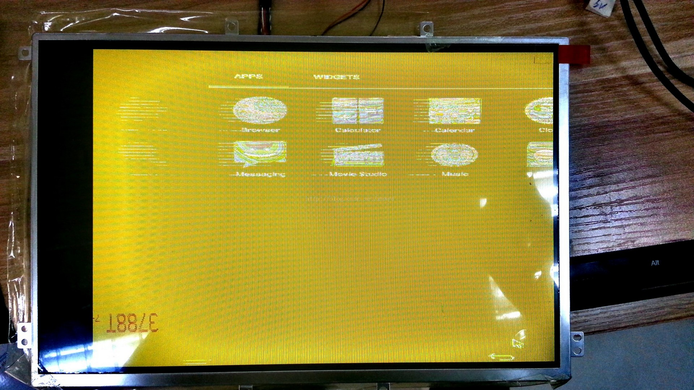
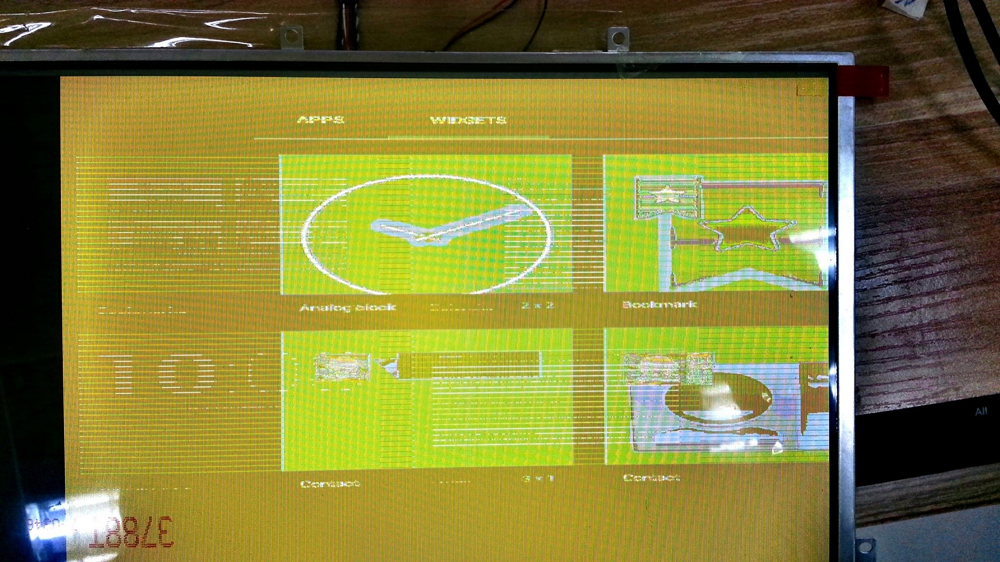
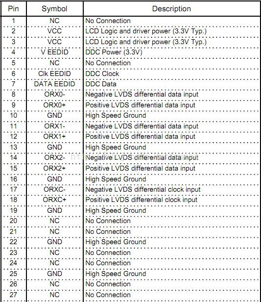

# 飞思卡尔i.MX 6Quad Android 4.2.2的LVDS屏幕驱动移植

### 1、概述
平台：freescale i.MX 6Quad 4核开发板MCIMX6Q-SDB（不带屏幕）
操作系统：Android 4.2.2_1
内核：3.0.35
显示屏：LG的LP101WX1-SLN2
显示屏参数：分辨率1280\*800，色彩18位，色彩数262K，时钟频率69.3M Hz
接口：LVDS0
### 2 移植步骤
2.1 硬件连接
显示屏通过LVDS0接口与开发板连接，开发板提供的LVDS0接口如下：





如上图所示，LVDS0接口共有33Pin，包括：
1）  使能脚CABC_EN0，亮度调节DSP0_CONTRAST
2）  一组I2C Pin6~7
3）  三组数据线Pin8~Pin15，一组时钟线Pin17~18
4）  电源、地等
显示屏LP101WX1的硬件接口如下：





如上图，显示屏提供的LVDS接口共有40Pin，包括3组数据线，1组时钟线，PWM脚和LED_EN脚等。它与开发板的连接方式如下：
1）  把LP101WX0的3组时钟线和1组时钟线对应连接到开发板的LVDS0接口上：
``` 
ORX0-    =>   LVDS0_TX0_N
ORX0+   =>   LVDS0_TX0_P
...
ORXC-   =>   LVDS0_CLK_N
ORXC+ =>   LVDS0_CLK_P
```
2） 连接电源、地
```
2  VCC =>   3.3V
3  VCC =>   3.3V
10  GND =>   接地
13  GND =>  接地
16  GND =>  接地
19  GND =>  接地
``` 
3） 连接背光
```
31    GND       =>   接地
35    PWM      =>   3V3（背光亮度脉冲输出，前期先接3V3，方便调试）
36    LED_EN =>   3V3（背光使能）
38    VLED     =>   5V
 ```
2.2    驱动移植
1、  从freescale官网下载【i.MX 6Software Updates and Releases】->【SABRE Board for Smart Devices】->【Android 4.2Jellybean】->【Source Code for i.MX 6Quad/Dual】软件包，即android_jb4.2.2_1.0.0-ga_source，然后参考android_jb4.2.2_1.0.0-ga_source\docs\Android_User_Guide.pdf的步骤下载android-4.2.2_r1源码，以及kernel（版本为3.0.35）和u-boot（版本为2009.08），并打上补丁android_jb4.2.2_1.0.0-ga_source。
2、  编译android4.2.2源码，lunch选项为【sabresd_6dq-eng】，生成u-boot-6q.bin，boot.img，system.img和recovery.img。
3、  修改drivers/video/mxc/ldb.c的fb_videomode类型的ldb_modedb变量，把LDB-XGA成员改为：
```
{  
    "LDB-XGA", 60,1280, 800, 14430,  
    80, 48,  
    15, 2,  
    32, 47,  
    0,  
    FB_VMODE_NONINTERLACED,  
    FB_MODE_IS_DETAILED,  
},  
```
4、  重新编译内核uImage，并重新生成boot.image，启动系统，设置u-boot启动参数为：
setenv bootargs console=ttymxc0,115200 init=/initvideo=mxcfb0:dev=ldb,ldb=sin0 video=mxcfb1:off video=mxcfb2:off fbmem=10Mfb0base=0x27b00000 vmalloc=400M androidboot.console=ttymxc0androidboot.hardware=freescale  
   

5、  系统启动后，屏幕可以点亮并输出图像，但图像效果不好，分辨率不对，显示效果如下：
 











 


但系统输出hdmi显示是正常的。
 
3      调试步骤
1、  去掉u-boot启动参数bootargs中的ldb=sin0，默认显示是sin1，然后把屏幕的数据线接到LVDS1接口上，显示效果相同。
2、  修改u-boot启动参数：
```
video=mxcfb0:dev=ldb,LDB-XGA,if=RGB666,bpp=16video=mxcfb1:off video=mxcfb2
```
或
```
video=mxcfb0:dev=ldb, bpp=16 video=mxcfb1:off video=mxcfb2
```
显示效果仍是一样。
 
3、  修改u-boot-imx/board/freescale/mx6q_sabresd.c的lvds_xga变量，使之与kernel的ldb.c里面的fb_videomode相同：
```
{  
    " XGA", 60,1280, 800, 14430,  
    80, 48,  
    15, 2,  
    32, 47,  
    0,  
    FB_VMODE_NONINTERLACED,  
    FB_MODE_IS_DETAILED,  
},  
```

编译，重新生成u-boot-6q.bin，启动系统后，显示效果仍是一样。
4、  改u-boot-imx/board/freescale/mx6q_sabresd.c的lvds_xga变量，使之name成员为LDB-XGA：
```
{  
    " LDB-XGA",60, 1280, 800, 14430,  
    80, 48,  
    15, 2,  
    32, 47,  
    0,  
    FB_VMODE_NONINTERLACED,  
    FB_MODE_IS_DETAILED,  
},  
```
编译，重新生成u-boot-6q.bin，启动系统后，显示效果仍是一样。
 
5、因屏幕的色彩数是18位的，在bootargs中添加bpp=18，效果未有改进。
 
3.1    Android 4.0.4调试
因我之前在sabrelite iMX 6Quad开发板，android 4.0.4调试过相同的屏幕，显示效果是正常的，所以怀疑有可能是系统版本的原因，我按以下步骤在sabre-sd开发板，android 4.0.4上验证显示效果：
1、     从freescale官网下载imx-android-13.4.1.tar.gz，解压后按里面的文档Android_User_Guide.pdf下载android-4.0.4_r1.1源码，以及kernel（版本为3.0.35）和u-boot（版本为2009.08），并打上补丁imx-android-13.4.1
2、     修改drivers/video/mxc/ldb.c的fb_videomode类型的ldb_modedb变量，把LDB-XGA成员改为：
```
{  
    "LDB-XGA", 60,1280, 800, 14430,  
    80, 48,  
    15, 2,  
    32, 47,  
    0,  
    FB_VMODE_NONINTERLACED,  
    FB_MODE_IS_DETAILED,  
},  
```
3、     按lunch选项【sabresd_6dq-eng】编译系统，把镜像烧录到sabre-sd开发板上，连接屏幕到lvds1接口，设置u-boot参数为：
```
setenv bootargs console=ttymxc0,115200 androidboot.console=ttymxc0vmalloc=400M init=/init video=mxcfb0:dev=ldb,LDB-XGA,if=RGB666,bpp=16video=mxcfb1:off video=mxcfb2:off fbmem=10M fb0base=0x27b00000  
```
然后启动系统。
4、     启动系统后，屏幕显示效果比android 4.2的较好，屏幕分辨率也是对的，显示效果如下：
 





 
3.2    解决方法
经过艰苦的调试，终于发现在bootargs中添加bpp=32即可解决问题，完整的bootargs如下：
```
console=ttymxc0,115200 init=/init video=mxcfb0:dev=ldb,bpp=32 ldb=sin0 video=mxcfb1:off video=mxcfb2:off fbmem=64M vmalloc=400M androiconsole=ttymxc0,115200 init=/init video=mxcfb0:dev=ldb,bpp=32 ldb=sin0 video=mxcfb1:off video=mxcfb2:off fbmem=64M vmalloc=400M androidboot.console=ttymxc0 androidboot.hardware=freescale fb0base=0x27b00000dboot.console=ttymxc0 androidboot.hardware=freescale fb0base=0x27b00000  
```
启动系统后，分辨率、色彩都显示正常。
但仍有疑问，bpp表示像素位数，我的屏幕的bpp是18，用的是3组数据线，为什么是32位呢？