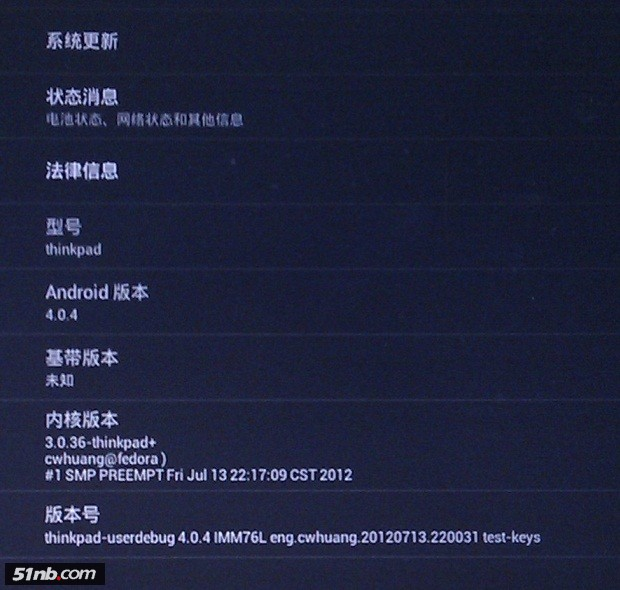
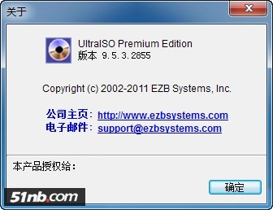
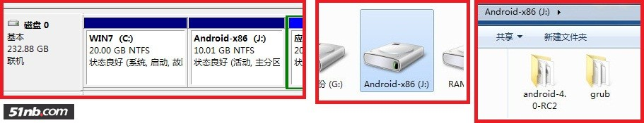
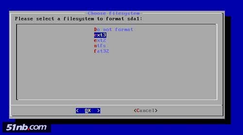
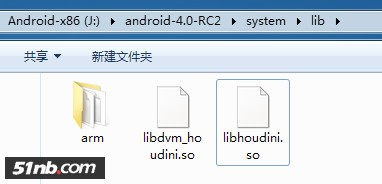
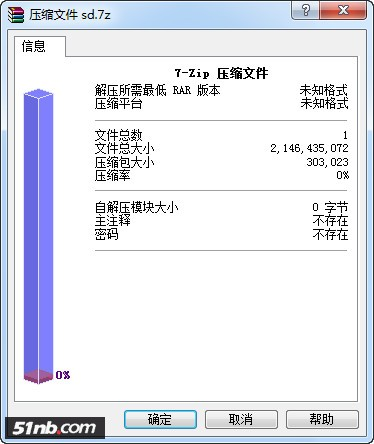
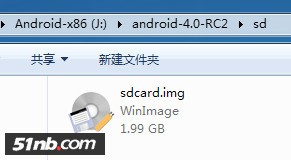
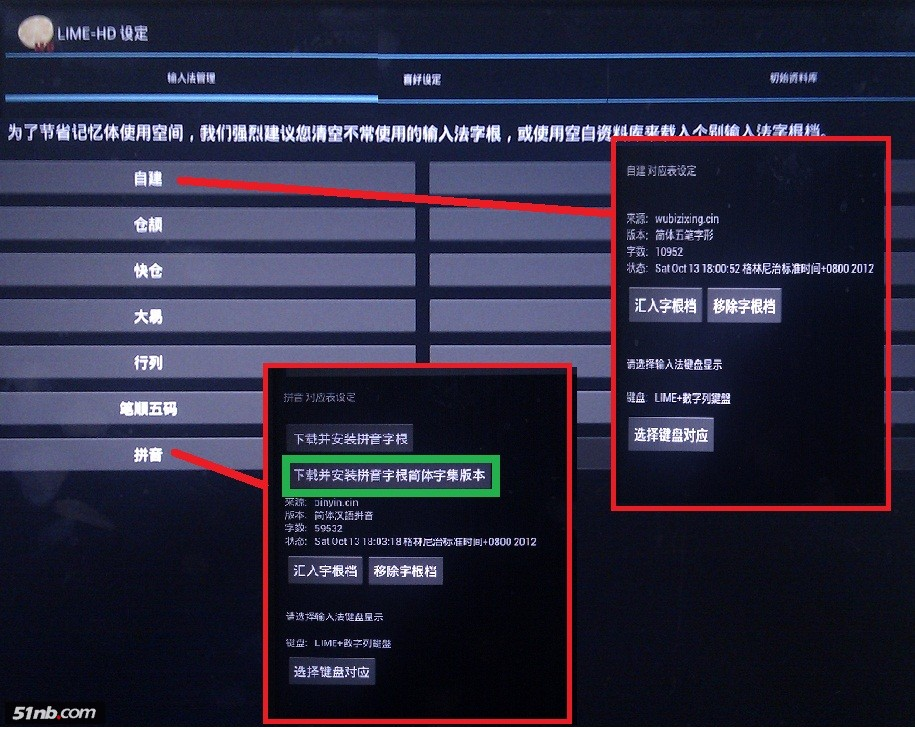

# Android X86 4.0 RC2 ThinkPad 完美攻略
有了Android X86，你可以不用买IPAD了。因为你手中就已经有了一个强大的PAD。
此篇以前论坛已有小黑上安装Android的相关报到。
Android 4.0.3 (安卓) X61T 完美版：
系统版本是X41T专修版。众多粉丝试过的就会知道，此完美版本，虽然还是挺好用的。
最大的问题就是“很多软件、游戏不能运行”，特别是QQ不能用。试问一个没有QQ的系统，拿来还能干嘛。
2012-07-15， 令人期待已久的Android-x86 4.0-RC2发布。
是thinkpad版了（是THINK都可以当PAD用了）。

全系列下载列表（非THINKPAD机器自选 ）
这里是THINKPAD版本的下载地址，大家下载此文件安装
http://android-x86.googlecode.com/files/android-x86-4.0-RC2-thinkpad.iso
新版简单介绍：
Android-x86 4.0-RC2 在 RC1 上出现的问题，例如电池容量不准确、键盘没办法用等大部份都已经解决了。相对于 RC1 版本的全鼠标操作，RC2 版本的键盘操作让广大Android 系统的 PC 用户更感到贴心；而且，虚拟 SD 卡已经被替换为内置储存支援。 最令人兴奋的是大部份的 Apps 甚至游戏都可以运行了，当然少量还是会发生问题。有网站测试过，部份有问题的例如 arm 版本的 Youku 客户端、网页视频等，有估计与Android 的解码器有关。

这是现在唯一能支持“大部份的 Apps 甚至游戏”的Android-x86版本，但这个版本也有不完美的问题存在。
1：要“很多软件、游戏不能运行”支持，需额外添加库文件。
2：Android X86 4.0 RC2 已不支持创建虚拟SD卡，不能下载及安装程序。
     虚拟SD卡由内部存储支持取代。但部分机器不能识别U盘及本地硬盘，别的我不知道，反正我的X61T就是这样。
3：中文输入法不能运行。
本文就是以此Android X86 4.0 RC2 就是为解决这三大问题，让小黑完美运行安卓的攻略。
一：Android X86 4.0 RC2安装
具体安装方法网络上的教程很多。我还是给大家推荐一个:  安卓X86中文网原创安装教程（一）之U盘运行——最安全简单的体验androidx86
我只说明一下对应本文的注意事项
1：好些人制作的U盘启动不了。
得注意，启动U盘必须得用UltraISO 9.5.3及以后版本制作才能正常启动。

2：分区设置如下

建议Android X86使用独立主分区安装，并且将其激活
3：格式化分格，最好是选择NTFS。

为方便拷库文件进入安卓系统，还是在WINDOWS下进行才方便。日后交换文件才有可能。
如果使用EXT格式。拷入文件是相当困难的。
4：/system目录打开读写权限，选择“YES”

二：无线联网
打开WIFI后，不能短时间搜索到WIFI源。
可自己先设定一个网络。就会很快找到。
三：“很多软件、游戏不能运行”添加需额外库文件。
下载如下三个文件，并放入相应的安卓目录内。然后重启（CTRL+ALT+DEL）即可。
§  把“libhoudini.so” 放到 /system/lib/ 目录
§  把“libdvm_houdini.so” 放到 /system/lib/目录
§  把“arm libs” 放到 /system/lib/arm/目录
这是只有android x86 4.0 RC2才支持的arm translator，它是移植ARM指令集翻译器，安装了RC1的请自行卸载干净后重新安装RC2。
原始下载页面BuilDroid有英文功底的，可去查看。
完成后出现如下内容：

四：创建虚拟SD卡
Android X86 4.0 RC2 已不支持创建虚拟SD卡，所以不能下载及安装程序。如果同时你的安卓不识别U盘或本地硬盘就需要创建虚拟SD卡。原理其实很简单。就是利用“Android 4.0.3 (安卓) X61T 完美版”创建的虚拟SD卡镜像文件给Android X86 4.0 RC2使用。刚创建的“sdcard.img”镜像文件很大512M至2G，压缩后只有296K。随便用WINRAR或是7-ZIP压缩都可以。备份压缩后的文件在安装好Android-x86 4.0-RC2后解压到安卓分区“android-4.0-RC2”目录即可。

为方便我就直接为大家提供2G的SD卡镜像压缩文件  sd.7z (296.09 KB)
解压后的位置如图：

这里虚拟SD卡，其实系统已经认为它是USB存储器了。
随后修改GRUB启动菜单。在“grub/Menu.lst”文件中加入“SDCARD=/sd/sdcard.img”代码
请使用Uedit32编辑，打开时选择“不转换为DOS格式”
Menu.lst为UTF8格式的LINUX格式文件，换行符与WINDOWS的不一样。用写字板打开编辑后会出错。
**********如下是Menu.lst部分内容**********
title Android-x86 4.0-RC2
         kernel /android-4.0-RC2  ……..  SRC=/android-4.0-RC2 SDCARD=/sd/sdcard.img
红色为添加部分。如此过后Android-x86 4.0-RC2就拥有自动加载的虚拟SD卡。
五：中文输入法解决方法（使用LIME输入法更新拼音库）
首先申明一下，除内置的LIME输入法外，其他的输入法，我没一个运行成功过。也就是说，只能用内置的LIME输入法。
最新发布的android x86 4.0 RC2不知道怎么一向好用的Google拼音输入法用不了，不断的FC，然后根据以往经验，
输入法都是不能用的（因为输入法一般有底层lo库的缘故，arm与x86的指令不同，所以库文件也要重写）。试装N个输入法之后还是打消了这个念头。
难道4.0RC1真的只能用鸟文了么？那样实在太没劲了！！
估计android x86的作者们也考虑到了这个问题，所以给我们留了一个后路，那就是可能被大家忽略的lime输入法。
根据我的测试，系统自带的LIME在android x86上运行是没问题的。LIME有一个很重要的特性，就是自定义码表，有了它，只要有码表，LIME几乎可以变身为任意输入法。
操作如下：
LIMI输入法的设置方法http://www.5i01.cn/topicdetail.php?f=423&t=2181982
输入法管理中选择拼音输入法。进入有自动下载拼音字库的按钮。下完即可使用

绿色方框内即点击自动下载简体拼音字库图
附所有库文件下载地址：
六：其他注意事项
1：时间，只能勾选自动确定时区，不能自动时间。
自动更新时间就会造成安卓下时间与WINDOWS时间不一致情况。
两个系统切换后时间会显示不一致。
2：无线网络需手动添加SSID才能访问
3：需关闭体眠，系统一但休眠，恢复后分辨率就会变。只能重启了。
4：部分应用软件注意事项（亲测）
    “QQ” 各种版本都可用。最好使用QQ for PAD。“QQ HD”，虽说支持大于[backcolor=rgb(255,255,255)]1024*600，[/backcolor]但好像不太好用。
    “MOBOPLYER” 有X86版可安装
    “GoogleMAP”可以在右上角设置中找到打开“缩放按钮”的开关
    “UC浏览器”只能用HD版
5：不能运行程序列表：
    “QQ游戏大厅”各种版本我都试过了，无法在里面下载游戏列表。不用装了。
    “谷歌拼音”输入法不需要存在了，无法运行
    “奇艺影视”不能用PAD版
    “DOPOOL手机电视”能运行，但不能看片
6：内部程序卸载方法：
用ES浏览器。进入“/system/app/”直接删除里面的程序APK文件即可直接卸载。这就是  /system目录打开读写权限，选择“YES”   的直接好处。没有ROOT权限也可以直接卸载内部程序
七：最终效果
