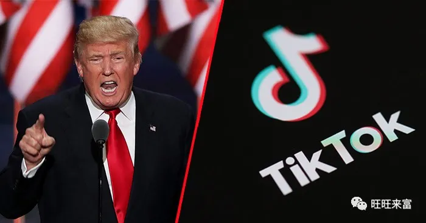

## 美国净网行动？远程注册家美国公司，合规运营你的 app

原创 旺总 旺旺来富 *昨天*

本文为【旺旺来富】原创文章，未经授权，任何机构或个人不得转载、摘编或以其他形式使用和传播。

### 1、天下乌鸦一般黑

事情简单说，就是美国「站在巨人的肩膀上」，宣布了 Clean Network 计划，都是些十年前我们玩剩下的东西了。  

又是运营商、光缆了，又是什么存储，云服务了，墙可不是一天建成的，这方面，Trump 需要多向我们学习。

接下来，大概率是只要是内地输出的技术服务，大概率都会收到阻拦

具体到开发者这边，**苹果 App Store**，**Google Play应用商店**，各种移动应用App，各种云服务，尤其是背后是中国公司控制的，就要遭殃了。

其实，我们早在年初就提示过各位内地的 Apple 应用的开发者，👉[苹果(Apple Developer Program)中国区的开发者要求身份验证，上传自拍，没毛病！](http://mp.weixin.qq.com/s?__biz=MzIyMjgzNDIxNA==&mid=2247483687&idx=1&sn=29b38328f10e055082b0d5ee88307219&chksm=e8263a6edf51b3784680e8a5bf3c6ea3a1cd786c938164c703e9856d8c442dd6b80dda4938d2&scene=21#wechat_redirect)

当时是建议是，出于一些风险的规避（具体就不细说了，想必各位开发者比我们更明白这里面存在的风险），尽早将，目前内地公司注册的 App Store 的角色转移到海外的公司，比如[香港](http://mp.weixin.qq.com/s?__biz=MzIyMjgzNDIxNA==&mid=2247484151&idx=1&sn=f861d35f9c6b796421512c0a172c59b0&chksm=e82639bedf51b0a859b059c2b24e96ddebbf81042af051b0133cc89821b12d1662d34da62613&scene=21#wechat_redirect)、[新加坡](http://mp.weixin.qq.com/s?__biz=MzIyMjgzNDIxNA==&mid=2247484608&idx=2&sn=db427d642ec67a88b8415dc7069048ed&chksm=e8263f89df51b69f798cb117d4e5c5545ff09214177588653458ebaf084c5ca3c917f6882cfd&scene=21#wechat_redirect)或者美国的公司。

### 2、顺势而为，风口猪会飞

在别人地盘上，就得遵守别人的游戏规则。  

就像，不管你是谁，想在中国内地赚钱，想在中国区上架 App，有些主题你就是不能碰，你可以天天骂 Trump 沙雕，你敢对太平洋对岸的说半点不是吗？

美版净网今天说，我不让中国的企业玩了，全方位的限制中资企业了。

讽刺的是，现在一边（中国）在推，一边（美国）在拉，顺势而为太重要了。

想想，每年光一个 App Store 的产业养活了多少中国的程序员，多少的产品运营，多少依附在上面的的寄生虫，各种黑白灰的产业链，想想，有多少程序员，这一辈子，就会写一个 Object-C，或者 Swift？

### 3、拥抱变化

拥抱变化，这是很多年在台上听马爸爸说的，当年听了没什么特别的感觉，创业之后才发现这么精华的鸡汤！  

具体到我们千千万万的开发者，跑的快的，年初已经听取我们建议的，恭喜，几乎不受任何的影响。

目前还是在用中国境内公司为主体上架、发布、运营 App Store 的法人公司，以及个人开发者们，尽快行动起来。

离岸公司虽好，合规运营更重要，这也是我们一直强调的点。

很简单，只需 3 步：

### 1.  注册一家美国公司，具体在那个州注册，请参见，
👉[App Store 开发者，最适合在美国哪个州注册，及优劣分析](http://mp.weixin.qq.com/s?__biz=MzIyMjgzNDIxNA==&mid=2247484630&idx=1&sn=54f72ea85c9e26fd4b988569656e67ae&chksm=e8263f9fdf51b689cdea30285705d1033d7b2dcba93f4dd3bd40d18cb5210a5142347a35815a&scene=21#wechat_redirect)
    
### 2.  开设对应的公司账户，
目前可以选择的包括美国华美、美国银行、美国大通银行、美国花旗银行、圣卢西亚、伯利兹银行等，均可以满足以上的要求
    
### 3.  以美国公司的身份重新注册 App Store，

99 美元的会员费就不要省了，重新上架 App
    

当然，一些众所周的原因，对于一些中国人持股的公司，哪怕是美国的公司，国际上都会持有一些不太友好的态度，TikTok 的老板估计肠子都悔青了。

所以，如果可能的话，尽量从一开始就多安排一些美国元素的吧。

当然，我们也是包含代持服务的（Nominee）服务，[关于离岸公司业务的 99 条常见问题](http://mp.weixin.qq.com/s?__biz=MzIyMjgzNDIxNA==&mid=2247484607&idx=8&sn=e614cfcdfc4ba61c8f63323fe80eb148&chksm=e8263ff6df51b6e0831e05ff983128370e45498e3fe1b47bc21e148779d81e1b2c6970e13a6c&scene=21#wechat_redirect)，已经详细给大家分析了这一服务，总之，如果在资金条件允许的情况下，通过代持的方案来运营新的公司，优势会非常的明显。

