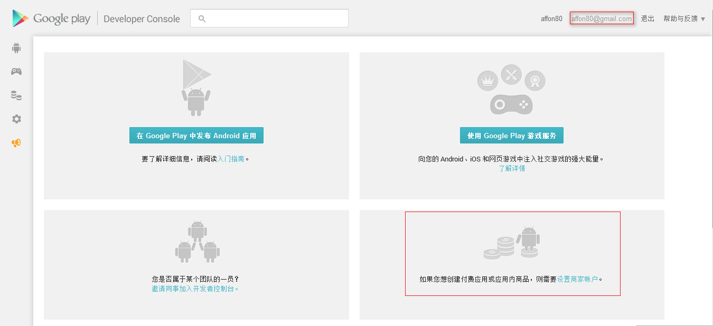
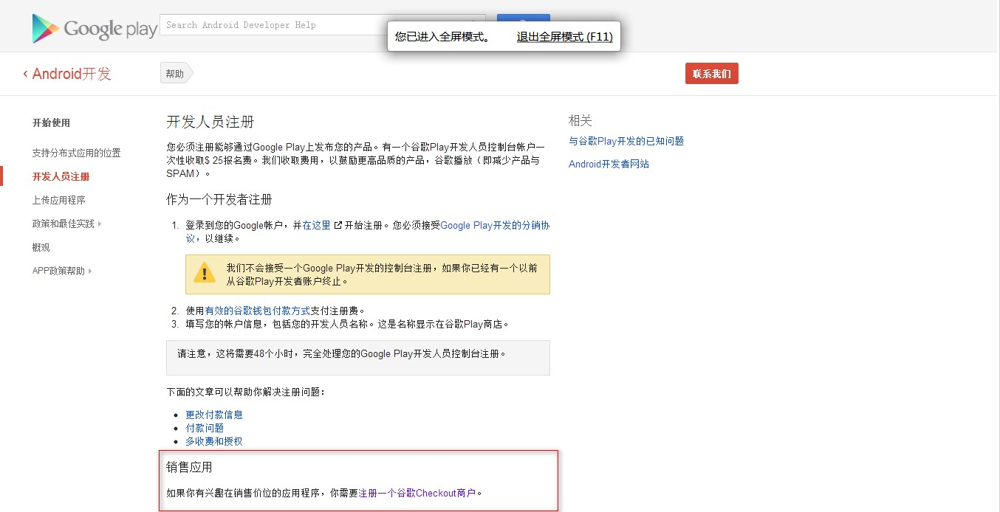
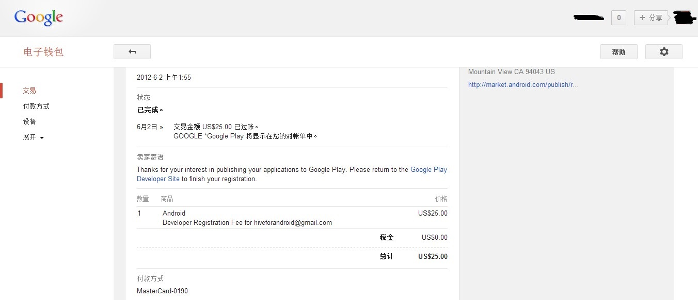
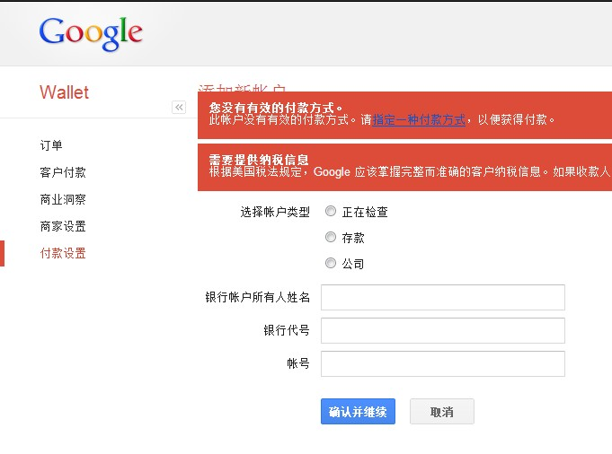

# 关于Google Play收费应用的几点说明

 2014-07-12 10:33

平时工作中接触很多开发者向我咨询在Google Play收费应用的问题，比如注册的Google Play开发者账号是否可以发布收费应用？收费应用该绑定什么样的银行卡？个人觉得收费应用是困扰中国地区Google Play开发者的大问题，所以很有必要对以上问题做一些解答。  
  
本人并非Google Play官方工作人员，以下的解答基于本人经验以及与众多Google Play开发者的交流，不妥之处请大家指正。另外由于Google Play的相关政策一直处于变化中，本人会持续更新和优化该贴，修改部分会用篮色字体标出，并加上更新时间，请开发者留意。（更新时间：2014年1月11日16:44）  
  
1、大家注册或购买的Google Play开发者账号仅可以发布免费应用，发布收费应用需注册Google Checkout商家账户（即通过Google Checkout商家账户绑定银行卡，用于收款）。  
  
下图为一个已经审核通过的Google Play开发者账号后台，可以看到“如果您想创建收费应用或应用内产品，则需要设置商家账户。”        
   
  
  

下图为Google Play帮助中心关于销售应用的介绍，“如果你有兴趣销售应用程序，你需要注册一个谷歌Checkout商户。”  
  
  
  

有关Google Play开发者账号注册的攻略可参考  
《[http://www.eoeandroid.com/thread-321206-1-1.html](http://www.eoeandroid.com/thread-321206-1-1.html)》[http://www.eoeandroid.com/thread-321206-1-1.html](http://www.eoeandroid.com/thread-321206-1-1.html)  
《Google Play付费应用发布、开发者账号注册、解封的心路历程》[http://www.eoeandroid.com/thread-321687-1-1.html](http://www.eoeandroid.com/thread-321687-1-1.html)  
  
2、收费应用提款时所用银行卡与注册Google Play开发者账号所用信用卡没有关系。很多开发者尤其是还未成功申请Google Play开发者账号的开发者，担心注册Google Play开发者账号时所用信用卡默认成为收费应用的提款银行卡，而注册Google Play开发者账号时使用的信用卡大多数情况下并非本人的，如果收费应用挣到钱，却转到别人的卡上，这不是亏大发了？其实开发者多虑了，下边截图说明。  
  
下图为一个已经审核通过的Google Play开发者账号的Google钱包，注册该开发者账号时支付时所使用的信用卡由国外的一位朋友提供。  
  
  
  
该信用卡仅用于支付Google Play开发者账号，与后续的收费应用绑定的银行卡无任何关系，甚至在成功注册Google Play开发者账号后便可以将信用卡信息予以删除。  
  
下图为Google Checkout商家账户的管理后台，通过“付款设置”可以进行收款银行卡信息的绑定。Google Checkout商家账户的登录地址：[https://checkout.google.com/sell/orders](https://checkout.google.com/sell/orders)。  
  

  
有关Google Checkout商家账户的相关问题可访问：[https://support.google.com/payments/?hl=zh-Hans](https://support.google.com/payments/?hl=zh-Hans)。  
  
3、有关Google Checkout商家账户收款银行卡的绑定，由于不同国家的Google Play开发者账号付款设置略有不同，因此请大家根据Google Play开发者账号所属区域填写相应的信息：  
  
Google Play开发者账号（中国地区）请绑定中国地区银行发行的储蓄卡，如中国工商银行储蓄卡、中国银行储蓄卡等；（更新时间：2014年11月26日14:33）

Google Play开发者账号（香港地区）请绑定香港恒生银行储蓄卡、香港汇丰银行储蓄卡、香港渣打银行储蓄或招商银行香港一卡通、建设银行陆港通等，推荐开发者绑定招商银行香港一卡通或建设银行陆港通。

Google Play开发者账号（美国地区）请绑定美国地区银行发行的储蓄卡；           
  
备注：已经有开发者通过绑定招商银行香港一卡通或建设银行陆港通收到款项，大陆居民在大陆一二线城市的部分招商银行或建设银行均可办理。  
  
有关申请招商银行香港一卡通的开户手续及开户网点可参考下文的附件。（更新时间：2014年1月11日16:48）  
  

- [招商银行香港一卡通见证开户手续.pdf](http://www.baijingapp.com/file/download/file_name-5oub5ZWG6ZO26KGM6aaZ5riv5LiA5Y2h6YCa6KeB6K+B5byA5oi35omL57utLnBkZg==__url-aHR0cDovL3d3dy5iYWlqaW5nYXBwLmNvbS91cGxvYWRzL3F1ZXN0aW9ucy8yMDE0MDcxMi8xMDM2MDF1c3Nuc21oenBxNmhwcDNnLmF0dGFjaA==)
    
- [招商银行香港一卡通见证开户网点.pdf](http://www.baijingapp.com/file/download/file_name-5oub5ZWG6ZO26KGM6aaZ5riv5LiA5Y2h6YCa6KeB6K+B5byA5oi3572R54K5LnBkZg==__url-aHR0cDovL3d3dy5iYWlqaW5nYXBwLmNvbS91cGxvYWRzL3F1ZXN0aW9ucy8yMDE0MDcxMi8xMDM2MDN4NW16d21hcHliY2VubnFtLmF0dGFjaA==)
    

有关收款银行卡绑定的具体方法，可参考《Google Play付费应用发布、开发者账号注册、解封的心路历程 》[http://www.eoeandroid.com/thread-321687-1-1.html](http://www.eoeandroid.com/thread-321687-1-1.html)  
  
由于本人曾于2013年9月14日将该贴发布在eoe社区中，期间开发者向我咨询了很多问题，在此一并整理给大家。    
  
**问：注册开发者是交付25美元的那张卡能否借用别人的，这样会不会给别人带来风险？  **
答：注册开发者账号需要支付的25美金可以借用别人的信用卡进行支付，基本上不会给信用卡持有人带来风险，当然做为信用卡持有人担心绑定后信息被泄露是非常正常的，你只用跟他解释绑定所使用的信用卡信息在开发者账号注册成功后（一般在支付后48小时后即可知道是否成功注册）是可以删除的，删除路径：Google Wallet后台-付款方式-信用卡-删除。  
  
**问：收款绑定香港的借记卡可以吗?**
答：香港的借记卡是否可以绑定成功，我没有试过，不过我觉得可以；另外推荐你办理招商银行香港一卡通或建设银行陆港通，大陆居民在大陆地区的部分招商银行或建设银行均可以办理。

有关办理招商银行香港一卡通的教程及注意事项，可参考：[http://www.baijingapp.com/question/3689](http://www.baijingapp.com/question/3689)

有关办理建设银行陆港通的教程及注意事项，可参考：[http://www.baijingapp.com/question/3716](http://www.baijingapp.com/question/3716)   

**问：收款绑定国内的招行信用卡可以吗？**  
答：不可以  
  
**问：用于收款的账单地址咋填呀，我是国内的，用的是国内信用卡香港随便弄的地址申请的帐号。我可以找到香港和台湾的用于收款的当地银行卡，但地址只能再国内，不知道咋办。**
答：用于收款的账单地址可以随意填写，最好和你开发者账号所需地区一致即可。  
    
**问：能不能推荐一些台湾的银行？**
答：我是绑定的台湾中国信托商业银行，[https://consumer.chinatrust.co ... nk/rb](https://consumer.chinatrust.com.tw/CTCBPortalWeb/appmanager/ebank/rb) 另也可考虑台湾银行，台湾银行在台北的网点很多。  
  
**问：我有一张信用卡(招商的美国运通双币卡)注册Google Play开发者账号成功了，也已经成功提交过应用。请问如果我想弄付费应用(道具解锁付费)类的应用，怎么注册商家账号？**
答：办理一张招商银行香港一卡通或建设银行陆港通即可  
  
**问：Google Play 上安卓游戏 每天自然的下载量有多少 就是不做广告，主要是英文地区的。**
答：这个要看游戏的质量，一般情况下，不做推广几百个就很不错了。  
  
**问：Google Play 安卓游戏的完整上线开户，需要哪些具体的资料和费用？**
答：注册Google Play开发者账号即可，其他的流程和与在国内电子市场基本一致。  
    
**问：Google Play开发者账号是否分国家？**
答：Google Play开发者账号是分国家的，而且不同国家会有一些区别。在此强烈建议开发者注册香港地区的Google Play开发者账号，不要注册美国地区的Google Play开发者账号，因为如果是美国地区的开发者账号后续在绑定收款银行卡（如招商银行香港一卡通或建设银行陆港通）的时候，可能无法绑定成功。  
    
**问：Google Play的开发者账号好像很容易被封，那不知道一个人能否用同一名下的多张不同的信用卡同时申请多个账户？**
答：开发者的经验告诉我，如果不同的开发者账号使用同一个信用卡可能被封；如果是同一名下的不同信用卡，我觉得是可以申请的，就是可以申请多个开发者账号。  
  
我是白鲸社区创始人魏方丹，工作时间接触了大量的Google Play开发者，如大家有相关问题可与我讨论，本人微信号：349886290    
  
本人QQ号：2685798944      

或加入“白鲸Club（Google Play 2群）”QQ群，群号：371891124  

或加入“白鲸Club”微信群（可先加我为好友，由我拉你入群）  

- [招商银行香港一卡通见证开户手续.pdf](http://www.baijingapp.com/file/download/file_name-5oub5ZWG6ZO26KGM6aaZ5riv5LiA5Y2h6YCa6KeB6K+B5byA5oi35omL57utLnBkZg==__url-aHR0cDovL3d3dy5iYWlqaW5nYXBwLmNvbS91cGxvYWRzL3F1ZXN0aW9ucy8yMDE0MDcxMi8xMDM2MDF1c3Nuc21oenBxNmhwcDNnLmF0dGFjaA==)
    
- [招商银行香港一卡通见证开户网点.pdf](http://www.baijingapp.com/file/download/file_name-5oub5ZWG6ZO26KGM6aaZ5riv5LiA5Y2h6YCa6KeB6K+B5byA5oi3572R54K5LnBkZg==__url-aHR0cDovL3d3dy5iYWlqaW5nYXBwLmNvbS91cGxvYWRzL3F1ZXN0aW9ucy8yMDE0MDcxMi8xMDM2MDN4NW16d21hcHliY2VubnFtLmF0dGFjaA==)
    

  

- [招商银行香港一卡通见证开户手续.pdf](https://www.baijingapp.com/file/download/file_name-5oub5ZWG6ZO26KGM6aaZ5riv5LiA5Y2h6YCa6KeB6K+B5byA5oi35omL57utLnBkZg==__url-aHR0cDovL3d3dy5iYWlqaW5nYXBwLmNvbS91cGxvYWRzL3F1ZXN0aW9ucy8yMDE0MDcxMS8xMDM2MDF1c3Nuc21oenBxNmhwcDNnLmF0dGFjaA==)
- [招商银行香港一卡通见证开户网点.pdf](https://www.baijingapp.com/file/download/file_name-5oub5ZWG6ZO26KGM6aaZ5riv5LiA5Y2h6YCa6KeB6K+B5byA5oi3572R54K5LnBkZg==__url-aHR0cDovL3d3dy5iYWlqaW5nYXBwLmNvbS91cGxvYWRzL3F1ZXN0aW9ucy8yMDE0MDcxMS8xMDM2MDN4NW16d21hcHliY2VubnFtLmF0dGFjaA==)

2014-07-12 添加评论

