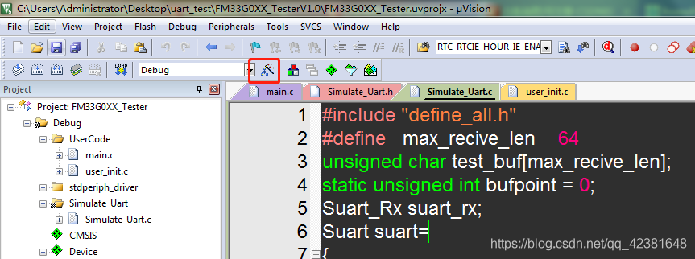
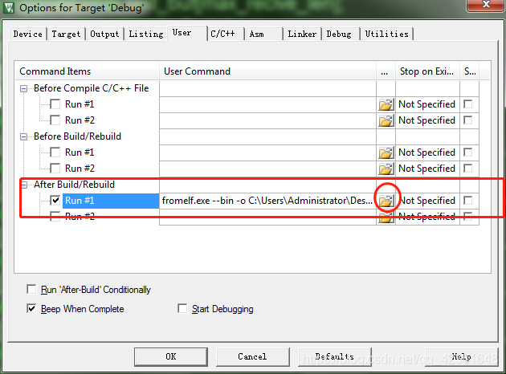
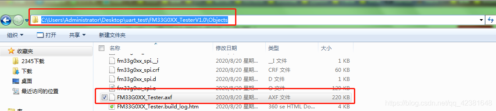
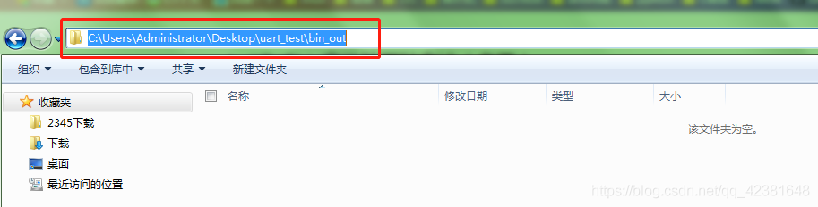
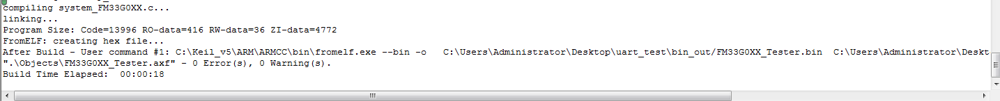
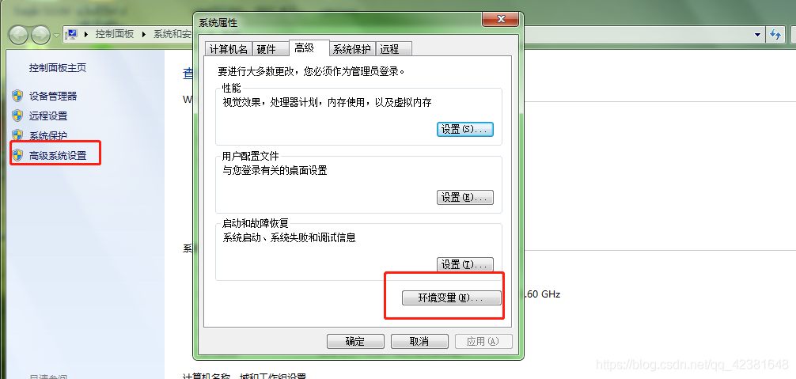
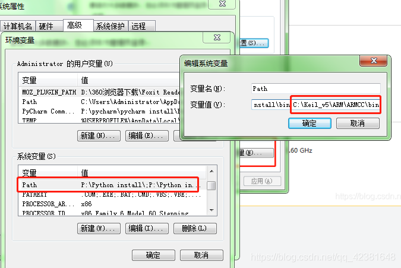
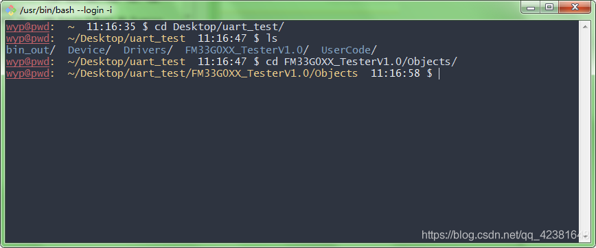
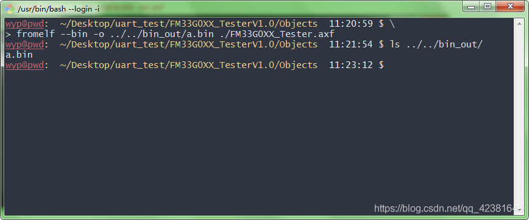

##  keil生成bin文件的两种方法（多图）

[comment]: 虚花悟情的博客-程序员宝宝_keil生成bin文件

***写在前面*：**之前使用keil都是用的自带的生成hex的文件对目标芯片进行烧录，由于接触过程序升级，明白其实写在flash中的文件基本都是二进制的bin文件，而hex可以理解为bin文件的带地址的扩展版。写本文前看到其他博主的生成方法，其中有借鉴、也有归纳。第一种为常用keil自动生成方法，第二种为扩展方法，对习惯使用命令行的同志比较方便。废话不多说，进入正题。。。

### **方法一： 使用keil自带的选项生成bin文件**

该方法适用于已经编译过的工程（至于keil如何编译我就不细说了），在输出文件夹下编译器会生成XXX.axf文件。这里强调一下axf文件的作用：axf文件是ARM芯片使用的文件格式，它除了包含bin代码外，还包括了输出给调试器的调试信息，例如每行C语言所对应的源文件行号等。与AXF文件经常一起看到的还有HEX文件，HEX文件包括地址信息，可直接用于烧写或下载HEX文件。——摘自百度百科

关于hex.bin.axf.elf等文件的具体作用请自行百度，或者点击  [这里](https://www.cnblogs.com/llxbl/p/10944160.html)。

下面我们就是对axf文件进行格式转换，使其生成bin文件。keil自带的armcc编译器有一个可执行文件，名字叫fromelf.exe我们以下的操作都是基于此命令，打开keil的option for target选项

打开user选项：这个选项代表用户自定义的命令功能，其中我们是在编译生成axf文件之后使用功能，所以使用第三个After Build

根据一些博主的说法直接勾选打开folder找到可执行文件一般在keil的安装目录下：

然后再键入命令  C:\\Keil_v5\\ARM\\ARMCC\\bin\\fromelf.exe  --bin -o ./Obj/@L.bin  ./Obj/@L.axf   这种方法也不是不行，只是执行会报错，熟悉命令行的同学都知道这里./代表的是相对路径操作当前目录下的文件，也就是说你必须在当前的armcc的bin文件夹下再建一个名为Obj的文件夹，然后把需要的文件复制过来才可以正常执行命令，否则执行keil的build功能就会报错，并且不会产生bin文件。这里推荐的做法是选择目标文件的绝对路径（相对路径和绝对路径请自行查阅），比如打开我的工程目录，找到axf文件所在的位置（默认输出到Object文件夹下），直接复制这个文件的路径替换上面的./Obj。

输出路径选择你要保存bin文件的文件夹，这里我是新建的一个名为bin_out的文件夹，复制路径替换./Obj。

最终我在keil里面的User Command里面输入的如下：

C:\\Keil\_v5\\ARM\\ARMCC\\bin\\fromelf.exe --bin -o   C:\\Users\\Administrator\\Desktop\\uart\_test\\bin\_out/@L.bin  C:\\Users\\Administrator\\Desktop\\uart\_test\\FM33G0XX_TesterV1.0\\Objects/@L.axf

编译后不报错并且生成bin文件，其中C:\\Keil_v5\\ARM\\ARMCC\\bin\\fromelf.exe  可以不写命令的路径，keil会自动去armcc的bin文件下去寻找，也就可以简化：

fromelf.exe --bin -o   C:\\Users\\Administrator\\Desktop\\uart\_test\\bin\_out/@L.bin  C:\\Users\\Administrator\\Desktop\\uart\_test\\FM33G0XX\_TesterV1.0\\Objects/@L.axf

2021.6.25 新增：

{

*fromelf   中 $L、@L、L的用法*

*$L、@L、L用来指定对应的路径或名称。*

*1、L是指axf文件路径，加文件名。*

*2、$L是指axf的文件路径，不含文件名。*

*3、@L是指axf的文件名，不含axf的后缀。*

*比如：生成D:\\1\\out\\aa.axf文件，那么*

*L的内容为：D:\\1\\out\\aa.axf*

*$L的内容为：D:\\1\\out\       （包含最后的“\\”）*

*@L的内容为：aa*

*因此可以利用他们组成：*

*1、fromelf --bin -o "$L@L.bin" "$L@L.axf"     表示在axf相同的文件下生成bin文件。*

*2、fromelf --bin ".\\obj\\@L.axf" --output ".\\obj\\972.bin"
原文链接：https://blog.csdn.net/qlexcel/article/details/85097355*

}

看到这有人会说what the F**K为啥会这么麻烦，粘贴来粘贴去就没有什么简便的方法吗？ok来看方法2

### **方法二： 使用Cygwin或Git for windows终端的命令行执行**

Cygwin是一个在[windows](https://baike.baidu.com/item/windows/165458)平台上运行的类UNIX模拟环境，是cygnus solutions公司开发的[自由软件](https://baike.baidu.com/item/%E8%87%AA%E7%94%B1%E8%BD%AF%E4%BB%B6/405190)（该公司开发的著名工具还有eCos，不过现已被[Redhat](https://baike.baidu.com/item/Redhat)收购）。它对于学习UNIX/[Linux](https://baike.baidu.com/item/Linux)操作环境，或者从UNIX到Windows的应用程序移植，或者进行某些特殊的开发工作，尤其是使用GNU工具集在Windows上进行[嵌入式系统开发](https://baike.baidu.com/item/%E5%B5%8C%E5%85%A5%E5%BC%8F%E7%B3%BB%E7%BB%9F%E5%BC%80%E5%8F%91/10945469)，非常有用。——百度百科

由于本人系统的原因并未安装cygwin，我用的是Git bash，当然方法基本都是相同的。

首先要把armcc的路径放到windows的环境变量中：

打开bash切换到keil输出的文件目录

输入fromelf命令可以看到这条命令不止有转换bin文件的功能，还可以有生成text、elf、32bit hex等的功能，但这里我们仅用bin选项

执行命令fromelf --bin -o ../../bin_out/a.bin ./xx.axf

这里我把生成的bin文件单独放到外部方便查找，具体的文件名称根据各自需要填写。

### ***结语：***

以上仅代表个人观点，如有不正确之处欢迎指正！转载请注明出处，谢谢！若文章对您有帮助，或者觉得不错，动动小手，点个赞再走吧 ^_^

版权声明：本文为博主原创文章，遵循 [CC 4.0 BY-SA](https://creativecommons.org/licenses/by-sa/4.0/) 版权协议，转载请附上原文出处链接和本声明。

本文链接：https://blog.csdn.net/qq_42381648/article/details/108116982

* * *

