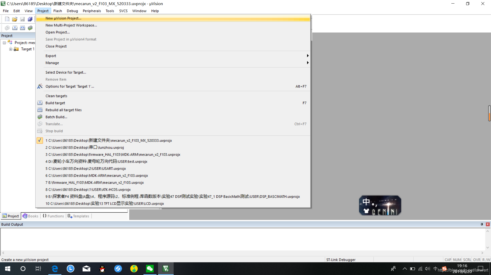
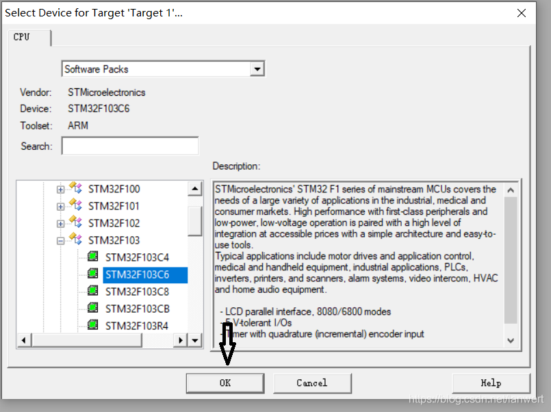
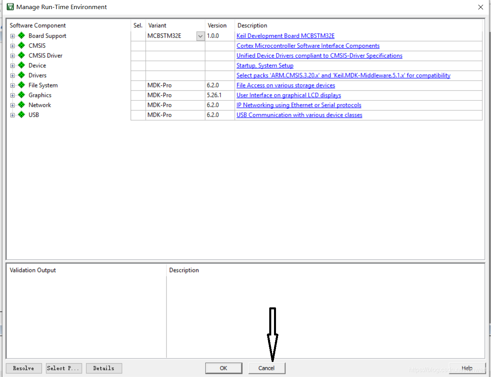
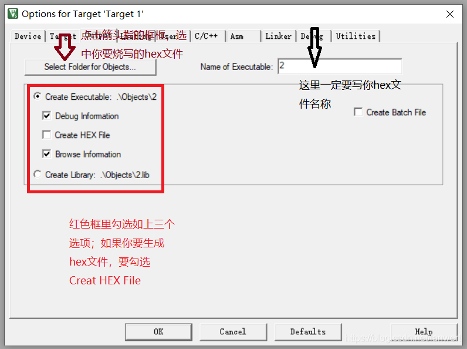
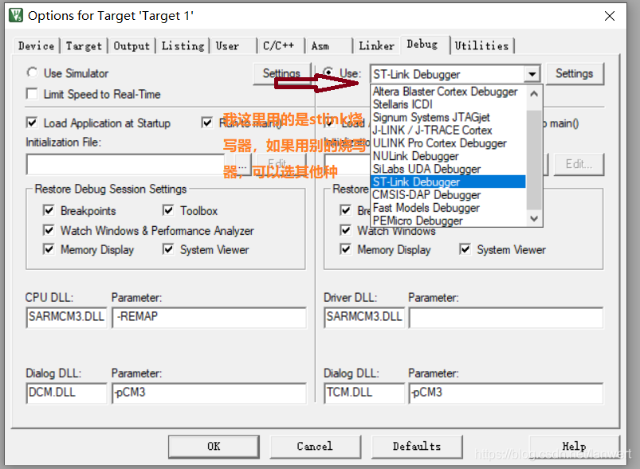
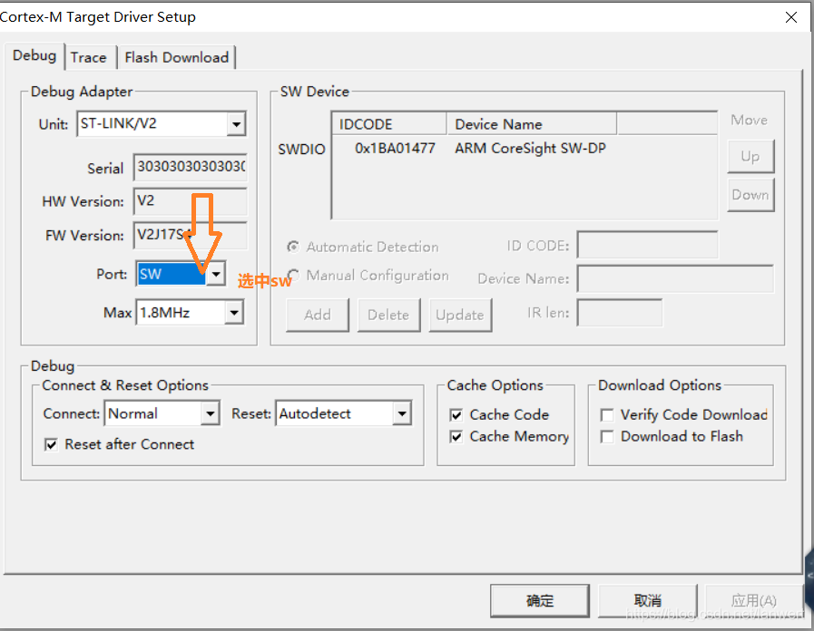
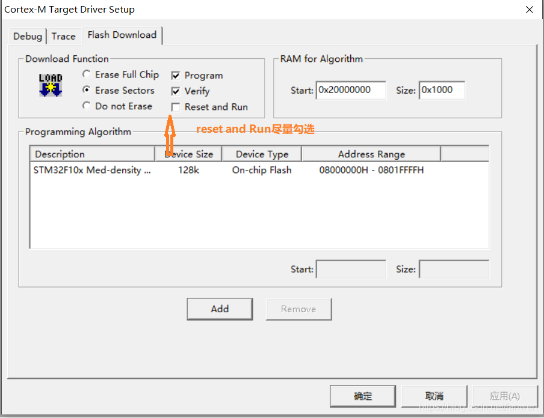

# 怎样用Keil5烧写现成的hex文件

 2019-06-20 19:59:1

第一步：打开[keil5](https://so.csdn.net/so/search?q=keil5)，创建一个新工程

创建工程尽量使工程名与hex文件的名字一致；创建工程时会让你选一个芯片型号，选自己用的板子就行了，选过之后keil5会自动弹出来一个补全代码的功能，这时我们要忽略它。步骤如下：

第二步：配置魔术棒

接下来就可以点击下载
然后就慢慢的享受hex文件被下载进板子的快感。
